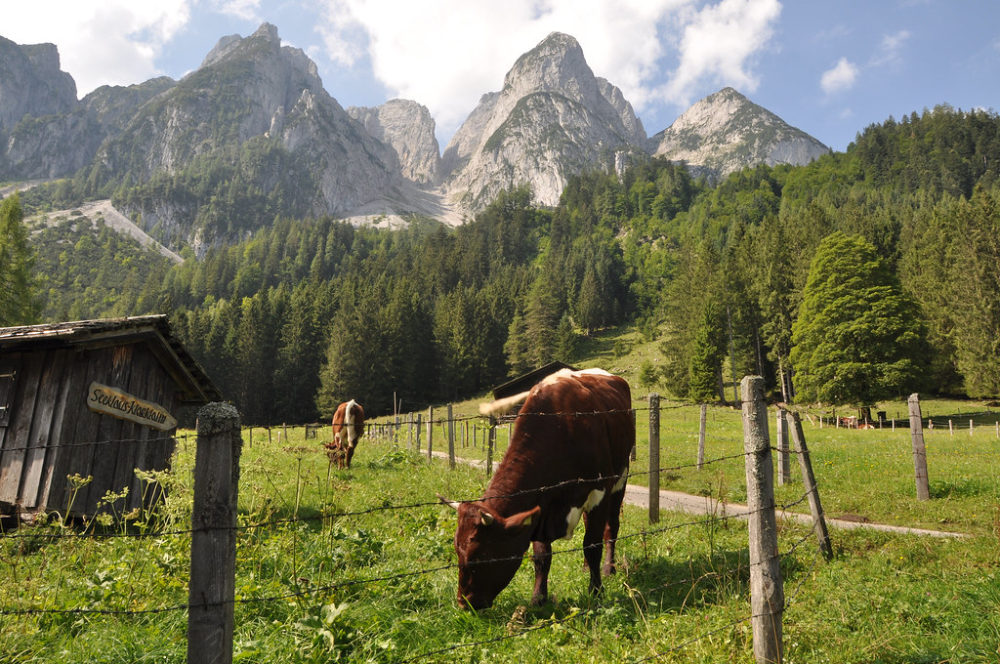

את יום השמש הנהדר הזה הקדשנו כולו לאגם גוסאו. ברוב ההמלצות שסקרנו ובשני ספרי הטיולים שקראנו - מציינים את גוסאו בתור עצירה בדרך לאטרקציות אחרות. ככל שקראנו יותר הבנו שאין בעצם שום סיבה למהר - אם המקום כל כך יפה ורגוע כפי שמספרים - אז למה לא פשוט להנות ממנו כמה שיותר? באמת יש באזור המון מה לראות, אבל העדפנו להשאיר דברים לפעם הבאה ולהנות ברוגע ממה שכן עשינו... ובהחלט תהיה פעם הבאה באוסטריה!

כמו בכל בוקר השקמנו קום, הכנו ארוחת בוקר של אלופים עוד לפני שהדונקלר קץ והגענו לאגם בין המכוניות הראשונות. בסוף כל יום כשחזרנו למגרשי החניה תמיד נדהמנו לגלות עד כמה רחוק עוד אפשר לחנות. במיוחד בשיא העונה כאן - הגעה מוקדמת בהחלט משפרת את יום הטיול.

 סביב אגם גוסאו יש המון מה לעשות, את הבוקר התחלנו בהקפת האגם עצמו - מסלול קצר יחסית ויפה. משום שרצינו לאמן את הדונקלר בwandern זה לקח  כשעתיים - כולל רביצות מול האגם והאכלת ברווזים בתפוחים.

אחרי שסיימנו את המסלול, שכרנו סירת קטנה כדי לשוט באגם. באגם כולו ניתן לשכור רק כ5 סירות, כך שהאגם המקסים הזה היה כמעט כולו לרשותנו. אחרי משא ומתן קצר אך עיקש, הוסדר כי אבא הוא זה שמנווט בסירה, השרלוטין היא העוזרת הראשית והנמלה מונתה לרב-משרתי הסירה. אמנם בשבילנו זה נראה טריויאלי, אבל בשביל השרלוטין זהו השייט הראשון בחייה הקצרים. אחרי כל השירים והסיפורים על סירות - ההתרגשות היתה גדולה. פחד הוא לא תכונה חזקה אצל הדונקלר ובמשך כל השייט היא רצה מצד לצד, קפצה, השתוללה ונקטה בכל צעד שעשוי לקרב את הגוף המיניאטורי שלה אל קרקעית האגם. כדי לנסות להפחיד אותה, מידי פעם ניערתי את הסירה הפצפונת מצד לצד ואמרנו שיש ״סערה״ וחייבים לשבת. אמנם בעיקר הפחדתי את הנמלה, אבל בסופו של השייט חזרנו כל המשפחה אל חוף מבטחים.

")

אחרי השייט, אכלנו את ארוחת הצהריים היומית שלנו תוך רביצה על חלקת דשא מול האגם. אחרי המנוחה עלינו ברכבל (Gosaukamm) לתחנה שנקראת Zwieselalm וממנה יוצאים מספר מסלולי הליכה. בחרנו מסלול שאיני זוכר את שמו אחרי התייעצות עם המפעיל של הרכבל. באופן כללי ברוב המקומות בהם רצינו לעשות מסלולי הליכה - תמיד היה קשה או בלתי אפשרי להוריד את הברושור המדוייק של המקום דרך האינטרנט - למרות שזהו מדריך המחולק בחינם. מצד שני כשמגיעים לאתר - תמיד יש מידע מדוייק ומועיל.

כמו שעון, השרלוטין התרסקה לשנת צהריים קלה במהלך המסלול, אותה ניצלנו לטיפוס החלק הראשון של המסלול הנופי שבחרנו. כשהתעוררה, סוף סוף הלכה חלק ניכר מהמסלול ברגל - האימון מתקדם יפה, בכל יום הילדה שלי הולכת יותר ויותר מרחקים בתוואי שטח שונים ומשונים (לרבות ״תוואי קקי של פרות״)

הלילה הוא הלילה האחרון שלנו בחווה בפלכאו, מחר נעבור לאיזור טירול. נפרדנו מכל החיות, רכבנו על הסוסה שרה והתארגנו לקראת החצי השני של ההרפתקה שלנו באוסטריה.
