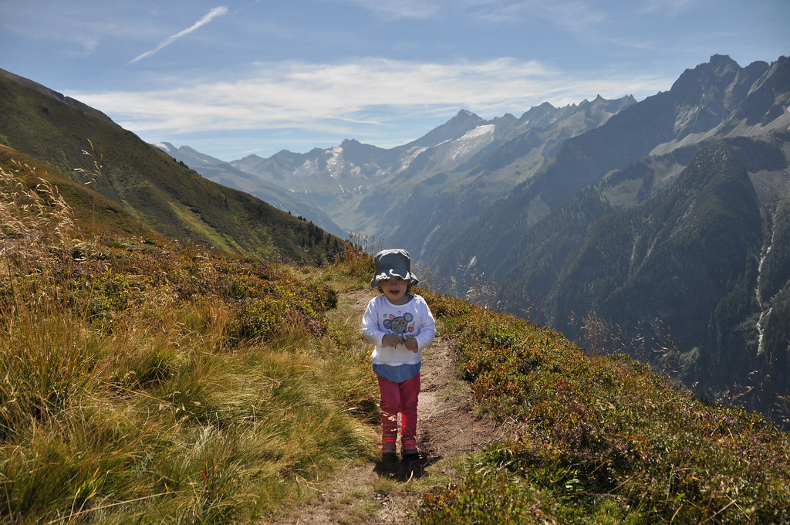

היום יצאנו לטיול האחרון בטבע של טירול, שהיה גם אחד היפים בהם. המסלול התחיל בעיירת הסקי מיירהופן, בה כבר ביליתי בחופשת סקי לפני כמה שנים. עלינו ברכבל שעשה לי ״דה ז׳ה וו״ ומשם התחלנו בטיפוס לעבר אחת הפסגות שסומנה בצלב גדול. אנחנו מאד מחבבים מסלולים בהם ניתן לראות מרחוק לאן אמורים להגיע ונקודת השיא היא פסגה ממנה נשקפים נופים חדשים.

הטיפוס לא היה קל, אך השרלוטין בכושר שיא נתנה טיפוס מרשים ולבסוף כבשנו את ראש ההר. בפסגה נחנו והתקשקשנו עם שני זקנים גרמנים מצחיקים שלימדו אותנו שכשמצלמים פה לא אומרים צ׳יז ואפילו לא ״מילש״ אלא משפט בגרמנית שקשור לזנב של עכבר (משהו כמו מאוסה שוואנצה). על הצלב הגדול בפסגה צלובה מחברת בה השארנו את חותמנו לדורות הבאים.

מדהים כמה המקום שונה בין ״מצב החורף״ שלו לבין הקיץ. בחורף מפוצץ תיירות סקי ואווירה צעירה של ״אפרה סקי״ שוררת על ההר כל היום. בקיץ לעומת זאת, שקט מאד ובעיקר מוצאים כאן מקומיים חובבי Bergwandern. ירדנו חזרה למטה וישבנו קצת לצד אגם קטן להצטנן מהשמש. מי הקרח כיווצו את רגליינו העייפות והנפוחות, ולחלקנו קיררו את ראשנו הקטן הנפוח-מרוב-שטויות.

מכאן המשכנו לביקור קצרצר באינסברוק (Insbruck) בה התאהבנו מהר מאד. מלבד נוף ההרים שצובאים על העיר כפי שמובטח בספרים, האווירה במדרחוב בעיר העתיקה נהדרת - חנויות טיולים, מעדניות איטלקיות מפיצות ריחות למרחוק ומקומות קטנים שמוכרים מגוון מאכלים מנקרי עיניים. גם עלמה שרלוט היתה במיטבה ורצה מאושרת בין החנויות כשהיא צוחקת וצווחת בלי שום סיבה נראית לעין. לא פעם התגודדו סביבה יפנים עם מקלות סלפי שלא הפסיקו לצחוק ולצלם אותה מכל כיוון.

למחרת, בדרך חזרה לשדה התעופה של מינכן עצרנו לספוג עוד קצת  קצת מהאווירה של אינסברוק ומשם נסענו ל English Garden במינכן להעביר את הצהריים לקראת הטיסה. הגן העצום הזה גורם לסנטרל פארק להראות כמו כלוב אוגרים - שטח אינסופי במרכז העיר הכולל מדשאות, מתקנים וכמובן נהר שעובר במרכזו בו נקודות שכשוך ו... גל שאפשר לגלוש עליו! באחת הנקודות בנהר נוצר מבנה של גל סטטי עליו אפשר לגלוש ממש כמו בלב ים.

חוץ מהנודיסטיות המשתזפות, אטרקציה מפורסמת בגן האנגלי היא הBiergarten השני בגודלו במינכן. הגן המפלצתי מכיל אלפי מקומות ישיבה ונמזגים בו נהרות של בירות קרות כל היום. דרך מעולה לסיים את הטיול הזה.

זהו, מכאן חזרנו לשדה התעופה ולחיים האמיתיים אחרי שבועיים נהדרים באוסטריה. להתראות בפעם הבאה.
