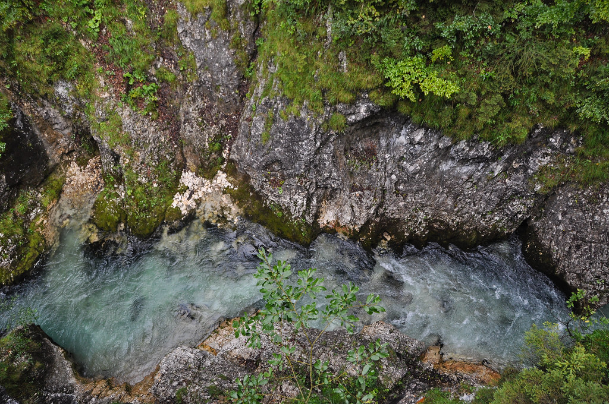

היום ביקרנו בנקיק לויטאש (Leutaschklamm). בנקיק היפה הזה, לדברי המקומיים, מתגוררת רוחו של השד הקדום לויטאש. לפי האגדה השד מצא לעצמו מקום שאינו נגיש לבני אדם ומסתתר שם ביחד עם גובלינים שאוהבים לרקוד בלילות.  את מנוחתו של לויטאש ואת חוסר הנגישות של המקום פתרו האוסטרים באמצעות הנדסה גרמנית משובחת בצורת מערכת גשרי מתכת ארוכה התלויה לכל אורכו של הנקיק.

עלמה שרלוט היתה מאד אמיצה והלכה לבד לכל אורך המסלול. היא לא התרשמה לא מהגבהים והגשרים הצרים ולא מנסיונות ההפחדה של אבא בנושא רוחות איומות שאוכלות ילדים. למרות שאני ללא ספק מצטיין בהפחדת ילדים של אחרים - הגורל הפיל עלי תינוק קשה... הנמלה לעומתה, היא פחדנית גשרים ידועה (- [ראה ערך המילפורד](http://shpandrak.blogspot.co.il/2011/12/blog-post_14.html)) ולא כל כך אהבה חלק מהגשרים. ע״ש באה לעזרתה והחזיקה את ידה ברגעים הקשים.

אחרי שהפרענו ללויטאש קשישא את מנוחתו, המשכנו לביקור בגן החיות האלפיני של אינסברוק. בגן אין המון חיות, אך יפה לראות איך הן מוחזקות בצורה הכי קרובה לסביבתן הטבעית - דבר שטוב לחיות אך לפעמים פחות למי שמנסה לראות אותן. גן החיות ממוקם מעל אינסברוק ומשקיף על העיר ועל ההרים הגבוהים בסביבתה

")
 אחרי המנוחה וסבב האכלת החיות היומי בחווה, דגמנו היום מסעדה טירולית נחמדה (Gasthof Herrnhaus). האוכל היה נחמד והשרלוטין היתה ידידותית במיוחד . בכל פעם שהמלצר המנומס התקרב לשולחן היא צעקה בקול גבוה ״דאנקה שןןן! דאנקה שןןן!״ מה שהצחיק מאד את כל הסובבים.

