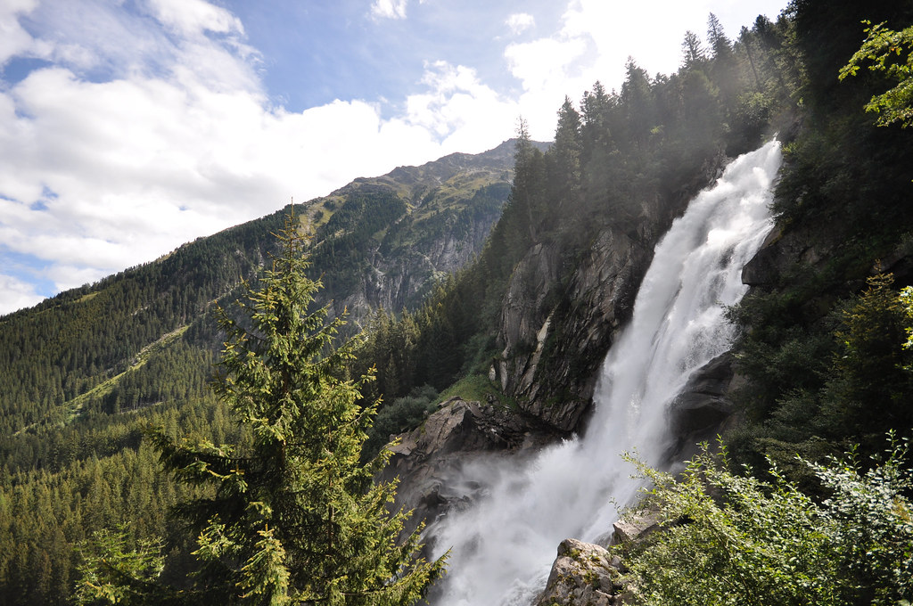

אחרי שבוע באזור זלצבורגלנד, עברנו למשכננו החדש - חווה בעיירה Strass שבעמק Zillertal בטירול. החווה פשוט מקסימה! בעלת החווה התנצלה שלא נשארו לה דירות קטנות, כך שהתגוררנו בבית מפנק בן שתי קומות עם המון חדרים שאפילו לא נכנסנו אליהם. עלמה שרלוט התרגשה מאד מהמעבר - בשבילה החווה הקודמת היתה כבר בית - היא פיתחה מיני חרדה כאשר בבקרים לפעמים שאלה - ״בערב חוזרים לכאן - כן״? כמו בחווה הקודמת, גם כאן היו פרות, כבשים וחזירים. הוצאת מרץ בטרמפולינה כבר הפך חלק מלו״ז היומי.

התפנקנו כאן בארוחות בוקר - כל בוקר ב6:30 הגיעו מאפים טריים, ביצים מהתרנגולות ויוגורט. בעלת החווה מכינה יוגורט טרי הישר מחלב הפרות אותו עלמה שרלוט מאד אהבה. זללנו והכנו ארוחת צהריים עם גבינות מקומיות שקנינו.

איזור טירול לא שונה בהרבה מזלצבורגלנד - אבל הרבה יותר ״דרמטי״. הן מבחינת הנופים (הקרבה לאלפים עושה את שלה) והן מבחינת האוכל (הקרבה לאיטליה וההיסטוריה המשותפת יוצרת מטבח עם טעמים מעניינים).

הבוקר הוקדש למפל קרימל - המפל הגבוה ביותר באוסטריה ואחד האתרים הפופולאריים ביותר באזור. המפל העצום שנופל מגובה של כמעט 400 מטר מורכב מ3 תת מפלים שוצפים וגועשים אותם ניתן לראות כבר מהכביש המוביל לאתר.

למרות שכבר מלמטה ניתן לראות את המפל המפלצתי במלוא הדרו - החלטנו להענות לאתגר ולעלות עד ״ראש המפל״. הטיפוס, שהפך תלול ככל שהתקדמנו, היה תרגול טיפוסים מצויין עבור השרלוטין שחזרה לתיק רק כשכבר היה ממש קשה.

לבסוף ״כבשנו״ את ״ראש המפל״ שם נחנו ואכלנו ארוחת צהריים. בדרך חזרה רכשנו לשרלוטין פעמון של כבשה ומעכשיו ניתן לשמוע אותה מגיעה ולהתכונן בהתאם.

מכאן חזרנו לחווה שלנו - הדונקלר לא יכל כבר לחכות ורצה לשחק עם כל החיות והמתקנים שבחווה החדשה. אנחנו ניצלנו את הזמן להתארגנות ומנוחה.
