היום ביקרנו ב״עיר המבצר״ קופשטיין. העיירה החמודה התברכה (או קוללה) בהיותה נתיב המחבר בין טירול לבוואריה. מסיבה זו, העיר היתה ״נחשקת״ כל השנים בידי שליטים טירולים, האבסבורגים ובוואריים. מי שמחפש עובדות היסטוריות, מוזמן למצוא אותן ברשת במקומות יותר אמינים מהבלוג הזה, אבל התוצאה של כל הסיפור הזה, הוא שה״קופשטיינים״ הבינו את ה״קטע״ ובנו מבצר מפלצתי ששרד המון שנים והתעצב עם היסטוריה כדי לספר בימינו את הסיפור של העיר בצורת אטרקציית תיירותית חמודה במיוחד. כמו שהשלט בכניסה לחנות המזכרות של המבצר מספר: ״In times past there was looting. These days there is shopping״

העיירה עצמה נראית חמודה מאד, שילוב בין עיירה אירופאית קלאסית לעיירה אלפינית כשמעל כל סמטא מיתמר מבצר אימתני. אולי בטיול אחר, בעונה קרירה יותר נקדיש קצת יותר תשומת לב גם לעיירה עצמה.

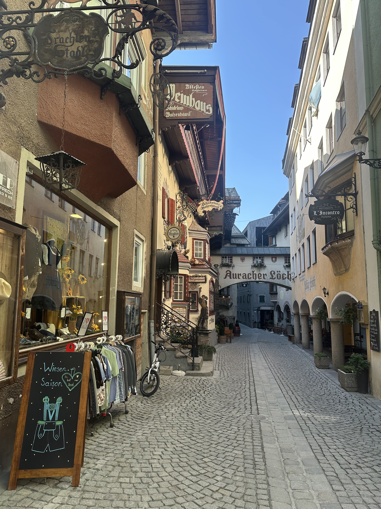
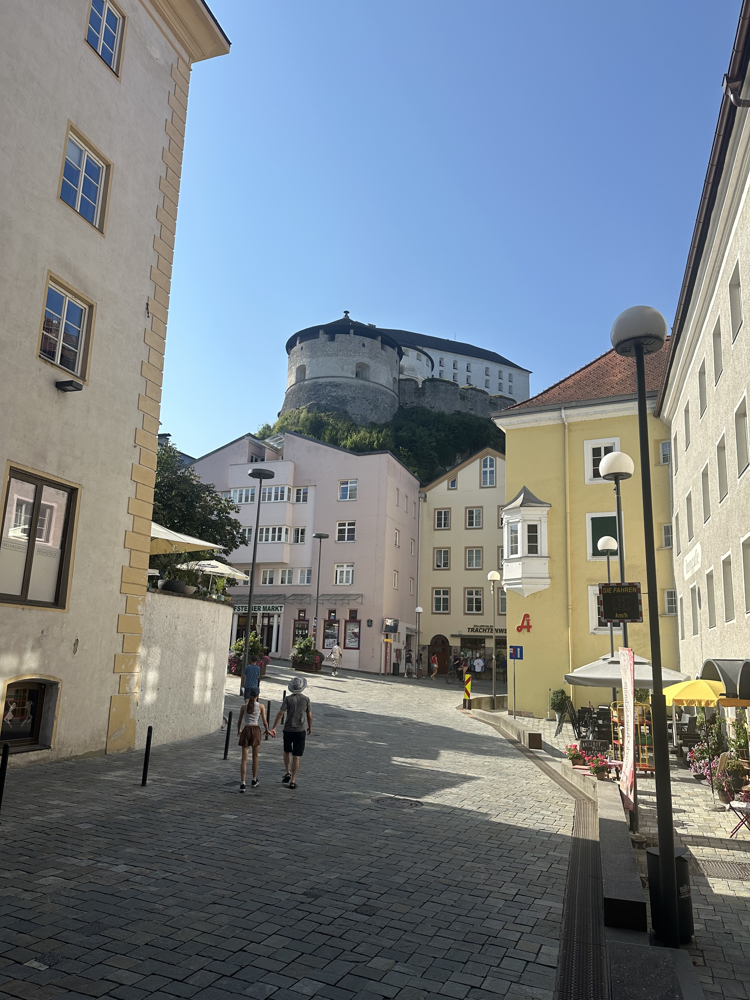

לא היינו בטוחים אם המבצר יעניין את הילדים (עלמה שרלוט בכלל דמיינה אותו כ״ארמון ורסאי״ משום מה), אבל שמחנו לגלות שהילדים פשוט רותקו מהמוצגים ובילינו במבצר שעות יפות. במבצר היה שילוב מושלם בין קצת מידע היסטורי על מקסימיליאן הראשון וחבריו, קצת טיפוס, נוף מרהיב והמון מיצגים שאפשר לגעת ולטייל בעולמות הדמיון.

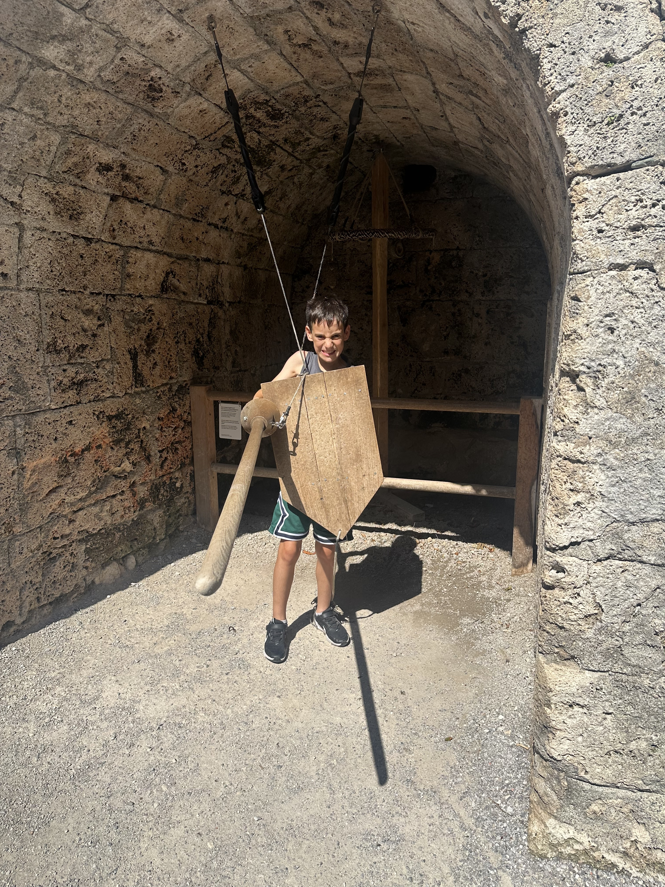
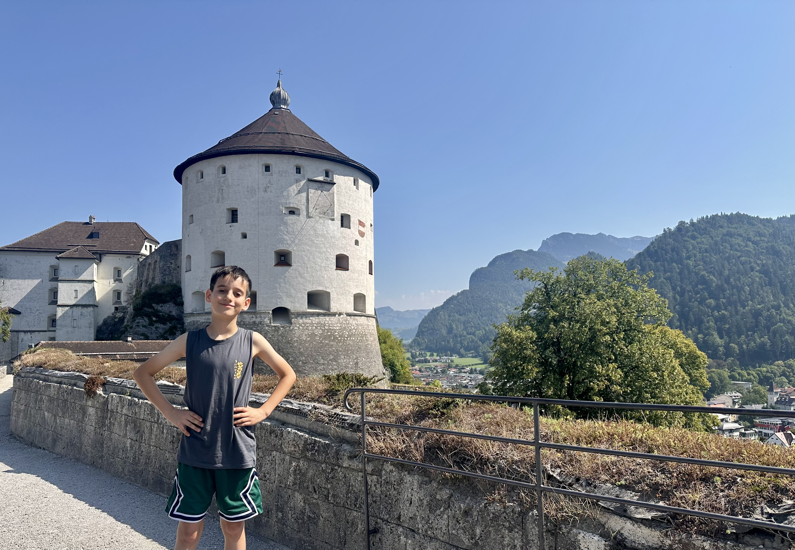
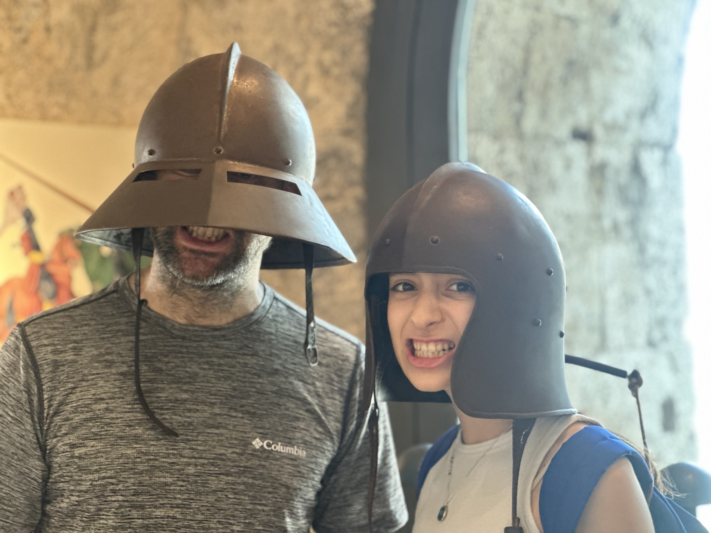
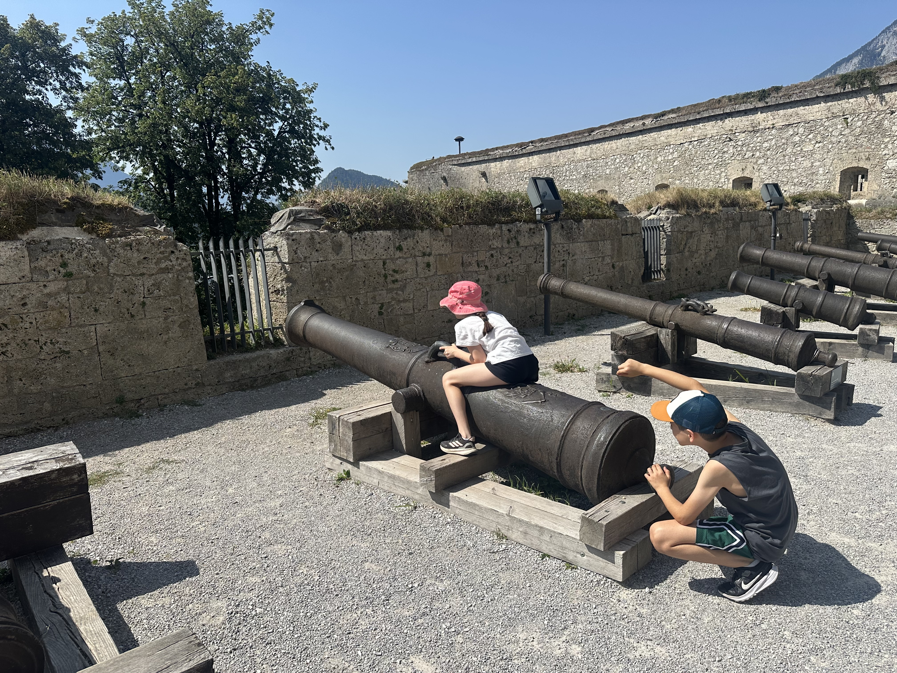
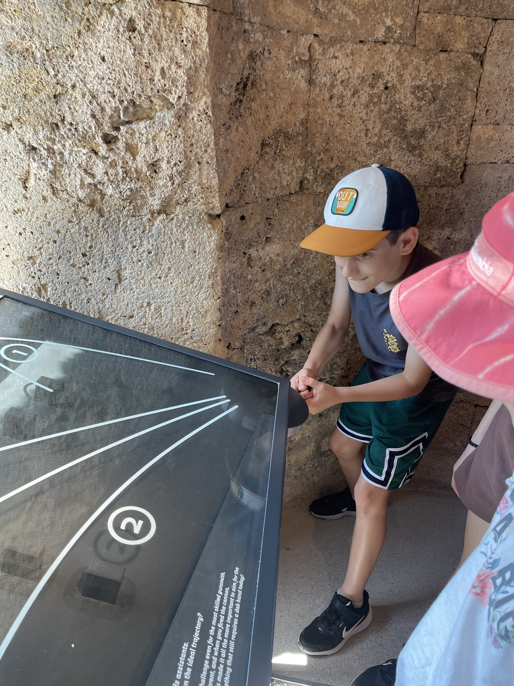
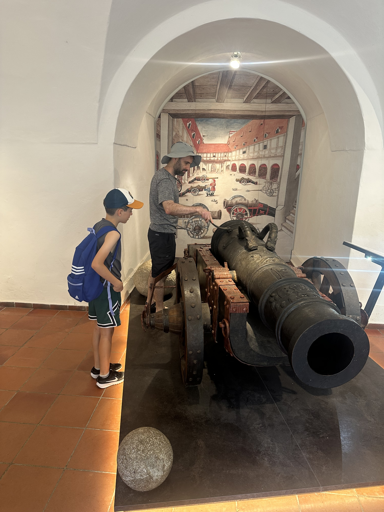

בזכות היכרותנו הקצרה עם המין האנושי, ממש לא הופתענו לגלות שהאיזור בו הושקעה מרבית היצרתיות האנושית היה ״מרתף העינויים״. בהתחלה הילדים הסתקרנו לגבי כל מכשיר וביקשו שנתרגם ונתאר איך הוא פעל, אך מהר מאד הם יצאו מהחדר בפרצופים מבועתים.

לעומת זאת, דווקא קומת הכלא בצריח הגבוהה ביותר של המבצר הפיחה קצת יותר תקווה במין האנושי. הכלא, עם הנוף היפה ביותר במבצר שימש לכלוא אסירים VIP ממעמד האצולה.

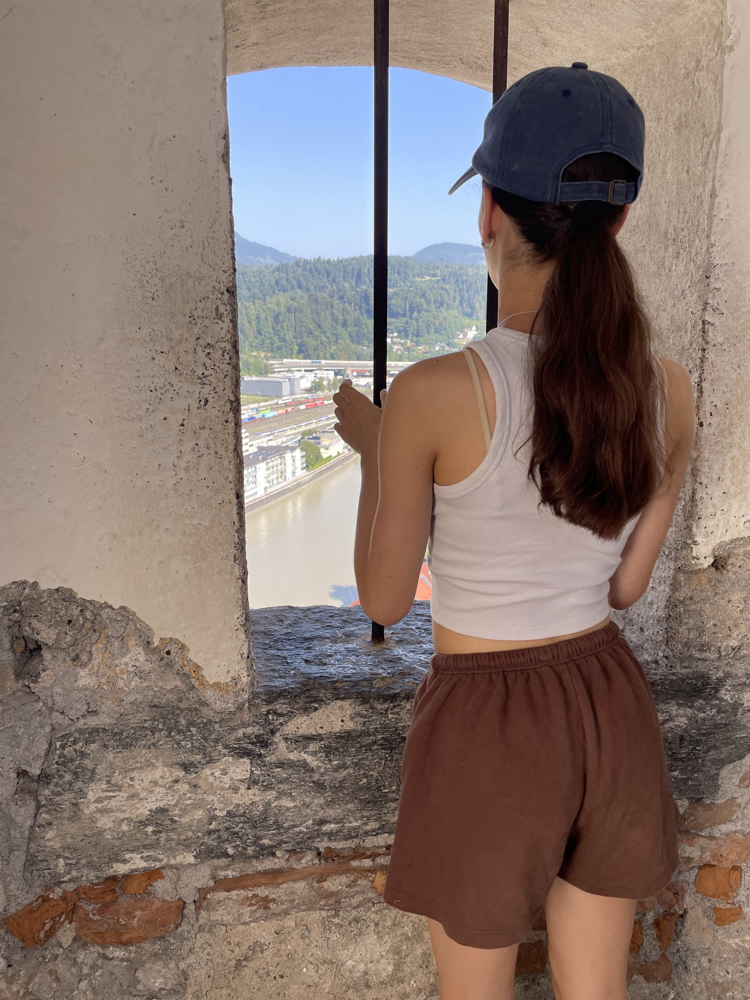
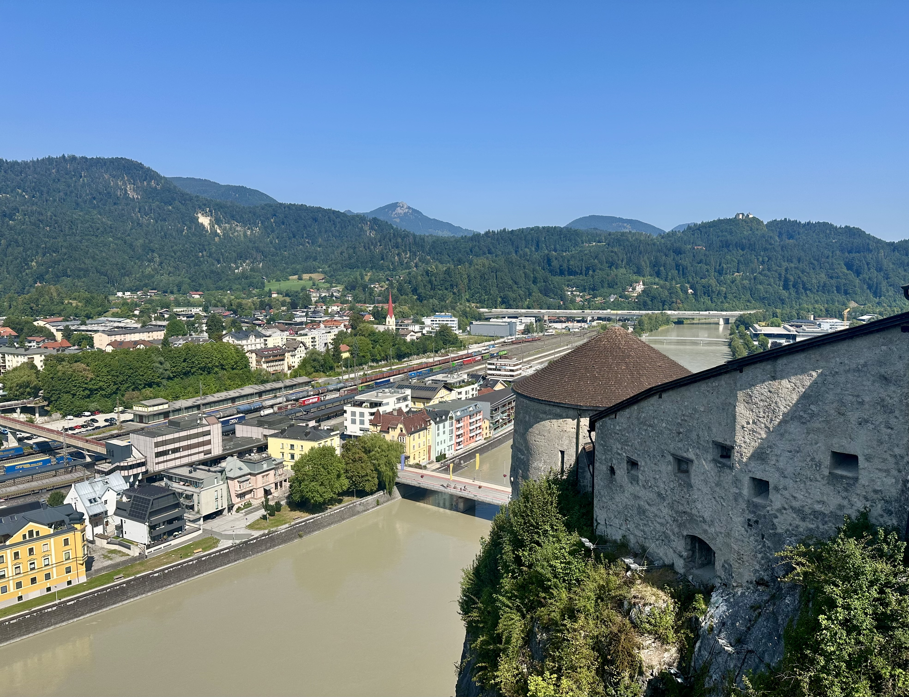
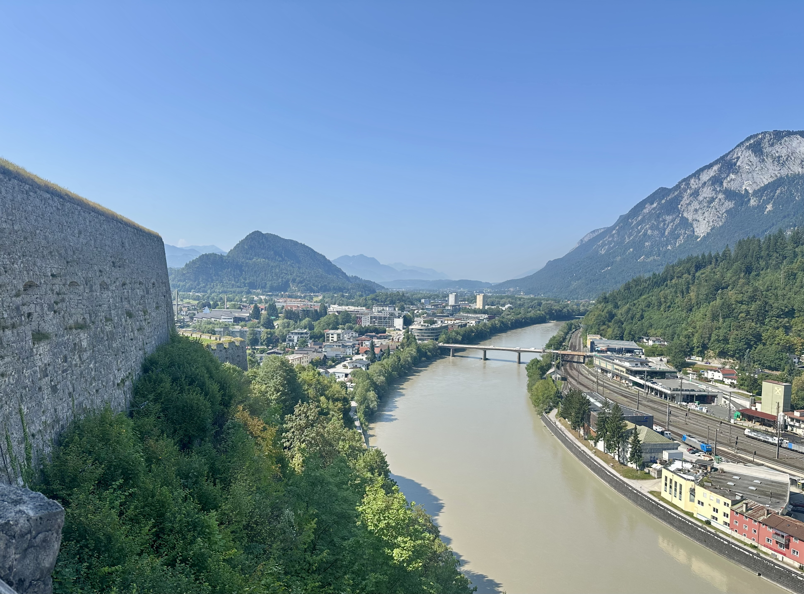

קינחנו את הסיור בהופעת עוגב הגיבורים המפורסמת של המבצר... העוגב, שנגינתו נשמעת עד 10 קילומטר מסביב למבצר מעניין מבחינה טכנולוגית/אקוסטית וגם היסטורית. מבחינת אקוסטית, העובדה שהצינורות העצומים נמצאים בחוץ בחלקם, ונתונים בתנאי מזג אויר משתנים, יש לכוון מחדש את העוגב בכל יום. במקרה פגשנו את הנגן והוא סיפר לנו שהוא הולך לכוון את העוגב לפני שירד לכניסה כדי לבצע את הנגינה. מבחינה טכנולוגית, העוגב המקורי נמצא בראש המבצר, אך שינוי מודרני שהוכנס, העביר את הקלידים עצמם אל הכניסה התחתונה של המבצר, כדי לאפשר לקהל ״להתקהל״ סביב הנגן. הקלידים מחוברים בסיבים אופטיים מהירים אל המבצר, שם מתבצעת המרה בין כל קליד שנלחץ, לפי הרגיסטר שבחר הנגן ונפתחים מספר שסתומי אויר מבין 5000 (!) הצינורות האפשריים וקול רועם מתוכם. העיכוב בצליל שגורמת הטכנולוגיה הוא שולי לחלוטין, אך מהירות הקול משחקת כאן תפקיד, המרחק הפיזי של העוגב מנגן העוגב דורשת אימונים מיוחדים, ופרט לכמויות הקלידים שיש ללהטט בהם עם הידיים והרגליים יש להסתמך על קצב פנימי בלבד, ולהתעלם מהצלילים ששומעים. בשל ההתמחות המיוחדת, בדרך כלל לכל עוגב יש נגן מומחה לו המכונה ״אורגניסט העיר״, עמדה שנחשבת ייחודית ויוקרתית...

מבחינה היסטורית, ״עוגב הגיבורים״ תוכנן ב1931 כ״אנדרטה אקוסטית״ לזכר חללי מלחמת העולם הראשונה באוסטריה וגרמניה. בתקופה הנאצית, עודכנה האג׳נדה כדי לקדם את האידאולוגיה, והטקסים המרשימים של העוגב שימשו את הרייך השלישי ככלי תעמולה. לאחר מלחמת העולם השניה, שונתה משמעות הטקס לטקס של שלום עולמי. ממש לאחרונה, לאחר ויכוח סוער במועצת העיר קופשטיין שינו את השיר האחרון שהיה נהוג לנגן במופע באופן קבוע (שיר קינה צבאי גרמני) וכיום בכל יום בסלוט הזה מנוגן שיר אחר שמשדר יותר שלום ואחווה.

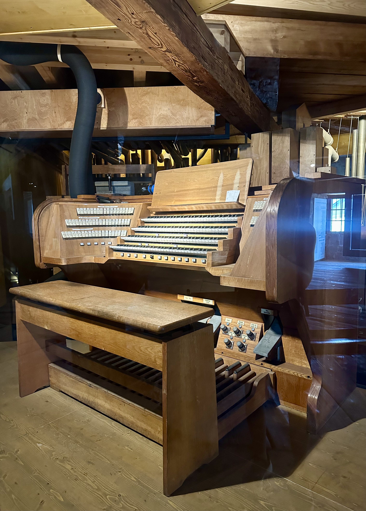
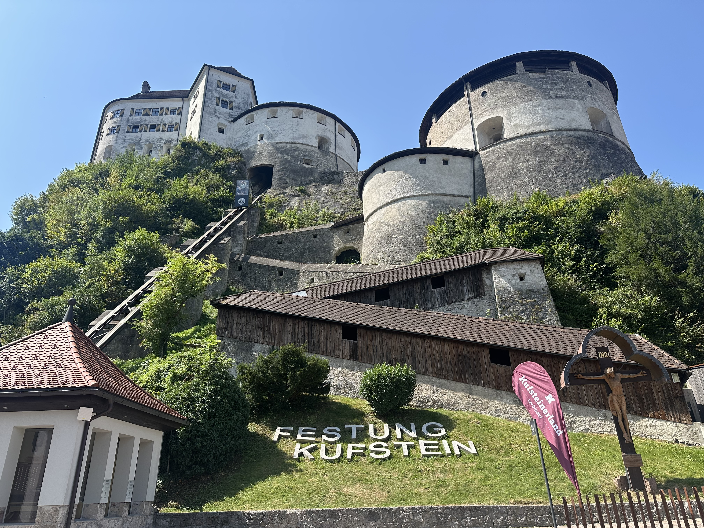

אגב, אם כבר מועצת העיר קופשטיין מוכנה לעשות עוד חשבון נפש מוסרי, להתכנס שוב, ולקחת החלטות קשות באמת כדי לשמח את העם היהודי: אנחנו מבקשים לשנות את השלט הזה בטירה, ממנו קשה להבין אם כאן זאת ״כיין״ כניסה או ״קיין״ כניסה (אין כניסה) :)

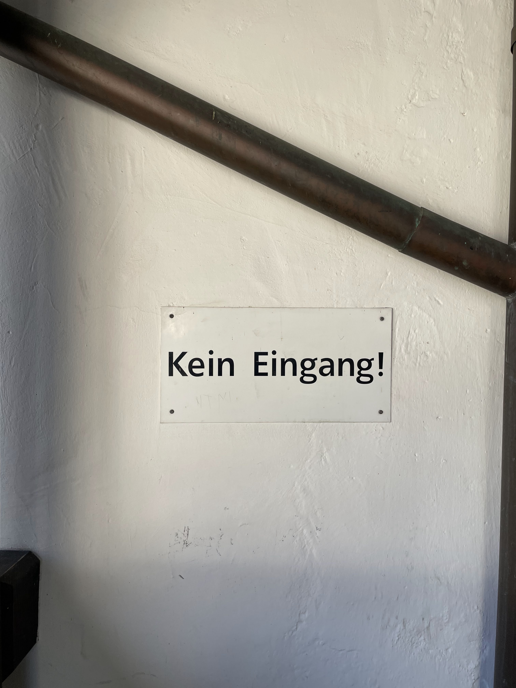

סיימנו את הביקור בקופשטיין בביקור בעוד מקום המשלב בין היסטוריה, הנדסה ואומנות. המפעל של רידל (Riedel). משפחת רידל מייצרת זכוכית כבר למעלה מ270 שנה (11 דורות)! כמו כל אירופה, ובמיוחד באיזור הזה, המשפחה עברה טלטלות רבות, אך וולטר רידל (הדור השמיני), לאחר ששוחרר מ10 שנים בכלא הרוסי, הגיע לקופשטיין ב 1956 ופתח את המפעל בו ביקרנו.

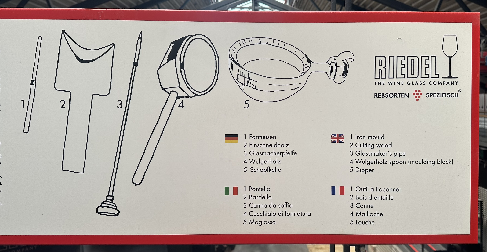

עד היום, בני משפחת רידל הם בעלי תפקידים אקטיביים בחברה, בשל חופשת הקיץ נבצר ממני לחבק את מקסימיליאן רידל שלא נכח, אבל זה בהחלט מרשים שחברה כל כך מצליחה בינלאומית עדיין נשמרת כעסק משפחתי. מי שהפך את רידל לשם עולמי הוא קלאוס רידל: שטען, ובהמשך אושר באופן מדעי שסוג הכוס משפיע על הארומה, והתאמה בין כוס לסוג היין אכן משנה את החוויה. אמנם ברידל לקחו את זה לקיצוניות והוסיפו קצת ״אבקת בולשיט״ שמאפשרת להם לייצר סיפורים מופרחים על כיוון זווית נחיתת המשקה על הלשון, והפרדה בין כל זן ענבים, אבל ההיסטוריה היא ההיסטוריה ולרידל יש כוסות ממש מגניבות.

את הביקור סיימנו בסדנת הכנת הכוסות, בה עדיין מייצרים חלק מהכוסות באופן קבוע בשיטה הידנית המסורתית. אמנם מרבית הכוסות של החברה מיוצרות במפעל משוכלל בגרמניה עם פטנטים וטכנולוגיה גרמנית מתקדמת המאפשרת את יצירת הכוסות הדקות במיוחד שבעבר יכלו להיות מנופחות רק בידי מעטים עם מיומנות גבוהה במיוחד - אבל המפעל באמת מתפקד, ויפה לראות את השימור של השיטות והמסורות העתיקות.

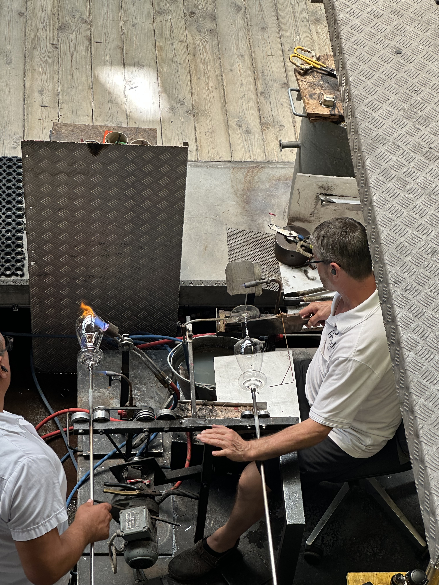
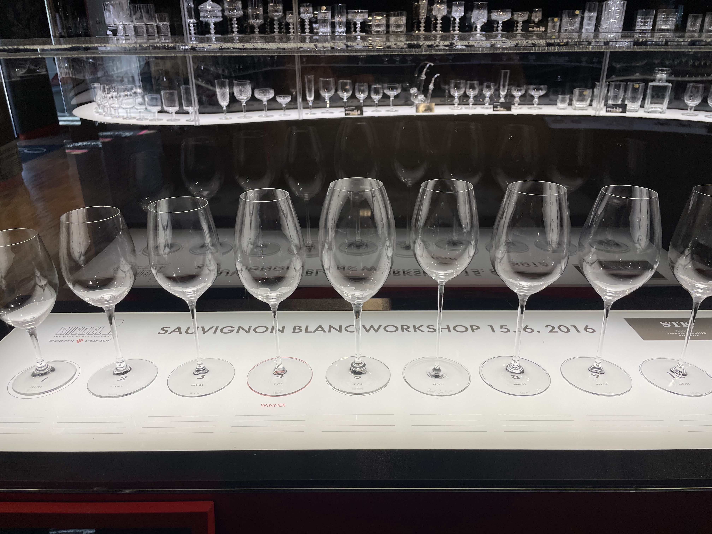

את הערב סיימנו באתגרי פינג פונג משפחתיים בהשתתפות מיוחדת של נמלתנו האהובה!

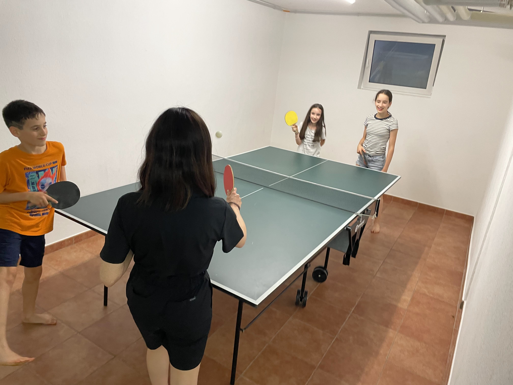

המשך יבוא...
