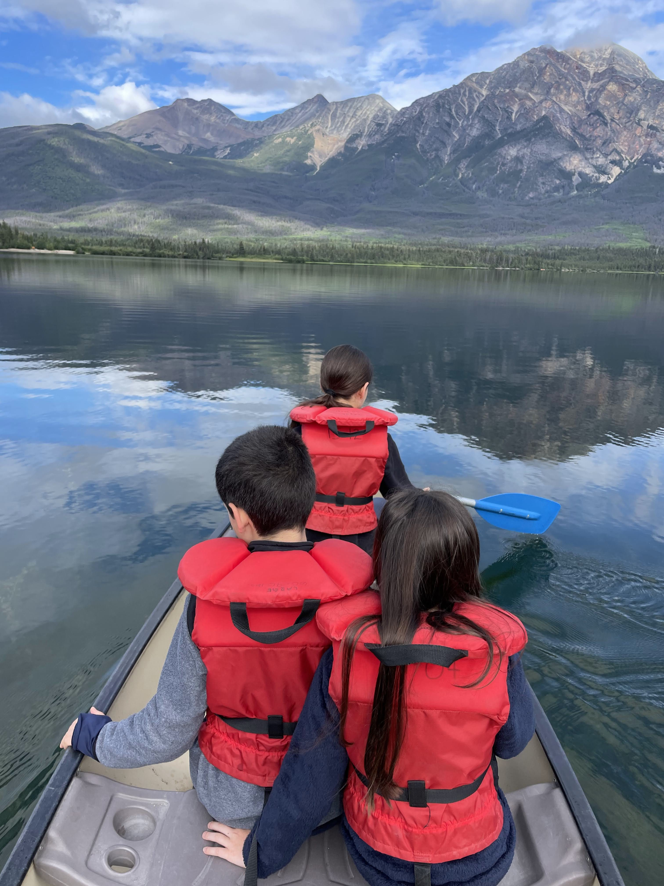
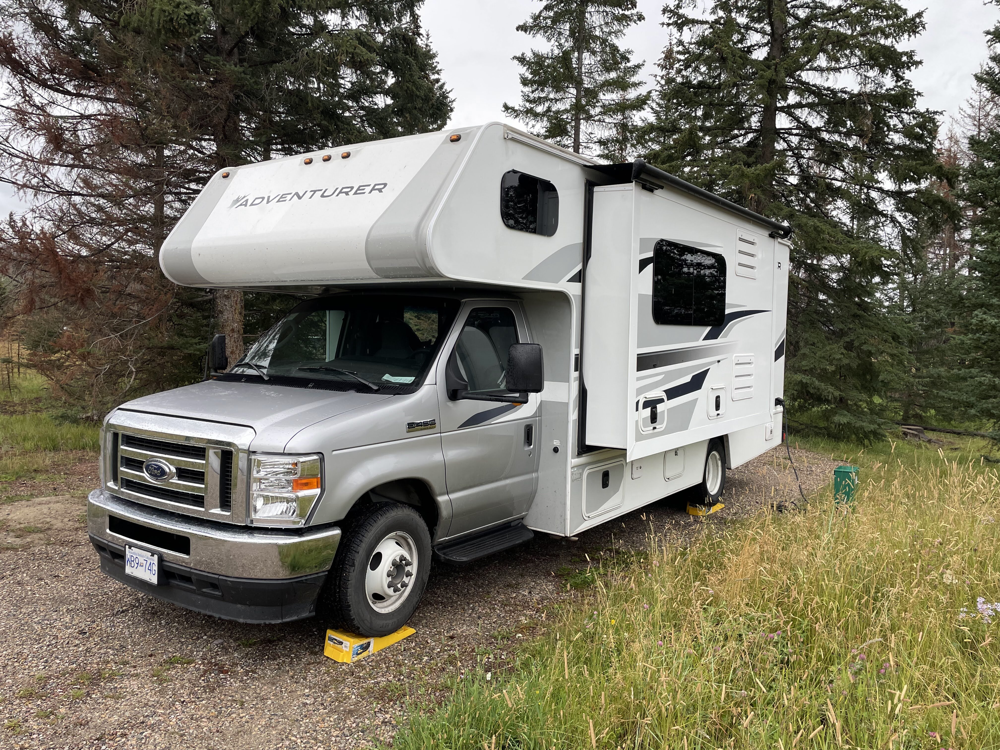
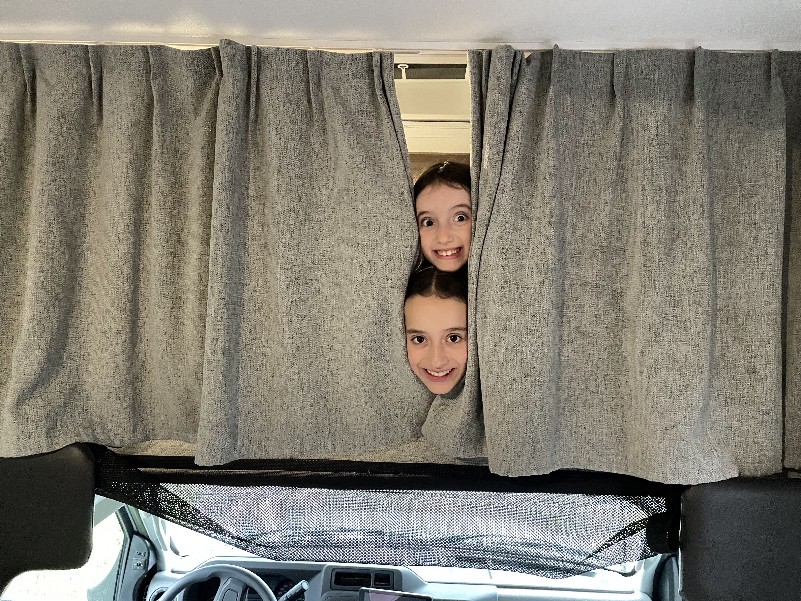

תחזית מזג האוויר לשלושת הימים הנותרים שלנו בג׳אספר נראתה קודרת ועגומה. אם נוסיף לזה את העובדה שחצי מהאתרים כאן נשרפו לחלוטין ולא נגישים, נאלצנו לעשות התאמות בתוכניות ולהגיב ספונטאנית למה שמזג האוויר מאפשר.

את הבוקר התחלנו בPyramid lake. החניון היה ריק לגמרי, הצטלמנו ליד האגם לפני שתיירים נוספים מתחילים להגיע, ויצאנו למסלול קצר.

במשרד התיירות בג׳אספר הזהירו אותנו שאתמול דב גריזלי הפך שולחן פיקניק וזלל את האוכל של תיירים מבוהלים, אז בנוסף לספריי הדובים עמדנו בהמלצות והקמנו רעש גדול במהלך ההליכה. בזמן שהנמלה היתה עסוקה בצילומי הפטריות שלה, המצאנו את אחד משירי הרחקת הדובים המוצלחים בכל הזמנים. נכון לכתיבת שורות אלה - אין הקלטה של ביצוע של השיר האינטראקטיבי, אבל תאלצו לדמיין - שם השיר הוא ״תעביר לי את הגריזלי״ - שיר קצבי בו אחד המשתתפים ״מכיל בתוכו את ׳הגריזלי׳״ ואז מעבירים מאחד לאחד תוך נהמות רמות לפי הקצב.

המסלול הקצר משתרך לחופי האגם ומסתיים באי קטנטן וחמוד. על האי, רשות הטבע והגנים של קנדה מאפשרת להזמין סלוטים עבור חופה בטבע מול האגם. עלמה שרלוט התרגשה מהסצינה הרומנטית והצטלמנו בכל מיני פוזות שונות ומשונות לפני שחזרנו באותה הדרך.

כשהגענו בחזרה לקראוון, מזג האוויר התחיל להתבהר, הילדים ניצלו את ההזדמנות כדי לגבות את החוב של הנמלה לשייט בסירה. ניצלנו את ״חלון מזג האוויר השמשי״ הקצר שקיבלנו, שכרנו קאנו קטן והשארנו את הנמלה להשתזף ולקרוא ספר לחופי האגם.

מהר מאד גיליתי שלילדים אין באמת מספיק כח בידיים כדי להזיז סירה, כך שנאלצתי לנצל את ההזדמנות עבור אימון כח. בזמן שה״עבד״ מאחור חתר, הילדים שרו שירים וחיפשו דובים וחיות אחרות על חופי האגם. פרט לכמה ציפורים לא מצאנו חיות מעניינות אבל היה שיט נחמד - הגענו עד לאי, הטרדנו את מנוחתם של כמה ציפורים וסגרנו את ״חוב השייט״ מול הילדים.

את שאר היום, שהיה גשום וקר ברובו, ניצלנו כדי לאכול צהריים במבשלת הבירה של ג׳אספר (מיט לואף מבשר Elk היה נחמד) , לשתות קפה, ולהשלים כביסות וזמן אינטרנט לילדים במכבסה/בית קפה המקומי snowdome (קפה טעים לשם שינוי). המרכז של ג׳אספר אולי היה נחמד לפני השריפה, אבל כרגע הוא נראה קצת עצוב.

חזרנו לנוח בקמפגראונד. הפעם החלקה היתה באמת עקומה - כך שנאלצתי להשתמש לראשונה ב״משולשים הצהובים הללו״. אחרי שגיליתי שזה שטויות, מעכשיו נחנה תמיד ישר... הבנות נסגרו ב ״סטודיו למתיחות״ שלהן (שנשמע הרבה יותר כמו ״סטודיו לצחקוקים״) וביזבזנו את ההקצאה האחרונה לארוחת ערב/בוקר אנגלית בקראוון (בישום כרית הנמלה בניחוח בייקון).

המשך יבוא...