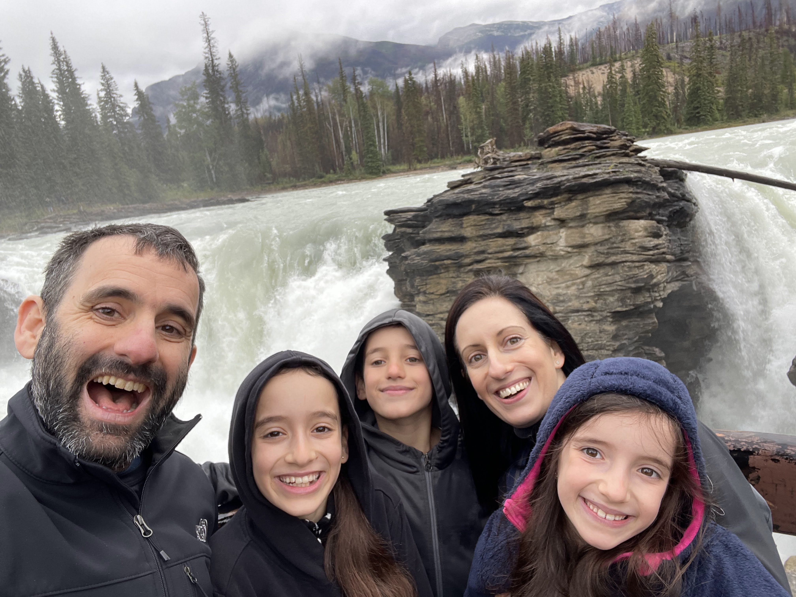
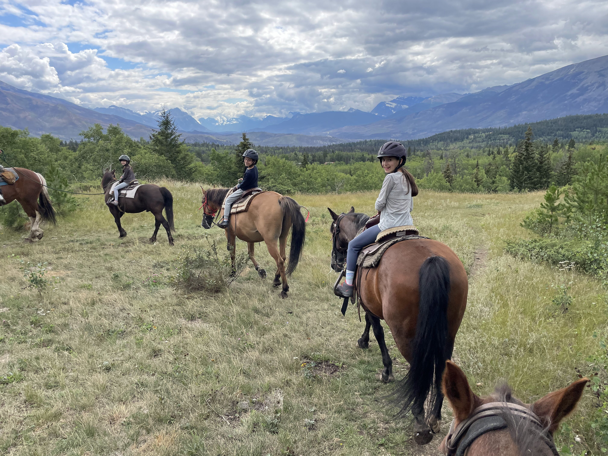
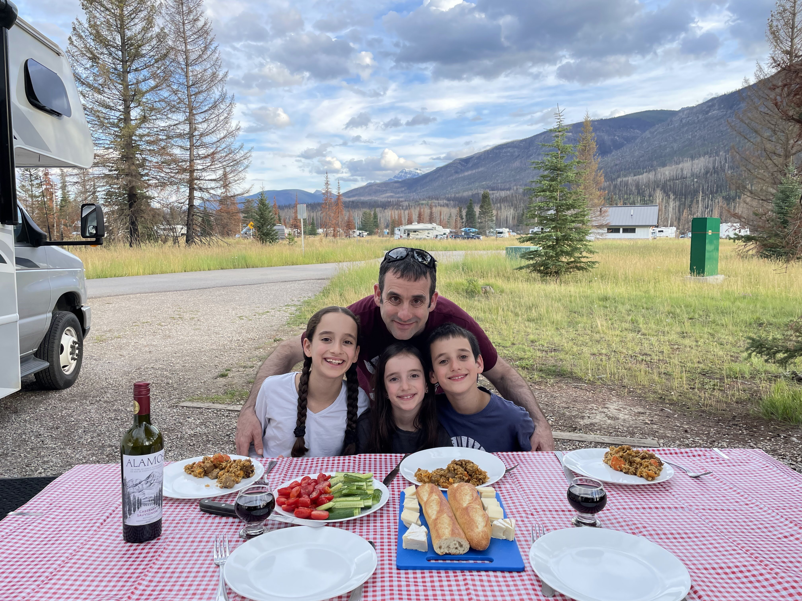

הבוקר שוב היה מעונן וסגריר, נסענו דרומה לכיוון מפלי אתבסקה. המפלים קרובים מאד לכביש ואין כרגע ממש מסלול שאפשר לעשות שם (המסלולים מסביב שרופים וסגורים). אופציה פופולארית לפעילות במקום היא ראפטינג - אבל ויתרנו הפעם. המפל אמנם לא מאד גבוהה, אבל ממש עוצמתי - ולגמרי שוווה את הביקור

עשינו מסלול קצר שיוצא מהחניון. נראה שעובדים על שיקום האזור כך שבעתיד סביר שאפשר יהיה לעשות במקום היפה הזה מסלולים יותר ארוכים. המסלול יורד מטה בין הסלעים עד שמגיע לנהר עצמו ממנו יוצאים כמה מחברות הראפטינג. בדומה לטיול באתונה, כשמישהו אומר ״אתבאסקה״ יש לסתור אותו ולענות בתקיפות - ״את/ה באסקה״

בצהריים מזג האוויר התבהר אז הזמנו רכיבת היכרות על סוסים. במיוחד לפיטים, שלא רכבו אף פעם, אפילו הרכיבה האיטית על החיות העצומות הללו היתה מסעירה. המסלול עובר ביער ברכיבה איטית המתאימה לכל הגילאים וטיפה משעממת, המדריכה סיפרה קצת עובדות על היער והראתה לנו עקבות וסימני ציפרניים של דובים על העצים, אבל הילדים יותר התעניינו בצרכים הענקיים שהסוסים עשו מידי פעם.

כשסיימנו את הרכיבה, לראשונה מאז הגענו לג׳אספר השמיים התבהרו לחלוטין ופתאום ניתן היה לראות את הצבעים האמיתיים של חלק מההרים. אחרי מנוחה קלה המשכנו ל"שמורת אור הכוכבים" של ג׳אספר (Dark sky preserve). אם היינו יודעים שלא יהיו עננים אולי היינו הולכים מאוחר יותר, אבל כבר הזמנו סיור מוקדם. המיצג עצמו היה נחמד, אבל הסיור וההסברים האינטרקטיביים סביב הטלסקופים המשוכללים היו הרבה יותר מעניינים (בעיקר כי היינו שם לבד ואפשר היה לעצור ולתרגם את המדריכות לילדים). היו המחשות מעניינות לתופעות כמו הזוהר הצפוני והשדה המגנטי של כדור הארץ. בהעדר חשכה, השתמשנו בטלסקופים העצומים להסתכל על כל מיני נקודות מעניינות באזור כמו תחנות הרכבלים שהיה אפשר לראות בדיוק רב או רוג׳ום קטן בסיום מסלול של פסגה גבוהה. הטכנולוגיה התקדמה מאז הפעם האחרונה בה הייתי במקום כזה. הרשים במיוחד טלסקופ מחובר למחשב שאפשר לבקש ממנו לראות עצמים ספציפיים והוא פשוט מכוון ומכייל את עצמו.

אחרי שהמדריכה במצפה התעקשה ששום שכבה מהירח לא עשויה מגבינה (למרות שהיא נתנה לי לטעום רק אבן קטנה מהשכבה החיצונית של הירח) נאלצנו לקנות גבינות ארציות בעצמנו. אחרי כמה אכזבות, הבנו כבר שאת הקנדים חייבים להרחיק ככל האפשר מחביצת גבינות, ואין טעם לנסות לטעום עוד גבינה מקומית. עברנו להתמקד ביכולת שלהם לייבא.

בנוסף, אולצתי להתגלח וכעת אני נראה כך:

המשך יבוא...
