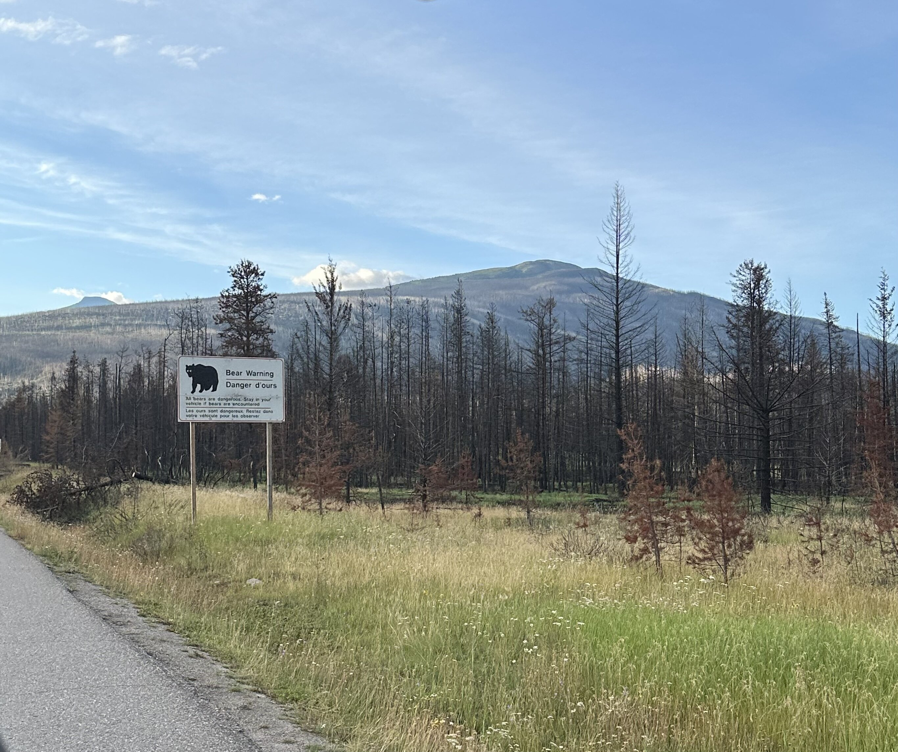
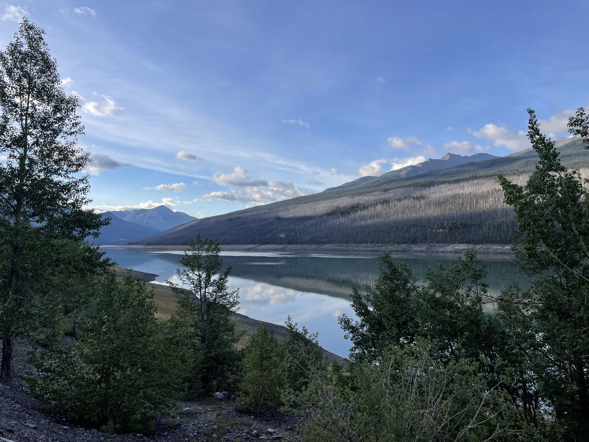
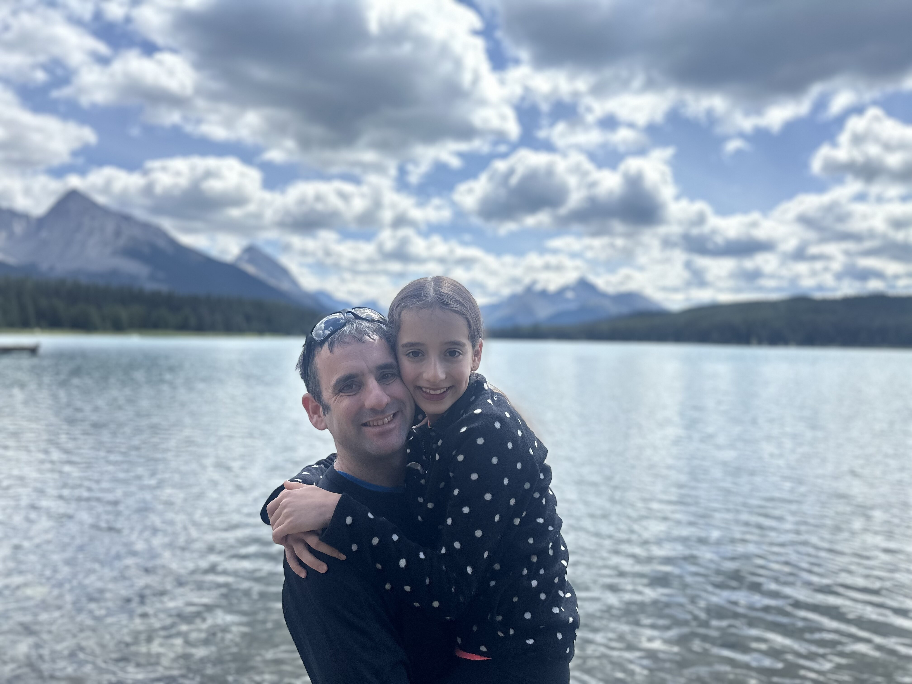

היום הוא הפרק האחרון בשמורת ג׳אספר ובהרי הרוקי בכלל, לקראת פתיחת הפרק הקייצי יותר של הטיול והמסע דרומה. את חגיגות הפרידה נפתח בצורה אופיינית עם השקמה וטיפוס על ״הר רוקי״ שורץ דובים. נסענו מזרחה לכיוון אגם מלין (Maligne lake)

הבוקר טיפסנו במסלול [Opal Hills Loop](https://www.alltrails.com/trail/canada/alberta/opal-hills-short-loop)  היוצא מצפון לאגם מלין ומשקיף על העמק. המסלול ידוע בתור כזה שיש בו סיכוי טוב לראות חיות גדולות כמו מוס וכמובן גריזלי. למרות שהיינו כמעט לבדנו על ההר כולו, קנדה עדיין ״חייבת לנו״ מפגש עם המוס המפורסם. נו מילא, כנראה שנאלץ לחזור בשבילו... אמנם לא דובים, אבל לגמרי כן יער: המסלול לא נפגע בשריפה הענקית ועבר בתוך יער ירוק שסיפק הגנה מהשמש בטיפוס התלול.

אחרי כשעה של הליכה וטיפוס של 500 מטר יוצאים מתוך היער ומעליו נחשפים נופים של ההרים מסביב. משם המסלול ממשיך במעיין ״עמק אלפיני״ בין פסגות בהן ניתן עדיין לראות שאריות שלג שנמס לאיטו לנחל שקט שחוצה את השביל. זה גם האיזור בו אנשים מדווחים על מפגשים עם מוס, אבל לא התמזל מזלנו. אמנם אין במסלול איזו ״נקודת שיא״, או נק׳ תצפית דרמטית, וגם אחרי כל כך הרבה מסלולים ברוקי קשה כבר להרשים אותנו - אבל המסלול ממש מקסים והיווה טיפוס פרידה ראוי, מהנה ולא קשה מידי.

משם השלמנו את הלולאה וירדנו בחזרה לחניון שכבר התחיל להתמלא, והמשכנו ברגל לשפת האגם לפיקניק הצהריים הרשמי. אגם מלין הוא עוד אחת מהנקודות הללו בה אוטובוס פורק אנשים שמצטלמים בכל מיני פוזות מול הנוף וממשיכים הלאה. הפעם, מכיוון שאת המסלול שלנו כבר צעדנו, זה בדיוק מה שעשינו :)

משם חזרנו לאחר צהריים וערב אחרונים בקמפגראונד בג׳אספר. מזג האוויר היה מושלם וכך גם מצב הרוח. הילדים התעקשו שנשאיר אותם במגרש המשחקים של הקמפגראונד - כבר כמה ימים שהם מבקשים, אבל נמנענו בגלל שהוא רחוק מאד מהחלקה שלנו. השארנו אותם עם מפה של האתר והוראות הגעה וגם אנחנו קיבלנו קצת שקט. כמובן שכשניסו לחזור - הלכו בדיוק בכיוון ההפוך והסתבכו בהרפתקה ובנסיון לתרגל את האנגלית שלהם. הם הגיעו נסערים בדיוק כמה רגעים אחרי שהנמלה הפסיקה להשתכנע שהם יסתדרו לבדם ועמדה לצאת לחפש אותם. היה לנו מספיק זמן להכין ריזוטו מפנק בבישול ארוך על המדורה ולהינות מערב קריר אחרון לפני המסע דרומה

כמו הרבה מסורות משונות, גם למסורת הזאת אין הסבר שמניח את הדעת: בכל פעם בה יש אזעקה והמשפחה נכנסת ביחד או לחוד למקום מוגן, לא משנה מה השעה או מצב הרוח, אנחנו נוהגים להזכיר אחד לשני את האורז הטעים שאכלנו יחד בצומרקה (יוון). אחרי ערב מושלם של שירים ושטויות, החלטנו שאם לצערנו נאלץ להכנס שוב למרחב מוגן - מעכשיו נזכיר את האורז הטעים שאכלנו כאן - האורז האגדי של ג׳אספר. מחר בבוקר נתחיל במסע בן יומיים דרומה לכיוון האי של וונקובר, ושינוי באופי הטיול.



