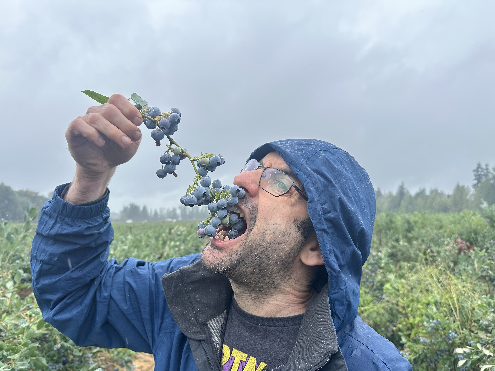

ברחנו ממזג האוויר הקודר שהגיע אל ״ונקובר האי״ וחזרנו לכיוון ״ונקובר העיר״, לא לפני ביקור נוסף באאוטלט - כדי להעביר בו כמה שעות של גשם. בעוד אני רוכב על פנדה פראית וממונעת עם הילדים, הנמלה השלימה את המהפך - ומעתה יש לקרוא לה: ״נמלולו״. רק ראוי שהטרנזפורמציה תקרה דווקא בונקובר - מולדתו של המותג היוקרתי.

את היום הסגריר הנוסף, ניצלנו בצורה מושלמת. אחרי שבאזורי הטבע לא מצאנו שום זכר לתרבות קולינארית, הקרבה לעיר גדולה עשתה את העבודה - מצאנו יקב שהוא גם "חוות berries״  שמציעה בילוי מושלם של קטיף, משקה וזלילה. הגענו מוקדם ל"Krause Berry Farms & Estate Winery" והתחלנו ב״עבודה״. החווה, שלא ממותגת כ״אטרקציה תיירותית״, חביבה על מקומיים קנדים. בחסות הבוקר הגשום, היינו כמעט לבנו בשדות הרחבים של הליקוט.

בהעדר שם כללי ל berries בעברית, קטפנו המון סוגים של ״גוחמניות״. מעולם לא אכלתי כל כך הרבה גוחמניות. בגחמנות דובית, גרפתי עוד ועוד גוחמניות לתוכי ועצרתי רק כשהן כבר יצאו לי מהאזניים!

אך הגחמנות לא נגמרה שם! אחרי העבודה הקשה בשדה, נכנסנו למבנה היקב שכבר התחיל להתמלא במבקרים. במקום ניגנו מוסיקה חיה וסביב שולחנות הומים, אנשים הזמינו פנקייקים ענקיים מכוסים בהררי גוחמניות וקצפת. בנוסף לפנקייק מושחת, הזמנו טעימת יינות מהיקב וקצת נשנושים - מצב הרוח היה בעננים. את השלל שאספנו לקחנו איתנו וחיסלנו אותם ביומיים הבאים בעיר. קנינו בקבוק של ״יין אוכמניות״ חמצמץ שהיה באמת משובח וחזרנו אל הטיול שלנו.

לפני החזרה לעיר נפרדנו לשלום מהקראוון (!). בזמן שהנמלה ״איפסה״ את הקראוון אני והילדים עזרנו בכך ש״לא הפרענו לנמלה לאפס את הקראוון״. ברגשות מעורבים החזרנו את הקראוון וקיבלנו הסעה מחברת הקראוונים המצויינת אל תוך העיר. שלושת השבועות האחרונים היו מופלאים, אך גם לא פשוטים. בזמן ההמתנה הבחנו שכמות שוכרי הקרוואנים דוברי הגרמנית היתה לא פרופורציונית. מסתבר שגרמנים מאד אוהבים לטייל בקנדה בקראוון. נפרדתי גם מספריי הדובים שלי ונתתי אותו למטיילת גרמניה שהייתה חשדנית באופן מיוחד: הבטחתי לה שלא השתמשתי בו בכלל, ואפילו כשנתקלנו בדב, הכנעתי אותו במו ידי רק כדי לא לבזבז לה את הספריי!

בלי ה״בית על הגב״ בילינו יומיים נחמדים בונקובר. העיר שלווה ונראה שהיה יכול להיות נחמד לגור בה. אין לעיר איזושהי ״אטרקציה״ ידועה, פרט ל״שעון קיטור״ מטופש וחסר כל צידוק. ניסיתי  לדמיין את ישיבת העיריה בה החליטו על בניית השעון הזה: כל אחד העלה הצעות משלו איזו אטקרציה תיירותית שתסמל את העיר. אני יכול רק לנחש שמחלוקות קטנוניות גרמו לכך שיצביעו עבור אופציה מגוחכת שאף אחד לא רצה וזה מה שיצא... אבל העיר באמת נחמדה - לראיה, בנמל חנו לא פחות מ4 אוניות קרוז עצומות שפרקו אלפי תיירים שבאו לטעום קצת מונקובר.

בערים הגדולות של קנדה, בזכות ריכוז גדול של מהגרים, אפשר אפילו למצוא אוכל טוב. ניצלנו זאת היטב ואכלנו במסעדה קוריאנית אותנטית ולמחרת במזללת ראמן. היה משובח.

למרות שהתלבטנו לגבי ביקור ב״עוד אקווריום״ עירוני, בעקבות ההמלצות הרבות ביקרנו בו והיה מעולה. פרט לאקווריום הפנימי, היו גם אריות ים וכמובן לוטרות שובבות שגנבו את ההצגה. לא לפספס את ההקרנה ב״4 מימדים״ על דגי הסלמון. האולם המושקע מעביר היטב את הסיפור של הדגים שכל כך חשובים לאקוסיסטם של קנדה.   

וזהו.. נפרדנו מקנדה. מכאן טסנו לכמה ימי חגיגות יום הולדת בארה״ב וחזרה הביתה! תודה קנדה, היית לנו בית טוב, עוד נחזור!

