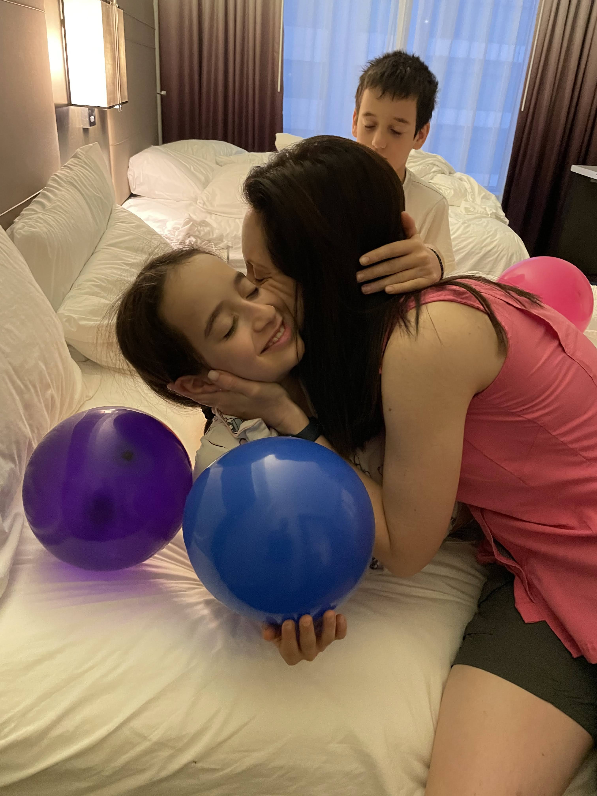
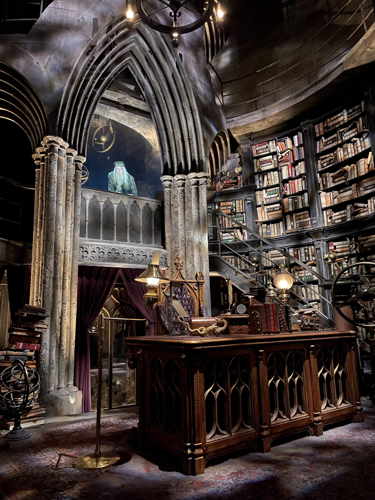

נחתנו ב LA לקראת פרק הסיום של הטיול ולחגוג לעלמה שרלוט את בת המצווה שלה. נסענו לאנהיים, הצטיידנו בסיכות הרשמיות והסתערנו על המקום אותו הרמקולים כל הזמן מכנים ״המקום השמח בעולם״.

מה שהתכיל כעכבר קטן ומצוייר הפך למפלצת קפיטליסטית חסרת לב. למרות הידיעה שקונגלומרט הענק הזה שטף לנו את המח במשך שנים והכתיב לנו מה לאהוב - לראות את המקום העצום הזה, עם כל הדמויות האהובות וההשקעה בפרטים, יגרום גם לאחרון הציניקנים להתרגש. אבל אסור להתרגש יותר מידי, יש לנהל את היום בצורה מחושבת, כי שם המשחק הוא ״תורים״! כמו חיילים ממושמעים צעדנו אחרי הנמלה לפי הסדר הנכון ואכן הצלחנו לחמוק מרוב ה״ייבושים״. 

הילדים הסתכלו לכל עבר וספגו כל דבר בהתרגשות שעלתה על גדותיה. הם ניהלו דירוגים מנומקים של כל המתקנים ביומנים שלהם והשוו בין שלושת הפארקים השונים בהם היינו. אני מאד אהבתי את האיזור של סטארק וורז בדיסני. ההתמקדות והשקעת היתר בפרטים הקטנים היתה כל מה שטוב בתרבות ההוליוודית. טיילנו בסמטאות של טטואין וטסנו במילניום פאלקון! כמיטב המסורת בפארקים הללו גם לאורך התורים פזורים המון גאדג׳טים אינטראקטיביים מושקעים שמכניסים את הממתינים לאווירה. המתקן של Rise of the Resistance היה מטורף, פרט לאפקטים המשוגעים, והבאת הקאסט המקורי של הסרטים לצלם סצינות עבור המתקן, הצוות במקום שיחקו קצינים בFirst order בצורה משכנעת. באמצע המתקן ״נחטפנו״ לתוך Star destroyer וקצינים התייחסו אלינו בגסות ופקדו עלינו לצעוד הלאה.

גם למבוגרים קשה להשאר אדישים כשכל הדמויות ש״גדלת עליהן״ מסתובבות סביבך ומשתפות אותך ב״משימות מסוכנות״ במתקנים המושקעים. כמבוגר מתרשמים (ומתחלחלים) גם מהצד האופרטיבי של כל הארוע. כמות המרצ׳נדייז ואיך שהם משווקים, הכרטיסים המיוחדים ל״עוקפי תורים״ והפיזור היעיל של עשרות אלפי האנשים בשני הפארקים העצומים. יש גם מתקנים המתאימים לכל הגילאים והפחדים. בפארק הAdventure המתקן של ״שומרי הגלקסיה״ אמנם תקף קצת את בעלי גן ה ״נמשלוקי שקשוקי״ אך ללא ספק היה אחד המוצלחים בפארק. מחירי המרצ׳נדייז היו משוגעים - מחיר אחיד של 35 דולר לכל סוגי ״אוזני המיקי״ - ואנשים קונים בכמויות! האמריקאים יודעים למכור חלומות לכל מי שמבקש. נסחפנו לתוך הפארק ואם לא הנמלה שלנו היינו נאבדים בתוך הפארק ולא מספיקים לעשות שום מתקן.

החלק הזה של הטיול נוסף ללוז בזכות עלמה שרלוט שלי - שחוגגת היום 12 אביבים. בדיסני חתמנו ״שנת בת מצווש״ מלאה בחוויות מסביב לעולם (בה התינוק קיבל סטטוס ״כסף״ באלעל(!)). חגגנו לפי כל כלליי הטקס בליווי העכבר המפורסם ביותר בעולם. עלמה שרלוט, אני אוהב אותך ומקווה שנמשיך לבלות יחד גם בתקופת הבגרות שלך עם המשפחה ובהרכב ״השובבים״!

נפרדנו מדיסני אחרי יומיים בחיבוק, והמשכנו לLA. כמו שזכרנו אותה מטיולים קודמים, LA די מגעילה. רחובות עלובים, שכונות עוני אינסופיות, ופרט לעשירים המסתגרים בשכונותיהם ולתעשיית הסרטים, פרט להסתובב בשדירת הכוכבים ולקוות שנרקומן לא ישדוד אותך אין כאן יותר מידי מה לעשות. סיבוב קצר במרכז הספיק. 

אבל הגענו לכאן בשביל הביקור בפארק של ״יוניברסל״. הפארק שונה מדיסני ונהנינו מאד גם ממנו. עם זכויות לסרטים, סדרות ומשחקי מחשב כמו סופר מריו, אינדיאנה ג׳ונס, המומיה, הסימפסונים, המיניונים ועוד ועוד, קשה להשאר אדישים. התרבות האמריקאית בה מאכילים אותנו בכפית מינקות עשתה את העבודה. גם כאן ההתנהלות היתה חשובה. התחלנו בביקור ב״עיר של נינטנדו״ - אזור חדש ומשוגע בפארק בו מסתובבים בעולם של השרברב המפורסם. הגענו למתקן של ה mario carts בלי תור בכלל - כשיצאנו מהאזור התור הוערך שם ביותר משעה (!)

!]

אבל המנה העיקרית לשמה הגענו דווקא לא נוצרה במעבדה של משרד סרטים אמריקאי, אלא בראשה של הסופרת האנגליה שהילדים כה אוהבים. הגענו לאזור הארי פוטר לקראת הצהריים ונשארנו בו עד שסיימנו את הביקור בפארק. כמו בדיסני, ההשקעה בפרטים הקטנים, בקריצות לקוראי הספרים וצופי הסרטים לצד דחיפת מוצרי צריכה על סטרואידים היתה במיטבה. האזור בפארק עוצב ככפר הוגסמיד, ובו התארחו כל החנויות והמזנונים מהספרים. מעל לכל זה התנשאה הטירה של הוגוורטס שבתוכה מתקן מושקע שמסייר בטירה הקסומה.

את הפסקת הצהריים עשינו ב״פונדק ראש החזיר״ בשתיית שלל הסוגים והפרשנויות ל״בירצפת״ (קפואה, רגילה ובגלידה) ובשתיית סיידר קסום (שהיה להפתעתי מוצלח מאד)

ביום של הטיסה חזרה בילינו המון שעות במוזיאון הטבע של LA. לא תכננו להשאר כל כך הרבה, אבל היה ממש נחמד. איכשהו באמצעות פיזור של עובדות מעניינות ואתגרים קטנים, הצליחו לרתק את הילדים - אפילו בתערוכה של אבנים הילדים נשארו לא מעט זמן.

זהו! עוד מסע הרפתקאות תם ונשלם! אלכס, שהקפידה לסיים את הטיול בטעם מתוק, דחפה לתוכה את כל הממתקים שהציע הלאונג׳ המפנק של LA. שווה להחזיק נמלה עם סטטוס - והאמת שנמלה בכלל. תודה נמלולי על תכנון הטיול הקפדני - אין כמוך!

