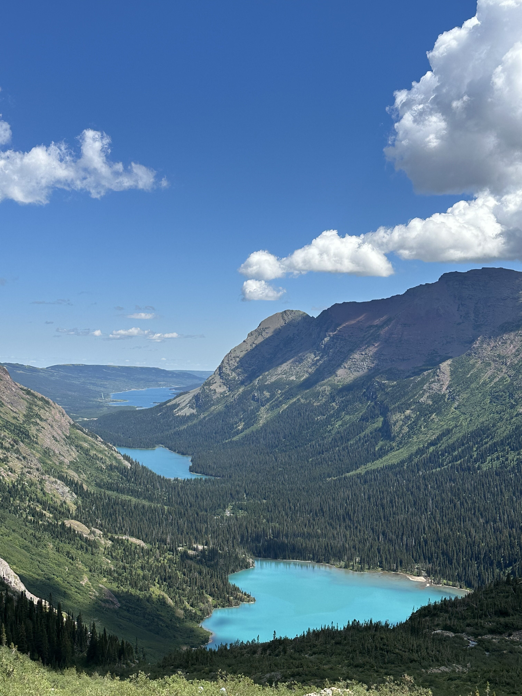
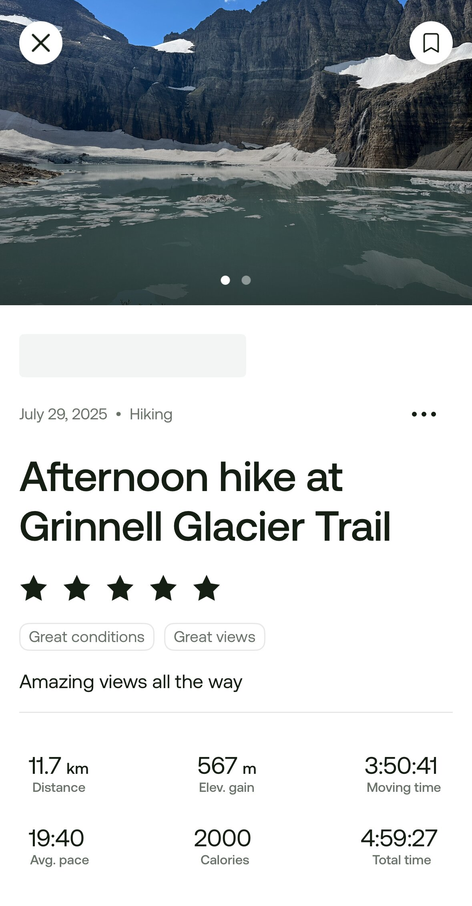

ביום השני שלנו בגליישר טיפסנו אל קרחון גרינל, מסלול שהיה ללא ספק אחד משיאי הטיול עד כה. חלק גדול של הפארק סגור למבקרים בעקבות שיפוץ תשתיות רציני שעושים פה. כדי לא להרוג את העסקים בפארק בזמן השיפוץ, רשות הפארקים מאשרת כניסה רק למבקרים שהזמינו בעוד מועד ״פעילות מסחרית באזור״ בזכות העובדה שברשותי ״נמלה עמלנית״, הזמנו חודשים רבים מראש שייט באגם שאיפשר לנו את הכניסה לאיזור בפארק בו נמצא המסלול. נתקלנו בהרבה מטיילים שלא יכלו להכנס ונאלצו לוותר על חלק מהמסלולים - שימו לב, תכננו מראש (או השיגו לכם גישה לנמלה עמלנית!)

אחרי כמה מסלולי הליכה קצרים יחסית, ראינו שהילדים כבר "battle ready" והחלטנו לטפס במסלול קצת יותר רציני (12 ק״מ עליה של 600 מטר). הריינג׳ר במרכז המבקרים הזהיר אותנו שהמסלול קשה, אבל הוא לא מכיר את החבורה שלנו... מצד שני, כן הקשבנו לאזהרות הריינג׳ר ורכשנו ״ספריי דובים״. במיוחד באזורים בהם אין הרבה מטיילים, הסיכוי לפגוש דב (גם בלי ״מסרק דובים״) עולה, ספריי דובים הוא הדרך הכי טובה לטפל במקרה של ״מפגש שלילי עם דב״...

המסלול עצמו היה לא פחות מ״מרהיב״. אסור לפספס. מתחילים בטיפוס דרך היער, אך לאט לאט מתחיל להחשף הנוף מכל עבר. המסלול מאד מגווון מבחינת נופים וצמחיה ולא משעמם לרגע - הרים מושלגים, מפלים, אגמים - בקיצור - לא לפספס. הטיפוס עצמו לא היה קשה, ופרט אולי לקטע קצר בוא צריך לעבור דרך מפלון כשבצד השני יש תהום, אי אפשר להגיד שהמסלול מסוכן...

השיט שהזמנו בתור ״כרטיס הכניסה לשמורה״, התחלק לשני חלקים וחצה את שני האגמים הראשונים (Swiftcurrent Lake ו- Lake Josephine). הסירות נשתמרו מאז פתיחת הפארק ונחשבות ״כלי שייט היסטורי״.  מכאן המשכנו בטיפוס הרגלי

הטבע בגליישר דינאמי ומרתק. בתחילת הקיץ האזור בו הלכנו, כמו אזורים רבים בפארק, נמצא בסכנה מתמדת של מפולות שלגים. מפתיע לגלות שגם למפולות (כמו לשריפות) יש תפקיד חשוב ומחזורי בעיצוב הטבע בשמורה. מבחינת הצמחיה, המפולות ״מפלסות״ דרך ביער הסבוך ומאפשרות לשיחים נמוכים לגדול. שיחי פירות יער למיניהם (Berries) מהווים חלק חשוב בתזונה של חיות רבות לרבות הדובים באיזור. מבחינת בעלי החיים, המפולות התכופות בעונה, קוברות בעלי חיים כמו עזי ההרים שנשמרות בקרח עד סוף העונה. ה״קפטן״ של הסירה שלנו סיפר, שבתחילת כל קיץ, הדובים יכולים להריח את האוצרות שלהם גם מבעד למטרים רבים של שלג, לחפור אותן החוצה ולפתוח את הקיץ בחטיף חלבון מרענן בדמות שלגוני עיזי הרים. פרט לשלגוני עיזים (ומעט מטיילים חסרי מזל), את מרבית החלבון בעונת הקיץ, הדובים באיזור הספציפי הזה מקבלים דווקא מסוג של עש שהם חופרים בכמויות לא הגיוניות מתחת לסלעים.

מנקודת גובה מסויימת נחשף בפנינו אגם גרינל במלוא הדרו. השמש יצאה והאגם נצבע בצבע טורקיז. האגם, שמוזן ממי קרחונים נמסים, מקבל את הצבע העמוק מהמינרלים שהקרחון ״חוצב״ בסלע כאשר הוא מתרחב ומתכווץ. יחד עם הצמחים המשונים שגדלו באיזור שחלקם נראו יותר כמו דמויות מספר של דר סוס, הנוף נראה כמו סיפור מהאגדות.

")

אבל ״האטרקציה״ המרכזית של המסלול הזה, היא ללא ספק הקרחון, או מה שנשאר ממנו... קרחון גרינל, כמו כל הקרחונים בשמורה, נמצא בנסיגה מתמדת ורובם יעלמו לחלוטין בשנים הקרובות. (todo:מידע). בשלב הנוכחי של הנסיגה שלו, קרחון גרינל יצר אגם קפוא אליו מגיע המסלול. גם הילדים, שלא תמיד יודעים להעריך נופים יחודיים התלהבו מאד מהמראה של האגם בו צפים גושי קרח גדולים. מהרגע בו נחשף האגם לקראת סוף הטיפוס, פיט פינטז על לטבול בו את הראש. אחרי טיפוס מאמץ בשמש, זה נשמע כמו רעיון מעולה

todo:amit להוסיף מידע על גליישר ועל הקרחונים שנמסים

אחרי הטיפוס, עצרנו להפסקת אוכל מושלמת ליד הקרחון הגוסס ואחרי סשן צילומים נוסף התחלנו לחזור.

בניגוד לחוות הדעת של הריינג׳ר, הילדים הלכו את המסלול בזמן מרשים ביותר. בעוד קיווינו להגיע לסירה הלפני אחרונה כדי לחזור, ככל שהתקרבנו, הבנו שיש סיכוי להקדים. כשהתקרבנו לאגם, ראינו את הסירה של 14:30 עוגנת ואנשים מתחילים לעלות עליה, פתחתי בריצת אמוק וממש בשניה האחרונה עצרתי את ה״קפטן״ מלהפליג וחיכינו רגע עד שכולם עלו לסיפון!

ירדנו מהשיט, הגענו לחניון הלודג׳, פיט הספיק לעשות אימון פסנתר ולהרשים כמה תיירות ושניה לפני שנכנסנו לקראוון, התחיל לרדת גשם שוטף - כך נראה יום של מזל. כדי לא לקלקל, כפרס על המאמץ בטיפוס, ובעיקר מיכיוון שהנמלה הכריזה על ״שביתת שטיפת כלים״, החלטנו על ״ערב של חזירות״ בפיצריה של סיינט מרי. התרחצנו ויצאנו לחגוג.

חזרנו לKOA והפיטים ״התרסקו״ בשניה לשינה בתנוחת ה״בוטנים״ המפורסמת שלהם. כך, נראה יום מושלם בטיול - כן ירבו!

המשך יבוא...