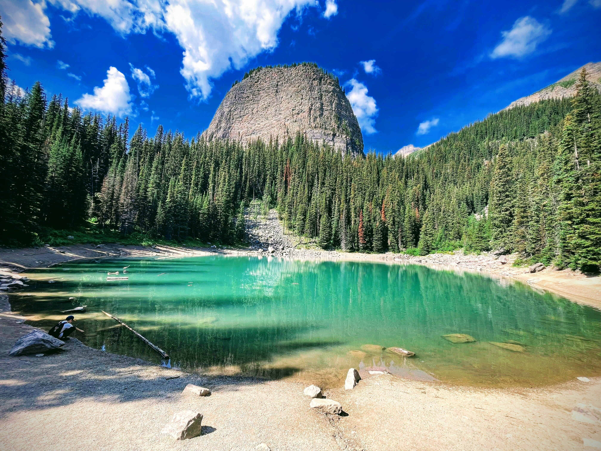

עזבנו את העיירה סיינט מרי ואת שמורת גליישר במונטנה ונסענו צפונה, בחזרה לכיוון קנדה ובאנף. שמורת באנף היא אטרקציית התיירות הפופולארית ביותר בקנדה (בחורף וגם בקיץ). אחרי הביקור המוצלח בגליישר, התאבון נפתח וההתרגשות גדולה. הילדים מנוסים בנסיעות ארוכות, כך שהנסיעה הזאת קטנה עליהם. פרט למשחקי הדמיון המטופשים ומהמצחיקים שלהם, התמכרנו לפודקאסט ״התשובה״ של דורון פישלר. תודה מיוחדת לסבתא עדה שקנתה לנו את הספר שלו (עליו אני ממליץ בחום לוהט) ועשתה לנו את הנסיעות מעניינות יותר!

בכניסה לקנדה, פרט לשלטים הרגילים של ״זהירות דובים״ ו ״התמרורים עכשיו הם בקמ״ש״, נוספו שלטים של ״חובה לחגור חגורות בטיחות״. אמנם במונטנה החוק גם מחייב בעיקרון לחגור, אבל מסתבר שזה לא נאכף בפני עצמו, ואפילו אם נאכף, הקנס הוא רק 20 דולר. בסך הכל הגיוני, לאמריקאים יש את החופש להרוג אחד את השני ולהיהרג בעצמם...

לזכות האמריקים אפשר לזקוף את העובדה שהם המציאו לנו את וולמארט, שסניפיה פרושים גם בקנדה. (לצערנו רשת Wholefoods פסחה על קנדה). עצרנו בוולמארט בדרך להשלמת חוסרים והצטיידות והגענו לחניון הלילה בבאנף

באנף היא עד כדי כך פופולארית, שלמרות שברשותי נמלה עילאית, לא היה פשוט למצוא מקומות לינה בשמורה. אתרי הקמפינג בתוך השמורה נפתחים לרישום חודשים רבים לפני העונה, אך עם זאת, כולם מסתערים על המקומות והשמורות מתמלאות עוד באותו יום בו נפתח הרישום. הצלחנו לתפוס מקומות בחניון הלילה ״Tunnel Mountain Trailer Court״ שבתוך השמורה, אם כי כל לילה בחלקה אחרת. בשונה מחניונים פרטיים, חניונים שבתוך השמורות הם אמנם פחות ״מפנקים״, אבל לפעמים ממוקמים במקומות מאד יפים. למרות הגודל העצום של החניון, הוא היה נחמד והיה מספיק מרווח. הילדים כבר החלו להתרגל שמידי פעם מלווה אותם איזושהי חיה משונה בדרכם למקלחת.

אז אמרנו כבר שבאנף פופולארית? עד כדי כך פופולארית שיש חניון ענק ליד השלט בו כתוב ״באנף״ בשם ״חניון השלט של באנף״ ואנשים עומדים בתור כדי להצטלם עם שלט!

מצד אחד, רצינו שהטיול יהיה ספונטאני כמה שאפשר ויאפשר לנו גמישות בתכנון, אך מצד שני את כל מקומות הלינה וחלק מהאטרקציות חייבים להזמין המון זמן מראש. הדרך בה ניסינו לאפשר ספונטאניות היא באמצעות לרווח כמה שיותר את האטרקציות, להשאיר חורים ולהזמין מראש רק את מה שחייבים.

אם באנף תיירותית ועמוסה, אגם לואיז הוא כל זה, מתנקז לנקודה בודדת במרחב. מכיוון שלא ניתן להגיע לשם עם קראוון נאלצנו להזמין מראש אוטובוס מהחניון. הזמנו את האוטובוס לשעה המוקדמת ביותר והכל עבד חלק. אנשים אמנם מתנהגים כמו עדר, אבל אנשים, יותר מכל דבר אחר הם ברובם עצלנים, ״אם מקדימים - מגיעים למקומות נפלאים״

הצטלמנו בנקודה המפורסמת בה כל התיירים מצטלמים (אגב נסיעות ארוכות, לחשב כמה הרכבים כאלה יש במשפחה בת 5 נפשות זה תרגיל מעולה לנסיעה - אנחנו אוהבים לתת לילדים תרגיל משותף לפני שהם מקבלים ״חטיף נסיעה״.  אחרי  שהצטלמנו בכמעט כל 31 התמונות האפשריות (אין חשיבות לסדר העמידה), יצאנו לדרך! אם השכמה מוקדמת לא מספיקה כדי להמנע מההמון, טיפוס רגלי עם הפרש גובה של 600 מטר כבר ״ישבור״ את העדר לחלוטין ויאפשר להינות מהטבע כמעט לבד.

המסלול לא קשה ומידי פעם נחשפים מתוך היער עוד ועוד נופים. די מהר מגיעים לאגם קטן בשם Mirror lake ועוד קצת אחריו אגם אגנס. המסלול והנופים מאד יפים - אגמים, מפלים, כל מה שאפשר לבקש. רוב המסלולים שהלכנו בהם לא מעגליים. בדרך חזרה ניתן לראות איך חלק מהנופים משתנים לחלוטין לפי מיקום השמש. הגענו לאגם אגנס, שם עשינו הפסקת נשנושים על חוף האגם. ליד האגם יש ״בית תה״. בעוד אנחנו פינטזנו איך נשב ב״בית התה״ ונעשה הפסקת בירה וצ׳יפס מול נופי האגם, הקנדים הארורים באמת מכרו שם... תה!

למרות שמדובר בהליכה עם קצת טיפוס, בגלל שהמקום באמת נחשב לנק׳ המפורסמת ביותר בקנדה, עדיין נהרו לכיוון אגם אגנס לאט לאט עוד ועוד מטיילים מסוגים שונים. חלקם מורגלים בטיולי טבע וחלקם רחוק מכך. תמונה שתיחקק בזיכרון המשפחתי היא משפחה ההודית שטיפסה כשהאמא עם נעלי בובה מוזהבות והילדה עם לא פחות מ ״שמלת נשף״ (!) מכאן המשכנו בטיפוס לנק׳ התצפית ״הכוורת הקטנה״. נקודה גבוהה ששימשה בעבר בתור נק תצפית לזיהוי מוקדם של שריפות. החל מאגם אגנס, כבר  היו מטיילים בודדים, והנופים פיצו על הטיפוס הנוסף. מאגם אגנס יוצא גם מסלול ל״כוורת הגדולה״, נשמור אותו לטיול הבא...

משם ירדנו בחזרה לתפוס את האוטובוס לקראוון שלנו שחיכה בחניון. אחרי הצצה זריזה במרכז המבקרים, הבנו שמדובר ב״גזלן על סטרואידים״, ואת ״התרעננות סיום המסלול הרשמית״ עשינו בקראוון. לאחר הפסקת ההתרעננות הבריאה, וחרף אזהרתה הנחושה של הנמלה החלטנו לעשות ניסוי. לטענתה של הנמלה, אם אחרי שתיית ״סקוויזי״ פירות בריא, ניקח כמה עוגיות אוראו, נטבול אותן בחלב(אבוי), ואז נסיע את הילדים בקראוון ו״נשקשק״ אותם, זה יגמר ״רע מאד״. וכך היה...  תוצאות הניסוי היו חד משמעיות. פיט, המסווג במחלקת ה״נמלים״, רגיש מאד לשיקשוק מהסוג שתואר. לקראת הערב היה לו כאב בטן(!) ואילו הבנות, שחד משמעית מסווגות במחלקת ה״שטותיים״ לא הראו שום רגישות לשקשוקים חלביים-פירותיים. מעניין, יום אחד ימצאו את הגן שאחראי על שקשוקי חלב... *הבהרה משפטית*: מסמך זה מתאר תעוד ראשון לניסוי שחושף את הגן, גן זה ראוי להיקרא גן ״נמשלוקי-שיקשוקי״. פרס הנובל מוקדש לפיט המסכן, שלא צלח את הניסוי.

אחרי שקשוק הילדים בחזרה למחנה, נשאר לנו המון זמן יחד לנוח ולהרגע, יחד, וכל אחד בענייניו



בבאנף, כמו בשמורות אחרות (ובניגוד לניסיון שלנו בפארקים בארה״ב) יש לסרוגין איסור על הדלקת אש. למקומיים זה בכלל לא מפריע מפני שכולם תמיד מצויידים מצויידים במיכלי פרופיין ענקיים (גז) המחוברים למכשירי צלייה במגוון גדלים וסוגים בין כיריים, מנגל, מדורת פרופיין או שילוב של כל אלה. כל זה בשילוב העובדה שההנמלה, בנוסף להיותה נשאית של גן הנמשלוקי שקשוקי, לא אוהבת שהכרית שלה ״מריחה כמו נקניקיה״, מגביל את היצירתיות שלי בהכנת ארוחת הערב. במעבר בוולמארט, חרשתי על כל המסדרון של כלי בישול לקמפינג. בלב כבד ויתרתי על על כל הציוד המשוכלל שראיתי והתפשרתי על הכירה החיצונית הפשוטה ביותר שבנמצא.

לארוחת הערב היומית הוגש חזה עוף צלוי בציר בקר סמיך. הכירה שקניתי, שנועדה להרתיח מים לתה, נמסה והתפרקה כשסיימתי לצמצם את הרוטב ואיתה התמוססה גם אופציית הבישול בחוץ... על כלי בישול לא מתפשרים... בפעם הבאה קונים מפלצת ומשאירים אותה פה :)

קינוח צחצוח ולישון! המשך יבוא...

