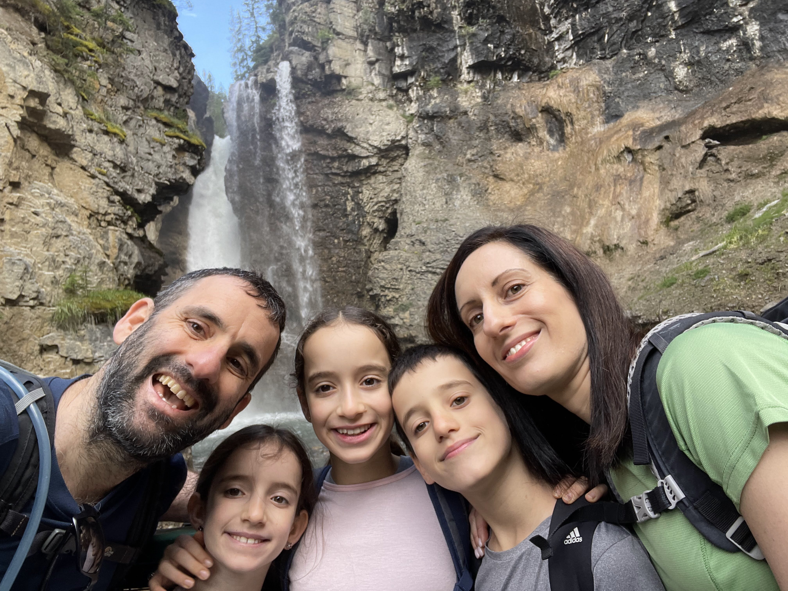
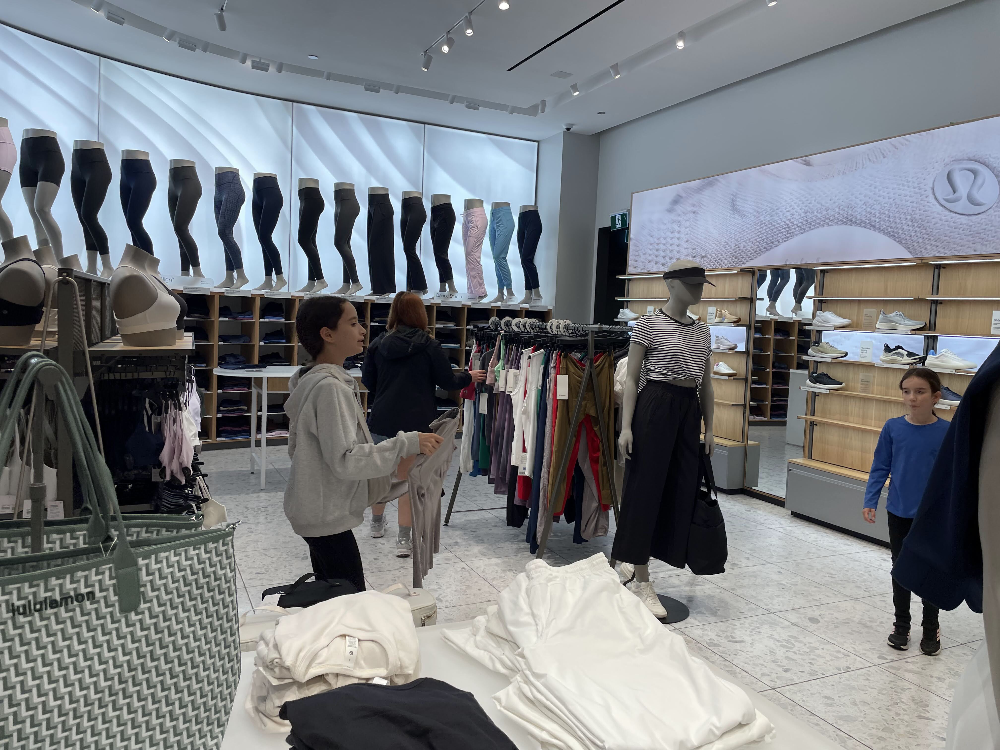

היום טיילנו בקניון ג׳ונסטון בשמורת באנף. שוב השקמנו קום והתחלנו מוקדם את הטיול. החלק הראשון של המסלול מונגש מאד, ולכן נהיה עמוס מהר מאד, אך מיד אחרי המפלים לא תמצאו כמעט מטיילים. המפלים גבוהים ומרשימים. בחורף, כשהמפלים קופאים, הם אתר מרהיב למטפסי קרח (כן יש כאלה תחביבים בחלקים הללו של העולם). המסלול כולל גשרי מתכת תלויים ומנהרות קצרות שנחצבו על מנת שאנשים יוכלו להתקרב אל המפלים.

עד שנעשה את הדרך חזרה, כבר יהיה תור משוגע רק כדי ״להסתכל על מפלים״. אף פעם לא ראיתי תור בטיול בטבע כדי להסתכל על משהו. העומסים פה באמת יכולים להיות משוגעים... משם המשכנו בטיפוס לבריכות הדיו. אמנם בחלק הזה של המסלול אין הרבה מטיילים, אבל הצלחתי למצוא לי חבר בדמות כלב שחור משחור שהלך איתי חלק מהדרך.

בריכות הדיו היו נחמדות - בתור עיוור צבעים אני יכול להגיד שאכן היו שם כמה בריכות, לגבי ה״צבעוניות״ אני לא ממש יכול להעיד...

חזרנו לקראוון ונסענו לחניון הלילה. בדרך חולפים ממילא בעיירה באנף כך שהחלטנו לנסות את מזלנו ולחנות בעיר. אמנם בכל מקום מזהירים שכדאי להתרחק כמו מאש מחניה עם קראוון בבאנף, אבל שווה לנסות... לפעמים צריך מזל - בדיוק כשעברנו בנקודה בה יש סיכוי למצוא חניה גדולה, יצא קראוון בודד וחנינו. ניצלנו את המזל ופיצינו את עצמנו אחרי ״בית התה״ המטופש מהטיול של אתמול: חגגנו את סיום המסלול ב״פוב״ אירי - עם בירה וצ׳יפס - אפשר לסמוך על האירים שהם יודעים את העבודה. הילדים ממש אהבו את המקום. וגם אנחנו... 

העברנו אחר צהריים רגוע בחניון הלילה. בערב, בעקבות איסור הדלקת האש נאלצתי לוותר על צליית הנקניקיות האיטלקיות שקניתי ובמקום זה הכנתי Ragù di salsiccia - שזה ראגו איטלקי שעושים מבשר נקניקיות מפורק - אלתור שהפך לאהוב במיוחד וחזר על עצמו בהמשך הטיול.

היום הבא היה יום רגוע אותו הקדשנו לעיירה באנף. נתנו לילדים לישון טיפה יותר, ונסענו על הבוקר לתפוס חניה בחניון הפצפון לקראוונים בבאנף. אם באים מוקדם, אין בעיה - ולא צריך להסתמך על שירותי השאטל. אכלנו ארוחת בוקר בחניון ויצאנו ל״מצעד הכביסה״

״מצעד הכביסה״ עבר בשלום, לקול קריאות הנמלה: שמאל ימין שמאל, שום גרב לא תיפול. שירותי הכביסה היו מצויינים, עכשיו אנחנו מוכנים לעוד שבוע של טיולים. בהעדר קליטה בהרבה מהמקומות, ניצלתי את הWifi ובזמן שהאחרים הלכו לעשות סיבוב, ״שמרתי״ על הכביסה והשלמתי קצת את מלאכת תעוד הטיול.

משם המשכנו ליום רגוע בעיירה. באנף באמת חמודה ויפה. סרקנו את הרחובות שלה וכל אחד בחר לעצמו מזכרת באחת מעשרות חנויות המזכרות הפזורות בעיירה הקטנה. הילדים התרשמו מאד מחנות ענקית שכל כולה בנושא אביזרים לחג המולד.

מחשש מהעומס הזמנו מראש מקומות לארוחת הצהריים ב״מבשלת שלושת הדובים״ שהיתה מצויינת. מסעדה גדולה יחסית עם מבחר בירות שהם מבשלים במקום. אפשר להגיד הרבה דברים על עודף התיירותיות של העיירה, אבל לזכותה ניתן לזקוף תקנות אנטי ג׳נטריפיקציה שדורשות מגורים על מנת לאפשר לקנות נכס (ובכך למנוע מהעיירה להפוך לאוסף בתי נופש ריקים של עשירים). בנוסף, התקנות המקומיות מציינות שבמידה וחיית בר כלשהי עומדת על הכביש, יש לה זכות קדימה והרכבים צריכים לחכות. למזלנו כשעברנו בעיירה הelk בחר להתחשב וליחך עשב דווקא על המדרכה.

משם חזרנו לאחר צהריים רגוע בחניון הלילה, מחר נשכים קום ונתחיל במסע צפונה לאזורי הקרחונים ומשם לג׳אספר. נהנינו בבאנף. על אף ההמוניות היחסית, עם התנהלות נכונה, אפשר די בקלות לנטרל את העומסים ולהינות מהשמורה ומהעיירה

לילה טוב, המשך יבוא...
