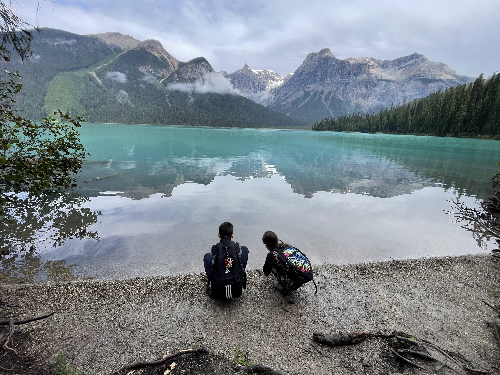
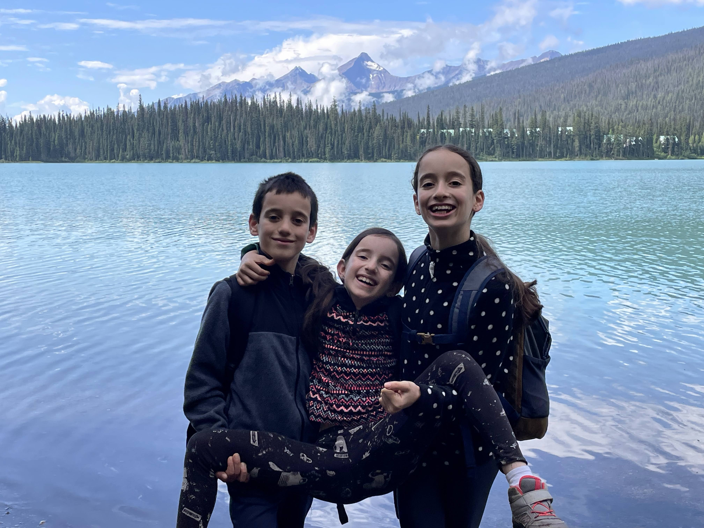
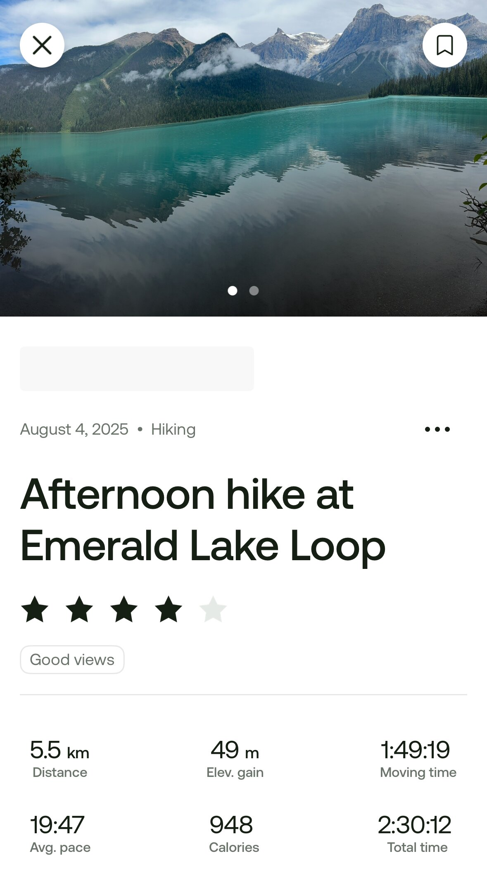
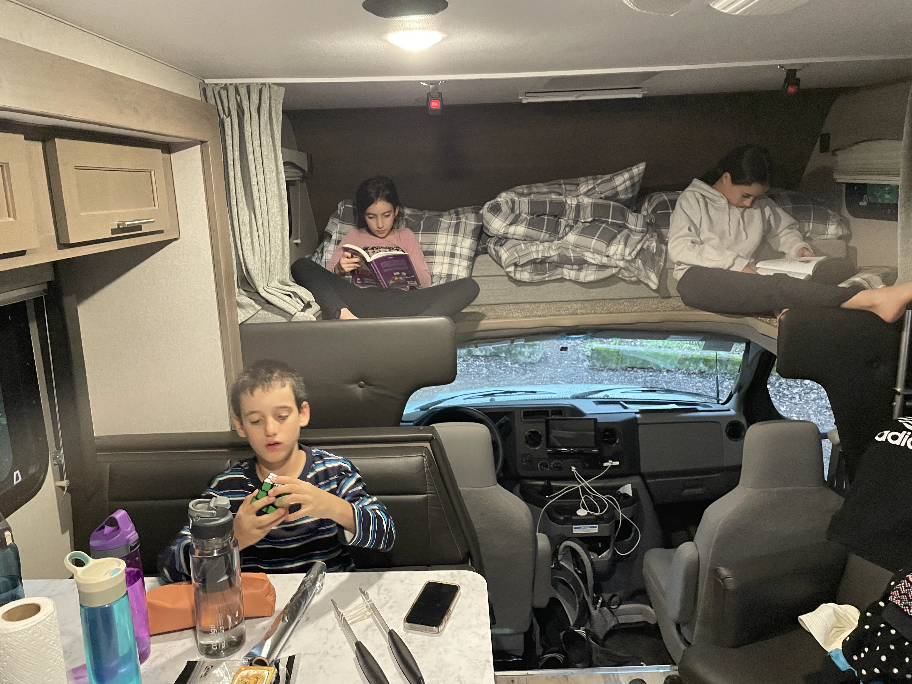

הבוקר חזרנו להשכים קום, נתחיל את המסע שלנו צפונה דרך ״אגם האיזמרגד״ (Emerald lake) שבפארק הלאומי יוהו (Yoho). בחניון האגם מספר מאד מוגבל של מקומות חניה, אז נאלצנו לצאת מוקדם מאד כי היתה לנו שעה נסיעה. התוכנית היתה לאכול את ארוחת הבוקר בחניון ואז לצאת למסלול. כמו בכל בוקר, הילדים התעוררו לקול שריקת הקומקום ולריח חזק של קפה נמס Tim Hortons.

עד כה מזג האוויר היה מושלם, וגם אם היה קצת גשם הוא תמיד הגיע אחר הצהריים המאוחרים כשסיימנו כבר את הפעילויות שלנו בחוץ. הבוקר היה שונה - התחזית דיווחה על סופות וגשמים בבוקר והתבהרות בהמשך היום. כבר מוקדם מאד בבוקר ראינו שהשמיים כהים מאוד. לא שהייתה לנו יותר מידי ברירה - אבל החלטנו לנסוע לחניון, לאכול, להתארגן ולראות ״מה קורה״. עד שהגענו כבר היה מבול משוגע. בנוסף, אפילו לא היה לנו מקום לחנות את הקראוון. החלטנו ״להתעלם מהעובדות״ ולאכול ארוחת בוקר בקראוון בצד הכביש.

סיימנו את ארוחת הבוקר, כשבחוץ עדיין מבול. אחד הקראוונים שחנו בחניון התייאש ממזג האוויר והמשיך הלאה - מהר תפסנו את מקום החניה היחיד - בעיה אחת נפתרה... החלטנו לתת לתוכנית עוד צ׳אנס, במקום לדלג על המסלול ולנסוע לקמפגראונד, החלטנו להישאר ולהעביר את ההקרנה המשפחתית מהערב לבוקר. כשיש לנו שעה פנויה בל״וז אנחנו רואים סדרה משותפת. לטיול לקנדה לקחנו את ״חומריו האפלים״ (his dark materials) של פיליפ פולמן. עד כה, עמוק לתוך העונה הראשונה, מאד התחברנו לסדרה - מתעסקת בהרבה נושאים שקרובים לליבי - ילדות, התבגרות וחוליי המימסד הדתי. הסידרה אמנם לא קשורה לקנדה, אבל בהחלט מתאימה לאווירה. יש בה דובים, יש ״מסע צפונה״ אל ארצות הקור, ואפילו יש מקומות מהם ניתן לראות את הזוהר הצפוני! בניגוד לסדרה, (לצערי לפעמים) אצלינו בסיפור לא נחטפים ילדים, כך שאנחנו עדיין בתפוסה מלאה.  החסרון היחיד הוא שלא קראנו את הספרים... אבל נאלץ לתקן בדיעבד... חיברנו רמקולים, העברנו את הקראוון למצב ״קולנוע ביתי״ ושקענו לפרק מותח.

כפי שחזתה התחזית, לאחר שעה של צפיה הגשם פסק, השמיים עדיין היו מעוננים, אבל זה כבר נראה הרבה יותר טוב. ארזנו מעילי גשם, ספריי דובים ונשנושים ויצאנו לדרך למסלול המקיף את האגם.

ככל שהתקדמנו במסלול השמיים הלכו והתבהרו. הקרקע לעומתם נשארה רטובה. נראה כאילו המסלול בתחזוקה ובמהלך התקנת גשרוני עץ, אבל כרגע המסלול מלא שורשים, שלוליות, בוץ והמון הזדמנויות לפגוש אותם עם הפרצוף. ההתקדמות בחלק הזה של המסלול היתה איטית מאד, אבל מעניינת ושונה מהמסלולים שעשינו עד כה. אין קושי פיזי, אבל צריכים למצוא דרך לעבור ולחמוק מגרביים או עכוז רטובים.

האגם אמנם קרוב לשמורת באנף, אבל נמצא כבר בטריטוריה של בריטיש קולומביה, ולכן מדובר בשמורה אחרת. שם השמורה (״יוהו״) נלקח משפת ה״קרי״ ומתאר כפי שנשמע קריאת התפעלות. המקום המוכר ביותר ביוהו הוא אגם או׳הרה, אך לא הצלחנו לבקר בו הפעם, משום שצריך לזכות בהגרלה. מאגם סודי שידוע רק למטיילים יודעי דבר, אגם אוה׳רה הפך ליעד תיירותי עמוס ומלא אנשים - הנהלת השמורה שמה לזה סוף והחליטה לאפשר למספר מוגבל של אנשים את הכניסה באמצעות הגרלה.

בכל מקרה, אגם האזמרגד יפה מאד והשאיר טעם טוב מהשמורה. ככל שעבר הזמן השמיים כבר התבהרו לחלוטין והתחלנו לראות אנשים שעושים את המסלול בכיוון ההפוך. קבוצת ה״שטותיים״ במשפחה החליטה לעשות ניסוי - שמנו לב שהברכות שאומרים אנשים שעוברים מולנו שונות ומשונות, ולפעמים ממש לא מובנות. הסקנו שאפילו אם ננהם נהמה מנומסת לעבר העוברים ושבים נזכה לחיוך וברכה חמה בחזרה. הניסוי התקדם יפה מאד עד שהנמלה גילתה אותו ואסרה עלינו בשום פנים ליצור קשר עם העוברים ושבים.

לקראת סיום המסלול התיישבנו בשמש ורבצנו קצת להפסקת נשנושים ומנוחה. רק לפני זמן קצר התכרבלנו באוטו בסערה קפואה, ועכשיו אנחנו רובצים בשמש...

משם, לאחר עצירה קצרה להתרשם מתצפית ליד ה״גשר הטבעי״ מעל הנהר, נסענו לחניון הלילה [kicking horse](https://parks.canada.ca/pn-np/bc/yoho/activ/camping/avantpays-frontcountry#kickinghorse) בתוך שמורת יוהו. המיקום של חניון הלילה בתוך הנופים הדרמאטיים של ההרים מסביב היה מרהיב. מאחר וסוף סוף מותר היה להדליק אש, ומזג האוויר הפך שוב לקייצי, החלטנו לבשל ארוחת ערב מעל המדורה.

בניגוד לתוכניות שלנו, מזג האוויר הקנדי עדיין לא סיים את התהפוכות שלו להיום. בזמן שתפוחי האדמה כבר היו באש וחיכו לקדרה, העננים שוב התגנבו לשמיים והשמש נעלמה. החלטנו להתעלם מהעננים ולהמשיך בתוכנית. בזמן שהתרחצנו שוב התחיל בחוץ מבול. כשיצאנו, אסייתי נחמד שלא דיבר מילה באנגלית השאיל לנו מטריות כדי שנוכל להשלים את המסע לקראוון מבלי להיספג לחלוטין. הבנו שמדורה כבר לא תהיה היום - הצלתי את תפוחי האדמה מהמדורה אל התנור, ונכנסנו לקראוון לערב אלטרנטיבי של בוריטו מאולתר ומשחקים. הילדים התלהבו מהבוריטו שהפך לאופציה מבוקשת בארוחות הערב בהמשך. 

כשסיימנו לאכול ולשטוף את הכלים - שוב מהפך, אחרי שבחוץ כבר היה קודר וחשוך - שמש בשמיים. כבר הייתה הרגשה של לילה, אבל עדיין, שעת השקיעה המאוחרת בילבלה אותנו, ואחרי הערב הקודר הגיע שוב זמן של שמש. כשיצאתי לוודא שהמדורה כבתה לחלוטין, קרה נס, אחרי כמה נפנופים - המדורה הרטובה הצליחה לתת כמה להבות! הודינו למפלצת הספגטי על הנס והשתמשנו במדורה בשביל המסת הקינוח

הלכנו לישון לקראת המשך המסע צפונה מחר. המשך יבוא...
