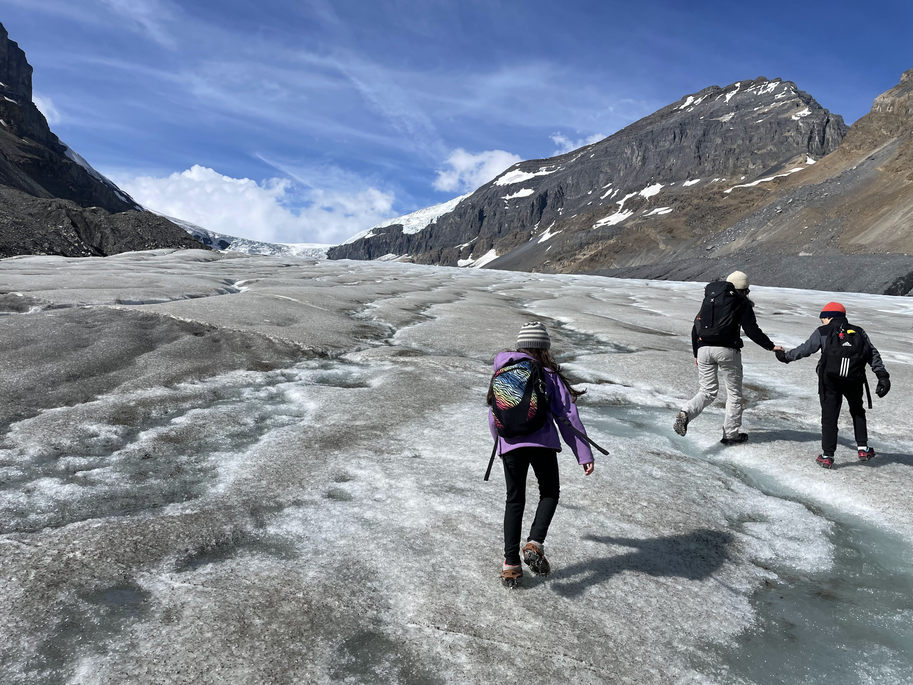
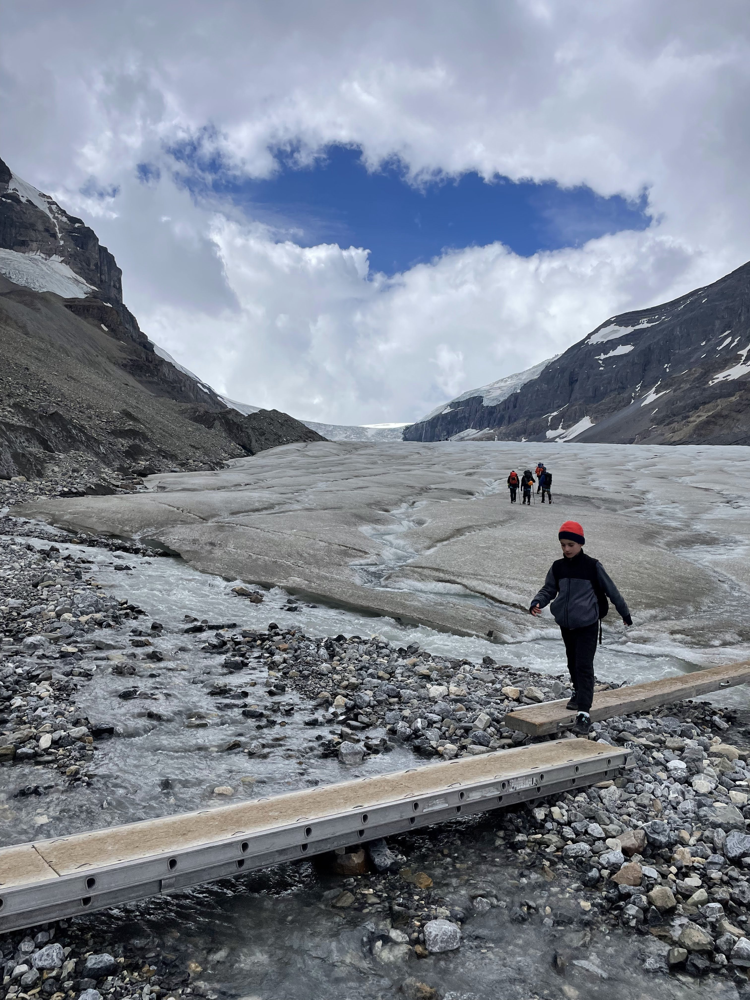
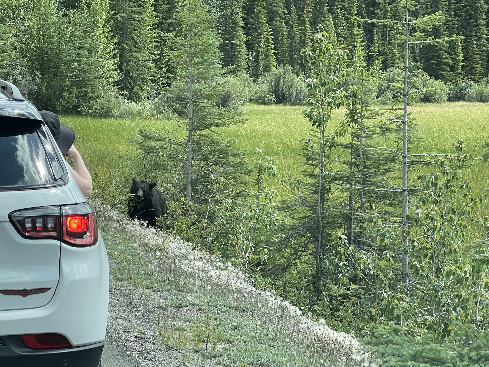

הבוקר שום קמנו מוקדם, עזבנו את חניון הלילה בשמורת יוהו ונסענו צפונה. הדרך המחברת את אגם לואיז בבאנף לג׳אספר נקרת ״דרך שדות הקרח״. התוכנית היומית כוללת טיפוס על קרחון אתבסקה (Athabasca). הקרחון הוא חלק משדה הקרח ״קולומביה״ ומאפשר גישה נוחה יחסית למטיילים לצפות בו מקרוב, או לטפס עליו עם ציוד מתאים והדרכה. אנחנו הזמנו טיפוס מודרך הכולל הליכה על הקרחון עצמו.

טיפ כללי חשוב - שמתי לב שבכל הפעמים בהן נסענו ליעד ורק אז אכלנו את ארוחת הבוקר, הנסיעה הרבה יותר שקטה, ילדים מורעבים שקטים יותר וחסרי אנרגיה - מומלץ מאד.

הקרחון עליו נטפס צפה עלינו מלמעלה ונראה בבירור ממגרש החניה. כבר בזמן ארוחת הבוקר הרגשנו שקפוא בחוץ. נוסף על כך, מזג האוויר היה מעונן מאד, אך התחזית היתה אופטימית. לבשנו עלינו את ציוד החורף ויצאנו אל הקור.

אספנו את הציוד, ואחרי תדריך בטיחות קצר והכרות עם המדריך יצאנו לדרך. השמיים התחילו להתבהר ויצאנו לכבוש את הקרחון!

ממגרש החניה, אוטובוס קטן לקח את הקבוצה לנקודת ההתחלה של הטיפוס. משם טיפסנו מסביב לאגם בשביל שהוביל אותנו למרגלות הקרחון. בדרך סיפר לנו המדריך את הסיפורים מרתקים על הדינאמיות של הקרחונים. כאשר החברה שלהם פתחה את הטיול הראשון לפני 40 שנה, הקרחון הגיע בדיוק לנקודה בה הוריד אותנו האוטובוס ומשם התחיל הטיפוס. מאז, בכל שנה, הקרחון נסוג במהירות מעריכית והמשימה להגיע אליו הולכת ומסתבכת. בכל תחילת עונה, מגיעים המדריכים למרגלות הקרחון ומחליטים איך יגיעו לשם הפעם. מסתבר שהאגם סביבו טיפסנו נוצר רק השנה, והפתיע את החברה כשהגיעו לשם בתחילת העונה. המדריך סיפר שלקח להם 4 ימים רק לחצוב בגרזנים את השביל מסביב לאגם כדי לאפשר את ההליכה.

החברה עובדת יחד עם אוניברסיטה בקנדה כדי להעריך מה יהיה תתואי הקרקע בעשרות שנים הבאות. המדריך סיפר שכבר השנה הם יריצו פיילוט שיבדוק ייתכנות ויתן אישור להפוך את החלק הראשון של הטיפוס לשייט בסירה דרך אגם הקרחונים אל מרגלות הקרחון. השביל עליו הלכנו, כך מסתבר, נחצב מעל כמה סנטימטרים של אבנים וחול שנפלו, בעוד מתחתינו יש קרח. מידי פעם אפשר היה לראות קרח מציץ במין האבנים, או את האדמה ״מזיעה״. מכיוון שהקרחון נמס, השביל זז כל הזמן, וצריך לסמן אותו כל כמה ימים מחדש. מידי פעם ציין המדריך נקודות ציון עד אליהן הגיע הקרחון בקיץ מסויים שהמחישו מאד את הנסיגה המואצת.

אחרי כמעט שעה הליכה, הגענו סוף סוף ועלינו על הקרחון, הרכבנו ״קרמפונז״ על הנעיליים למנוע החלקה והתחלנו בטיפוס על הקרחון עצמו

מעניין מה יהיה תוואי השטח, מומחים, סירה, מנסים 

מזג האוויר היה מושלם, וכך גם מצב הרוח. הילדים אמנם כבר גלשו על קרח, אבל אף פעם לא טיפסו על קרחון. החוויה עוד יותר מיוחדת, מכיוון שבעוד עשרות שנים בודדות, הקרחון יימס לחלוטין, ולא ניתן יהיה יותר לטפס עליו. אמנם בכל חורף הקרחון עדיין גדל, בקייץ הוא נסוג יותר ויותר ומתכווץ בקצב מהיר מהצפוי. פרט לעליה בטמפרטורות, שינוי האקלים משפיע על הקרחון בעוד דרכים - השריפות, שניהיו יותר ויותר תכופות, מפיצות אפר שחור לאוויר שמגיע גם לקרחון וצובעות אותו בשחור. הצבע השחור מתחמם מהר יותר מהלבן ומהווה מאיץ נוסף לנסיגת הקרחון.

קרחון אטבסקה הוא אחת ה״אצבעות״ של ״שדה הקרח קולומביה״ - שדה קרח עצום המגיע לעומק של מעל 300 מטר וממנו ״נשפכים״ 6 קרחונים שאחד מהם הוא הקרחון אטבסקה עליו אנחנו מטפסים. בעוד הקרחונים שסביבו צפויים להעלם מהר יחסית, קשה יותר לחזות מתי יעלם שדה הקרח, אבל כרגע התחזיות מנבאות שסביב 2100 כבר לא ישאר כאן כלום. לנכדים שלי שקוראים שורות אלה ומפליגים עם הנינים שלי ברחפות וירטואליות על ״אגם קולומביה״ תוך כדי אכילת פנקייקים עתידניים בצורת עלי מייפל - מקווה שאתם נהנים - פעם דרך פה סבא שלכם!

כמו בפוסטים הקודמים בנושא השריפות - שינוי הוא לא בהכרח שלילי, הוא פשוט... שונה. הדבר היחיד הקבוע בטבע - הוא שהטבע משתנה כל הזמן. אני מקווה שהאנושות תמצא פתרונות יצירתיים ותשרוד גם את משבר האקלים הנוכחי - אם בכלל ישאר משהו מהאנושות אחרי מלחמת העולם השלישית... בנימה חיובית יותר, המסת הקרחון יוצרת מפלונים ובורות מרהיבים בקרחון מהם ניתן להתרשם במהלך הטיפוס. המדריך סיפק הסברים מעניינים לתופעוות שיוצר הקרחון במהלך המחזורי של גדילה והתכווצות ונתן כל מיני שמות לסוגים שונים של בקעים בקרח להם אין ממש שמות בעברית יומיומית.

קרחון אתבסקה התחיל את נסיגתו כבר ב1840 בסוף ״עידן הקרח הקטן״. החוקרים יודעים לומר את השנה המדוייקת מפני שהקרחון, בעודו מתרחב, רומס כל מה שעובר בדרכו. בחורף שנת 1840 הקרחון הספיק לכופף שורה של עצים לפני שנעצר והחל לסגת. העצים ברי המזל שרדו והמשיכו לצמוח כאשר החלק התחתון של הגזע שלהם מכופף. החוקרים חתכו את אחד הגזעים וספרו את הטבעות. 

הסיור היה מאד מעניין ומומלץ, המדריך סיפר המון עובדות וסיפורים כולל סיפור גבורה על מדריך טיפוס הרים קנדי אגדי שגר בכפר שלו ועדיין מדריך טיפוסים אחרי גיל 70! הקנדי (לא זוכר את שמו) הוא הראשון שהצליח לטפס לפסגה של אחד ההרים הגבוהים בסביבה. הסיפור מאד קנדי, כי כדי לעבור באחד המעברים המאתגרים, בהעדר ציוד טיפוס מתאים, אותו מטפס לקח איתו מקל הוקי, ניסר אותו ותקע אותו בין הסלעים - מה שאיפשר לו להיתלות ולעבור. המדריך סיפר שעדיין אפשר לראות את מקל ההוקי מלא קרבינרים (טבעות איבטוח) ששימש את המטפס האגדי ובינתיים נפל ומוטל בין ההרים.

היו עוד סיפורים והסברים מעניינים, אך אשאיר לכם סיבה לבוא לשמוע עוד בעצמכם. ההגענו לנקודה הגבוהה ביותר אליה אפשר להגיע בלי ציוד טיפוס מתקדם (גרזנים וחבלים). הצטלמנו והתחלנו לרדת. מומלץ ביותר - לא לפספס!

חזרנו לקראוון מרוצים וקיבלנו אישור מהנמלה לממרח ״לא הכי בריא״. קראתי קצת (וננזפתי בעקבות כך) ביומנים שהילדים כותבים בטיול. מצחיק לראות איך לפעמים אנחנו עושים דברים מטורפים, ועיקר הכתיבה שלהם מתמקדת דווקא בשטויות שאכלנו. עלמה שרלוט ופיט בעיקר בדברים המלוחים, ואלכס ה״מתוקית״ מרחיבה על כל דבר מתוק שהיא דחפה לפה. מכאן אני מסיק שחשוב לציין את הדברים גם בבלוג המשפחתי ☺️. יותר מאשר ממתקים, בשביל טיול מושלם, לפעמים פשוט צריכים מזל. כשהצצנו מחלון הקראוון ראינו שמזג האוויר התקדר, גשם התחיל לרדת, והקרחון כולו התמלא ערפל ומטפסים רטובים וקפואים.

אם כבר מדברים על מזל, אז דווקא בהמשך הנסיעה צפונה ״זה קרה״. אמנם כבר ראינו בחטף דוב מהאוטובוס, הפעם היה לנו מפגש אינטימי יותר - בדומה למפגש שהיה לנו ביוסמיטי, באמצע הכביש ראיתי רכב בשוליים במקום לא הגיוני, מיד עצרתי והתחלנו לסרוק. ממש צמוד לקראוון הסתובב דב שחור ונשנש לו בנחת מכל הבא ליד. לא היה נראה שהקרבה לאנשים עושה עליו איזה רושם אז נשארנו כמה דקות בסביבה (בתוך הקראוון כמובן) וצפינו ב״מלך הרי הרוקי״ בפעולה. בלי צורך בספריי דובים ופחד מוות - זאת ללא ספק הדרך המוצלחת ביותר לצרוך מפגשי דובים...



חזרנו קצת דרומה כדי לישון באתר הקמפינג [Silverhorn]([Camping - Banff National Park](https://parks.canada.ca/pn-np/ab/banff/activ/camping#silverhorn)) אותו הזמנו מראש אחרי יום נוסף מלא חוויות. לראשונה בקנדה ישנו באתר קמפינג בלי שום חיבורים (בלי מים, חשמל או ביוב). לקראוון יש בטריה מספיק גדולה, פאנל סולארי ומיכלים גדולים לאגור מי מקלחת וביוב והכל תפקד מצויין (יש גם גנרטור אם חייבים חשמל במתח גבוהה או נגמרת הסוללה). חניון הלילה היה מאד מוצלח - נוף יפה וחלקות מרווחות. כרגיל איך שהתחלתי לבשל על המדורה התחיל להיות מעונן, אבל הפעם החלטתי לצלוח את מזג האוויר ולבשל קדירה במדורה. הכנתי מספיק גחלים כדי שאפשר יהיה לעבור גם טפטוף קליל והתחלתי לבשל.

משפחה של צרפתים חמודים ביקשו להשתמש בגנרטור שלנו כדי לשלוח מייל חשוב לבית הספר של הילדה. באיזור כולו אין קליטה והיה להם חיבור star link אבל לא היה להם גנרטור. הצרפתים נראו מאד מתורגלים בשטח, בעוד הילדים מדליקים מדורה עם מעילי גשם ומכסים את האש שרק נדלקה מהגשם, ההורים יושבים ושותים ייין. לקוראים העתידיים, starlink זה חיבור לווייני חדשני שאמור לעבוד מכל נקודה על כדור הארץ.  הצרפתי הנחמד נתן לנו להשתמש חופשי בחבילת האינטרנט ללא הגבלה מה שהיה נחמד אחרי כמה ימים בלי קליטה סלולרית (כן, בימינו עדיין אין קליטה בכל מקום).

סיימתי לבשל את הארוחה בגשם קל בלי בעיות ועוד יום טיול מוצלח חלף עבר לו. 

 ביומנים")

המשך יבוא...
