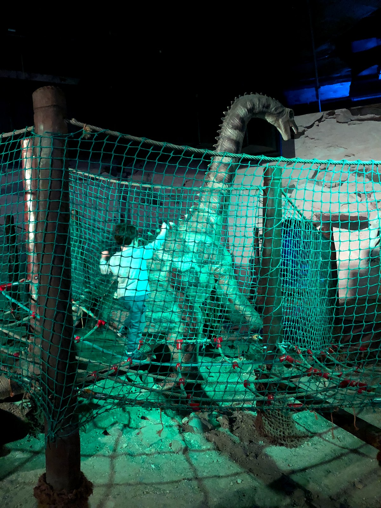

היעד לחופשת הקיץ של 2019 הוא צפון צ׳כיה. השארנו מאחור את החום הדביק של אוגוסט הישראלי לטובת חופשה משפחתית רגועה בטבע של בוהמיה.

נחתנו בערב אחרי טיסת יום קצרה, דחסנו את הילדים במושב האחורי של סקודה אוקטביה צ׳כית מסורתית וברחנו מפראג צפונה. אם יוצאים, מגיעים למקומות נפלאים - ואנחנו בדרכנו - לא פחות - ל״גן העדן הצ׳כי״! ״גן העדן הצ׳כי״ הוא שמו של פארק לאומי המשתרע על כ200 קמ״ר בצפון צ׳כיה. בששת הלילות הראשונים נלון בצימר בישוב פצפון בשם מישובקה (Michovka) שנמצא בלב יער בגן העדן הצ׳כי.

את הבוקר הראשון העברנו במסלול מגניב בBesedice Skaly שנמצא במרחק הליכה מהבקתה שלנו. סלעי החול המפורסמים של השמורה יוצרים מבוך טבעי ומפותל ממנו הילדים מאד נהנו. סימון השבילים במסלול (ובצ׳כיה בכלל) ראויים לציון, כך שלמורת רוחנו לא הצלחנו לאבד אף אחד מהילדים במבוך ונאלצנו להמשיך בטיול בהרכב המלא.

השנה הפיטים כבר כבדים מדי מכדי שיוכלו להילקח בתרמיל ומצופים ללכת ברגל בגבורה בכל המסלולים. המסלול קצר יחסית כך שסיימנו בזמן שאיפשר לנו לחזור בצהריים ולאפשר לפיטים שנ״צ התאקלמות. מאד ממליצים על אפליקציית המסלולים Mapy.cz שגם עזרה בתכנון וגם אפשרה לנמלה לאסוף מדדים מיותרים ולנתח אותם בלי שום סיבה נראית לעין.

")
מנקודות התצפית במסלול השקפנו על עמק ״מאלה סקאלה״ (Mala Skala). מאלה סקאלה היא ללא ספק העיירה עם השם הכי מדליק של הטיול. בכל יום כשעברנו בה עם הרכב אבא קרא ״מאלה״ והילדים הריעו ״סקאאאלה״! זה הושרש כל כך שכשפספסתי תמיד היה ילד שידע את התפקיד ולפתע נשמע מאחור ״מאלה״!

כמו כמעט בכל יום בטיול הזה, הקפדנו לעשות הפסקת בירה קלה בצהריים - הפעם זה קרה ב״קיוסק״ שצמוד למסלול. הבירה בצ׳כיה זולה ונהדרת (לא יותר מ5 ש״ח לחצי ליטר בירה טריה מהחבית (!)). פגשנו במקום את בעלת הצימר ש״הורידה״ עם חברותיה כמה כוסות של בירת דובדבנים מקומית אותה היינו חייבים לנסות (מגעיל ממש).

 - מתוקה להגעיל")

כל איזור הפארק  מכוסה בעצי תפוחים. אמנם עדיין מוקדם בעונה, אבל אפשר כבר למצוא תפוחים בשלים על העצים. קטפנו תפוחים מעץ ליד הקיוסק שעזרו לנו להעביר את טעם בירת הדובדבנים. אני ושרלוט בדיוק קראנו בטיול את ״דני אלוף העולם״ (רואלד דאל) בו מסופר על דני שאהב לקטוף תפוחים מזן דלישס מעץ שגדל ליד הקרון שלו. חוץ מהתפוחים גם היער בו ממוקם הצימר שלנו הזכיר את היער המפחיד של ויקטור הצל מהסיפור. בזמן שהפיטים ישנו ניצלנו את הזמן לסיים את הספר ב״יער של הצל״ תוך כירסום תפוחי דלישס עסיסיים.

אחרי הצטיידות קלה ושנ״ץ העברנו את חלקו השני של היום ב״אטרקציית ילדים״ בדמות פארק דינוזאורים. הפארק הקטן בליברץ (Liberec) - העיר הגדולה של האיזור - היה הצלחה. מפתח לבילוי מוצלח באטרקציות שקשורות לילדים הוא תמיד לתכנן להגיע בזמן בו המקום כמה שפחות עמוס. ההיסטוגראמה שמספקת גוגל עבור "Popular times״ היא priceless בנושא זה. לנמלה יש אלרגיה חריפה ל״ילדים של אחרים״ שמחריפה ביחס ישר לכמה שהם שמחים.

פארק הדינוזאורים השאיר רושם עמוק על הילדים - שלא ציפו לדינוזאורים העצומים שזזו ונהמו כשמתקרבים אליהם. בהתחלה הם נבהלו ולא הסכימו להתקרב עד שלאט לאט היחסים התחממו.

צ׳כיה מוכיחה את עצמה בתור יעד מעולה לבריחה משפחתית מהקיץ הישראלי. מזג האויר בצפון קריר ונעים רוב הזמן גם בקיץ והטיסה הקצרה גם היא יתרון. העובדה שצ׳כיה מצד אחד היא מדינה מצליחה כלכלית (מהעשירות יותר בגוש הסובייטי לשעבר), ומצד שני שמרה על המטבע שלה (למרות היותה באיחוד האירופי) - יצרה מצב שהמחירים פה מאד אטרקטיביים במדינה שהיא מערבית לכל דבר. האוכל פה זול בצורה מגוחכת - זה ממש הרגיש כמו בילוי ללכת לסופר ולקנות מכל טוב במחירים מצחיקים.

אחרי יום ראשון עמוס בחוויות ירד הלילה על ה״יער של הצל״. נתראה מחר.
