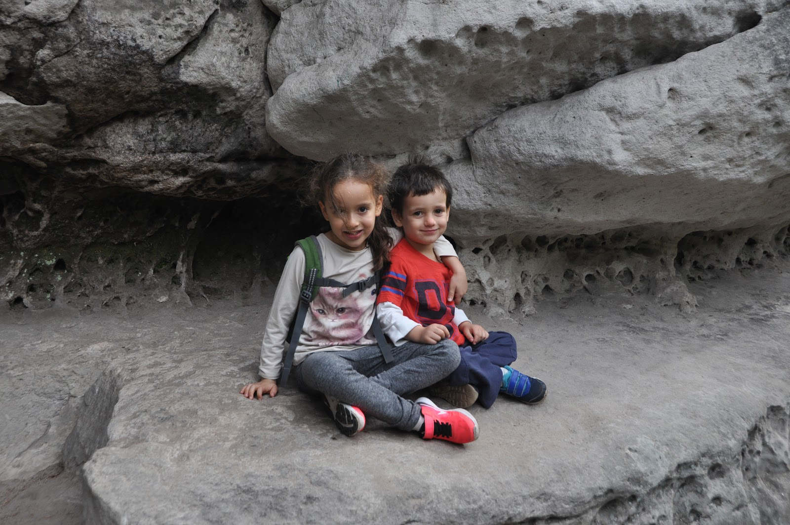

גם את יומנו השני בטיול העברנו ב״גן העדן הצ׳כי״ - והפעם ב״צוקי פראחוב״. השקמנו קום, זללנו את ארוחת הבוקר עם פרי היער היומי ויצאנו לדרך. פראחוב ידועה בצוקי אבן-החול האדירים החולשים על קו הרקיע שלה ומהווים גן עדן אמיתי למטפסי צוקים ומטיילים. באיזורים בהם הצוקים צפופים הם נראים ממש כמו גורדי שחקים במעיין מטרופולין קמאי.

בחרנו במסלול הארוך (ירוק) שכלל לא מעט עליות וירידות תלולות (לא מומלץ לילדים שלא רגילים להליכה ממושכת). הפיטים צלחו את המסלול בהצטיינות יתרה ולא צנחו לאף תהום על אף שלל ההזדמנויות. כמו במסלול הקודם השילוט, ובמקרה זה גם התיעוד online של המסלולים - היה ללא רבב.

*מפת המסלולים - צוקי פראחוב*

המסלול מיוחד ומגוון - גם בתוואי השטח וגם בנופים היחודיים לשמורה. אסור לפספס לכל מי שמתקרב לאיזור. מומלץ מאד להגיע מוקדם ולהמנע מסופי שבוע (ומן הסתם מעונת התיירות בכלל אם מתאפשר) משום שבאיזורים הצרים עלולים להיווצר פקקים. הגענו לחניון המסלול בין הרכבים הראשונים ועל אף זאת בשעה האחרונה של המסלול כבר הורגש עומס מסויים. למי שמתקשה לקום מוקדם אני משכיר שרותי פיטים לטיולים (אנא פנו אלי בפרטי)

את אחר הצהריים העברנו ברוגע בגינה שבישוב בו לנו. אך הערב כמעט ונגמר באסון. כשחזרנו לצימר חניתי את האוטו כרגיל בפתח, שחררתי את חגורות הילדים והלכנו. הילדים יצאו מהאוטו לאיטם והתחילו לשחק במתקני השעשועים שבגינה של הצימר כשלפתע נשמעת צווחה מפי הנמלה - האוטו! האוטו! הרכב שלנו החל להידרדר לאחור במדרון החניה - רצתי אל האוטו אבל זה היה מאוחר מידי - הצימר ממוקם על הר והרכב החל לדהור בנפילה חופשית במורד. הסקודה ניפצה את גדר החלקה השכנה והתעופפה באויר דרכה! הרכב הסורר המשיך בדהירתו עד שנכנס בקול נפץ אדיר בבית השכן!

אלו היו כמה רגעים שבהם הלב פעם בטירוף. במזל גדול לא נפגע אף אחד! בזכות העובדה שהחורף כאן קר מאד, קירות הבתים עבים במיוחד והנזק לבית לא היה נוראי - הסקודה לעומת זאת - סיימה את הטיול... השמועות בעיירה הקטנטונת מישובקה עברו מפה לאוזן ובכל כמה דקות הגיע זקן צ׳כי חייכן אחר לראות במו עיניו מי האידיוט שהטיס סקודה על פני גיא והר. בעלת הצימר אפילו הראיתה לי אחרי כמה ימים כתבה באתר המקומי של האיזור - חגיגה שלמה.

השוטרים הגיעו וישבו על המקרה כמעט שעתיים עד שהבריקו עם פסיקה לפיה מגיע לי קנס על הפרת חוקי התנועה. חשוב כשמטיילים במדינה לדאוג לפרנסה של המקומיים - גם המטופשים שבהם :) (והשוטר באמת עשה איור יפה של מסלול ההתרסקות) . בשעות הקטנות של הלילה הגיע משאית עם מנוף ובתוכה ביריון צ׳כי עם קרוקס שבפעולה די מרשימה הצליח להשחיל את הסקודה המעופפת מעל שאריות הגדר ומתחת לכבלי החשמל. הוא השאיר לנו סקודה חדשה ונסע לדרכו.

הילדים שנבהלו נורא מכל הסיפור הספיקו להרגע עד שעת הסיפור וכשקמו בבוקר פשוט היה עותק של המכונית מוכן עם כל הכיסאות שלהם כאילו לא קרה דבר. אנחנו חיים בעולם כזה, זה די משוגע...

נסיים את הפוסט בפינת הדגל האהובה פינת ״שגעונות הנמלה״ - והפעם טרפת הcolor coding! הנמלה החליטה לבצע בבני משפחתה ניסוי סדר נוסף והפעם קידודי צבעים - כל אחד מקבל צבע עבור אחסון כל החפצים שלו - ממברשת שיניים - עד לתחתונים!

ולמי שחשב שתאונות דרכים או משמעת גרמנית זה נורא: טעות בידו! שימו לב לגזירה הבאה: החולצות בטיול זה מסודרות במעיין גלילים כך שאמורים בחצי מבט להחליט מה לובשים ולהוציא אך ורק את הפריט המבוקש.

לילה טוב יומני
