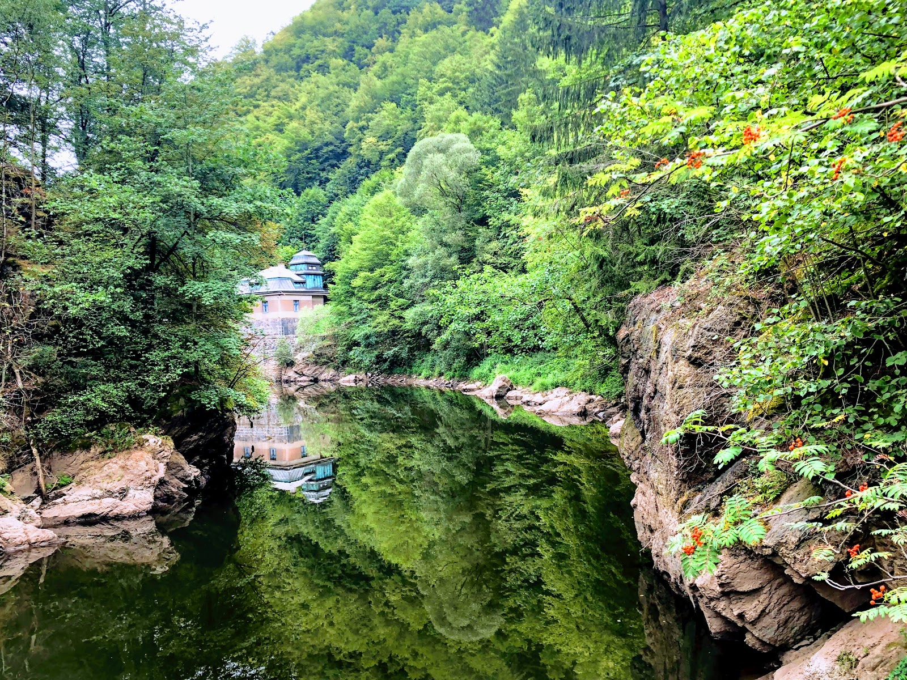

את היום השלישי בצ׳כיה פתחנו בטיול במעבר ריגר (Rieger) המלווה את תואי נהר הייזרה (Jizera) בשמורת גן העדן הצ׳כי. המסלול קל ויפה ומאפשר גישה לנהר למי שחשוב לו במיוחד להפריע לשלוותם של ברווזים. אחת מנקודות הציון  במסלול היא פלא תחנת כח הידרואלקטרית מרשימה משנות ה20 (של המאה הקודמת!) שלמיטב הבנתי עדיין פעילה לפחות ברמה מסויימת. תמיד כשרואים ״פלאי הנדסה״ ישנים אני אוהב לדמיין את האנשים שבנו אותם... אם זה ערים עתיקות או במקרה זה מערכת מתוחכמת של תעלות וטורבינות.

חלק קצר במסלול מורכב מקונסטרוקציית עץ תלויה מעל הנהר שמאפשרת תצפית יפה. שאר המסלול מתפתל בין היער לנהר עצמו. המסלול הוא חד כיווני, אבל כדי לא להסתבך עם תזמון של רכבת שיוצאת פעם בשעתיים העדפנו ללכת חלק מהמסלול ולחזור. הלכנו עד נקודת התצפית Bohmova vyhlidka ושם הסתובבנו (תאור מסלול מצורף). רצינו לעשות יום רגוע כך הרשינו לעצמנו לקחת את הזמן ולשבת לפטפט עם הברווזים, לאסוף חלוקי נחל ופשוט להנות מהטבע.

בחציו השני של היום, לא לפני שנת צהריים מתוקה מתוקה, ביקרנו באגם שנודע בתור "ואדי ניסנאס הצ׳כי" - את שמו המוזר קיבל האגם על שם העיר בה הוא נמצא - Jablonec Nad Nisou (בתרגום עם רמת דיוק מסויימת: עץ התפוחים על נהר הנייסה). ניצלנו את היום עם מזג האויר החם ביותר שהיה לנו עד כה כדי להצטנן ולטבול במימי האגם המלאכותי הגדול של ואדי ניסנאס. האגם מוקף בחופים נוחים לרחצה והמוני מקומיים רבצו בשמש מול האגם ובתוכו. במרכז האגם צפות שתי רפסודות ואבא השתעשע ברעיון המטופש לשחות אליה עם ילדים (שחלקם אינם שוחים). השעשוע ברעיון המטופש הפך לתוכנית אוילית ומפה לשם אבא מצא את עצמו גורר ילדים לא מרוצים במצופים בשארית כוחותיו אל הרפסודה. נו טוב... כשהיינו על הרפסודה הבטחתי לשרלוט שיום אחד נצחק על המסע הזה המון - אמנם היא לא הבינה את הקונספט באותו הרגע - אבל כמה דקות אחרי שיצאנו מתנשפים חזרה בחוף היא כבר היתה גאה בעצמה ומרוצה למדי :) אלכס - המתוקית לא היתה כ״כ אמיצה (וכן היתה קצת יותר חכמה) ונשארה ברדודים לשמור על הנמלה.

")

סיימנו עוד יום נפלא בצ׳כיה בBurger Grill Pub עם בירה נהדרת והמבורגר נחמד. במסעדות בצ׳כיה, הרבה יותר מאשר בכל מקום אחר בו טיילנו, מקובל שתפקיד המסעדה לדאוג לאיזושהי תעסוקה לילדים - אם מדובר בחוברות מושקעות, או בפארק שעשועים ענק - זה כבר תלוי במסעדה. הסידור הזה לפיטים (שבצ׳כיה אגב נקראים צ׳יכים - צ׳יך וצ׳יכולינה) והעובדה שהמחירים במסעדות שערורייתי - גרם לנו לאכול בחוץ הרבה יותר מאשר בטיולים אחרים.

