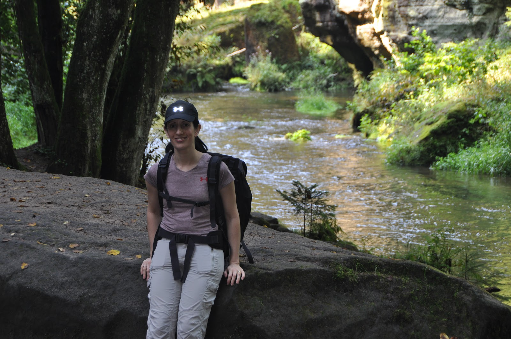

כמו בכל שנה, יום ההולדת של השרלוטין ״נופל״ על חופשת הקיץ המשפחתית (ראה ערך [יום הולדת בדרך הלחם](http://shpandrak.blogspot.com/2017/08/blog-post_21.html)). לכן טקס יום ההולדת הפך כבר להיות חלק אינטגרלי מהחופשה. בימים הראשונים לטיול שארלס הרבתה לשאול: ״מתי יהיה יום ההולדת שלי?״ אבל אחרי יומיים הפסיקה - הסבירה בדיעבד ש״רצתה שזאת תהיה לה הפתעה״. גם השנה השתדלנו לדאוג למסלול ״חגיגי״ ליום ההולדת, טיילנו בשמורה ״בוהמיה השוויצרית״ בצפון מערב צ׳כיה שבהחלט כיבדה את המעמד. את שם השמורה קבע שוויצרי עם בעיית געגועים קשה למולדתו. אמנם השמורה לא ממש מזכירה את שוויץ, אך עם זאת היתה יפיפיה בזכות עצמה.  
משום שהיתה לנו נסיעה יחסית ארוכה, שלפנו את הילדים מוקדם, עשינו חגיגת בזק, ארזנו כריכים למסלול ויצאנו לחגוג את ההרפתקה היומית.

בשמורה ניתן להרכיב מספר מסלולים, אנחנו בחרנו לעשות מסלול חד-כיווני שמתחיל בMezní Louka ומסתיים בPension Klepáč כשמסוף המסלול חזרנו באוטובוס. המסלול לא קשה והאטרקציה המיוחדת בו, לפחות מבחינת הילדים, היא ששני מקטעים של המסלול עוברים בשייט בסירות קטנות בנקיק צר ויפיפה. הנוף היה שונה יחסית מהטיולים הקודמים וגם השייט יצר גיוון נחמד.

במהלך השיט ניתן להבחין בפסלים ששתלו בשמורה בהם משתמשים המדריכים הצ׳כים כדי לספר בדיחות בצ׳כית צחה שלפי כמות הצחוקים היו לא פחות מ״קורעות מצחוק״. אך למה שרק המקומיים יצחקו מהקריינות? בין השייט הראשון לשני עבדתי עם פיט על יכולת ייחודית לפרוץ בצחוק חסר רסן לפי פקודה. בסבב ב׳ של השייט, ידם של הצ׳כים כבר היתה על התחתונה! בכל פעם שהמדריך הצ׳כי רק פתח את הפה, סימנתי - ופיט הפליא בצחוק מזוייף חסר הקשר שאמנם לא מאד הצחיק אחרים - אבל אני כמעט והשתנתי במכנסיים מרוב צחוק - מה שרק עודד את פיט להגזים!

אכלנו צהריים במסעדה מצויינת בMezni Louka (בשם Lokal Mezni Louka). הילדים שכנראה היו רעבים מאד טרפו בהנאה את כל המנות ששרלוט בחרה לפני שחזרנו לצימר להמשך חגיגות יום ההולדת. בערב יצאנו שוב לחגוג בפיצריה נחמדה Pietro Tomasso בMala Skala.

לא יאומן ש״התינוק״ הפך לילדה טיפשית ומופלאה בת 6. מזל טוב עלמה-שרלוט אהובה! מי יתן ובכל יום הולדת שלך נעשה כל כך הרבה דברים נחמדים יחד!

