היום עזבנו את הצימר במישובקה לטובת היעד הבא בטיול. זללנו שאריות עוגה שנשארו מיום ההולדת השרלוטי, וכל ילד הורשה לקחת איתו בלון אחד לדרך.

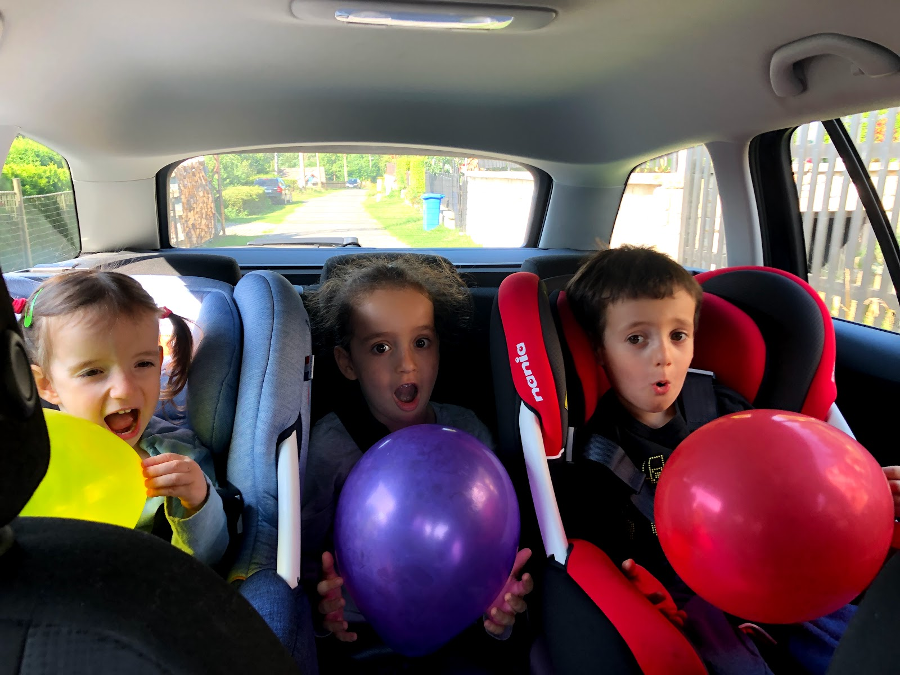
את יום המעבר בדרך לדירה החדשה בשפינדלרוב מלין (Špindlerův Mlýn) העברנו בעיירה הארחוב (Harrachov). התחלנו את הביקור במפעל הקריסטל ומבשלת הבוטיק  novosad &amp; syn. המפעל שהוקם לכל המאוחר ב1712 הוא העתיק ביותר שעדיין פעיל בבוהמיה. במפעל ניתן להתרשם מחדרי המפעל המקורי שנשתמרו כבר יותר מ300 שנה (!). זכוכית קריסטל (או בדולח) היא זכוכית מועשרת במתכת כבדה כלשהי - בדרך כלל עופרת רעילה למרות שהיום במפעלים מודרניים מחליפים את העופרת במתכות פחות בעייתיות. המתכת משנה את התכונות האופטיות של הזכוכית באופן בו יש יותר החזרה של אור (ברק) ומכאן הפופולריות בשימוש בנברשות ובכלי יוקרה.

הסיור היה מעניין. צפינו בעובדים מנפחים כלים באותה הטכניקה בה השתמשו לפני מאות שנים. החל בתנור הלוהט, דרך הנפחים, המשייפים והחורצים שמקשטים את התוצרים. כששאלתי את המדריכה מדוע לא מחליפים את כל העובדים הללו במכונה משוכללת שלא יוצאת להפסקות צהריים, ישנה או מריחה כמו פועל צ׳כי - ציפיתי לשמוע התפתלות שמתיימרת להסביר שמכונה לעולם לא תגיד לאותה רמת גימור. אך להפתעתי המדריכה היתה כנה והסבירה שקהל לא היה בא לצפות במכונה מכינה כוסות ושהם מכניסים כסף מהסיורים. אמנם אני דווקא הייתי מעדיף לראות מכונה משוכללת של Riedel עם 300 זרועות שחותכת בלייזר אלפי כוסות קריסטל בשניה - אבל זה כבר עניין של טעם אישי...

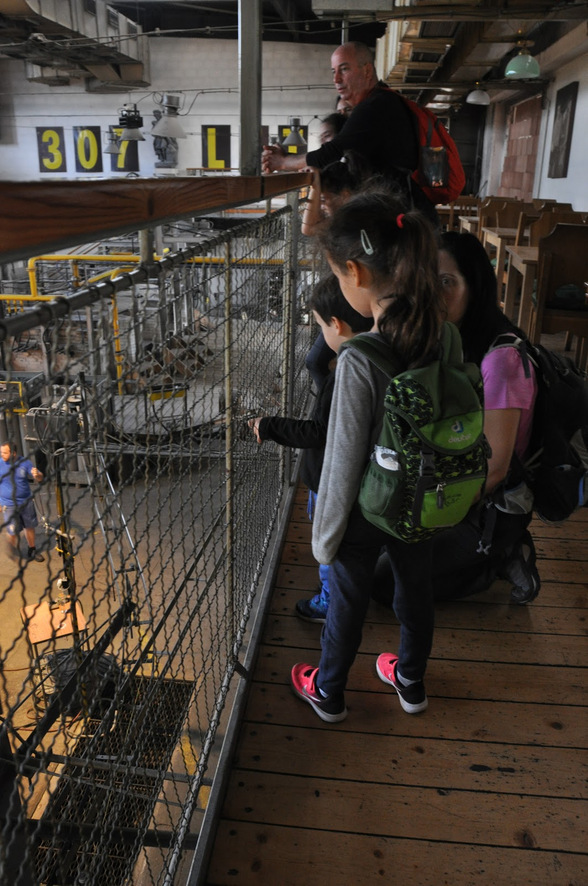
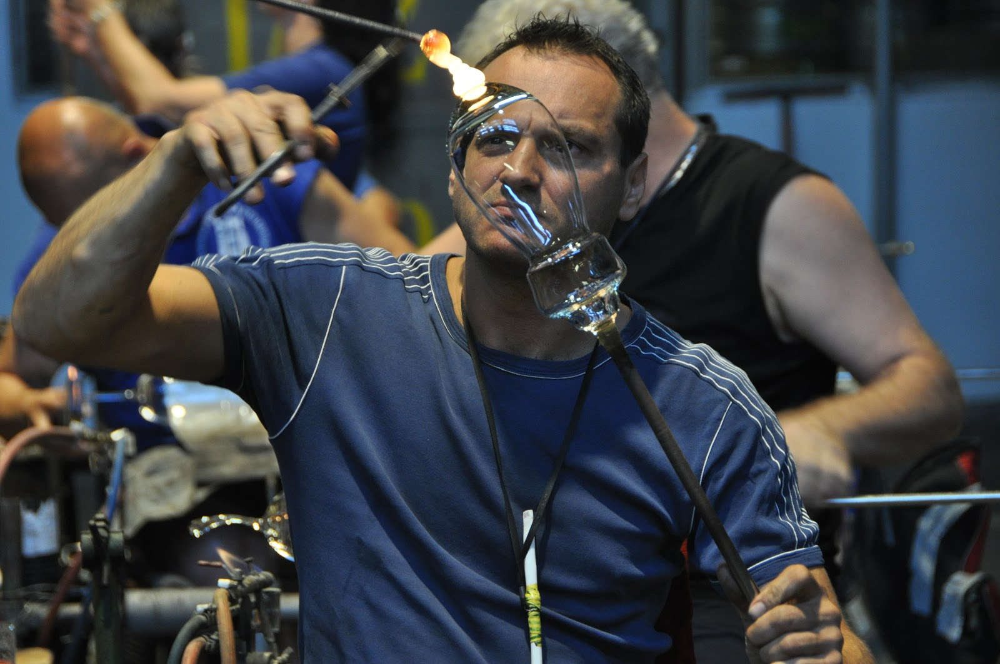
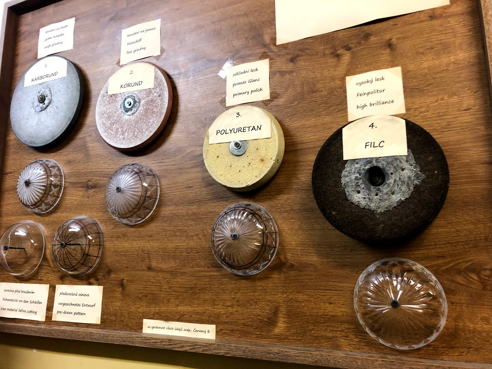

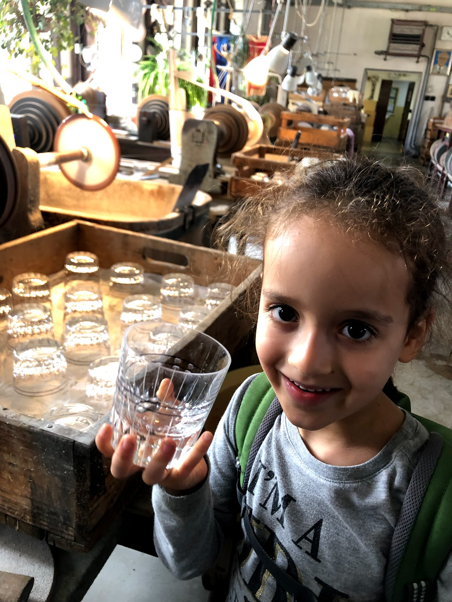

מדהים שהמפעל המשיך בפעילותו במשך כל כך הרבה שנים! המקום שרד בין היתר שתי מלחמות עולם ותקופה קומוניסטית שכללה לא מעט סנקציות כולל דיכוי האביב של פראג. הקושי הנוכחי של המפעל, אם אני קורא נכון בן השורות הוא  התיעוש והגלובליזציה. בשנת 2008, לאחר המשבר הכלכלי הגדול של אותה התקופה, המציא את עצמו המפעל מחדש ופתח בשטחו מבשלת בוטיק. המפעל עדיין מתפקד ומכניס כסף כנראה בעיקר מסיורים. כחלק מהסיור מקבל כל מבקר מבוגר טעימת בירה במתנה המוגשת כמובן בכוס תוצרת המפעל. הכרטיס לסיור כולל גם סיור במוזיאון שמתאר את ההיסטוריה של המפעל וייצור הזכוכית באיזור - אך מהר מאד הבנו שלהסתובב עם  ״פיט במוזיאון חרסינה״ זה לא רעיון טוב בכלל. שתינו את הבירה שלנו ומיהרנו לאטרקציה הבאה!

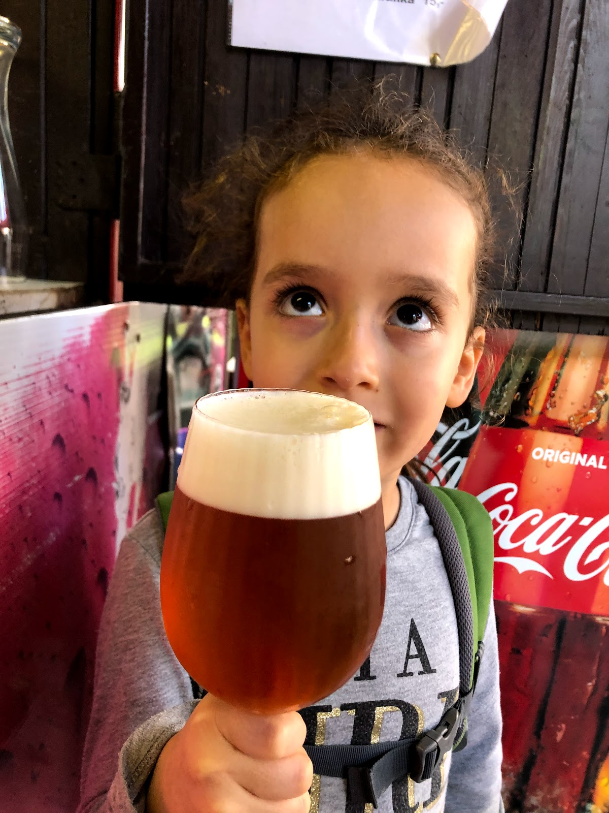
משם המשכנו לטיול קצר למפלי Mumlavsky. במרחק של כ-2 ק״מ מHarrachov מתחיל מסלול קצר המוביל אל המפלים. המסלול ״סגר לנו את הפינה״ מצויין - מפלים יפים ולא ארוך מידי. המסלול לא היה עמוס ואיפשר להתקרב לנהר ואפילו להשתכשך בו.

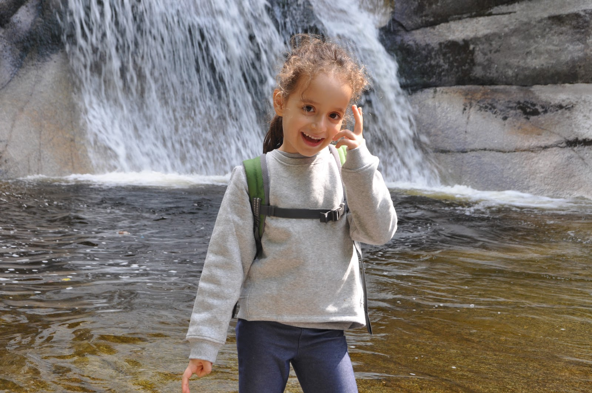

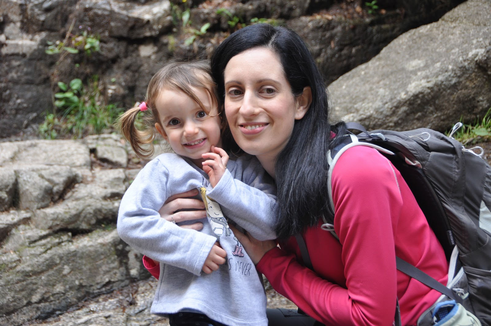

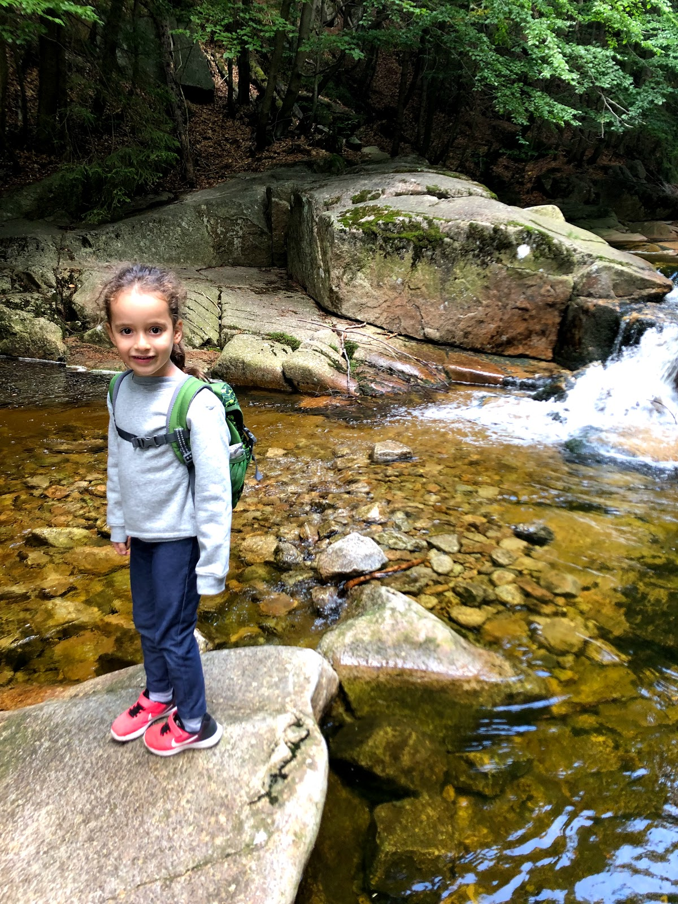

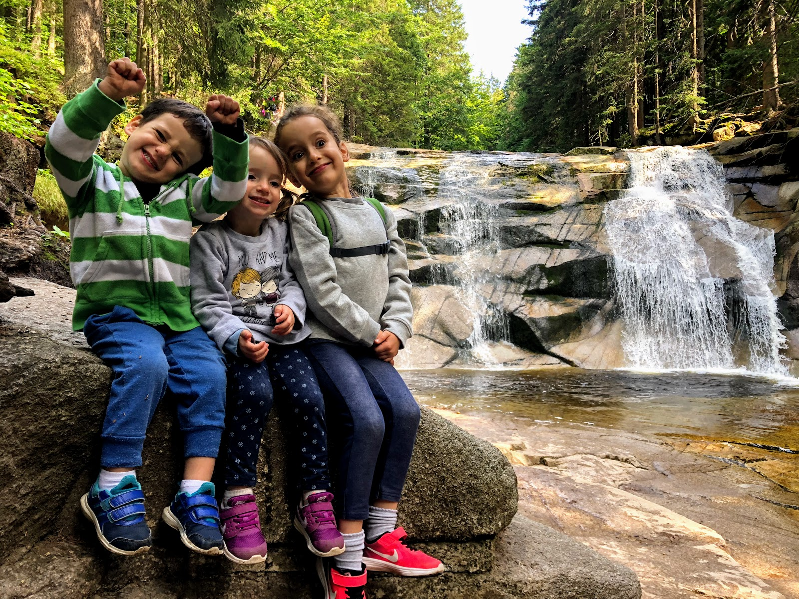
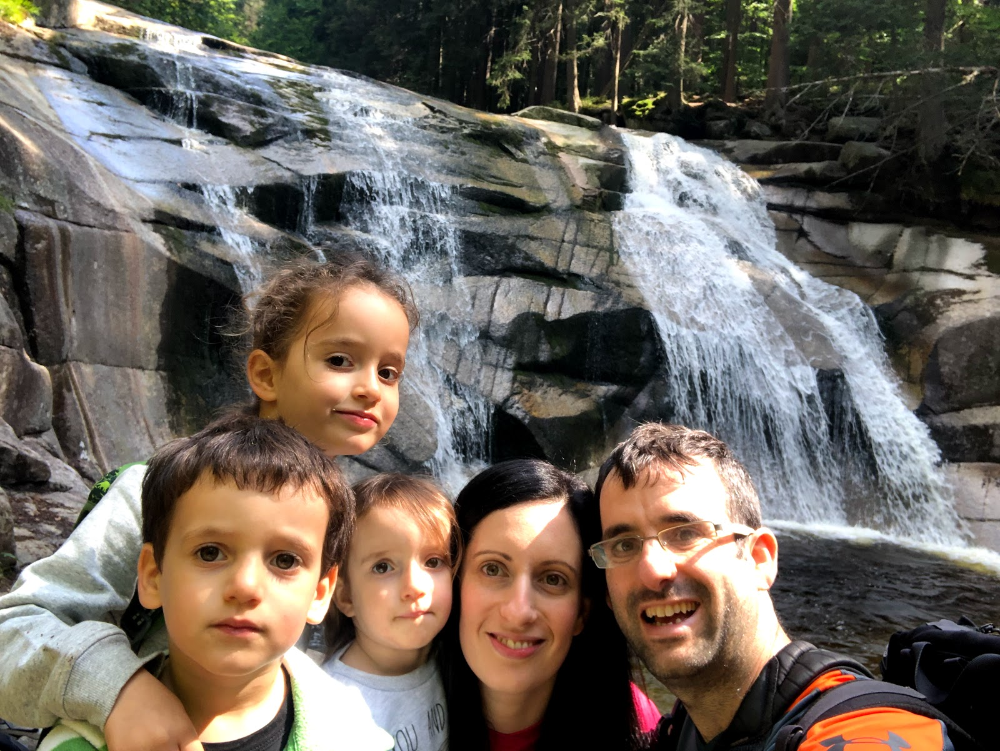

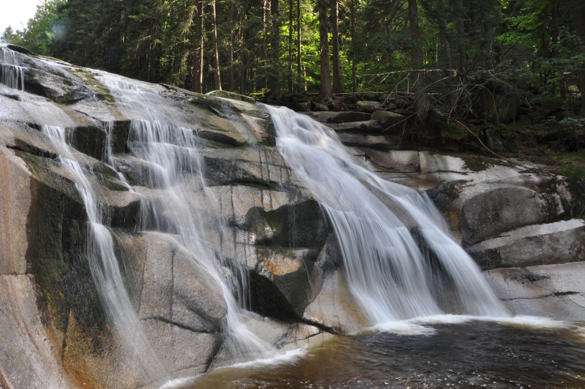

משם יצאנו לנסיעה לשפינדלרוב מלין - ה״בית״ הבא שלנו בטיול. הדירה היתה מפנקת - המבנה נראה כאילו היה פעם אחוזה של דוכס עשיר שעכשיו הפכה לבית דירות. עיטורי הקירות החיצוניים בעץ נראו כמו עבודת יד מפרכת. הגענו מוקדם מספיק כך שהספקנו להצטייד בסופר המקומי, לקנות גבינות מקומיות, להכין ארוחת ערב בכיף ולהתכונן להרפתקה של מחר.

