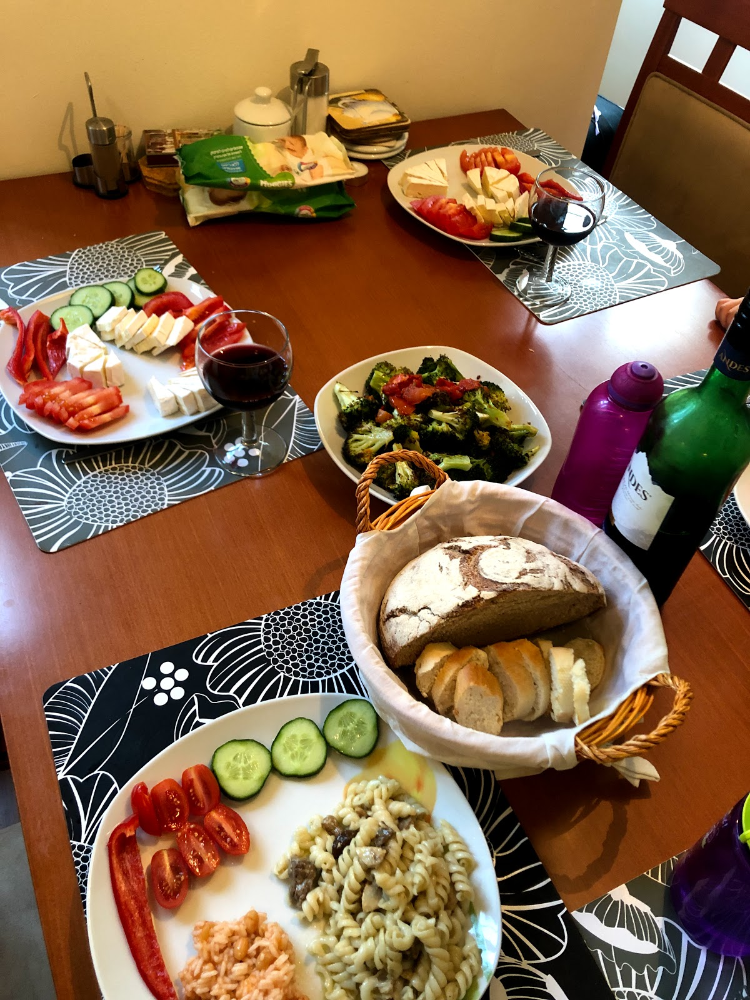

---

היום טיילנו בצוקי אדרשפך (Adrspach Rocks). אדרשפך היא אחת מ״ערי הסלעים״ המרשימות ביותר בצפון צ׳כיה. אמנם מזכירה קצת אתרים קודמים בהם טיילנו פה כמו [צוקי פראחוב](http://shpandrak.blogspot.com/2019/08/blog-post_17.html) אך אין ספק שכל מקום כזה מותיר רושם עמוק בכל פעם מחדש. הצוקים הגבוהים בצורות המשונות, הנקיקים שביניהם - וכל השטויות מסביב שמשרד התיירות הצ׳כי טרח למקם כדי לרצות את המטיילים.

הלכנו במסלול הירוק (מעגלי) עם גישה ל״מפל הנס״ ומעבר ב״טירות המיסתורין״. המסלול מתחיל ומסתיים ליד אגם Pískovna היפה ומתפתל בין הסלעים לתוך ״עיר הסלעים״. השמורה מתוחזקת היטב, הן מבחינת השילוט ומבחינת הטיפול בשבילים. יש די הרבה side trips לתצפיות על סלעים בצורות שונות ומשונות, ובאזורים בהם צריך מונגש השביל על ידי דרגשי עץ או מדרגות מתכת. המסלול לא קשה אך יש לקחת בחשבון לא מעט עליות וירידות ששוות כל רגע. ״טירות המיסתורין״ זה בסך הכל קטע במסלול בו יש שער בנוי שנראה כמו תפאורה מסרטי ״שר הטבעות״. ישנן המון נקודות חן מרהיבות בהן הצ׳כים הפליאו לדמיין כל מיני צורות בסלע, אך הנקודה  היפה ביותר לטעמי היא כיכר הפילים (Elephant Square). כיכר הפילים היא נק׳ בה המטיילים מוקפים בסלעים ארוכי חדק מתאספים ורוכנים למרכז לצורך דיון מעמיק בעניינים פיליים.

לקראת סיום המסלול, איתרנו לנו נקודה שקטה בה רבצנו מול האגם וקינחנו בפיקניק צנוע. כשעוצרים רגע ומתבוננים מסביב, מגלים עולם ומלואו. במקום בו עצרנו צמחו עשרות סוגים של פטריות כל אחת יותר משונה מהשניה. העמקנו עוד בין העצים והמשכנו למצוא עוד ועוד פטריות בצורות משונות לצד פירות יער מפתים. תמיד בטיולים כאלה אני מצטער שאיננו יודעים להבדיל בין פטריות רעילות ופטריות למאכל. כמעט בכל יער אירופאי אפשר לפגוש מקומיים מטיילים עם סלסלות וקוטפים פטריות שמנמנות. כדי לכפר על בורותי, בערב קניתי תערובת פטריות והכנתי לילדים פסטה עם פטריות יער טעימות.

בסיום המסלול קנינו לילדים גלידת פירות יער שהוכנה מול עינינו מפירות קפואים. מה שהיה פחות מזין בגלידה הוא שבמהלך הכנתה, דבורים שהסתובבו סביב הפרי נשאבו למכונה ומצאו את דרכן לתוך הגביעים של הילדים. ״זה טוסיק של דבורה״! נשמעה פתאום צעקה שרלוטית!  
אחרי עוד יום טיול בטבע המטורף של צ׳כיה, חזרנו לדירה באחוזת הדוכס הצ׳כי. גילינו בגינה טרמפולינה ענקית שעזרה לסחוט מהילדים כל טיפה מיותרת של מרץ מטורלל. ליד הטרמפולינה, היתה ביקתה קטנה, בה אני והשרלוט דימיינו שנים על גבי שנים של ייסורים בהם הדוכס עינה משרתים שהמרו את פיו.

