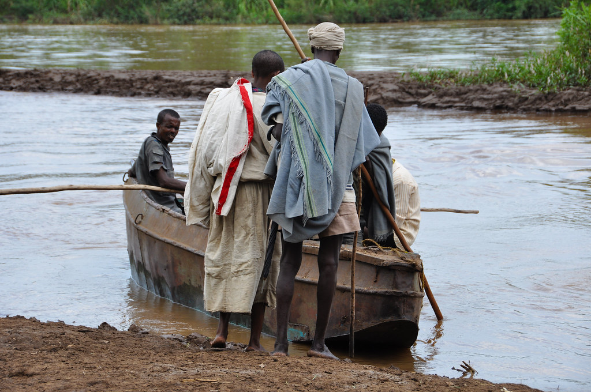

במסגרת טיול הרווקים האחרון בהחלט שלי - נסענו אני ומתן לאתיופיה לטרק בהרי הסמיאן עם קבוצה מאורגנת קטנה דרך “אקו טיולי שטח”. מוטב מאוחר מאשר אף פעם – לעבודת התעוד: היכון, הכן צא:

**24/09/2010 – בהר-דר**

בטיסת לילה הגענו מתל-אביב לאדיס, ומשם בטיסת המשך קצרה לבהר-דר שהיא “עיר” הבירה של מחוז אמהרה באתיופיה. כמו כדי להזכיר לנו לאן הגענו, עובדי חברת אתיופיאן אירליינס הצליחו לאבד את התיקים של כולנו. אחרי שהבטיחו להשיב את התיקים עד הערב, יצאנו לתור את האטרקציות של האיזור. בהר-דר ממוקמת על גדות [אגם טאנה](http://he.wikipedia.org/wiki/%D7%90%D7%92%D7%9D_%D7%98%D7%90%D7%A0%D7%94), שהוא מקור “הנילוס הכחול” ובסה”כ אחראי לכ70% מהמים הזורמים לנילוס – או בקיצור “אגם המלריה”. למרות שבעיקרון באזור בהר דר אין “יותר מידי” מלריה, ההנחיה היא לבלוע ולמרוח את כל מה שהאדם הלבן מצא לנכון להמציא כנגד המחלה.

הצטרפנו לצוות של חברת הטיולים המקומית (המעולה) Getts ופנינו לביקור במפלי הנילוס הכחול. אל המפלים הגענו באמצעות הוואן שהוצמד לנו וחציה בשייט של “נהר המלריה” בסירה רקובה שהשכרנו ממקומי. בנק’ זו חשוב לציין שתנינים הם עמידים למלריה וגם אוהבים כפות רגליים לבנות :)

המפלים היו גדולים ומרשימים. קשה להבין למה בחרו לקרוא להם דווקא הנילוס ה”כחול”, אבל מילא. המים אגב מעולים לשתיה על ידי אתיופים – אנחנו נשתה מים מינרלים לכל אורך הטיול…

הצמחיה באיזור המפלים עשירה והאיזור ירוק כולו. בהליכה הקצרה בין הסירה למפלים פגשנו לראשונה את “ילדי המיסטר-מיסטר” ואת הקולגות שלהם “ילדי ה one-bir one-bir” (ביר הוא המטבע של אתיופיה (כעשרים אגורות), ומיסטר זאת המילה היחידה שהם יודעים באנגלית). בהמשך הטיול נכיר עוד זני ילדים – חלקם מתקדמים יותר וחלקם פחות…

משם המשכנו לשייט קצר, הפעם בכלי שייט רציני קצת יותר, באגם טאנה. בדרך ביקרנו באי קטן בו טיילנו בין כפרים בדרכנו לכמה כנסיות די משעממות. בכפרים ראינו לראשונה מקרוב את הבתים האתיופיים הטיפוסיים – בנויים משורות של גזעי עץ דקים שמצופים בבוץ(!). לנשים בכפרים הללו, ובעצם לנשים באתיופיה כולה, יש תפקיד אחד בחיים – להסתובב כל היום ולאסוף ענפי עצים להסקה. הגברים לעומתן עסוקים כל היום בלבנות מחדש את הבתים שהתפרקו אחרי שהם בנו אותם מחדש אתמול – אם רק הייתי יודע להגיד באמהרית: “אולי בוץ זה לא רעיון כל כך טוב”…

האי כולו מכוסה בשיחי קפה. למדנו שהקפה, שמקורו באתיופיה, צומח באופן עצמאי רק באתיופיה (בלי טיפול והשקיה). אחד הסיפורים בנושא “גילוי הקפה” מספר על רועה עיזים תימני שביקר באתיופיה וזיהה שכשהעיזים שלו אוכלות קפה הן הופכות פעילות יותר. היום משתמשים בדיוק באותו הטריק על עובדי היי-טק.

חזרנו למלון שממוקם ממש על שפת אגם המלריה בו כבר חיכו לנו תיקינו האבודים. בזכות העובדה שהתכוננו לגרוע ביותר המלון הפתיע לטובה. מתן, שלא “האמין” בטיפ שאומר “קח איתך לטיסה את נעלי הטיולים – תמיד!” העביר את היום הבוצי הזה בסנדלים. לא יהיה מופרז להגיד שמתן אימץ קהילה אתיופית קטנה עם כמות חיידקי המלריה שתפסו מחסה בין אצבעות רגליו היחפות. שיקול הדעת של מתן שוב ניכר כשבחר שלא להימרח ברעל בלילה בו ישנים על שפת אגם המלריה – שמלבד היותו מקור הנילוס, הוא גם מקורם העיקרי של “היתושים” :)

המשך יבוא…
