רגע לפני הטרק האינטנסיבי, מחכה לנו עוד יום עמוס בחוויות והיכרות מקרוב עם התרבות האתיופית בחיי היום יום. נבקר בגונדר, בשוק מקומי, בכפר יהודי וכמעט נהרג :)

**25/09/2010 – גונדר**

קמנו בבוקר בבהר-דר כשמתן מכוסה כולו בעקיצות יתושים :) ויצאנו לדרך הארוכה בכיוון גונדר. נסענו בכביש היחיד(!) באתיופיה שסלול בחלקו (שמו האופטימי – כביש 1). כבר בתחילת הדרך שמנו לב לשיירה אינסופית של אנשים שצועדים בצד הדרך (רובם יחפים). גרום, המדריך המקומי, סיפר לנו שהיום שבת ואנשים הולכים לשוק הקרוב כדי למכור\\להחליף סחורה. עד כאן זה נשמע הגיוני, אבל אז הוא הוסיף שהשוק הקרוב נמצא במרחק 4 שעות הליכה!

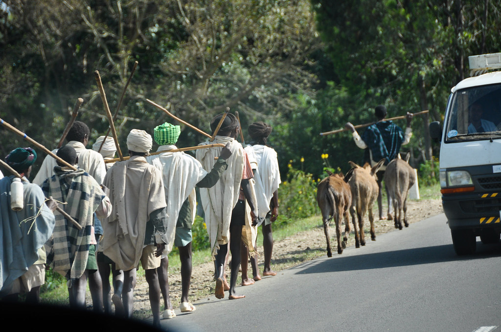

התחלנו לקבל חצי מושג על איך באמת חיים כאן. באתיופיה יש כ90 מיליון תושבים – רובם עניים מאד. אנחנו נמצאים באזור “העשיר” של אתיופיה… זה הגיוני לגמרי מבחינתם ללכת 4 שעות לשוק, להחליף סחורה ולחזור בעוד 4 שעות הליכה הביתה. עוד מנהג אתיופי מגניב שאפשר לראות בתמונות - גבר תמיד ילך עם משהו ביד – אם אין לו מה להחזיק, זה יהיה סתם מקל…

")

הדרך היתה יפה מאד, וככל שהתרחקנו מבהר-דר זה נהיה נדיר יותר ויותר לראות עוד מכוניות על הכביש מלבדינו. עלינו קצת בגובה, והנוף התחיל להיות הררי

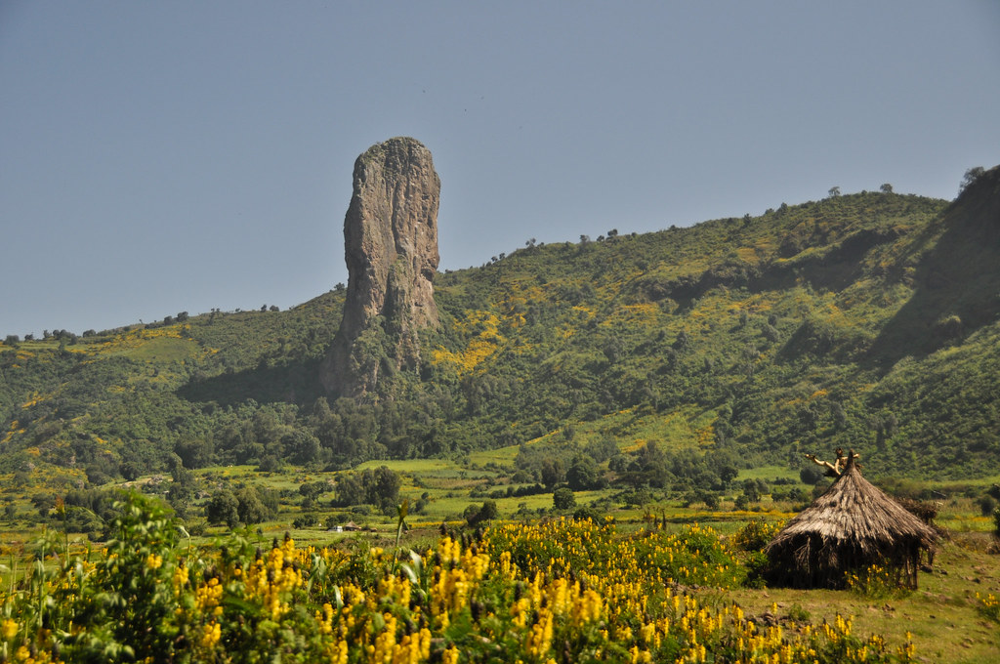

לקראת גונדר עצרנו בשוק מקומי שהיה עמוס באנשים בצורה לא הגיונית. למרות שזה לא הרגיש ככה, זה נחשב בטוח להסתובב בשוק. מתן, שמשום מה הרגיש מאד חברותי באותו הרגע, התחיל לשוחח עם נער חמוד שידע אנגלית בסיסית. הנער, שבמהלך כל השיחה לפת בידיו כמות מטרידה של רגליים שמחוברות לתרנגולות חיות למכירה, סיפר על הלימודים שלו ועוד כל מיני שטויות. כל הסיטואציה עוררה התרגשות רבה - לא בכל יום יוצא לחברה האלה לדבר עם איש לבן (ועוד בכזה גודל..). מהר מאד התאספו סביבנו כמות מוגזמת של אנשים. אני ברחתי משם ברגע שקלטתי ילד מלטף את היד השעירה שלי בסקרנות.

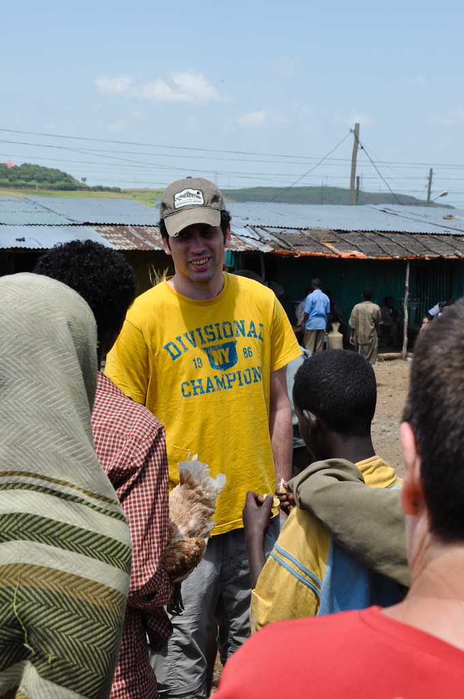

")

למרות שבאמת לא היה שום איום, ההרגשה היתה ממש לא נעימה, ומהר מאד מצאנו את עצמנו סגורים בתוך האוטובוס מוקפים בהמוני סקרנים.

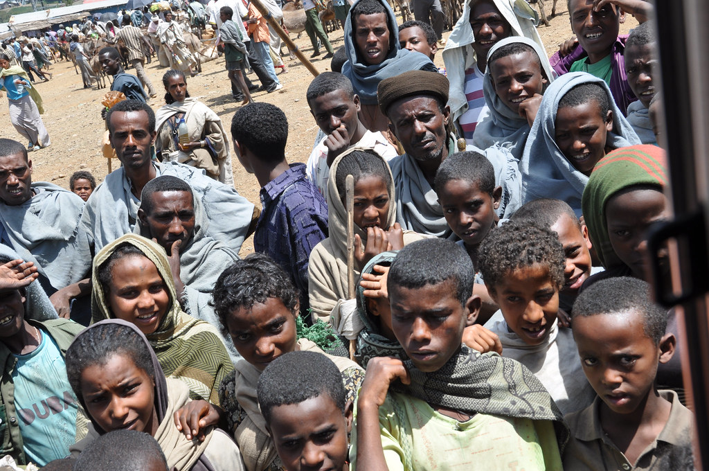

חילקנו קצת עטים, סוכריות ובירים לילדים נבחרים והמשכנו בנסיעה. כבר למדתי שעטים זה אטרקציה פה, אז הפעם הבאתי קצת תחמושת מהבית… מכיוון שהסבירו לנו שהמושג של עודף לא ממש קיים פה, אז פרטתי בשדה הרבה שטרות של ביר בודד. תמיד היו לי בכיס כמה שטרות של ביר שזכו לכינוי “כסף כושים”. ילדים חמודים שלא הציקו ולא עצמו עיניים בתמונה הפכו מייד זכאים ל”כסף כושים”. (הבהרה: אין בביטוי “כסף כושים” כוונה ללעג או גנאי – זה פשוט היה מצחיק מידי מכדי לא להשתמש)

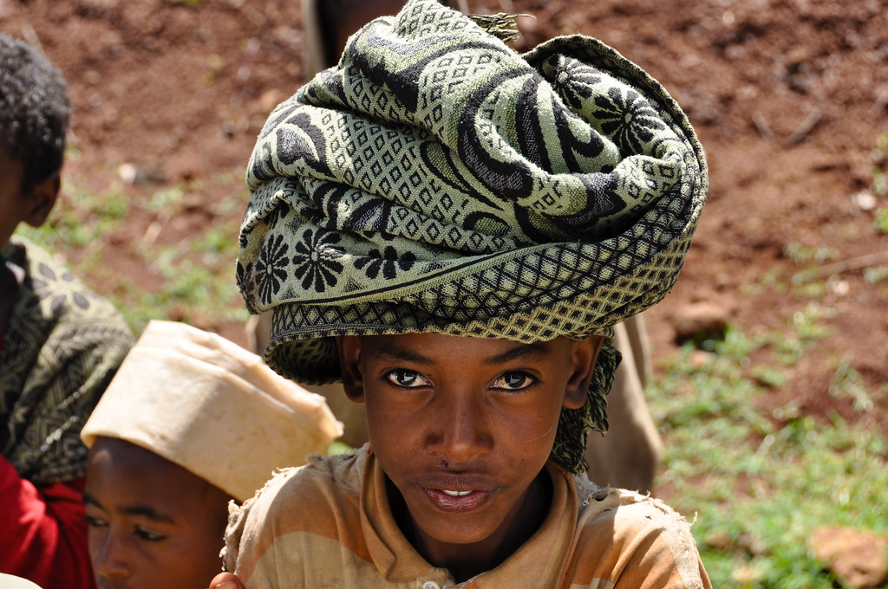

בדרך מהשוק לגונדר קרה הארוע הכי הזוי בכל הטיול הזה. הנהג שלנו התחיל לעקוף במהירות רכב איטי כשלפתע הוא רואה שבאמצע הכביש הולך איש שמוביל חמור עם שקים. הוא ניסה להתחמק מהם אבל ללא הצלחה גדולה – הוואן פגע בלחי של החמור והפיל אותו. הוואן ירד מהכביש עד שכמעט התהפך מחוץ לשוליים. זה היה מפחיד בטירוף ויצאנו מזה די במזל אחרי שבראש כבר דימיינתי את המבזקון השולי בynet שמספר על התקרית…

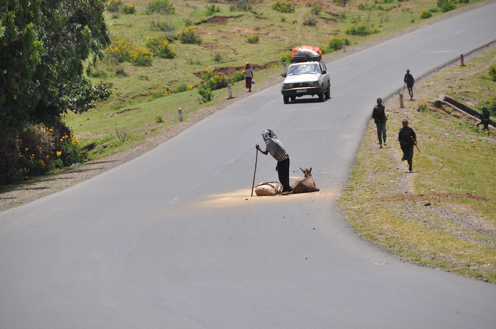

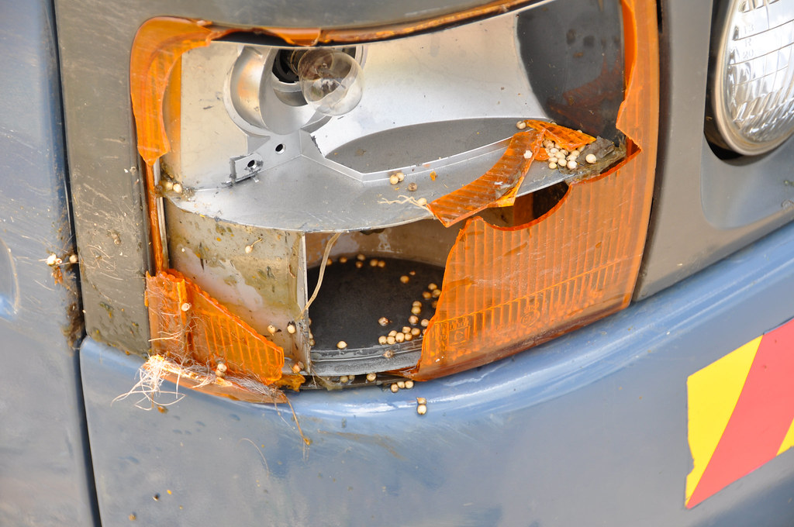

בסך הכל הנזק היה נסבל, והחמור אפילו שרד כמעט לגמרי את הפגיעה. מבחינתנו התאונה עצמה היתה רק ההתחלה של ההרפתקה. בסיטואציה המוזרה הזאת יצא לנו לחוות קצת איך באמת מתנהגים האתיופים אחד לשני – בלי כל התיירים שבאמצע… תוך שניות התאספו המון אנשים והתחילו לעזור לאסוף את הסחורה של האיש (גרגרים מסוג כלשהו..) הנהג שלנו עם המדריך הלכו גם הם לעזור והחלו במשא ומתן. כל הארוע התנהל מבלי שתהיה אף הרמת קול או כעס. הנהג הסביר לסוחר (שכונה “אובמה” בגלל חולצה שתרם לו איזה אמריקאי) שגם לו יש עלות של תיקון הרכב, וחוץ מזה שהחמור נראה בסדר גמור. אובמה חשב שמגיע לו פיצוי בסך חמור מלא (כ 75 דולר). אחרי שלא הצליחו לישב בינם את ההדורים ההחלטה היתה לנסוע לחפש שוטר שיפסוק בנושא. אספנו את אובמה איתנו ונסענו לחפש שוטר בכפר קרוב. די מהר איתרנו צמד שוטרים ואחרי שיחה קצרה הוחלט להביא אותם למקום האירוע. הצטופפנו עכשיו בוואן עם אובמה ועם שני השוטרים בדרך אל מקום האירוע.

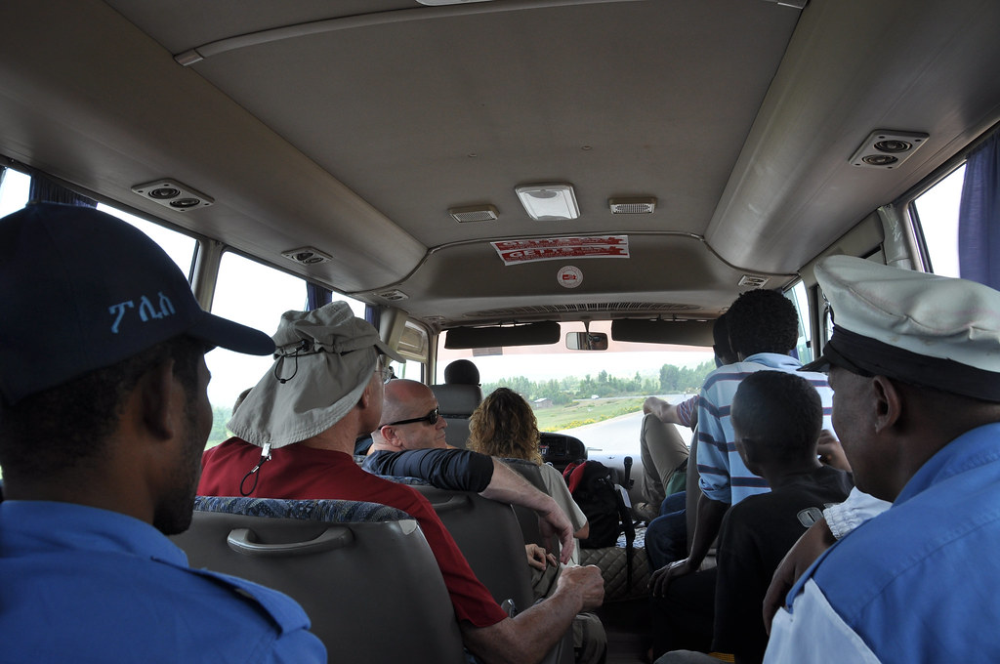

במקום האירוע השוטרים לא עזרו יותר מידי והכריזו שזהו לא “איזור השיפוט” שלהם וצריכים לנסוע למשטרת המחוז. בינתיים באוטובוס גרום (המדריך המקומי) הסביר לנו שבמקרים של מחלוקת בין מישהו ש”יש לו” מול מישהו ש”אין לו” אף פעם לא פוסקים לטובת “זה שאין לו”… “זה שיש לו” ישלם – השאלה היא רק כמה.

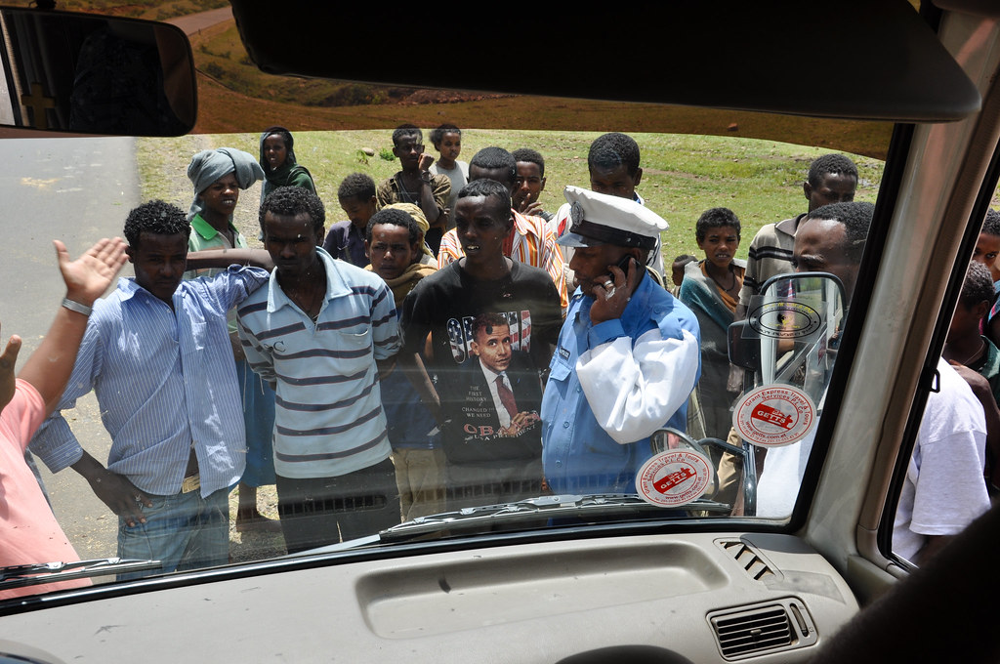

החברה המקומית שלחה לנו וואן חלופי בעוד “החבורה” – השוטרים אובמה והנהג שלנו נסעו למשטרה לעשות משא ומתן. אז מה למדנו מכל הסיפור הזה? נראה שהאתיופים הוגנים איש אל רעהו ומוסריים בדיוק כפי שסיפרו לנו. עוד דבר מעניין שאפשר ללמוד מהסיפור הוא ערך הזמן פה. נראה שבדיוק להיפך ממה שאנחנו רגילים - להכל כאן יש ערך - חוץ מלזמן. הסוחר שהיה באמצע הדרך לאנשהו עזב הכל כדי לנסוע איתנו, הנהג שגם הוא היה באמצע עבודה גם התפנה. השוטרים – שאפילו לא היו קשורים לכל זה פינו את כל היום שלהם (שכנראה לא היה עמוס ממש) והצטרפו לחגיגה… אין צורך לציין כמובן, שלכל אורך האירוע כל בן אדם שהיה ברדיוס של 5 קילומטרים מאיתנו התגודד סביב האוטובוס ועקב אחרי ההתרחשויות…

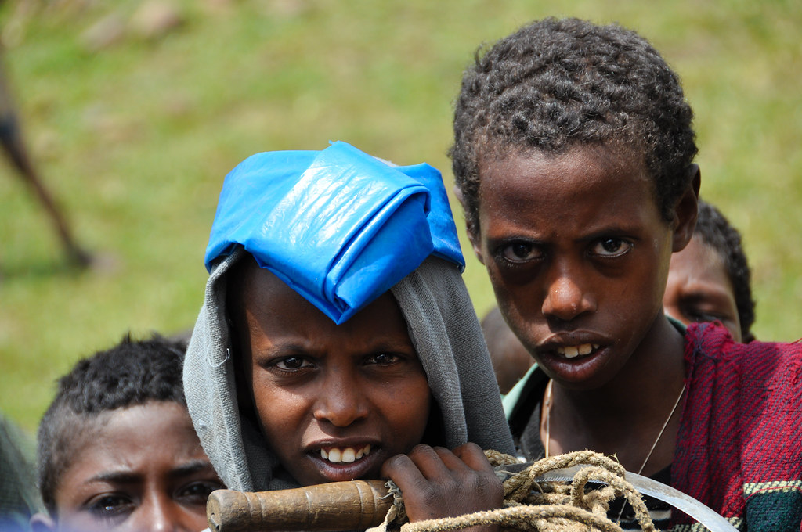

משם המשכנו לארוחת צהרים במלון בגונדר.  חצי מהקבוצה רצתה לנסות לאכול במסעדה מקומית במקום במלון על אף ההמלצה ההפוכה לגמרי שקיבלנו. גרום לקח אותנו למקום שהוא אוהב והבטיח שהמקום נקי יחסית... לראשונה באתיופיה טעמנו מהאוכל המקומי שלהם – [אינג’רה](http://en.wikipedia.org/wiki/Injera). האינג’רה היא פיתה שמזכירה את הלחוח התימני רק עשויה מטף שהופך אותה לחמצמצה. על האינג’רה, שמשמשת כצלחת, מגישים כל מיני פרוסות מחיות מתות. היה טעים ויחסית נקי (מגרד מלמטה את הציון “0 כוכבי נמלה לניקיון..”)

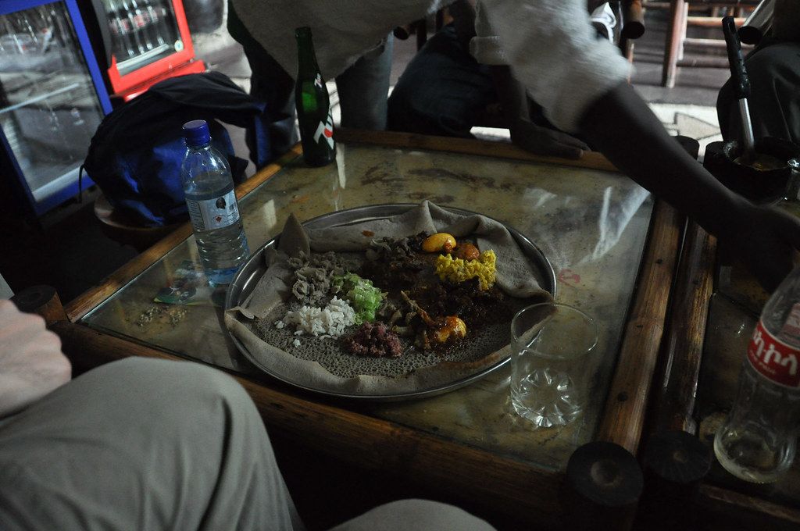

לא לגמרי היה ברור איזה חיות הונחו על האינג’רה אבל אכלנו… על הקירות המסעדה, בין דיוקניהם של קיסרי אתיופיה, היו תלויים כל מיני פוחלצים מאולתרים שהיו אמורים כנראה לעורר את תאבונינו.

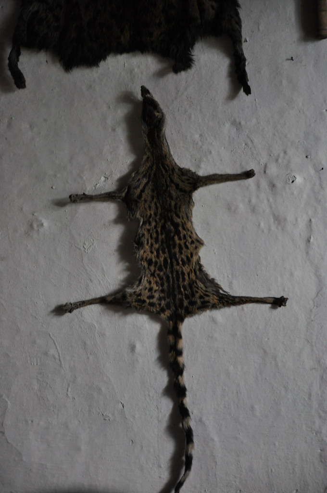

כשגרום סיפר לנו שהתוספת הכי חגיגית לאינג’רה זה פיסות בשר חי  - זה כבר היה מאוחר מידי – הסוס הטרויאני כבר הונח בביטננו :). כשחזרנו למלון הכרזתי על “חיטוי רוסים” – אני ומתן שתינו כמעט את כל אספקת הוויסקי שהבאתי עבור הטרק בתקווה שהאלכוהול ימצה את הדין עם כמות הכולרה שדחפנו לבטנות הלבנות שלנו...

משם המשכנו לסיור בעיר העתיקה של גונדר. ראינו כמה ארמונות, כנסיות ובריכה אחת מגניבה שמשמשת לטקסים המוניים. למדנו המון דברים מעניינים על האימפריה האתיופית ועל השליטים שלה, אבל נשאיר את זה לפוסטים הבאים (אולי יהיה לי מצב רוח יותר ממלכתי)... אראה רק תמונה של תקרת כנסיה שצבועה בדם של חיות שהיא כנראה בעלת ערך למישהו כי היא מופיעה על מרבית הטישרטים שמוצעים לתיירים.

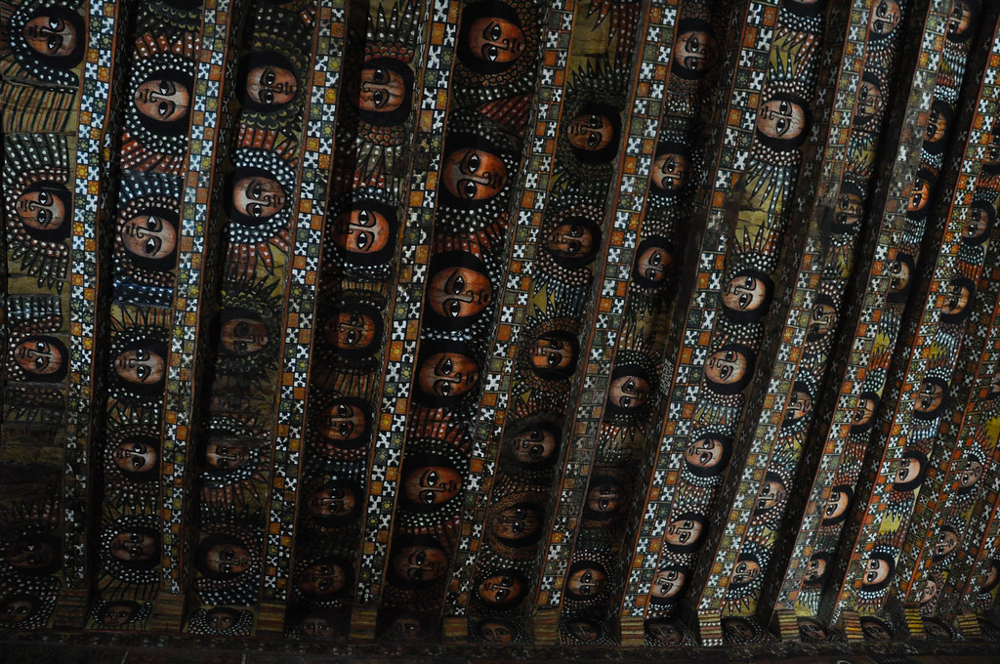

לסיום היום הארוך הזה, ביקרנו בכפר יהודי קטן בו נשארה רק אישה יהודיה אחת וחצי בית כנסת. האישה היהודיה התרגשה לקראתנו וחיבקה כל אחד ואחד רגע לפני שכמו יהודיה טובה לקחה אותנו לפינת המזכרות שלה :)

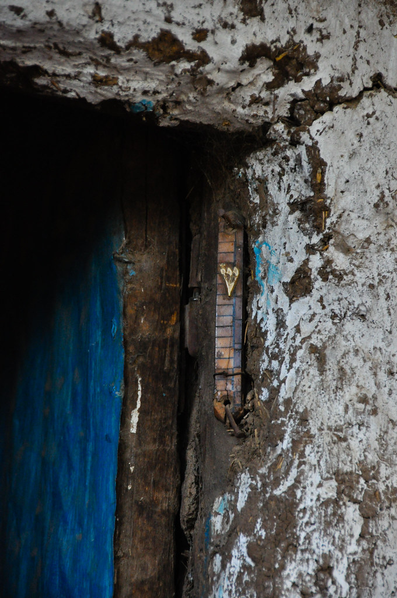

נכנסנו גם ל”בית הכנסת” – שהיה בעצם בונגלו רגיל מבוץ רק שאמרו לנו שהוא “בית כנסת”. ישבנו בבונגלו ולמדנו על ההיסטוריה של היהודים באתיופיה. למדנו על הכינוי פלאשה, על בני הפלאשמורה ועל הקשר המרתק בין העם האתיופי לעם היהודי. שוב זה כבר נושא לפוסט בפני עצמו – שיכתב או שלא….

הלכנו סוף סוף לישון במלון בגונדר. המיוחד במלון זה שהוא היה העתק מדוייק אחד לאחד של המלון בבהר-דר. כמו עם עניין בתי הבוץ, האתיופים לא ממש חדשניים – אם יש משהו שהם יודעים לעשות, הם יעשו ממנו שוב ושוב ושוב…

המשך יבוא…
