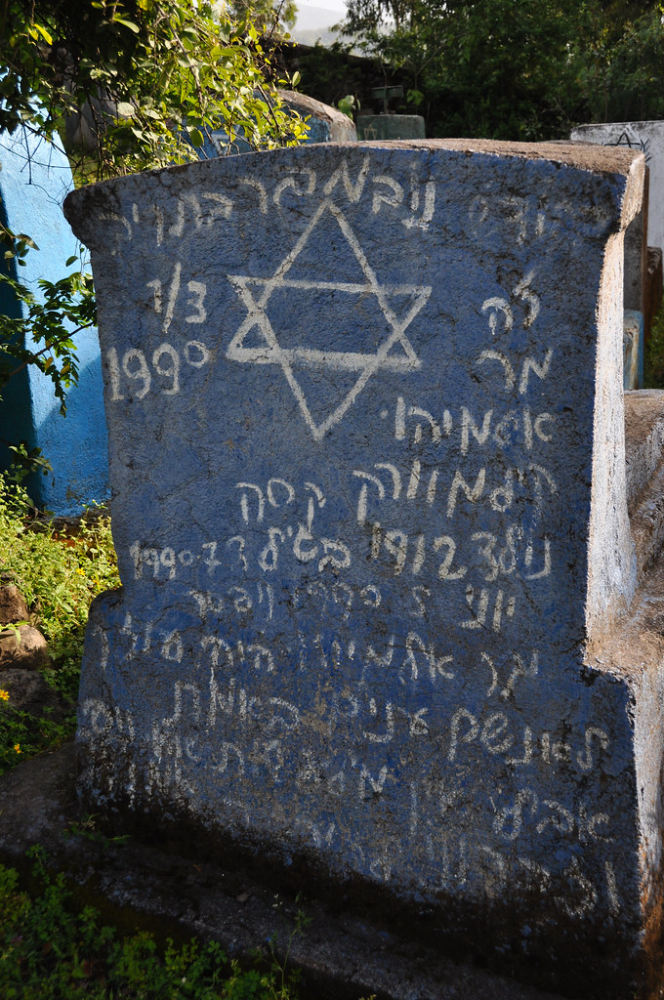
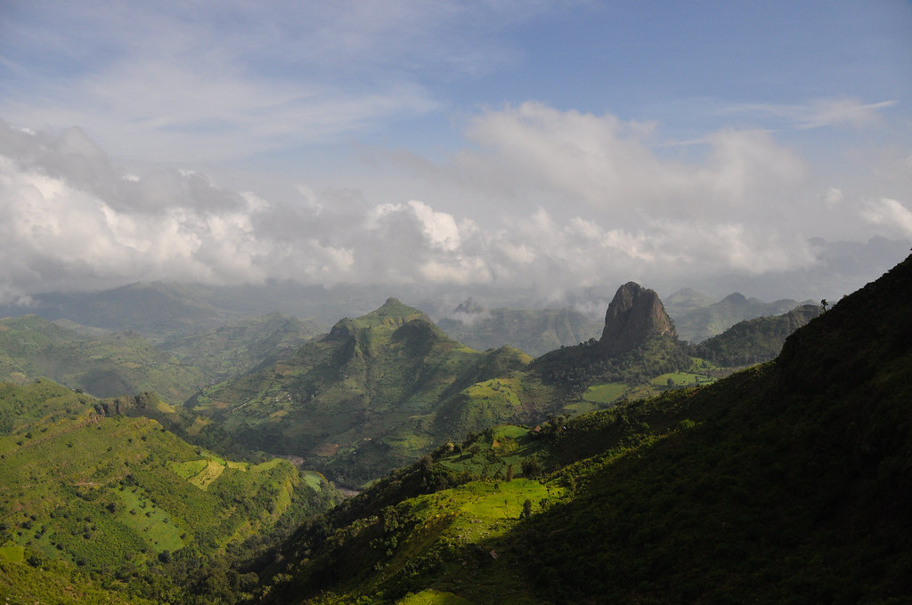
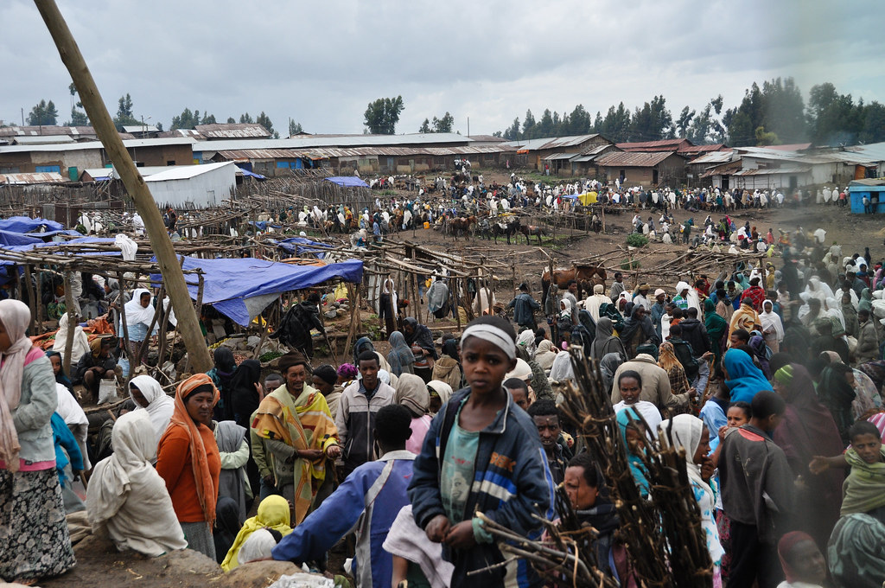
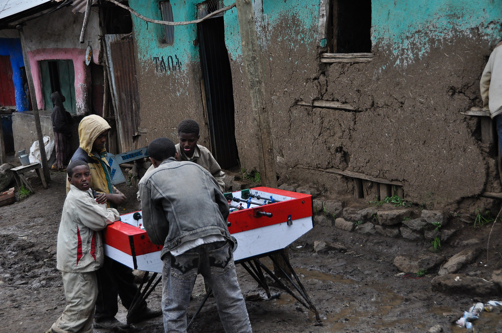
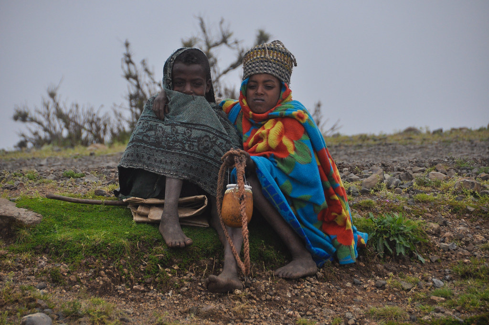
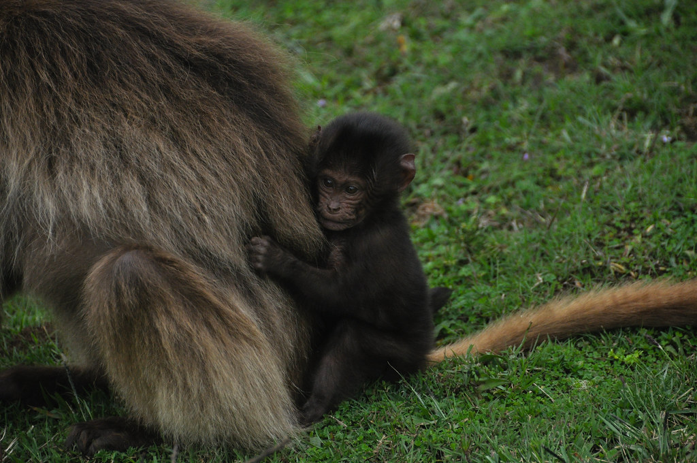
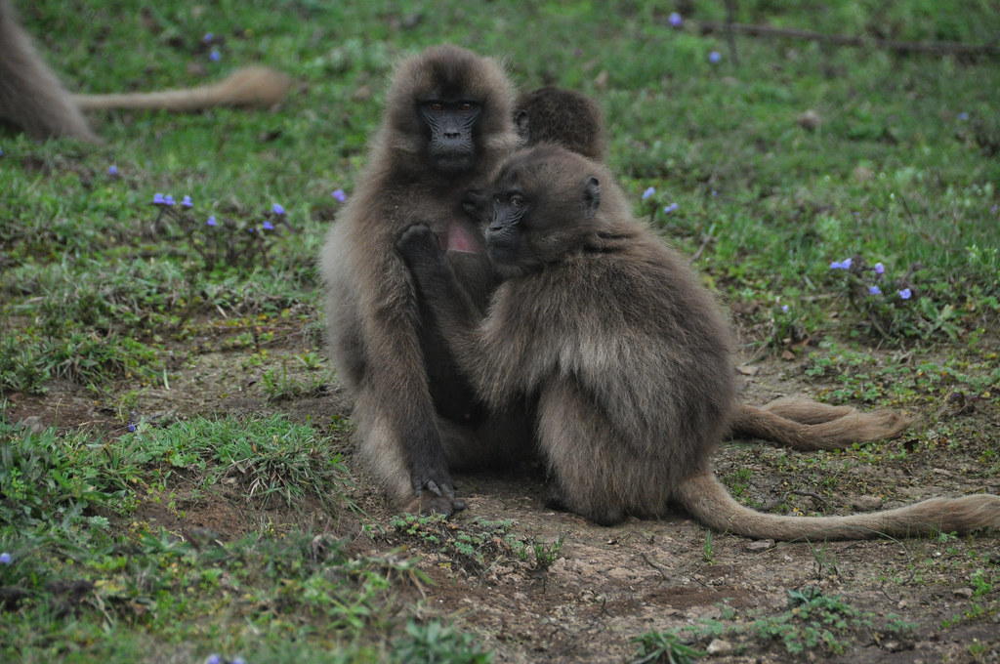
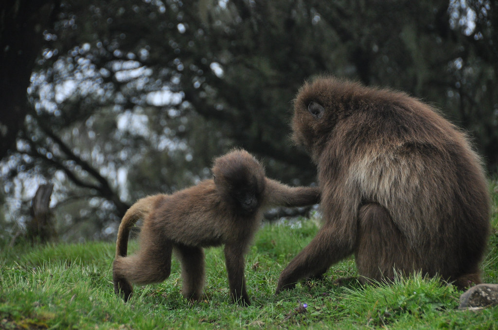
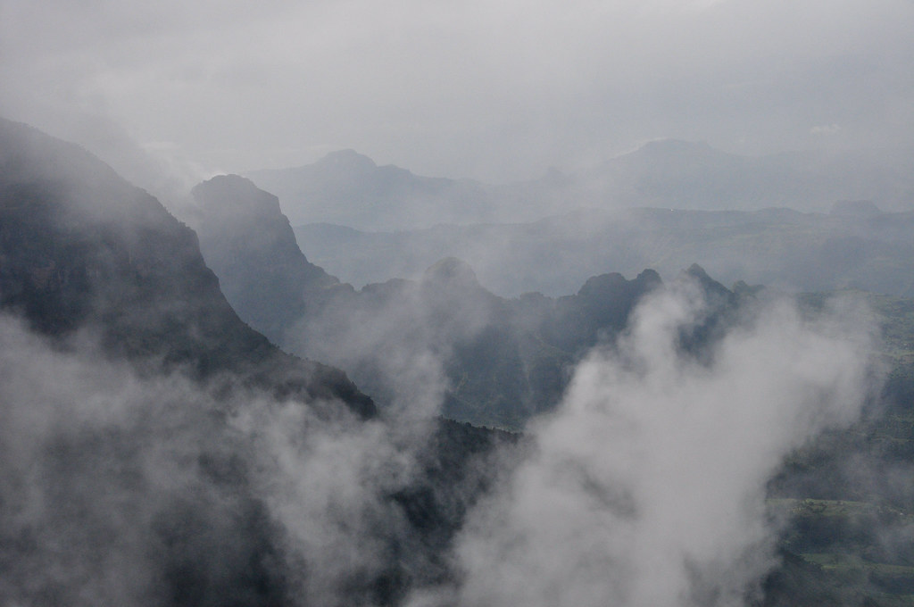
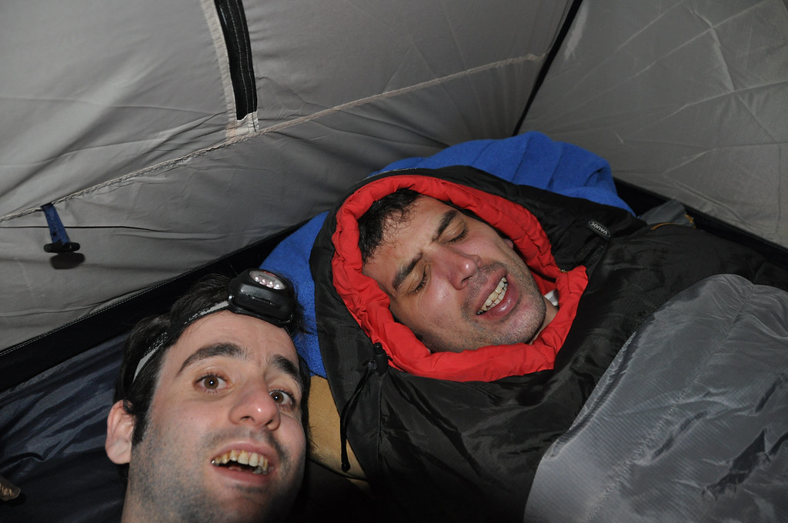

**26/09/2010 דברק – סאנקבר**

היום סוף סוף ניגש למטרה לשמה התכנסנו באתיופיה – טרק בהרי הסימיאן. את חצי היום הראשון העברנו בנסיעה – לא לפני שהחזרנו את חובנו לעם וביקרנו בבית הקברות היהודי שבגונדר.

ככל שהתקרבנו לאזור הרי הסימיאן פני השטח נהיו יותר הרריים בעוד פניהם של האתיופים יותר שדופים.

היעד הבא היה דברק – הדבר הכי קרוב לעיר שהכי קרוב לנקודת היציאה לטרק או במילים אחרות – חורבה שאינה ראויה למגורי אדם :)

תופעה שנתקלנו בה כאן לראשונה היא שמישהו תרם לאתיופיה כמות של שולחנות foosball, וכמעט בכל חור אפשר לראות ילדים אתיופים מתגודדים סביב שולחנות כאלה ומנסים להבין איך הם בדיוק אמורים לאכול את זה…

מדברק הגענו מהר לנק’ היציאה לטרק והתחלנו את ההליכה לכיוון המחנה הראשון שלנו בכפר המוסלמי סאנקבר. את מעט שעות ההליכה שהיו לנו להיום הלכנו בערפל כבד. מידי פעם צצו מבין העננים חבורה של ילדים שניסו למכור לנו מזכרות ריחניות.

כבר ביום הראשון של הטרק יצא לנו לפגוש את אחת מהחיות האנדמיות (שאפשר למצוא רק באתיופיה ורק בהרי הסימיאן) - הג’ילדות. ג’ילדה היא סוג של בבון שנמצא בסכנת הכחדה. קל היה להבחין שכשאנחנו התקרבנו לג’ילדות הן התעלמו מאיתנו לחלוטין – אבל כשהמלוים האתיופים התקרבו, הן נסו על נפשן תוך השמעת צווחות איומות. קשה יותר היה להבחין בריר שהופרש בצורה מוגברת בפיו של “נער החמורים” שלנו למראה הג’ילדות. (על דאגה, “נער החמורים” עוד לא אמר את מילתו האחרונה בבלוג…)

הג’ילדה מעבירה את רוב זמנה  בפליית פרעושים מג’ילדות אחרות ואכילתם. לא משהו שמצדיק את המשכיות גזע הג’ילדה – אבל בכל זאת חיה חמודה. כשהן לא זוללות פרעושים אפשר לראות אותן משתוללות וצווחות אחת על השניה בהתלהבות.

מידי פעם כשהערפל קצת התפוגג יכולנו לראות את הנופים שמצפים לנו בימים הבאים. הרי הסמיאן הספיקו כבר לגבות קורבן אחד - נפרדנו משוקי היום – שפיצלח לעצמו את הרגל.

תם יום ההליכה הראשון והקצר יחסית. מתן ואני ישנו לראשונה זה לצד זה והתנסינו בטקס “מקלחת המגבונים” – טקס שישנה את מערכת היחסים בינינו ואת תמימות הנעורים שלנו לעולמים :)

