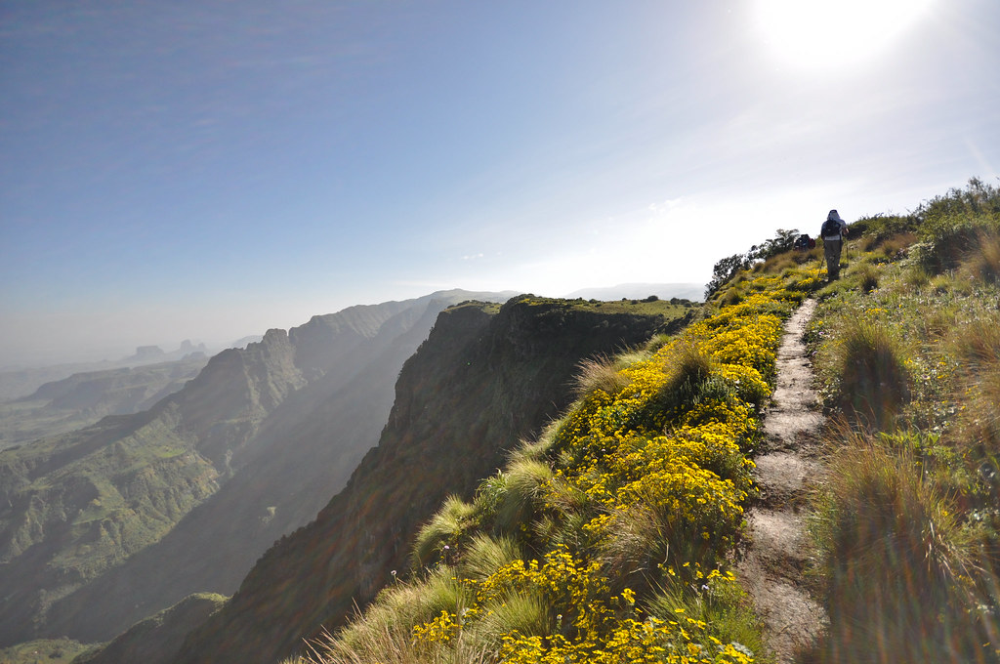
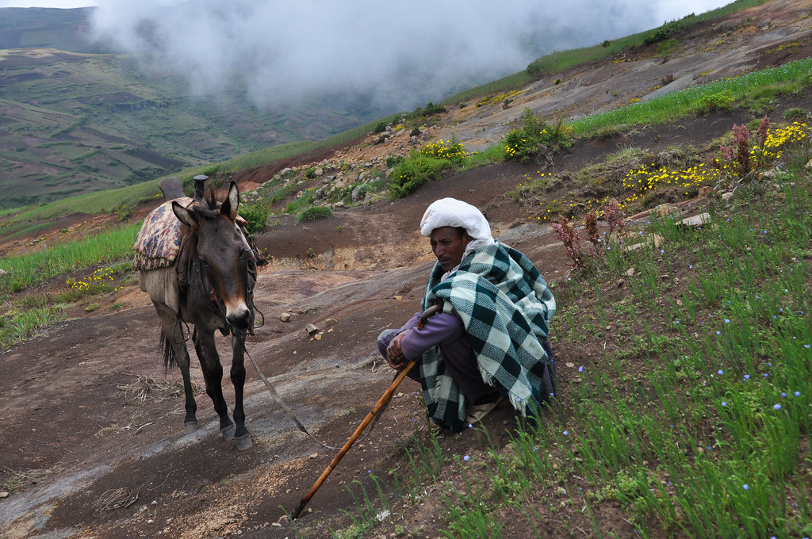
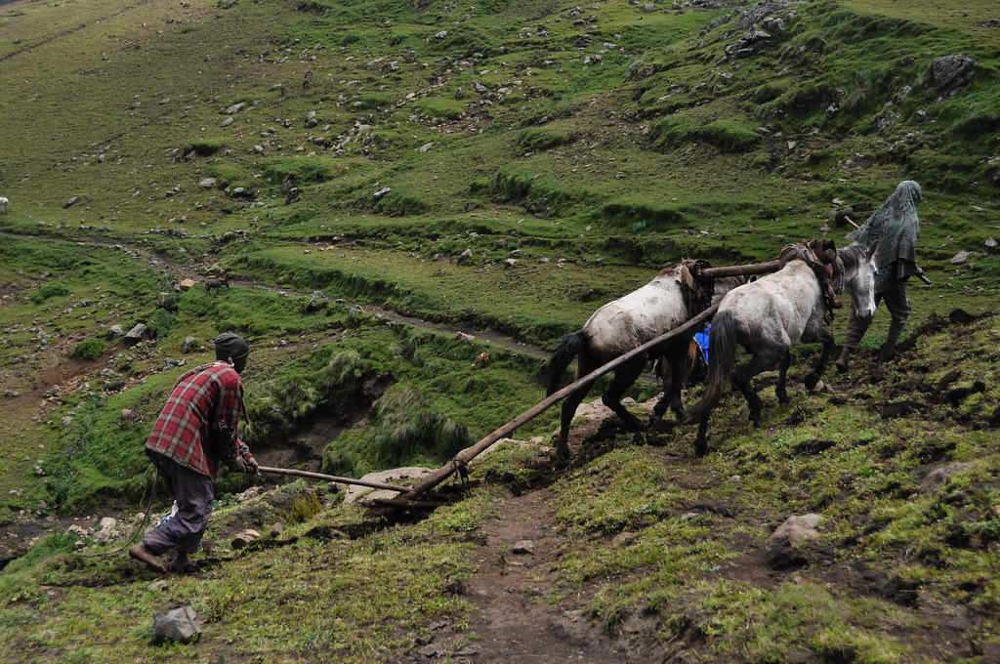
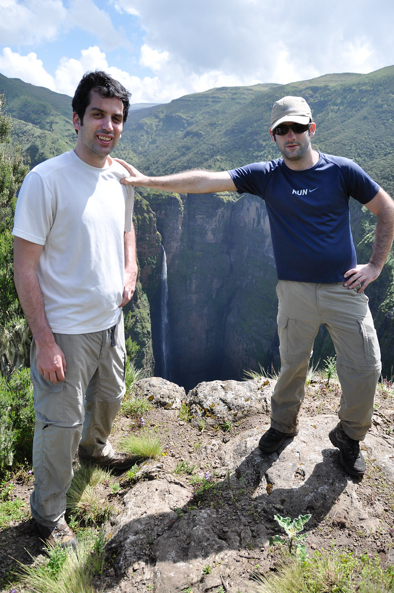
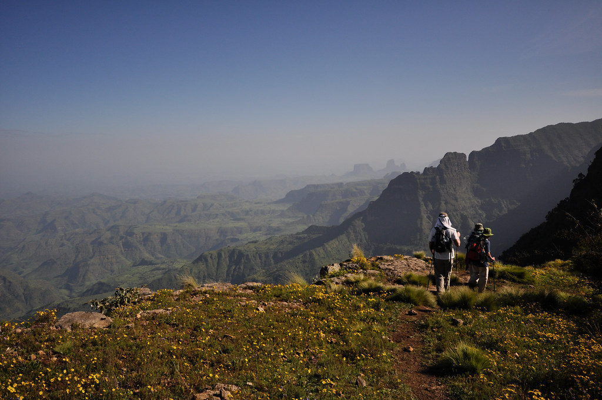
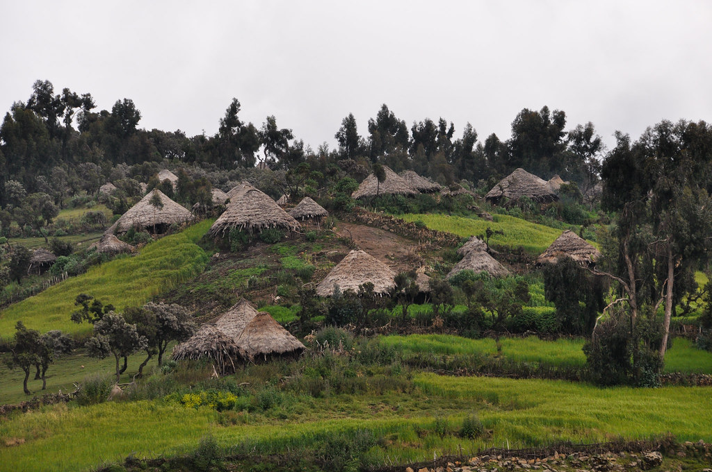
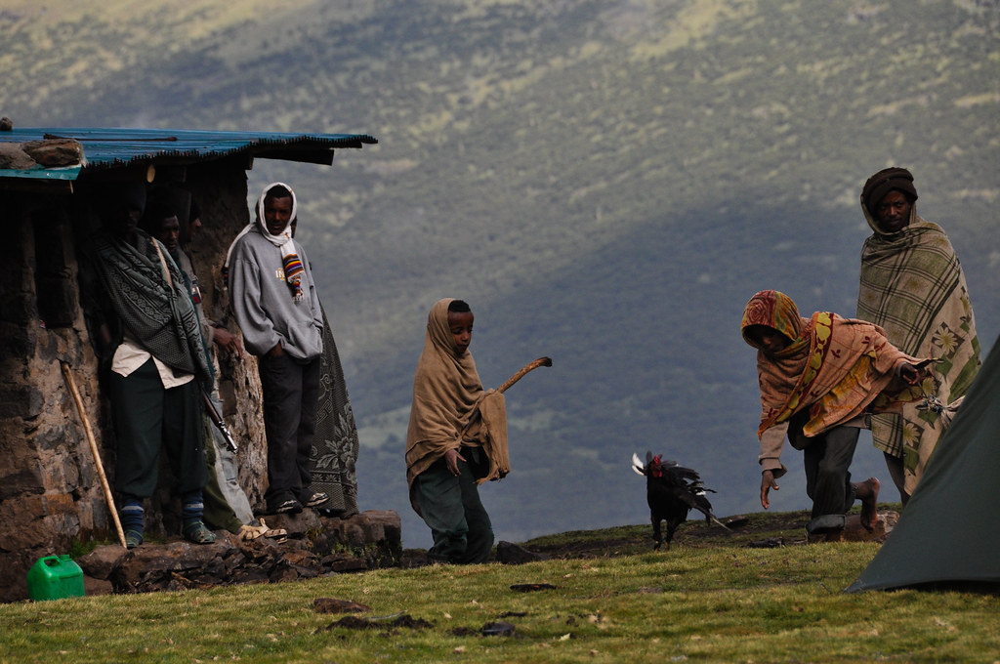
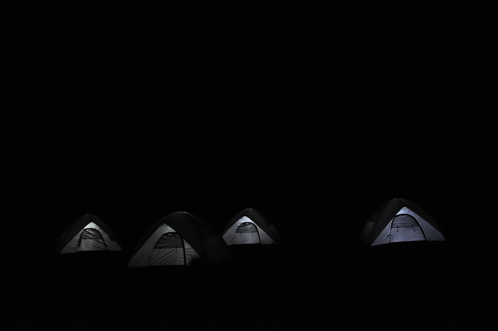

**27/09/2010 סאנקבר – גיצ’**

בוקר חדש ושמשי הגיע נושא עימו ריח מפנק של כפות רגליים עצומות. זהו יום ההליכה המלא הראשון שלנו – יצאנו מוקדם מוכנים להרפתקאות

היום החליף את נער החמורים שלנו אתיופי מבוגר שלא ממש הצלחתי להתחבב עליו. התגובה היחידה שהצלחתי לחלץ ממנו היא פרצוף “לא מרוצה” בכל פעם שליטפתי את החמור שלו…

המסלול עבר בשטחים חקלאיים אתיופיים המעובדים בעזרת ציוד חקלאי פרימיטיבי. ההרגשה היתה כאילו חזרנו אלף שנים אחורה בזמן.

עברנו במפל גבוה בשם ג’ימבר. הנופים בטרק בהחלט פראיים ובתוליים כפי שציפינו. בכל היום הזה לא ראינו נפש חיה. כלומר – חוץ מנפשות של חיות בר למיניהן.

לקראת ערב הגענו לכפר בשם גיצ’. בגיצ’ פגשנו את האנשים הלבנים היחידים שנראה בכל הטיול הזה – ה”חֶרְבַדִים”. ה”חרבדים” הם בעצם סוג של “גרמנים” שפיתחו מודעות ולכן הם “מבינים” כשאומרים בעברית “גרמנים” – ולכן יש לכנותם “חרבדים”.  החרבדים דיברו בינהם חרבדית שוטפת וניחנו בחוש הומור די מחורבד - למעשה מלבד חבדיותם אין לי ממש סיבה לספר עליהם…

המלווים שלנו קנו מהמקומיים ביצים וכמה תרנגולות והכינו לנו ארוחת ערב מלכותית. החברה המקומית איתה טיילנו הייתה מדהימה - הציוד היה מצויין והטבח הכין אוכל מעולה שהיה טרי יותר ממה שכנראה אי פעם נאכל. בכל ערב נקנו חיות שחיש מהר הפכו לארוחת ערב טעימה. האוהלים שהקימו עבורנו היו גדולים ומצויידים בפנסים – והמזרנים עבים ונוחים.

המשך יבוא…
