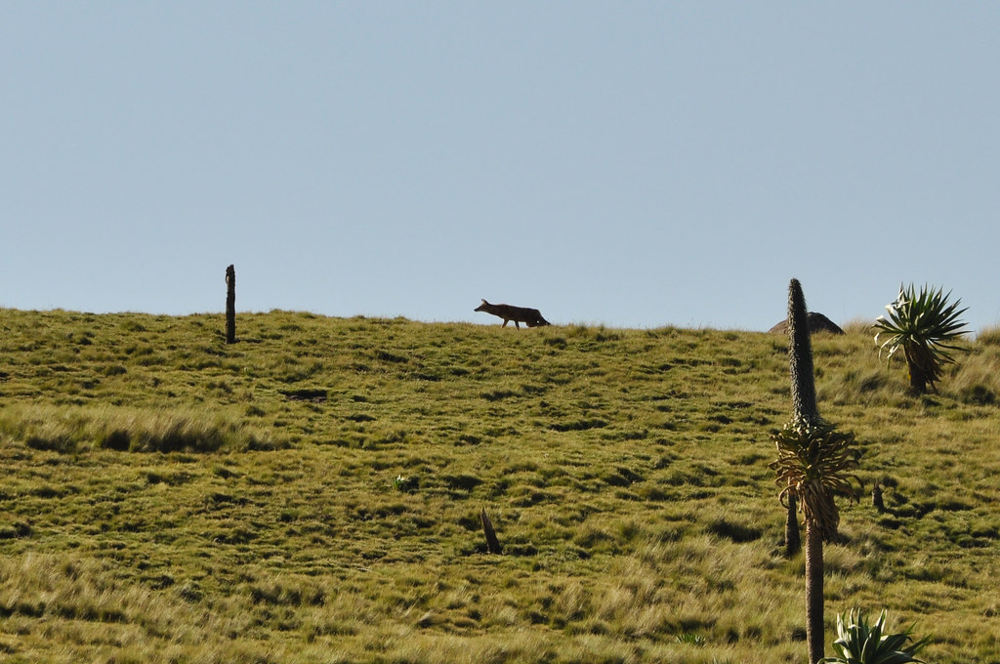
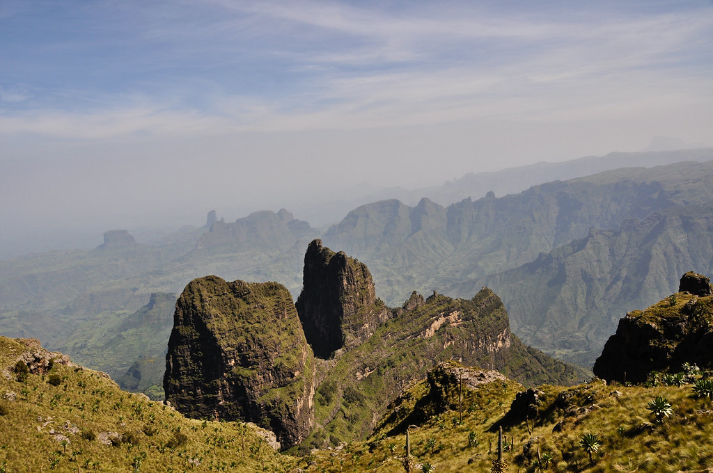
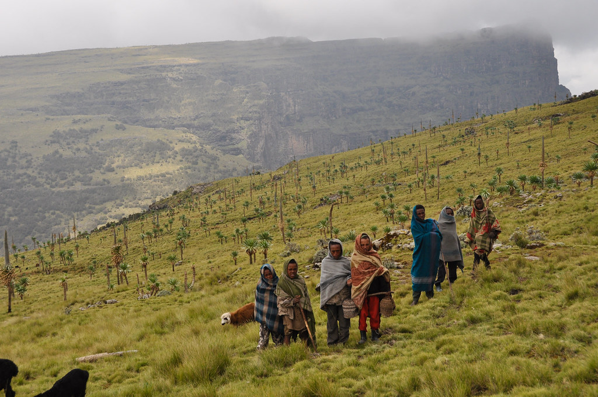
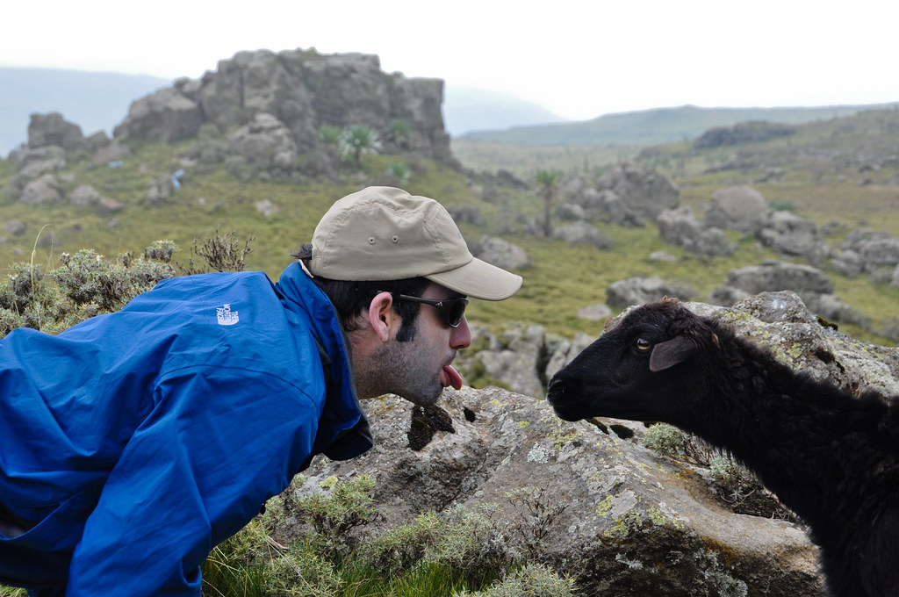
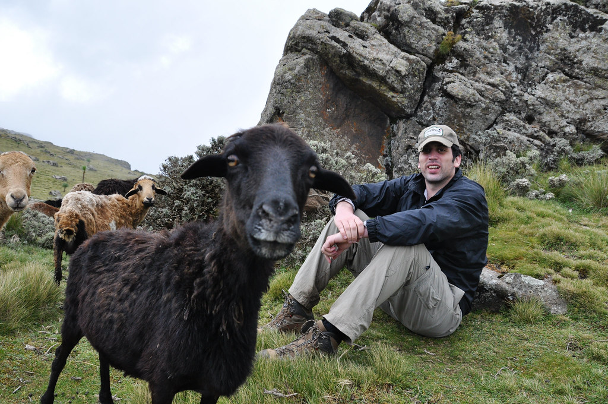
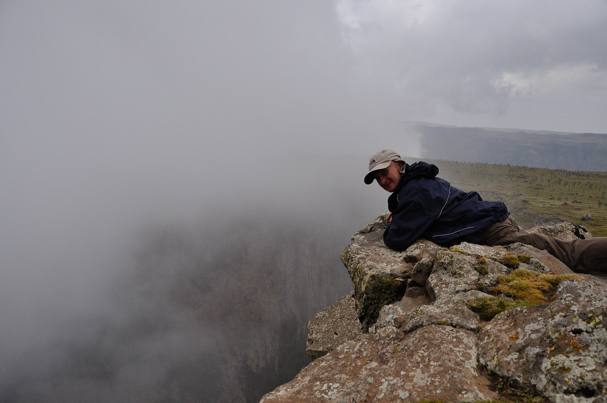
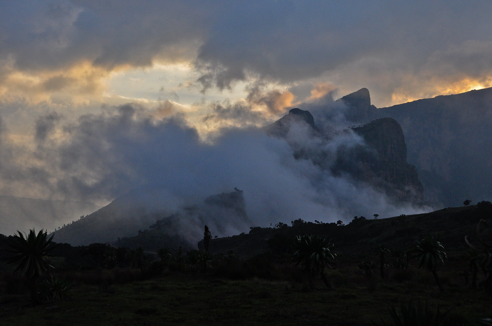
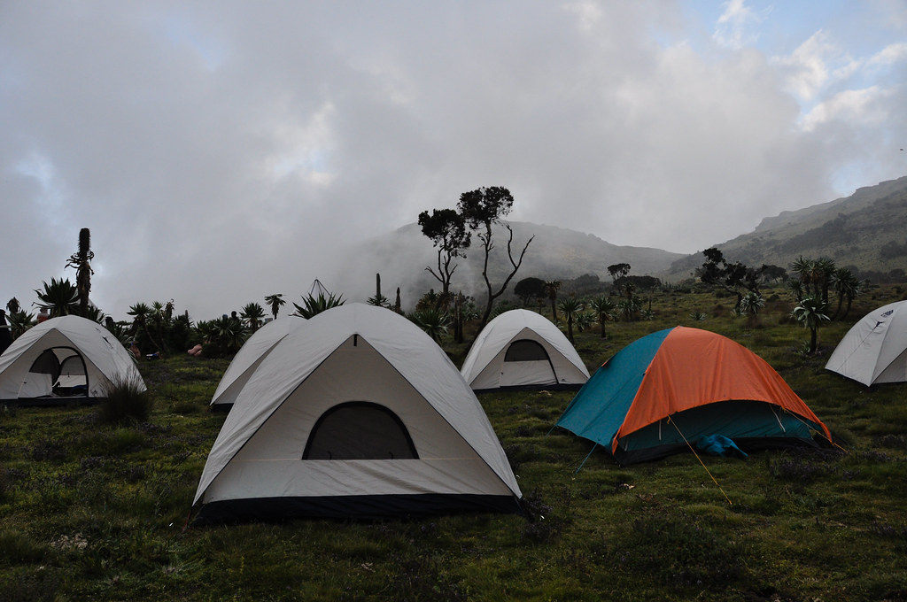

**28/09/2010 גיץ’ – צ’נק**

עוד יום בטבע הפראי של צפון אתיופיה. היום הנוף הזכיר את הנוף שיצא לי לראות באיזור הר קניה, עם צמחי הענק והפעילות הגעשית שיצרה הרים מהקרקע כאילו היתה פלסטלינה.

כבר אחרי חצי שעה התמזל מזלנו לראות חיה נדירה – שועל\\זאב סמיאן – חיה אדומה שהביולוגים עדיין לא החליטו אם היא שועל או זאב. בכל מקרה הבעיה תיפטר בקרוב מאד – זאת מפני ששועלי\\זאבי הסמיאן יעלמו מן העולם. את השועלזאב ניתן למצוא רק כאן בהרי הסמיאן ומעריכים שנשארו רק כ100 פרטים – שמהר מאד יכחדו…

בהמשך עברנו בנק’ ה”מפורסמת” ביותר בטרק – Imet Gogo (יש לבטא במלרע). נק’ תצפית יפיפיה שמשקיפה על האיזור כולו.

בדרכים פגשנו מידי פעם את “ילדי הסמיאן” ששמחו לקבל כל פסולת שרק נשליך לעברם…

בהפסקת הצהרים, גרום – המדריך המקומי עשה “קונצים” לילדים. הוא ביקש מהם לשיר – והקליט אותם בטלפון. הם נדהמו לשמוע את עצמם מוקלטים וביקשו עוד ועוד. תוצאת לואי של אותו שעשוע תמים של גרום - הוא שה”נעימה” הבאה המשיכה להתנגן לי בראש עד סוף הטיול…

*מקהלת “ילדי הסמיאן”*:


לא יודע למה זה הפתיע אותי אבל בניגוד למה שהייתי מצפה – היחס לבעלי החיים כאן באפריקה הוא די נוראי. מרביצים להם בעוצמה, קושרים אותם וכמובן זוללים אותם בתאווה. בכל ההפסקות למשל, בזמן שהוא לא הרביץ לפרד, קשר “נער החמורים” את ראשו של הפרד לרגלו – מה שהכריח אותו לאכול, לא איפשר לו לברוח – וגם כנראה כמעט תלש לו את הראש מהמקום...

כמו מידע פנימי בבורסה או סיגריות בכלא, באתיופיה ה”זהב הלח” הוא המגבונים הלחים – פיסה קטנה של ניקיון בעולם שכולו… אחר. אבל מה שבא בקלות הולך בקלות – ובאופן תאורטי – חיה פרימיטיבית שלא יודעת לכלכל את הצרכים שלה – עלולה לסיים לך את כל אספקת ה”זהב הלח” באקט אחד חסר אחריות.

בתצפית הבאה אליה הגענו, המזל כבר לא היה לצידנו וכל התהום היתה מכוסה בערפל כבד. מדי פעם התפזר לשניה הערפל ויכולנו לראות את הפיר העצום שלמרגלותינו.

עשינו היום דרך ארוכה. מאזור המאהל ניתן היה לראות שוב את Imet Gogo – מה שעזר להמחיש ויזואלית את המרחקים הגדולים אותם אנו גומעים  ברגל.

הקבוצה כבר התחילה להתגבש והערבים במאהל היו נחמדים. אחת הפעילויות הקבועות שלנו אחרי ארוחת הערב היה משחק טריויה משותף. היו בקבוצה אנשים שונים וכל אחד הביא איתו ידע אחר לחלוטין – מחשבים, ביולוגיה, גאוגרפיה, היסטוריה ומתמטיקה. אה.. ויש את ג’רלד שנולד בתק’ המפץ הגדול ומאז סופח לתוכו ידע בכמויות אדירות…כל אחד תרם משהו כשרק נושא הטיולים היה משותף לכולם.

המשך יבוא…