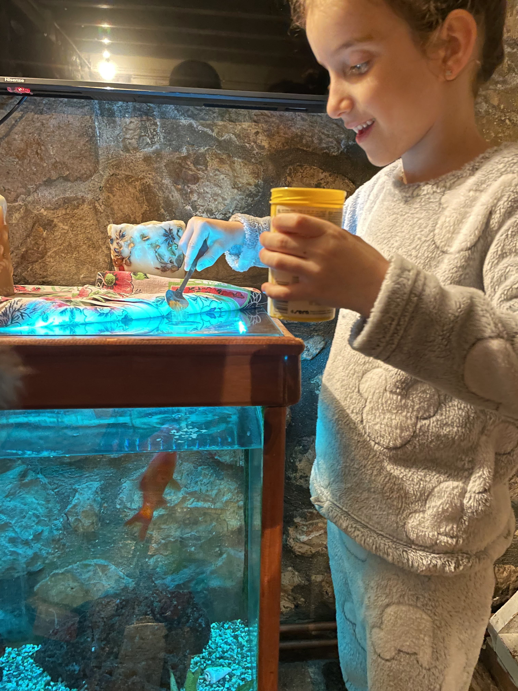

באוקטובר 2024 טיילנו בצפון יוון. לא כתבתי סיפור דרך בטיול המופלא על זה, ועל כך אני מתחרט, אבל החלטתי לפחות בדיעבד לצרף קצת תמונות מהטיול. אחרי שעמלנו והזמנו טיול באוגוסט השנה, הטיסות בוטלו בתקופת המתקפה מאירן ונאלצנו לבטל את כל הטיול ההוא. הזמנו בצורה ספונטאנית יותר את הטיול לצפון יוון ולא התחרטנו!

את החלק הראשון של הטיול העברנו באזור צומרקה. צומרקה הוא אזור הררי כפרי אותו רבים מתארים כ-״יוון כמו לפני תקופת התיירות ההמונית״. באזור היפה הזה גרים רק כ1000 תושבים המתחלקים בכפרים בודדים על פני שטח גדול והררי.

הנמלה מאד התלבטה לגבי מקום הלינה בצומרקה, שנראה קצת ״קריפי״ בתמונות, אבל אני מאד התעקשתי וההימור השתלם. גרנו בבית אבן מבודד שאת גילו קשה להעריך. הבקתה חלשה על חלקה גדולה מלאה בעצי פרי, והיתה בסיס חלומי לטיול שלנו בצומרקה. תומאס, בעל הבקתה מתפרנס מהשכרת הנכס ומטייל בזמנו החופשי, הוא עזר לנו בכל שאלה על יוון מוזרה ככל שתהיה. אחרי שדיברנו איתו ארוכות כל כל מיני שטויות, הוא חזר והביא לנו בקבוק ״ציפורו״ מקומי - סוג המשקה שליווה אותנו בטיול כולו. המשקה מזכיר גראפה איטלקי ומאד נהננו ממנו.

אם בית אבן עתיק לא מספיק כדי להשרות אווירה, בבקתה היו פזורים כל מיני חפצים עתיקים כולל כלי נגינה וספרים עתיקים ביוונית. פיט מצא שם את ה ״איליאדה״, ובתור חובב מיתולוגיה יוונית עיין בכל הרישומים של האלים.

שם מקום הלינה, אם מעוניינים לחפש: ״Marina's Stone Cottage״. תמונות אווירה מהבקתה של תומאס:

בימים בהם לא אכלנו במסעדות, בישלנו במטבח האבן המשונה שבבקתה. מדפי התבלינים היו מלאים צמחים מיובשים וכל מיני בקבוקונים שנראו עתיקים וחשודים. אחרי שבחנתי, ריחרחתי וטעמתי, בהיותי הסקרן וחסר האחריות שאני - רקחתי אורז בטעם עתיק מתוך הסיר העתיק. האורז עד היום נחשב ״האורז של החיים״, ונהוג להזכיר אותו במשפחה כדי לשפר את ההרגשה ברגעים קשים.

פרט להסתובבות בין הכפרים, טעימת מטעמים ועצירות קצרות בגשרים ומנזרים עתיקים, עשינו גם 3 מסלולי הליכה. מסלול אחד מהכפר סיראקו לקלאריטס - שביל רגלי עתיק שמחבר בין הכפרים. מסלול למפלים של קויאסה, ועוד מסלול מקסים למפל קפבלוביסו. כפי שהבטחתי, זה לא ״סיפור דרך״, אלא ״אלבום תמונות״, אז הנה רצף תמונות מהטיולים שלנו באזור צומרקה:

המסלולים היו יפיפיים ומזג האוויר היטיב איתנו גם בסוף העונה החמה. אחד הבונוסים בטיול ביוון, הוא האוכל. המחירים הנמוכים והאוכל האותנתי - וכמובן - הציפורו - פשוט תענוג. אחרי כל מסלול התפנקנו בעצירה לצזיקי ושאר מתאבנים יוונים. מבחינת בשר, יש פה הרבה כבשים ועיזים שנותנות גם חלב לגבינות וליוגורטים המקומיים - ללקק את האצבעות.

מכאן החבורה העליזה תמשיך לאזור כפרי זגוריה להמשך ההרפתקה ביוון...

