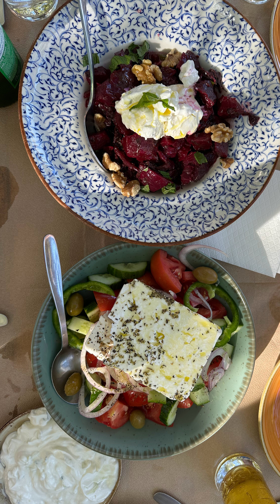

עזבנו את בקתת החלומות של תומאס, ונסענו צפונה לכיוון כפרי זגוריה. האזור מפורסם בכפרים העתיקים שבו ובטבע הפראי ששיאו בקניון ויקוס הגדול. בניגוד לצומרקה, האזור הרבה יותר מפותח תיירותית, אם כי עדיין, ואולי בגלל הביקור מחוץ לשיא עונת התיירות, הרגיש יחסית אותנטי.

בדרך עצרנו ביואנינה - בירת מחוז אפירוס בו אנחנו מטיילים. אחרי סיבוב קצר באזור העתיק ביצענו את אחת מארוחות הצהריים המוצדקות בטיול - מאז שנחתנו לא אכלנו גירוס, הילדים לא אכלו גירוס, לא הפסקתי לחפור לגלגל את המילה גירוס על שפתי המריירות עד שבאתי על סיפוקי.

 מדובר חד משמעית כמובן על שווארמה (או דונר קבב), אבל יש ניחוח יווני בלחם וביוגורט המתבל שנותן את
הלגיטימציה לקרוא לזה ״גירוס״

הבסיס לטיול באזור כפרי זגוריה היתה הדירה של שחורציאניטיס בכפר מונודנדרי. שחורציאניטיס לא היה זורם כמו תומאס (וגם לא קראו לו שחורציאניטיס), אבל לזכותו יזקף שבכל בוקר הוא הגיש לנו ארוחת בוקר שכללה כמעט תמיד ספנקופיטה שהוא אופה בעצמו. הדירה המפנקת בתוך הכפר העתיק היתה בית מושלם לימים הבאים.

בנוסף לטיולי היום, הזמנו גם ״קניונינג מפלים״ שללא ספק היה אחד משיאי הטיול. הנמלה, שידועה ביכולתה המוגבלת [לעופף]() ויתרה על התענוג ונותרנו רק חבורת ״הילדים שבלב״ להשתלשל מההר. המדריך המקומי היה מאד נחמד. ניכר שהאיזור תיירותי לפי כמות המילים בעברית שהוא ידע לירות לעברינו בדיוק ברגעים הנכונים. המדריך עובד במכבי האש המקומיים ומשתתף בחילוץ והצלה של מטפסי הרים - ובזמנו החופשי זורק ילדים ממפלים. הסיור היה מעולה, מפחיד בידיוק ברמה המתאימה ומתאים לילדים - אם הם לא פחדנים מידי. בחלק המפחיד יותר, עבור הילדים, המדריכים הפכו את החבלים לחבלי אומגה ופשוט השליכו אותם למטה ותפסו בקצה השני.

מכיוון שזה אלבום תמונות ולא ״סיפור דרך״, אכתוב רק שעשינו מספר מסלולי הליכה יפים באזור בינהם: ״מסלול עידן הקרח״, מדרגות ורדטו וגבי המים של רוגובו. המסלולים בטבע בדומה למסלולים אחרים באירופה מגוונים ומרהיבים. מזג האוויר המשיך לרחם עלינו והצלחנו לטייל בכל המקומות שרצינו. חלק מהטיפוסים לא פשוטים, ובסיום מסלול אחד, אלכס התאמצה כל כך, עד שבקצה המצח שלה התנקזה טיפה של ״מיץ מתוקיות״ מרוכז. תמונות ממסלולי ההליכה והביקורים בגשרים עתיקים:

מבחינת המטבח המקומי, בדיוק כמו באיזור צומרקה - מסעדות זולות, סלט יווני, ספנקופיטה וציזיקי משובחים המשיכו לככב בתפריט. מסעדות ראויות לציון: מסעדת Froso's Pies אליה חזרנו בשני ערבים וזללנו ממבחר הפשטידות המשובחות שלהם. ומסעדת  Kanela & Garyfallo - מסעדה שמתהדרת במנות הפיטריות המקומיות שלה - אפילו קינוח פטריות היה משובח (צריך להזמין מקום מראש)

מכאן נמשיך לאתונה דרך המנזרים של מטאורה ונסיים את הטיול בצפון יוון.
