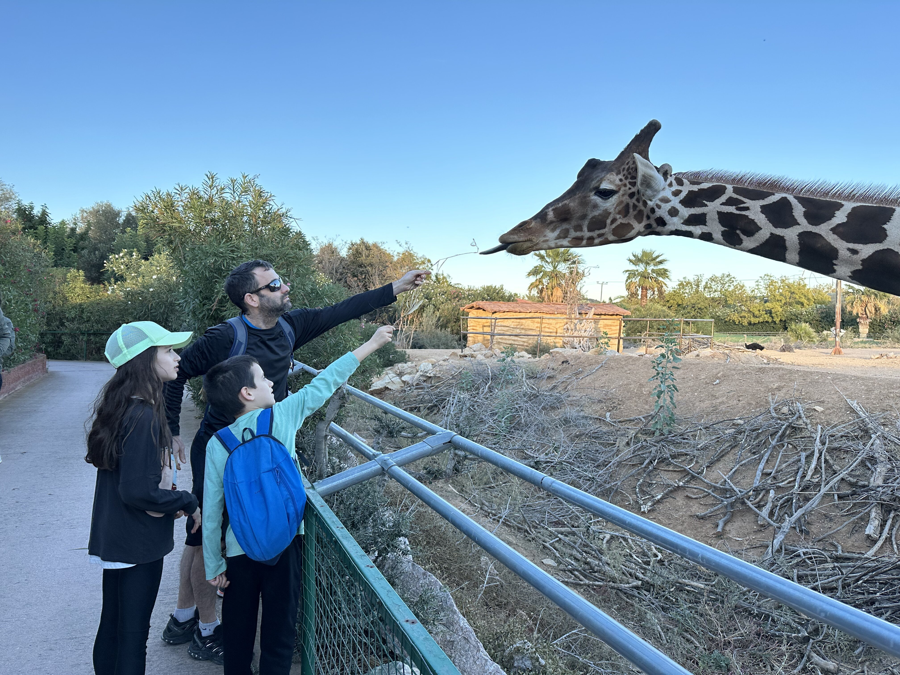

מאזור זגוריה נסענו בחזרה לאתונה, בדרך עצרנו להתרשם מהמנזרים ה״תלויים״ של מטאורה. המנזרים הם אחד מהאתרים המפורסמים ביוון ובצדק רב - מנזרים שהוקמו על ראשי הרים תלולים במיוחד - ממש נראים כמו מתוך סרט פנטזיה. אל חלק מהמנזרים אפשר היה בעבר לעלות רק עם סל שקשור בחבל אותו מושך נזיר אדוק. היום בחלקם יש מדרגות ואפילו רכבל לתיירים. אנחנו ויתרנו על האטרקציות ורק הסתובבנו להתרשם מהנוף.

משם התמקמנו באתונה לסיום עירוני קצר להרפתקה שלנו ביוון. מרשים במיוחד היה הביקור באקרופוליס. אמנם זה סיור עתיקות, אבל גם הילדים מאד התרשמו. המיקום של האקרופוליס הצופה על הנוף והמבנים המרשימים עושים את העבודה.

הספקנו גם לבקר בגן החיות של אתונה בו כיכבו עיזים טיפשות באופן מיוחד בפינת הליטוף.

באתונה עצמה נהנינו להסתובב במרכז, לקנות מזכרות, לאכול קבב מושלם במסעדה במרכז ולבקר באתרים המרכזיים של העיר. באחת הקנסיות היה איזה בישופ קדוש שאנשים חיכו בתור כדי לנשק לו את הידיים ולקבל לחם קדוש. כמובן שהתקדשתי לאורו ונתתי לילדים לחם חינם וברכה קדושה לחיים טובים! אחד המראות שהיו משונים במיוחד לילדים היא כמות המזכרות בצורת בולבולים שנמכרו בכל מקום. יוונים עם הבחירות האופניות שלהם.. לך תבין.. זהו נפרדנו מיוון, נקנח בתמונות אחרונות מאתונה:

