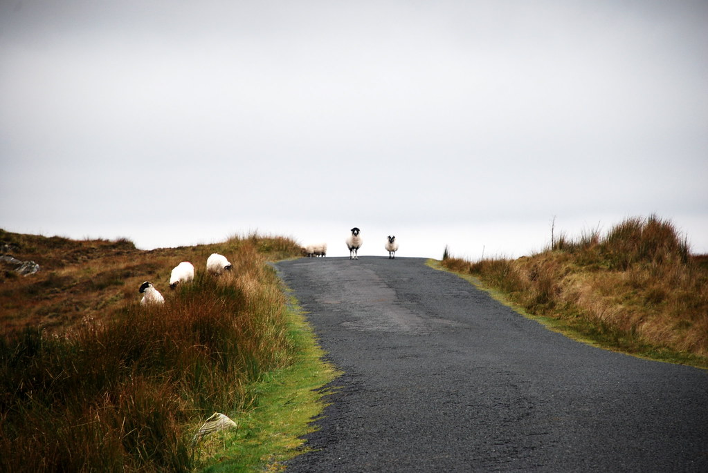
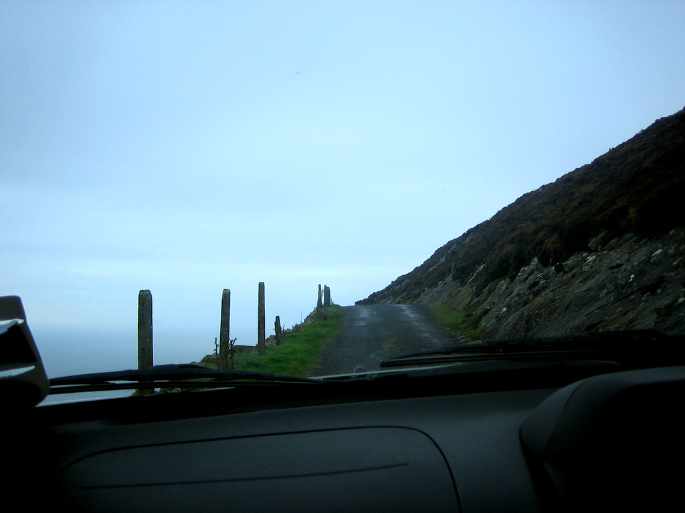
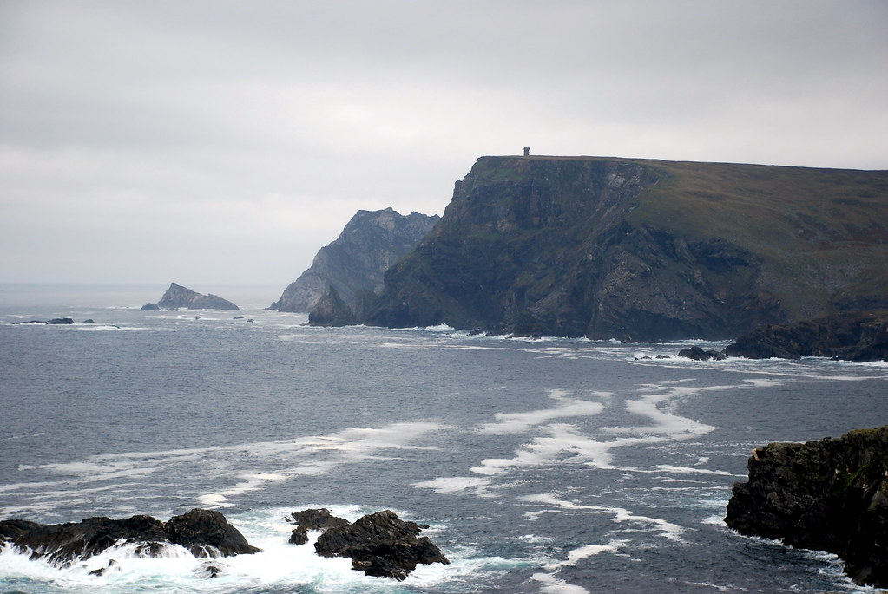
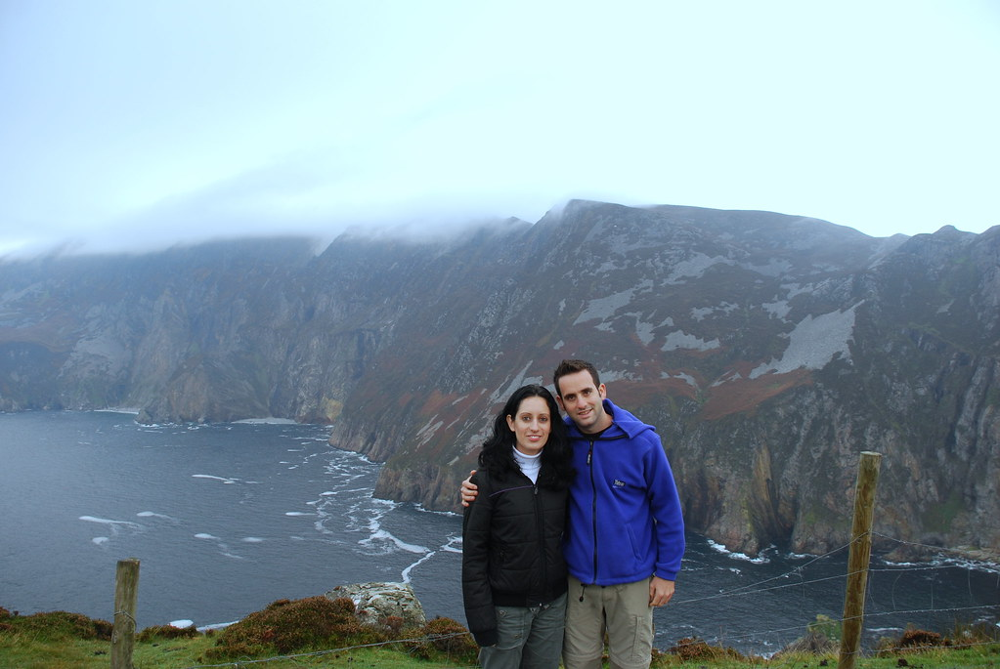
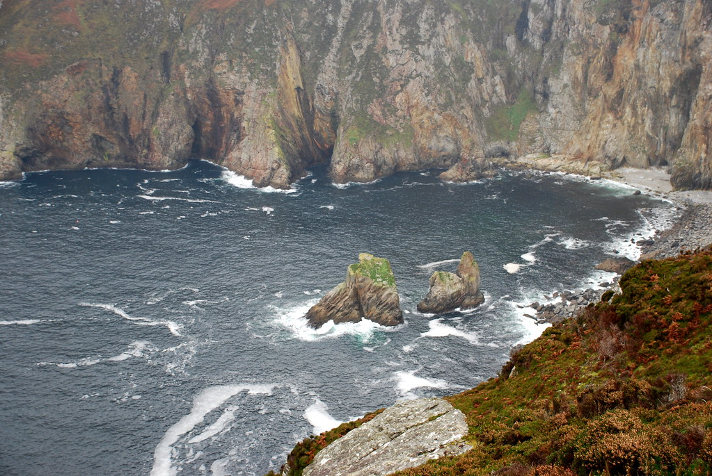
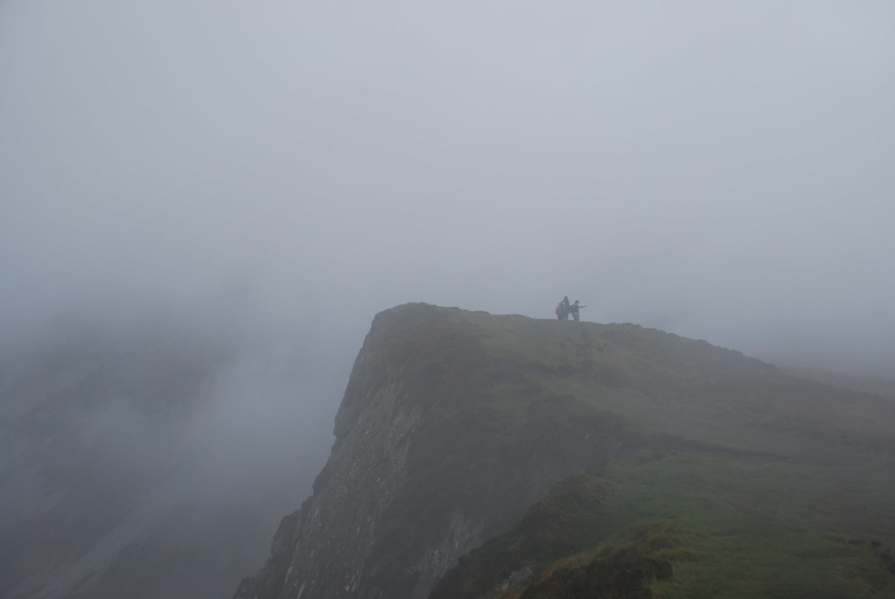
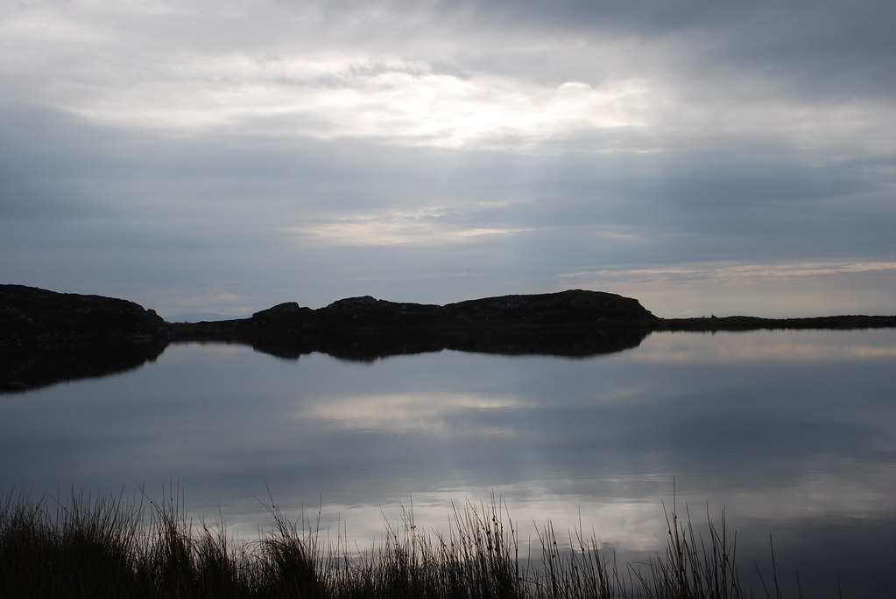
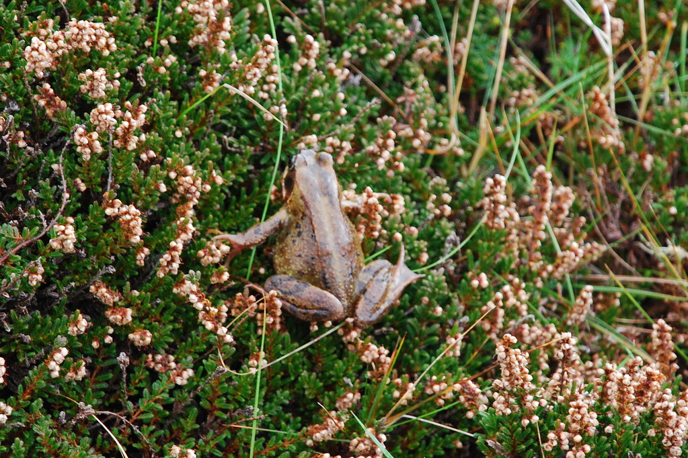

**6/10/2007 Donegal County**

היום נטייל בDonegal County.  
התעוררנו בבוקר לצלילי מוזיקה קלאסית בכפר הנידח Grange. בעלת הבית התרגשה כי זאת הפעם הראשונה שיוצא לה לפגוש אנשים מישראל, למרות שלדעתי היא שמחה לראות סוף סוף אנשים – ולא משנה ממש מאיפה…  
היא ניצלה את החברה שלנו זה כדי לשתף אותנו בקשיי היום יום שלה, במיוחד לגבי משימות טיפוח הגינה.

יצאנו לכיוון [Slieve League](http://en.wikipedia.org/wiki/Slieve_League) שמפורסם בצוקים מרהיבים ובנסיעה המפחידה בדרך אליהם.  
חשבנו שהכבישים הצרים בהם נסענו באיזור Ring of Kerry הכינו אותנו לחוויה, אבל גילינו שיאים חדשים :)  
ה”כביש” היה בעצם שביל שמתאים לאופניים, כשבצד אחד הר, ובצד השני תהום בגובה עצום מעל הים. מיותר לציין כמובן, שאותו כביש נועד להיות דו סיטרי!

הצוקים היו עצומים ופראיים. עצם העובדה שלא קל להגיע לכאן, הופכת את המקום לפחות מתוייר, ויותר אמיתי – אין שבילים מסומנים וכמעט שאין גם אנשים…  
בדרך לSlieve League יצא לנו לעבור בכפרים מהיותר נידחים שראינו. מצד שני כל בית מתפרש פה על שטח עצום.  
בכפר Carrick, כמעט בכל בית יש טרמפולינה ענקית. סביר מאד שהכפר הוקם סביב מפעל לייצור טרמפולינות בו עובדים כל האבות.  
בחצרות רבים ראינו גם מגרשי כדורגל לילדים, מה שבכלל הוציא את העיניים!  
עזבנו את הרכב והמשכנו לטפס ברגל.

בהמשך הטיפוס לנקודות תצפית גבוהות יותר על הצוקים היתה עננות שלא ממש איפשרה לראות את הצוקים. יכולנו רק לראות את סף התהום שמסמן את המוות לכל מי שיעז להתקרב

בדרך חזרה עשינו עיקוף כדי להגיע לאגם קסום שהיה שם רק בשבילינו.  
היה אפשר לומר שהמקום רומנטי למדי אם לא היו שם קרפדות עצומות שמקפצות סביבו – או לחילופין שהנמלה לא היתה מתייחסת לקרפדות המקפצות :)

משם נסענו לכיוון Ardara כדי לעבור בGlengesh pass שבLonely planet כל כך התלהבו ממנו. הpass היה כ”כ סתמי עד כדי שעברנו אותו מבלי לשים לב, ואפילו לא הטרחנו את עצמנו כדי לחזור..

את היום סיימנו בLetterkenny. מצאנו B&amp;B מגניב שהמקלחת בחדר היתה מוחבאת בתוך הארון! או שהקונסטרוקציה שימשה כדי להחביא את אנה פרנק, או שמדובר בנסיון התחמקות מאיזשהו סעיף מיסוי דרקוני הנוגע למקלחות…

מה שמיוחד בLetterkenny ומחוז Donegal בכלל, הוא שתושבי האיזור כולו נפלו קורבן לאורתודנט פסיכופט, שעיוות להם את הלסת באופן בו הם לא יכולים לבטא את האות t. מה שהופך בין היתר את Letterkenny ל Lesherkenny ואת המילה water ל washer :)

מממ… meatballs ב subway ולישון.. נתראה מחר!
