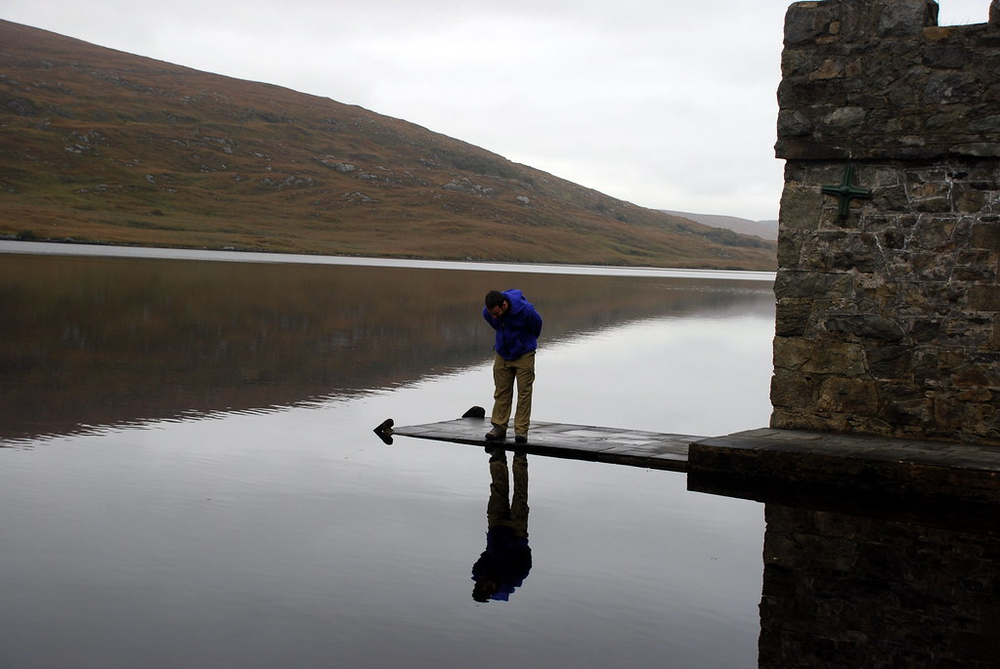
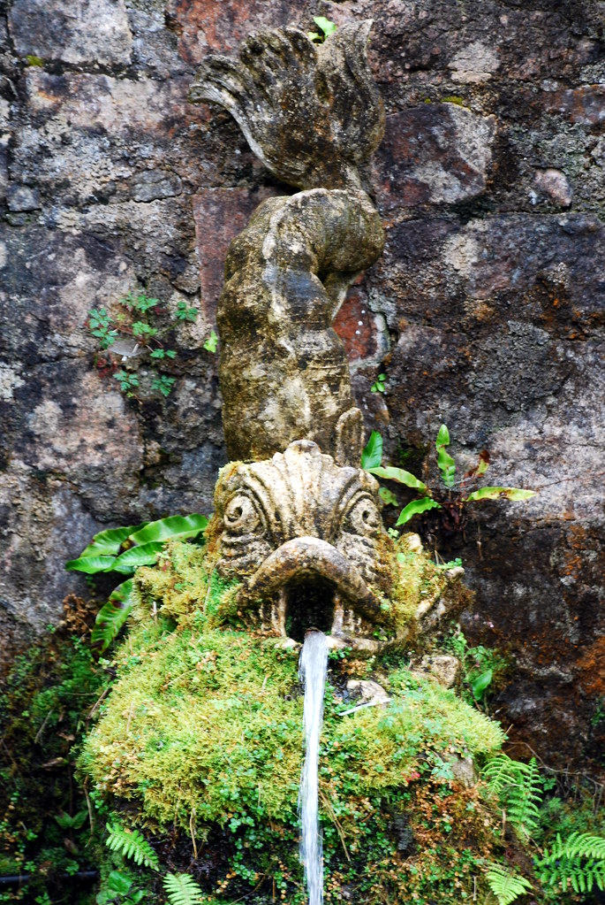
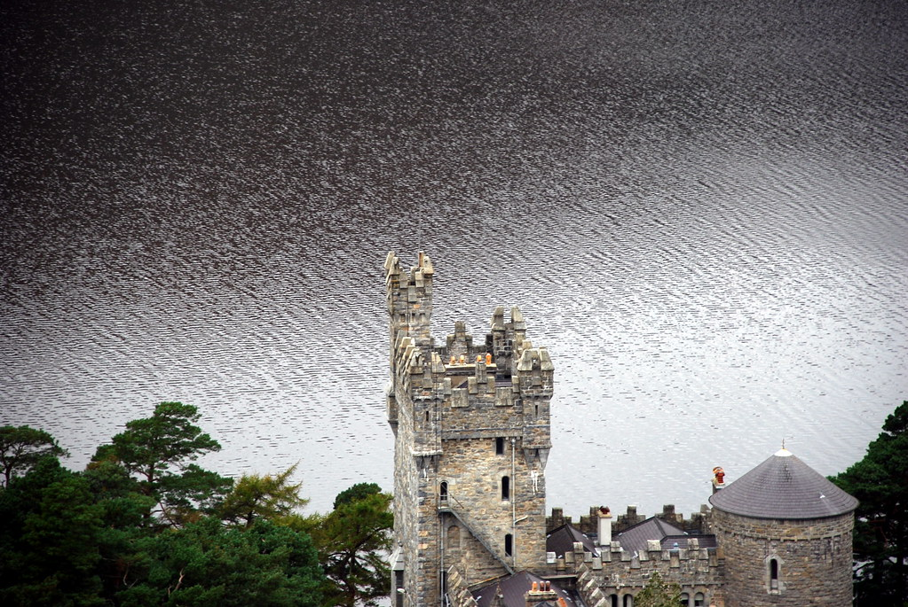
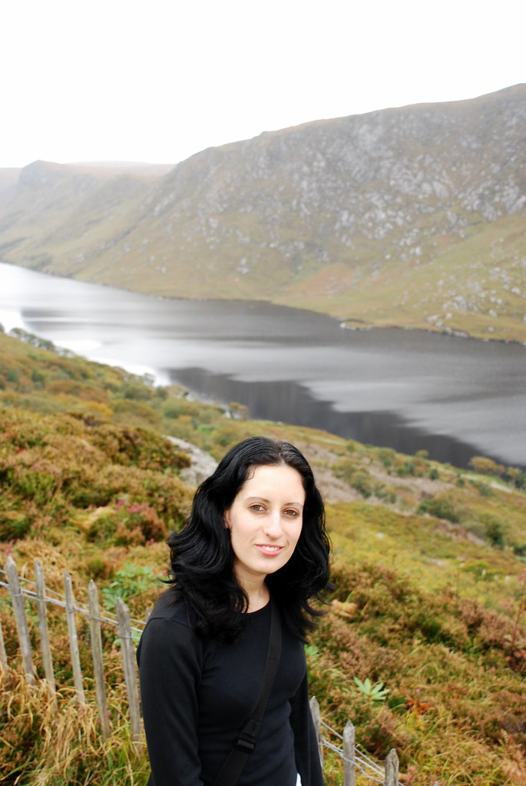
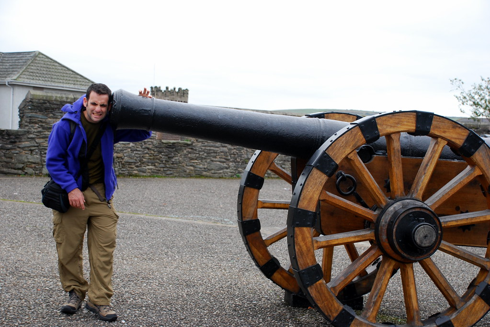
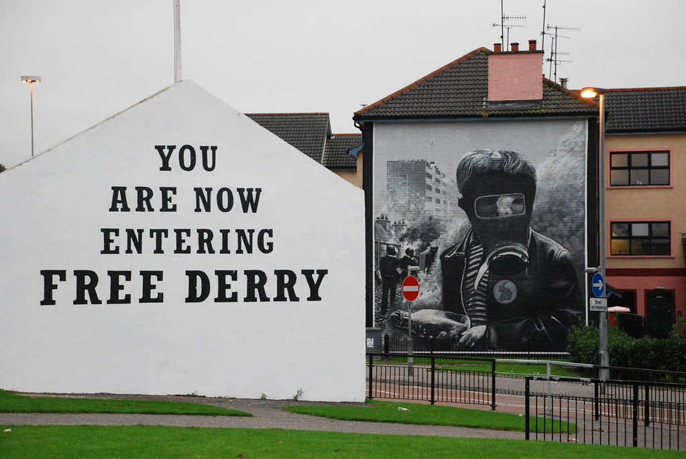
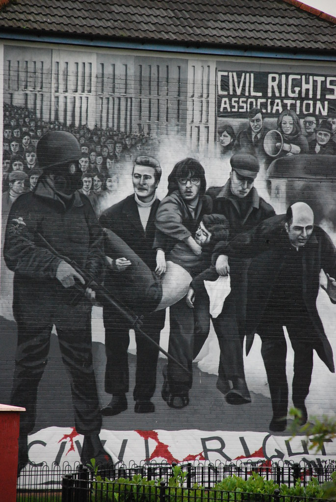
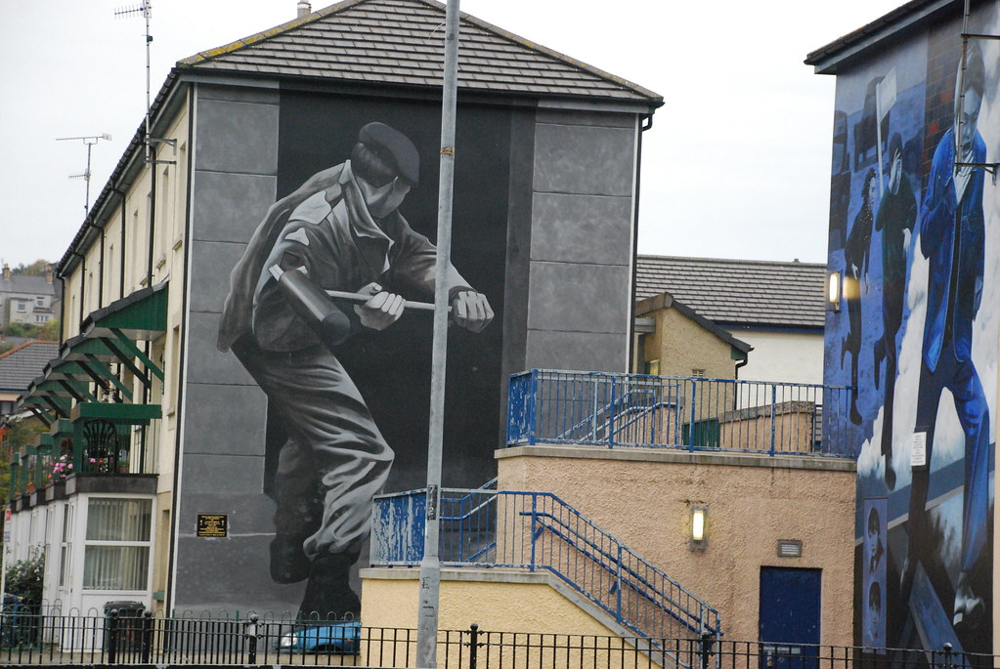
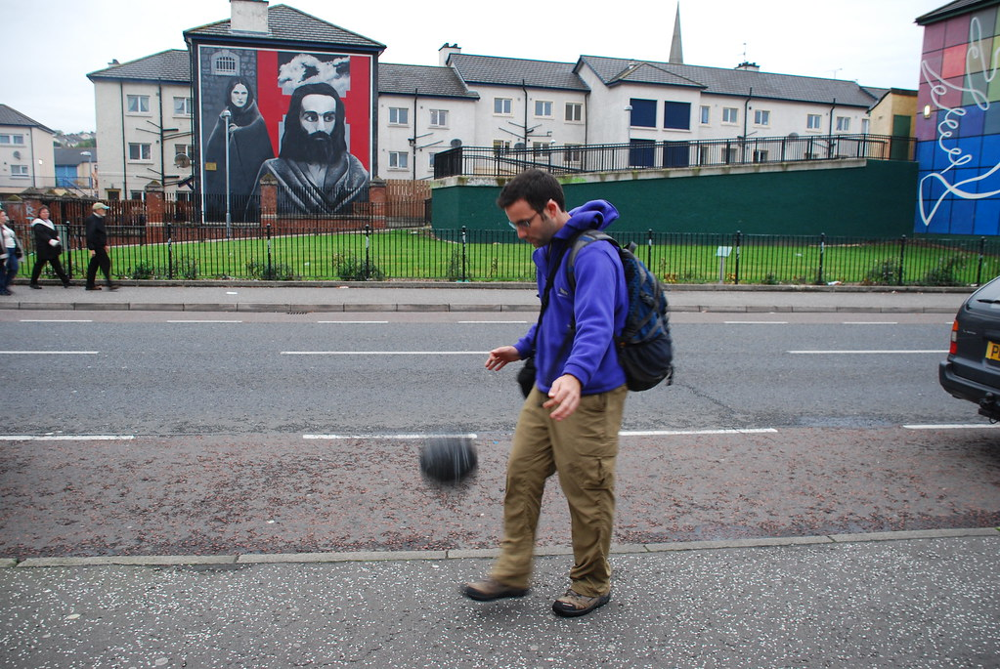
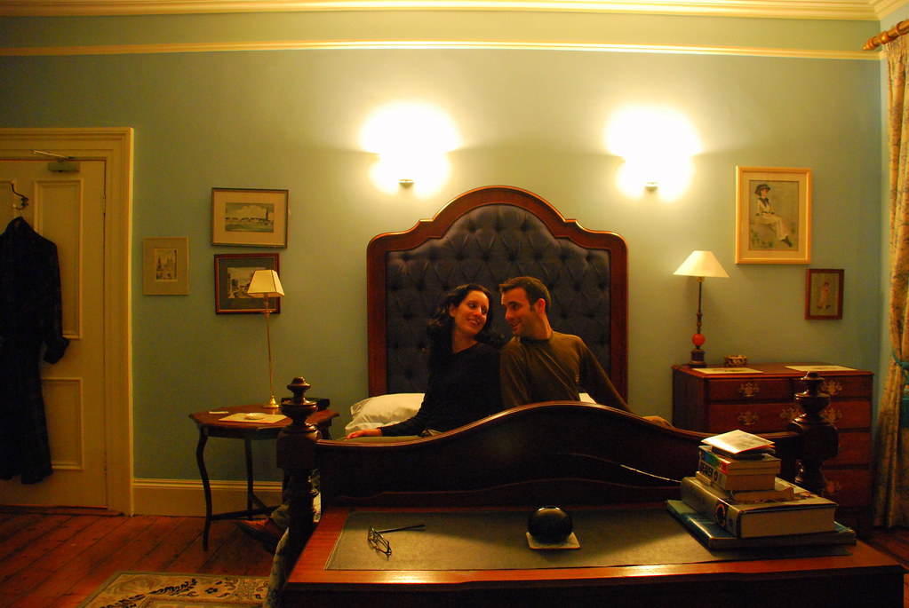

**07/10/2007 - לונדון(דרי) לא מחכה לי**

התעוררנו בבוקר ב ל”שרקני”. בעלת הבית שאתמול היתה מאד נחמדה, נשארה מאד נחמדה - אך גם נוסף לה מימד לא מבוטל של מוזרות.  
זה התחיל בזה שהיא התעקשה שכבר שילמנו לה אתמול והיה צורך להתווכח איתה שלא, והמשיך כשעברנו ליד המטבח בו חזינו בתמונה עצומה של האפיפיור שהיתה מונחת על השיש, והפכה את המטבח למקדש קטן.  
בבית הסתובבו אנשים עם מבטים של זומבים שלא הוציאו שום הגה, והכי גרוע - בעלה, שנראה שם עוד הכי נורמלי, הסתובב עם לכלוך ענקי בצד הפה והיא לא אמרה לו על זה כלום!

את היום נתחיל ב Glenveagh National Park, אך לא אמשיך בסיפור לפני שאחנוך את פינת “האירים משוגעים על…”:

- האירים משוגעים על להוסיף gh בסוף שמות של מקומות
- האירים משוגעים על subway (חנות הנקניקים – לא רכבת תחתית..)
- האירים משוגעים ממש על כיכרות! כמעט בכל הזדמנות, גם אם אין בכלל פיצולים הם תוקעים כיכר. גם באוטוסטרדה של 5 נתיבים הם תוקעים כיכרות ע-צ-ו-מ-ו-ת ומיותרות!
- האירים משוגעים על - לגור לצד כביש ראשי באמצע שומקום. פתאום מאמצע כביש יחסית ראשי, יש כניסה לחניה של בית בעל שטח עצום – בלי שם של רחוב, מספר או שילוט. אם רוצים לשלוח לבית כזה דואר, צריך לכתוב לדוור משהו כמו: סע בכביש הראשי, הבית ה 6 מצד ימין… בבתים מהסוג הזה שממוקמים בCarrick יש בחצר טרמפולינה ענקית.
- האירים משוגעים על טרמפולינות!

נכנסנו לפארק הלאומי באמצעות shuttle שלקח אותנו לאיזור בו מתחילות ההליכות רק כדי לגלות נקודה נוספת:

- יש אירים שהבית שלהם תקוע באמצע national park!

הפארק היה נחמד. אגם צלול ושקט, טירה מרשימה וגנים סבירים.  
טיילנו בטירה “בקטנה” והסתפקנו במסלול קצר יחסית למפל המים של הפארק.

משם טיפסנו לנקודת תצפית יפה עם חבורת אירים עליזים.

התחברנו קצת עם האירים, וגילינו שאחת מהם גרה בDerry - שהיא היעד הבא שלנו. היא היתה מאד נחמדה, המליצה לנו על מקומות לינה ואפילו ציירה לנו מפה שבדיעבד הצילה אותנו כשגילינו שהרחובות בDerry לא כל כך משולטים…

נסענו לכיוון Derry או Londonderry. האירים קוראים לעיר Derry והבריטים Londonderry. מדובר במשחק ילדותי ומטופש. אם נשווה את זה לישראל, זה כמו שהפלסטינאים יקראו לירושלים עזהירושלים…

מיד שמים לב שעוברים את הגבול. הבריטים המרגיזים מודדים מרחקים במיילים, ואת הבתים שלהם הם בונים מלבנים חומות ומכוערות. המטבע שלהם הוא פאונד למרות שאכנה אותו מרגע זה שילינג בלי שום סיבה הגיונית.

דרי היא סוג של עזה. אנשים מפוקפקים, בלאגן, ואוירה כללית של נזק. מצד שני באנו לדרי בשביל לקבל את האוירה הזאת ולשמוע קצת סיפורים, אז למה בעצם אני מתלונן?!

הלכנו לB&amp;B עליו המליצה האירית מההר. פתחה לנו את הדלת אישה מטורללת עם מבטא אנגלי ושיניים עוד יותר אנגליות בעקימותן. מבלי שנבקש קיבלנו ממנה סקירה על “המצב” בצפון אירלנד – איך היא שמחה שאחרי 30 שנה ו4000 הרוגים הגיעו למצב סביר, ואיך זה יפה שהגענו מישראל. היא סיפרה שיצאה משלחת של בריטים ואירים לישראל לספר לנו ולפלסטינאים איך הצליחו “לעשות את זה” כאן…

יצאנו לסיבוב “סביב חומות דרי”. החומה לא ממש מעניינת, אבל הסיור לא ארוך מידי, כך שזה היה נחמד. היה נחמד בbog side – איזור בו נהגו לרסס כתובות נגד המשטר הבריטי. היום מאפשרים לאומנים לשחזר כתובות וציורים מאותן תקופות כך שהאיזור צבעוני ויפה.

עברנו גם במקום בו התרחש האירוע הידוע לשמצה שזכה לכינוי [Bloody Sunday](http://en.wikipedia.org/wiki/Bloody_Sunday_%281972%29), בו חיילים בריטים מרושעים ירו במפגינים אירים תמימים שרק רצו לקנות בובות בארבי לחברות שלהם.

למרות שאני חוטא פעמים רבות בגוזמאות, כאן באמת יש אוירה לא כל כך סימפטית, ובערב חיפשנו פאב עם אוכלוסיה פחות אותנטית. בסוף מצאנו פאב רגוע יחסית. הגינס היא אותה גינס (רק יקרה יותר בשילינג אחד).

ראינו עם כמה מקומיים משחק רוגבי בין ארגנטינה לסקוטלנד מאליפות העולם שמתקיימת בתקופה זו. היה מעניין לראות ספורט אחר ולנסות להתחבר. בגדול זה סתם ספורט ברבארי ודפוק, אבל יש לו את הרגעים המגניבים שלו…

חזרנו לB&amp;B שלנו עם בעלת הבית המטורללת. החדר היה החדר היפה והגדול ביותר שהיה לנו בטיול. שוב המקלחות מחוץ לחדר, למרות שבחדר יש כיור גדול ומפואר. בחדר היה גם אח, ונברשת עתיקה ומגניבה!

המשך יבוא…
