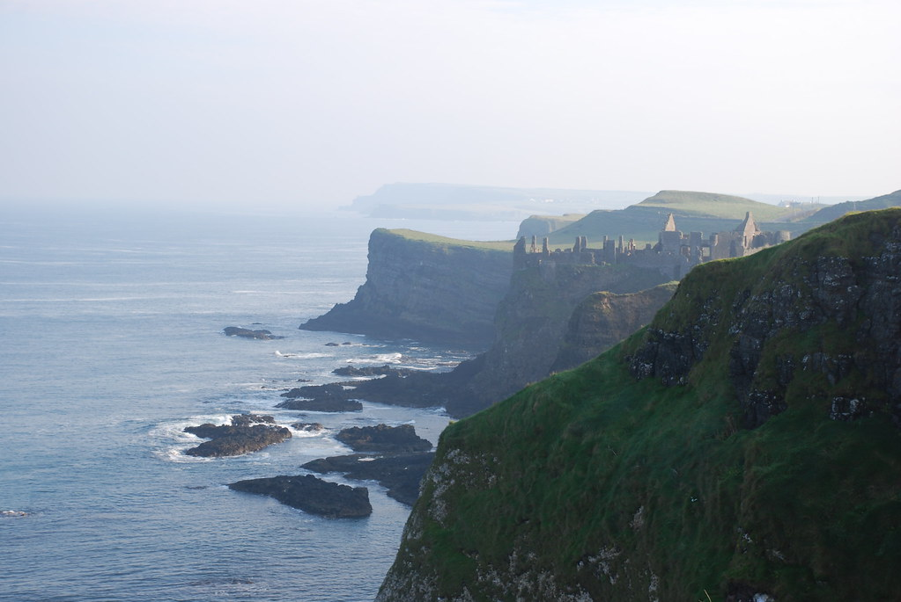
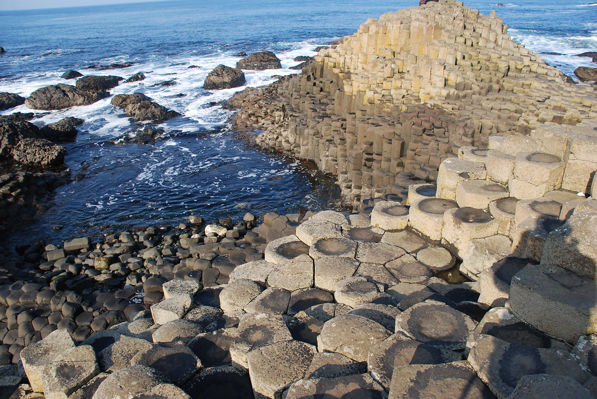
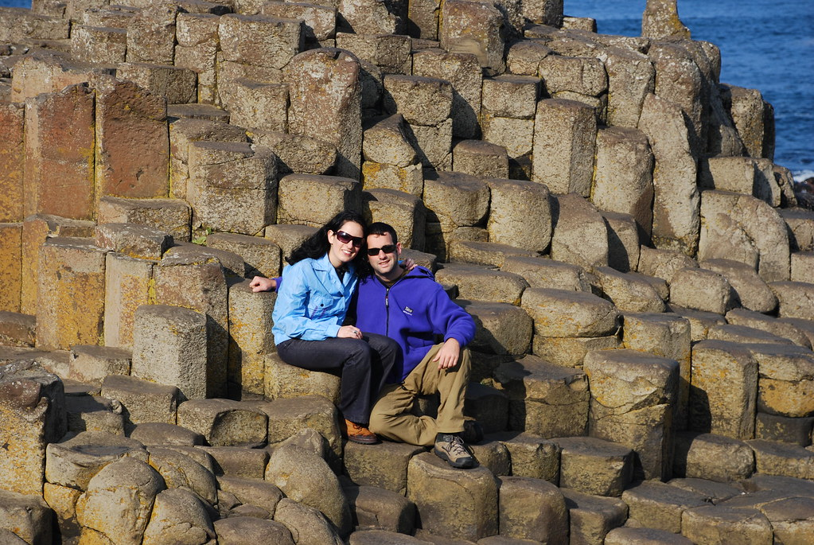
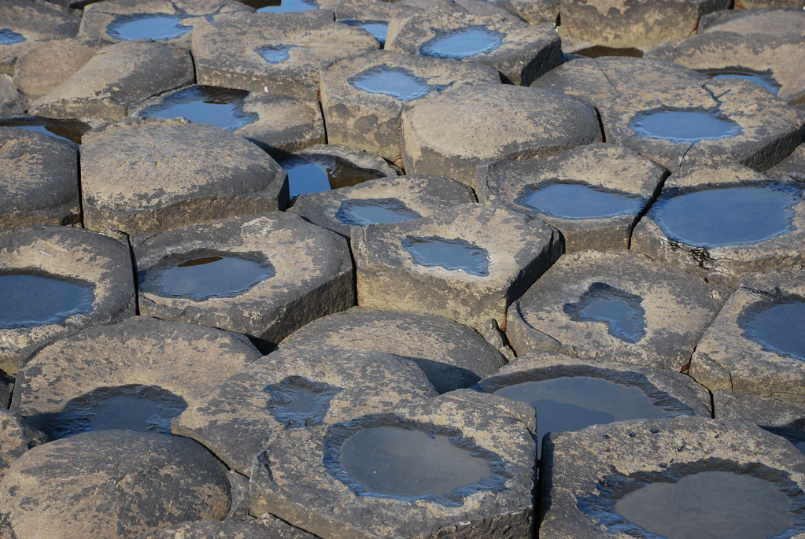
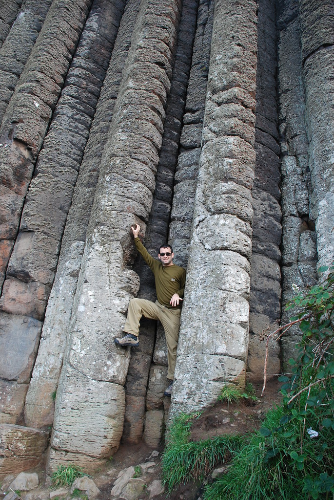
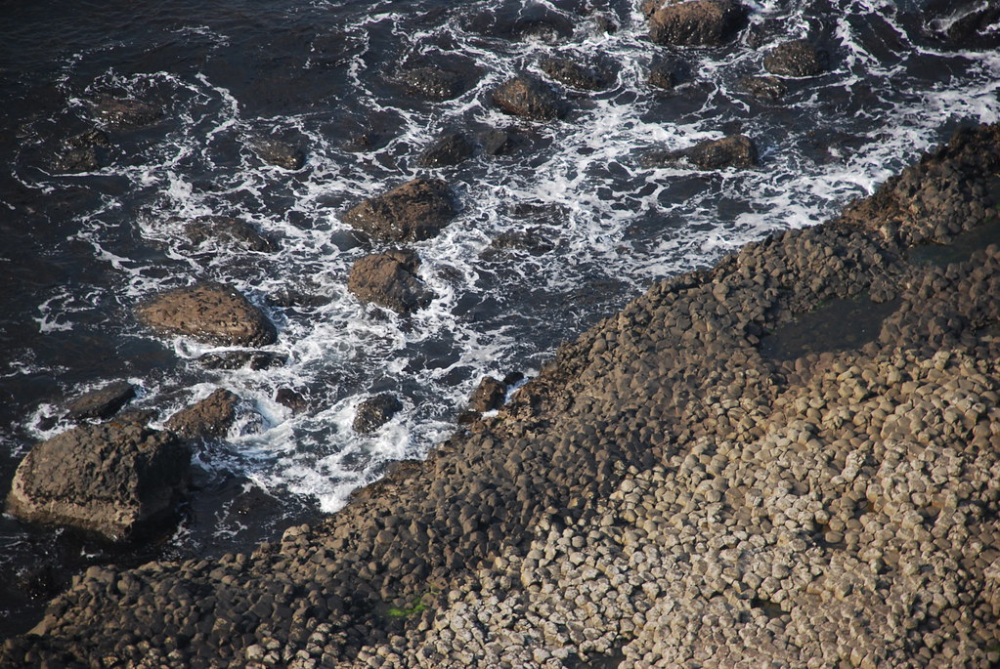
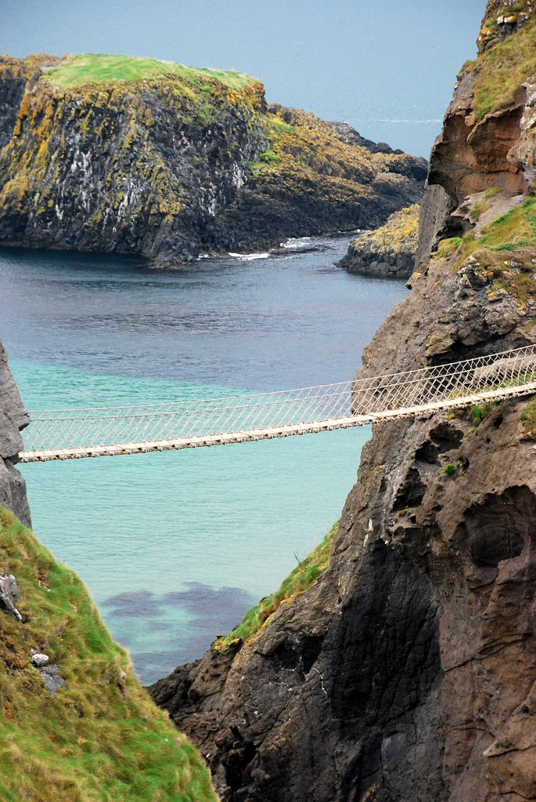
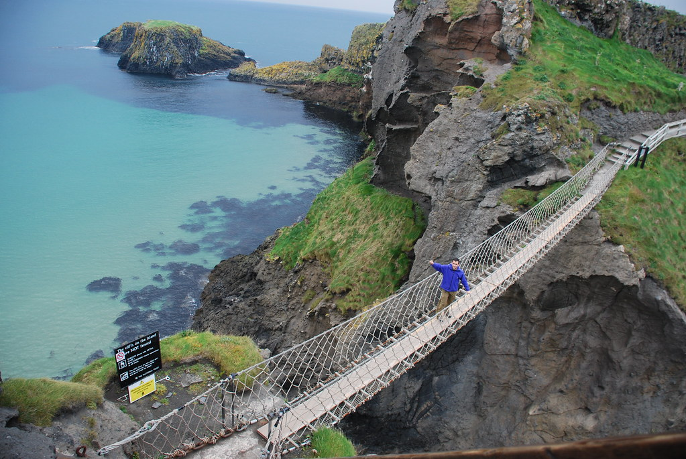
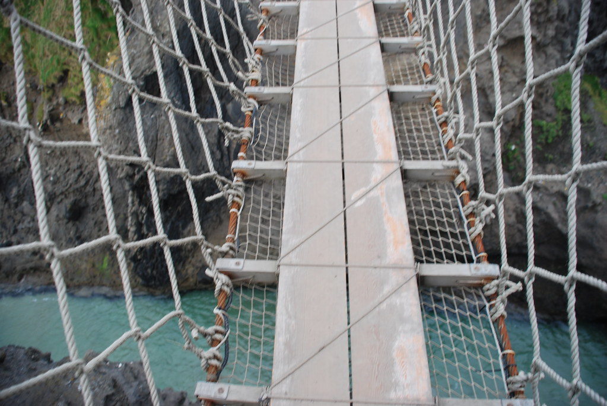

אחרי כמה פציעות, תק’ מבחנים קצרצרה, ודברים יותר מעניינים לעשות, אני חוזרים לפרוייקט הסבת יומני הטיולים למדיה הדיגיטלית לה הם ראויים.

**08/10/2007 – מיששת משושה לא מיששת**

התעוררנו בDerry בB&amp;B ההזוי עם בעלת הבית המטורללת, והשתתפנו בארוחת בוקר בינלאומית נחמדה. היה זוג מסידני שסיפר לנו איך אתמול בערב הם הלכו לפאב בו היתה הופעה חיה – הם סיפרו שבמהרה השירים הפכו לשירי מחאה עד כדי שהם נבהלו ויצאו (בעיקר כי הבעל הוא אנגלי…).  
הודית מוזרה ופטפטנית סיפרה כמה היא רוצה להגיע לישראל ומכל הדברים דווקא כדי לצוף בים המלח – בכל פעם שהיא אמרה ים המלח זרחו לה העיניים. תוך כדי כל זה, משפחה אמריקאית שמנה בטירוף זללה את כל האוכל…

נפרדנו מהמטורללת ומבעלה הכנוע כדי לנסוע לכיוון מזקקת בושמילס וה Giant’s Causeway הסמוכים. בדרך עברנו בטירת 4 השילינג המרשימה לסיור קצרצר. בטירה בדיוק התקיים סיור בית ספר בו ראינו ילדים צפון איריים קטנים שעתידים להיות פושעים.

כדי לנצל את יום השמש שהפציעה בחיוכים התחלנו עם סיור בGiant’s Causeway. האתר המדהים שב County Antrim, הוא לדעתנו היפה ביותר בצפון אירלנד, אם לא באירלנד כולה...

ה[Giant’s Causeway](http://en.wikipedia.org/wiki/Giant%27s_Causeway) הוא אתר גאולוגי ייחודי שאם לא אלאה בקשקושים על לבה חום קור ובזלות, אוכל לסכם בזה שהוא בנוי מהמון המון משושים יפיפיים. מדובר בכ-40,000 משושים מכל הגדלים והצורות. מה שמגביר את החוויה זה שהמשושים יוצרים שבילים ומדרגות כך שאפשר לטייל בינהם ולא רק להסתכל.

לא הפסקנו להתפעל מתופעת הטבע המעניינת. ולטייל באתר העצום.  
כמובן שלאירים יש גם סיפור שיעשה סדר בכל העובדות המדעיות. מסתבר שבעבר הרחוק התגורר באיזור ענק בשם Finn McCool. אותו ענק חמום מח רצה להשמיד ענק אחר שגר בסקוטלנד. הענק בנה שביל משושים עצום כדי להגיע לסקוטלנד, אך למרבה הפתעתו, הקולגה הסקוטית התברר כענק הרבה יותר ענקי מענקינו שלנו וזה התקפל וברח חזרה לביתו.

הענק הסקוטי החליט לא להשאר חייב ורדף אחרי הענק האירי לביתו על אותו שביל משושים. אישתו של הענק האירי החביאה אותו על ידי כך שהלבישה אותו בבגדי תינוק! הענק הסקוטי, שמסתבר היה די אינפנטיל, ראה מה גודלו של התינוק, הסיק מכך על גודלו של האב, ברח חזרה לסקוטלנד תוך כדי שהוא משמיד את שביל המשושים.

האירים, שמתמחים באגדות ומעשיות, כמובן לקחו קצת קשה מידי את נושא הענק, כך שיכולנו למצוא שם את “כיסא הענק” העשוי משושים, אורגן הענק ונעל הענק..  
כשזה הגיע ל”גמל של הענק” כבר הסתובבנו וחזרנו :)

ממתחם המשושים עברנו לעיירה בושמילס לסיור במזקקת הוויסקי המפורסמת Old Bushmills. הסיור היה אינפורמטיבי ומעניין והתקיים ברובו בניחוח חזק של אלכוהול. ניסיתי להבין מהמדריכה מה הסיפור של היישון, ולמה אי אפשר לזרז אותו בתנאי מעבדה. היישון בחביות מתבסס על עונות השנה, כך שהחביות מתרחבות ומתכווצות עד שהן “נושמות” את הוויסקי ומעניקות לו מטעמן הייחודי.  
בעיקרון, אם נחמם ונקרר מיכלי ענק עם כמה גזעי עץ משובח בתוך מעבדה, נוכל ליצור וויסקי עם אותו הטעם, רק בעלות נמוכה בהרבה!  
המדריכה הסכימה שיתכן כי זה אפשרי, אבל אז לפי חוקי המדינה, אסור יהיה לקרוא לזה וויסקי - מכיוון שזה לא נח לפחות 3 שנים! נפרדנו בכך שהסכמנו לקרוא למשקה האיכותי והזול שלי “ביסקי” ולכבוש את העולם!

")

עזבנו את המזקקה לא לפני שטעמנו וויסקי בן 12 שנה בגרסא הקיימת רק במפעל, וויתרנו על בקבוק וויסקי עליו מוטבע שמנו.

האטרקציה האחרונה שלנו להיום היתה בסימן שאלה. למעשה היא היתה בסימן שאלה אך ורק בראשה של הנמלה. אני אסביר – באיזור קיים גשר חבלים המפורסם ביופיו ובבטיחותו המפוקפקת (Carrick-a-Rede). בLonely Planet נכתב שהאטרקציה פתוחה עד ספטמבר, לכן סוכם שנעבור לראות אם זה פתוח, ואם לא פשוט נמשיך. עכשיו בינינו – מי סוגר גשר ?!

הנמלה, למי שאינו יודע, מפחדת באופן ספציפי מגשרים! איך שהגענו לחניון וראינו בו מכוניות, יעל הלבינה לחלוטין והתחילה למלמל: אני לא עושה את זה, אני לא באה, אנחנו הולכים מפה! :) הסיטואציה היתה ממש מצחיקה!

שילמנו את דמי הכניסה ויעל שבאמת השתדלה, כמובן לא עלתה על הגשר… האמת היא, שאם לא הייתי רוצה להראות לה שזה לא מפחיד, בחיים לא הייתי דורך על הגשר הזה.. זה היה פחד מוות! הגשר כולו רעד ברוח וגם אני…

אל אף הפצרות המקומיים, יעל עשתה את הצעד החכם ונשארה בצד הבטוח… האיזור עצמו היה מדהים ביופיו והזכיר קצת נופים של תאילנד.

נסענו לעיירה Ballycastle כדי למצוא B&amp;B אחרי עוד יום מעייף. מצאנו מקום נחמד עם בעלת בית חביבה ששמחה לקשקש איתנו והראתה לנו תמונה של הגשר המקורי משנת 1900 (!) הגשר המקורי היה רעוע בהרבה והיה לו רק “חבל מעקה” בצד אחד! השתמשו בגשר על מנת להגיע לאיזור דייג השופע בדגי סלמון. היא הוסיפה שהיא בחיים לא תניח על הגשר הזה אפילו חצי רגל.

בעלת הבית לא רצתה לקבל יורו, אז הסברתי לה שיש לנו רק יורו ושילינג. משום מה השימוש בשילינג מאד הצחיק אותה, ונתנה לנו הסבר מפוקפק שהפאונד הוא חלק מהשיטה הדצימאלית…

ולסיום – פינת “האירים משוגעים על…”

- האירים משוגעים על שמות הערים – Milltown ו Ballycastle – יש עשרות עיירות עם השמות הללו – לפעמים אפילו שתיים באותו County!
- האירים משוגעים על שמות הרחובות High St. ו Main St. בכל עיר\\עיירה\\כפר\\חור נידח, אלו יהיו שמות הרחובות הראשיים
- האירים לא משוגעים על גיוון…
- האירים משוגעים על אוכל סיני – כמעט בכל חור אפשר למצוא פה אוכל סיני
