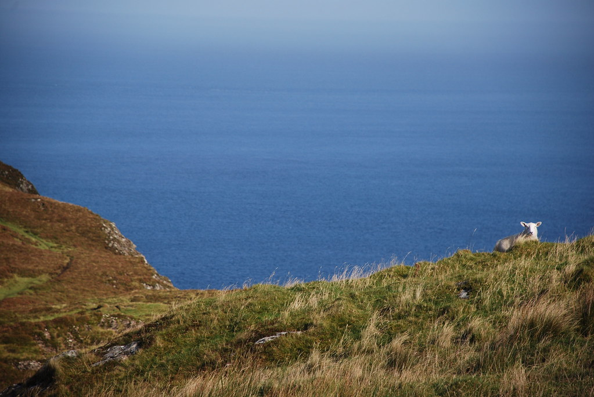
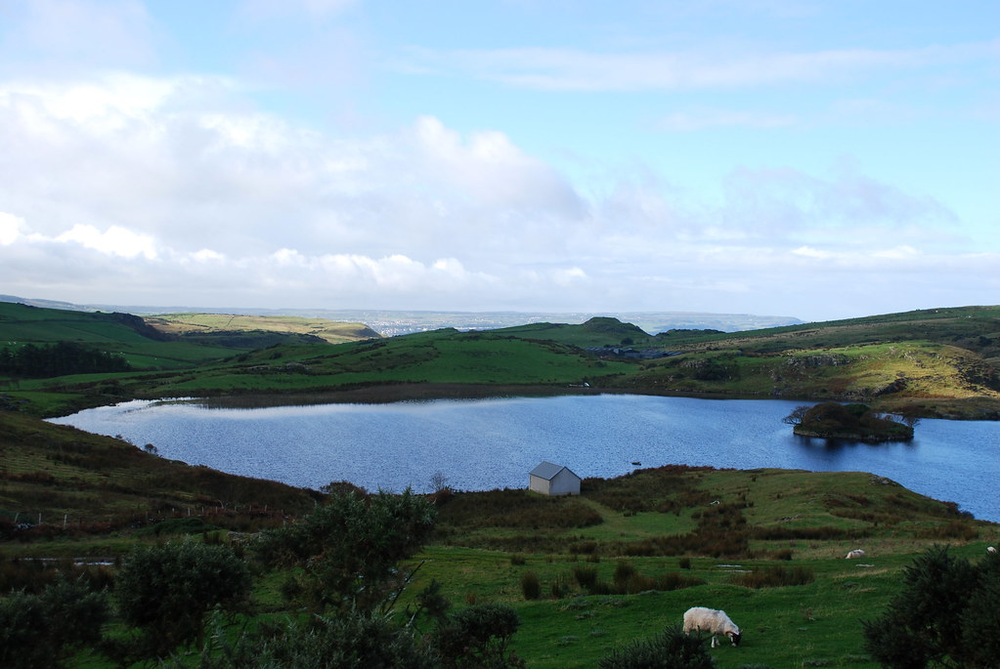
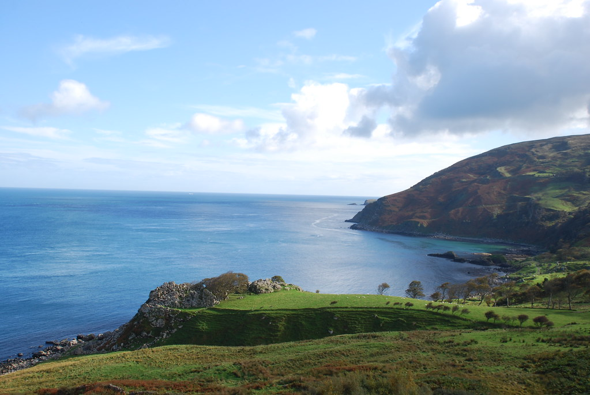
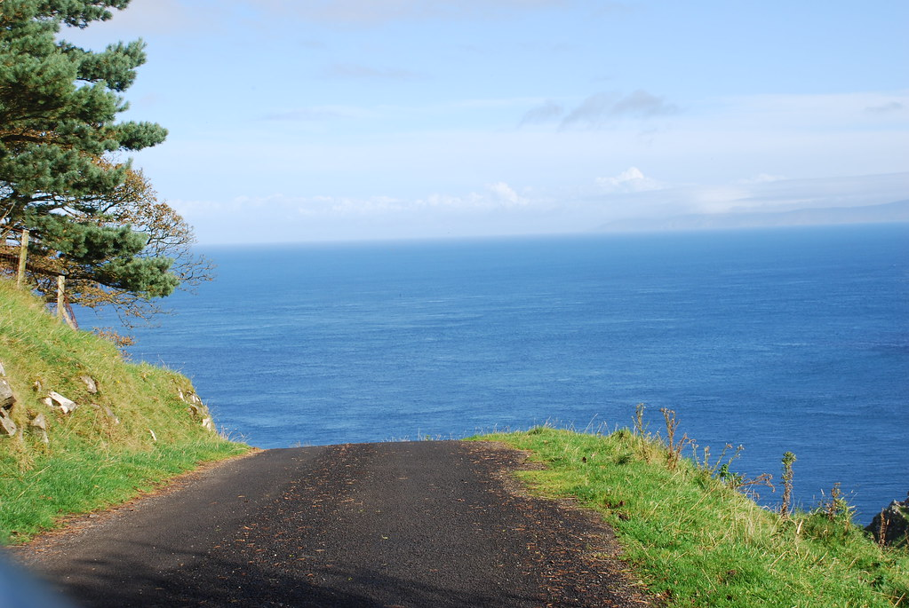
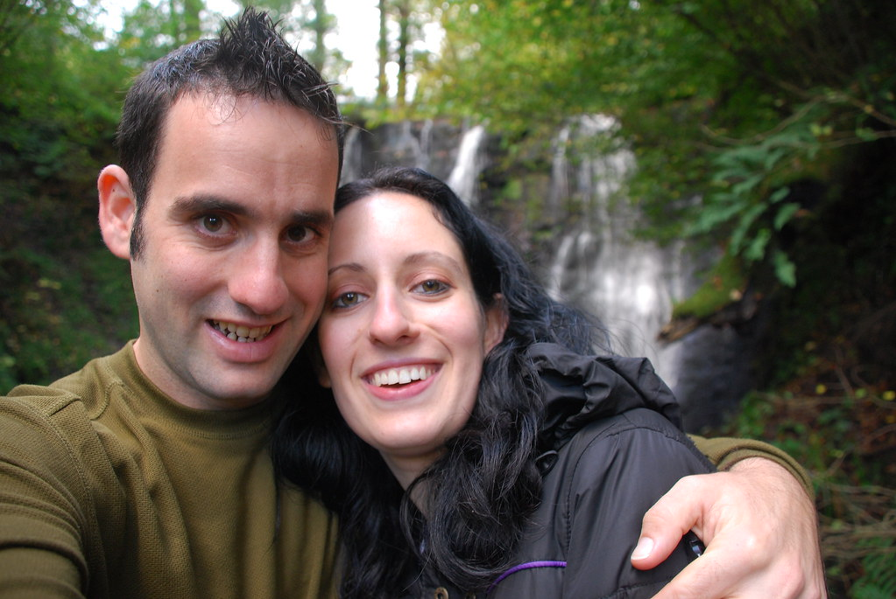
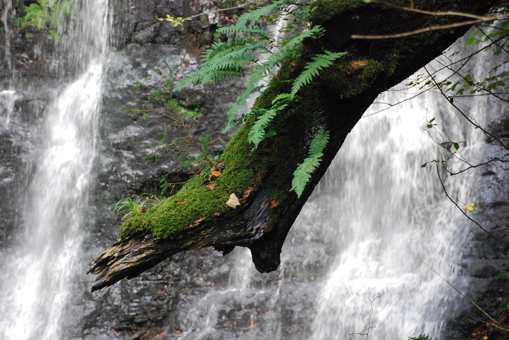
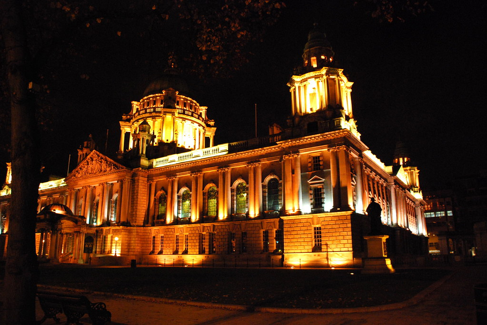

**09/10/2007 – Glens Of Antrim**

היום מוקדש ברובו לGlens Of Antrim שבצפון אירלנד. לאיזור יש להציע כמה מסלולי הליכה שאמורים להיות יפים. כבר בתחילת הדרך, היה אפשר לשים לב שאנחנו כבר לא באירלנד. השילוט בצפון אילנד הוא קטסטרופה. מה הפלא שיש פה טרור ?! אחרי שנסענו קצת בסיבובים הגענו לאיזור בו אמור להתכיל מסלול הליכה מומלץ בשם Fair Head. נסענו לפי ההוראות שב Lonely Planet והגענו לדרך ללא מוצא… כשהסתובבנו כדי לצאת, ראינו בצד שלט קטנטן. היינו צריכים לצאת מהאוטו כדי לקרוא שהגענו לFair Head. הכביש ללא מוצא בעצם היה החניון הנטוש של המקום :)

הבלאגן של הטרוריסטים צפון האירים רק התחיל כאן.. מה”חניון” יצאו שני “שבילים”. שביל אחד נראה יותר כמו דרך שפילסה לעצמה כבשה בדשא, בעוד בתחילת השביל השני שנראה יותר כמו שביל אמיתי היה שלט גדול שמכריז Private property, No Entry! התחלנו בשביל הכבשה, כדי לגלות שהוא לא באמת שביל, והשביל האמיתי עובר בתוך האיזור המשולט באיומים!

השביל היה במצב נוראי – כולו בוץ כבשים ופרות… מה שכן הנופים היו יפים. בכל כמה דקות הליכה היה שער ברזל שלא מאפשר לכבשים לעבור בין המתחמים. כדי לעבור, צריכים לפתוח את השערים – אחד השערים שמוקם מעל שלולית בעומק חצי מטר התמוטט כשעברנו בו וכמעט ונפלנו שנינו לתוך השלולית. טוב… מספיק עם התלונות לבינתיים – היה כיף…

")

הגענו לכמה נקודות תצפית מרהיבות כאשר השמש הפציעה מבין העננים ומהן ניתן היה אף לראות את סקוטלנד באופק.

הסתובבנו כשהשביל נכנס לתוך שלולית שהיתה בעצם יותר בריכה משלולית ולא ניתן היה יותר להמשיך בלי לשחות! מהחניון המאולתר המשכנו לMurlough Bay, שהוא נחשב מפרץ קסום ומבודד. כל האיזור הזה מבודד! לא ראינו פה אף אחד כל היום :)

כשהגענו למפרץ נרשם שיא לשילוט הגרוע של האיזור , והשלט עליו היה כתוב לMurlough Bay שכב על הרצפה מחורר בשני חורים ענקיים שנראים כמו יריות של shotgun! טרוריסטים מטופשים… למרות שהנופים כאן באמת יפים – אירלנד הנורמלית מציעה נופים דומים בצורה יותר אנושית…

התחלנו להתקדם לעבר Belfast. בדרך עשינו מסלול מעגלי קצר (3km) ב Glenariff – שמורת טבע שכוללת כמה מפלים נחמדים – שאל חלקם מזרימים פסולת כימית שיוצרת צבעים מעניינים וריחות פחות מעניינים…

בהינתן אטם לחוטם, הפארק היה נחמד למדי, ולשם שינו מסודר מבחינת שילוט ושבילים.

הגענו לBelfast יחסית מוקדם, כך שהספקנו לחסוך היום כמה אטרקציות עירוניות מטופשות שכבר לא נצטרך לעשות מחר!  
לסיכום Glens Of Antrim, אפשר לומר שהמקום מאד יפה מבחינת נופים. בספר כתוב שמשורר אירי השווה את האיזור לשוויץ… כנראה ששוויץ התחרז לו עם משהו, כי זה לא בדיוק זה, אבל עדיין כיף :)

כיאה לזוג חזירי בר שהגיעו לעיר לאחר זמן רב בחורים התג’נקקנו בפיצה האט בה יעל, לראשונה בחייה טעמה פיצה בשרית – המסקנה – נחמד אבל היא לא תחזור על זה. חבל.. אבל למי אכפת… לילה טוב…
