10/10/2007 - Belfast

היום הארוך הזה הוקדש ל-Belfast – בירת צפון אירלנד. התעוררנו בהוסטל שמנוהל על ידי מארחת עצומה בגודלה לעוד ארוחת בוקר אירית שגרתית. מכיוון שאנחנו כבר בעיר גדולה, האוכלוסיה שונה לגמרי ממה שהתרגלנו (אם בכלל היו עוד אורחים מלבדנו..). את צלילי הטבע, או המוסיקה הקלאסית החליפו צרחות של ילדה הודית שאמהּ התעקשה להאכילה בכח בעוד תייר תמהוני בשולחן מצידנו השני התעסק בתלישת מפות מתוך הLonely Planet שלו.

את המסלול התחלנו מ”הגנים הבוטניים” של בלפסט. השילוט החגיגי בכל פינת רחוב שמפנה אל הגנים נטע בנו תקוות שווא שמדובר באטרקציה של ממש. הגנים היו עלובים למדי. סנאי שעבר במקרה הביט בנו בפרצוף מרומה – מאוכזב מרמת הבוטניקה הירודה. כפי שיצא לנו כבר לראות לא פעם – האירים לא מבינים הרבה בבוטניקה. אם להיות מדוייק, האירים למעשה, לא כל כך מבינים הרבה בכלום. מה שכן, הם מאד מאד אדיבים, וגם במקה יצא להם להתיישב באי בעל נופים פראיים. אה.. חייבים לציין לזכותם גם את האירוע המכונן בו אירי שניסה להכין בירה תוך כדי שהוא שיכור, העריך לא נכון את כמות המרכיבים ויצאה לו בטעות Guinness מרעננת. מסתבר שכל זה מספיק כדי להחזיק פה עם :)

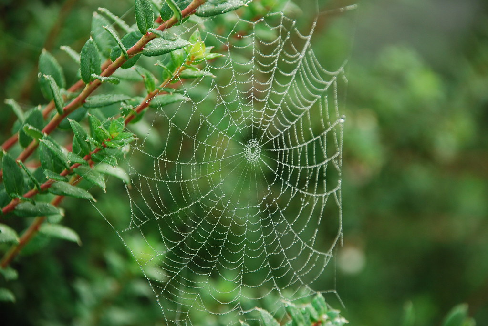

משם המשכנו לעוד מספר אטרקציות עירוניות בינוניות – כנסיה, בניין נטוי מטופש ובית עירייה מפואר שהיה סגור ברובו לצורך שיפוצים

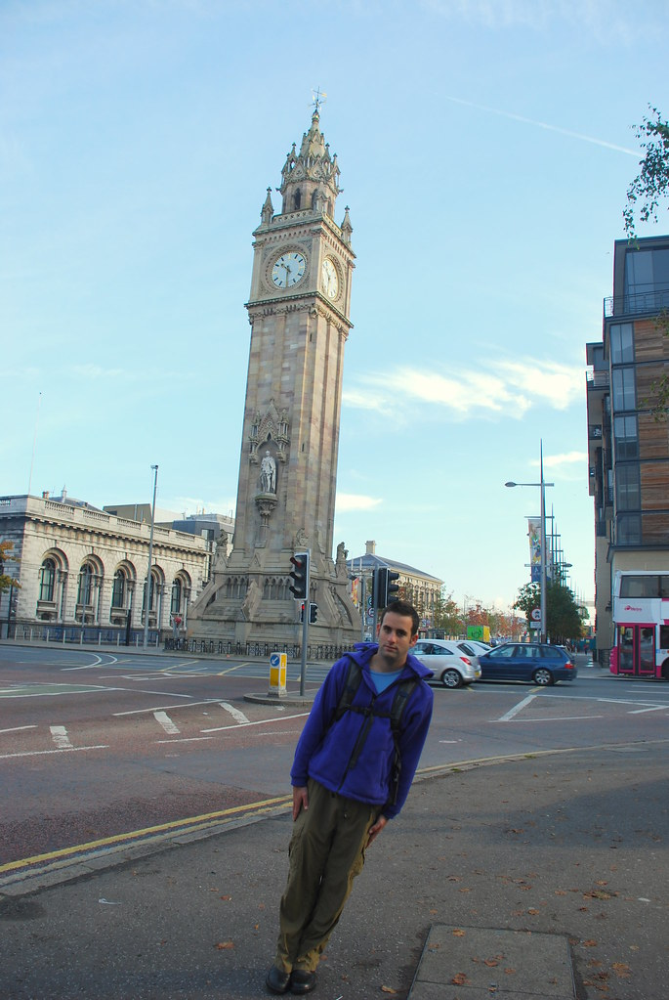

משם התקשרנו להזמין את האטרקציה שלשמה הגענו לבלפסט, ואולי לצפון אירלנד כולה – סיור ב Black Taxi. בסיור סוף סוף נגלה על שום מה אותו סכסוך שכל הזמן מסבירים לנו ש”זה בדיוק כמו אצלנו”. ומה לעזאזל רוצה אנגליה מצפון אירלנד?! הגיע לאסוף אותנו אירי גבוה עם שיניים מצחיקות ומבטא אירי כבד באופן מיוחד בשם ג’ון. המבטא היה כל כך כבד, עד שחששנו שכבר לא נבין שום דבר ממה שהוא יספר לנו. שמחנו להתבדות כאשר בסופו של דבר חוינו סיור מדהים וחלבנו ממנו ה-מ-ו-ן מידע על כל תחומי החיים כאן.

אני לא אגולל כאן את כל הפרטים אבל הסיפור בגדול הוא כזה: יש שני סוגים של אנשים פה: פרוטסטנטים – הבריטים וקתולים – האירים. למעשה מדובר על אותם האנשים בדיוק – עובדים באותם מקומות, שותים יחד ואוהדים את אותן קבוצות אנגליות. אבל, ההבדל היחיד פחות או יותר, הוא שמי שהוא “בריטי” הולך לישון בבית שממוקם בצד אחד של גדר, ואילו מי שהוא “אירי” – בצידה השני. אמרתי גדר? מדובר בחומה עצומה שכל הזמן רק מגביהים אותה יותר כי צעירים משועממים זורקים דברים לעבר הצד השני. למה? כובע! אין שום סיבה! הם אפילו לא דתיים במיוחד כך שעניין הפרוטסטנטים מול הקתולים לא ממש רלוונטי. אנחנו שהאשמנו את האנגלים: “מה הם רוצים מצפון אירלנד” בכלל לא היינו בכיוון.. לאנגלים אין שום עניין בצפון אירלנד. אנחנו בכלל לא הבננו את כל הסיטואציה – בדיוק כפי שלארופאים אין שום מושג על המתרחש בישראל – והאמת – זאת ההקבלה היחידה שמצאנו בין המצב כאן למצב בישראל?! (חוץ מהשנאה וכמויות הדם שנשפך כמובן..). אצלנו יש סכסוך אמיתי, עם רקע, היסטוריה והבדלי תרבות… כאן אין לך שום דרך להבדיל בין שני המחנות – אלא אם תעקוב אחרי מישהו הביתה ותראה באיזה צד של הגדר ביתו ממוקם! בסוף הסיור כשניסינו לנחש באיזה צד גר ג’ון, כל אחד ניחש משהו אחר..

בסיור עברנו בהרבה מקומות בהם יש ציורי קיר מגניבים (murals) בדומה לדרי בה כבר ביקרנו. באחד מציורי הקיר הוצג טרוריסט שאוחז רובה, מכל כיוון שמסתכלים נראה שהוא מכוון אליך – מעיין מונה ליזה טרוריסטית.

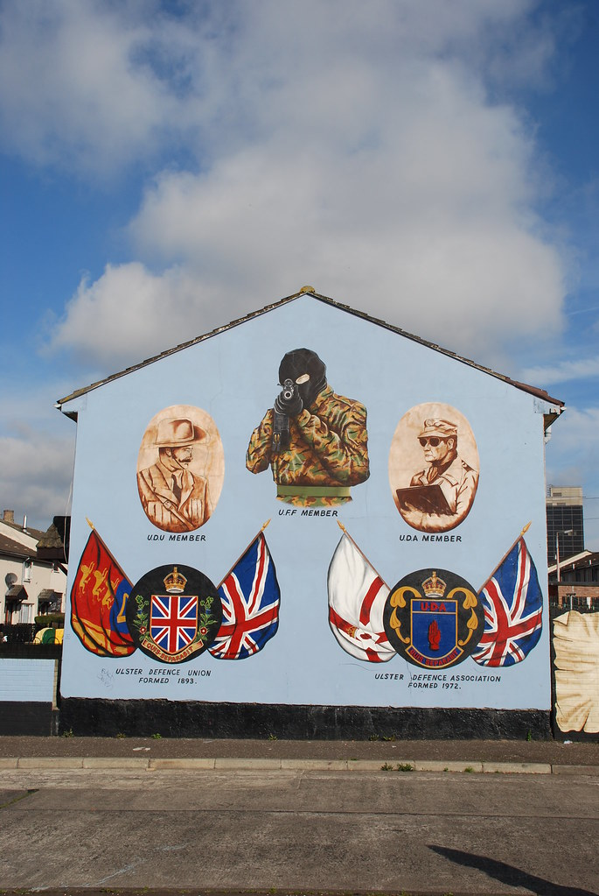

הסיור היה מאד מעניין. ניסינו להוציא מג’ון עוד פרטים על ההבדלים בין שני המחנות – לא יתכן שאין כאלה! המפונקים האלה סתם שונאים אחד את השני כי אין להם משהו אחר לעשות! לפי ג’ון, ה”בריטים” אפילו לא שותים יותר תה מה”אירים” – מדובר באותה האוכלוסיה בדיוק!

בדרך גם חתמנו על “קיר השלום” – קיר מקושקש בחתימות שאיכשהו מקדם את השלום…

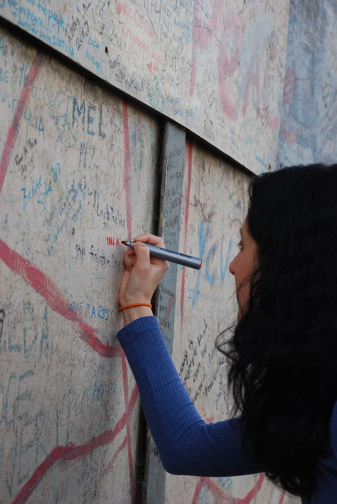

כמובן שהסכסוך לא נשאר רק כאן, אלא גם כל מחנה לוקח צד בסכסוכים בינלאומיים אחרים – אחרי הכל, אין להם באמת על מה לריב, אז שיהיה מעניין…

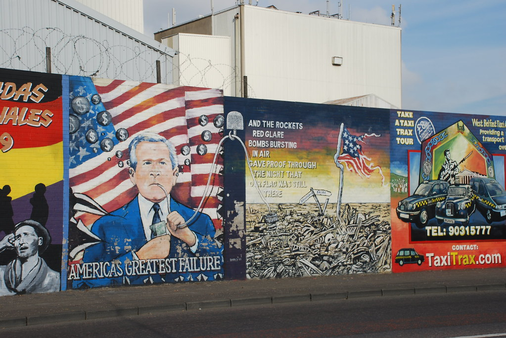

גם אנחנו, עם הסכסוך הישראלי פלסטיני מככבים כאן לא מעט. שימו לב איך בחרו המחנות במי לתמוך: הבריטים, שמרגישים שהם מיעוט בצפון אירלנד – לקחו את הצד של ישראל – הרי אנחנו מדינה קטנה ומאויימת בתוך ים של מדינות ערביות בדיוק כמוהם. ו”האירים”, כנראה סתם כדי להיות ההיפך מ”הבריטים” כמובן מצדדים בצד הפלסטיני :)

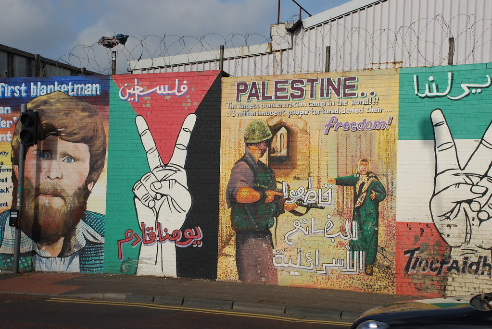

בסוף הסיור ג’ון סיפר לנו שלבת שלו קוראים חנה, וחשף קעקוע שכיסה את כל הזרוע שלו עם הכיתוב Hana. הוא שאל אותנו שאלות על אברם גרנט כמאמן, והמליץ לנו בחום לא לאכול Full Irish Breakfast בכל יום – אבל זה רק בגלל שהוא פרוטסטנט בריטי מנוול :)

סיימנו את הסיור החווייתי בזמן כך שנשאר לנו בדיוק מספיק זמן להגיע לBelfast Zoo ולממש את התחייבותה של הנמלה מ[קורק](http://shpandrak.blogspot.com/2007/09/2007-4.html) ללכת לגן חיות! בשעה וחצי שהיתה לנו עד לשעת הסגירה הספקנו לראות כמעט כל מה ששוה לראות בגן. האטרקציה העיקרית בגן, היא הלמורים. לא בתור עוד חיה בכלוב, אלא כמות של למורים מסתובבים חופשיים בכל הגן!

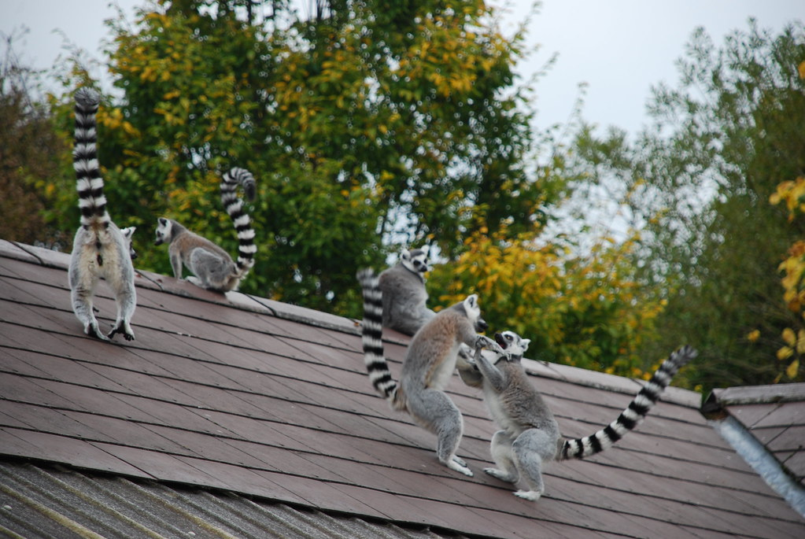

הלמורים הם חיות חברותיות. אפשר ללטף אותן, לשחק והם לא נושכים – לפחות לא יהודים. הידיים הקטנות שלהם נראות אנושיות או יותר נכון – קופיות…

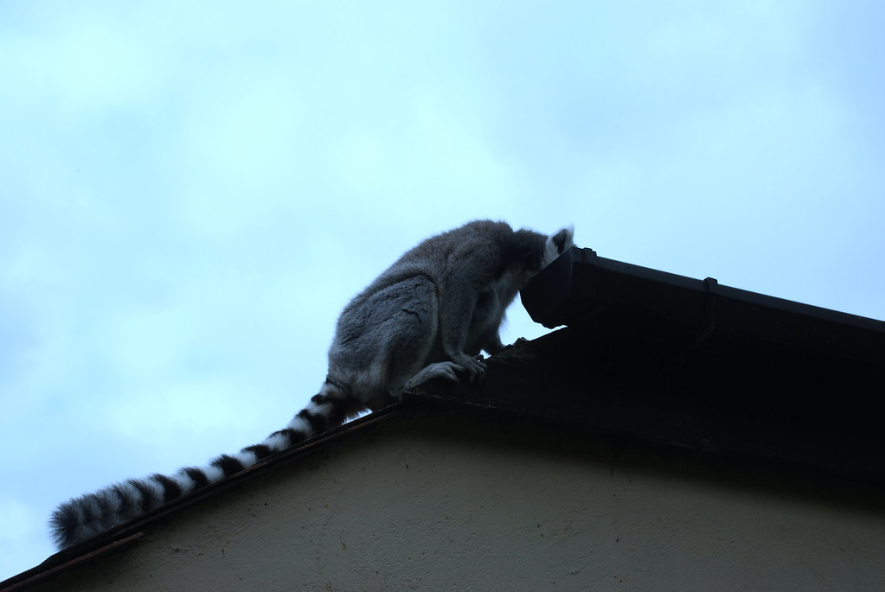

כמובן שהיו גם עוד כל מיני חיות נחמדות: קופים ג’יראפות, פינגווינים, וחזיר בגודל של מקרר שנראה כאילו רק מחכה שיהרגו אותו כבר. עוד אטרקציה מרכזית היתה לילי – לביאה גורה שמה שמיוחד בה, הוא שמיום היוולדה היא חיה בכפיפה אחת עם גורת כלבים מזן סיני. בינתיים הן שומרות על אותו הגודל, וחיות יחד בשלום – מדהים.

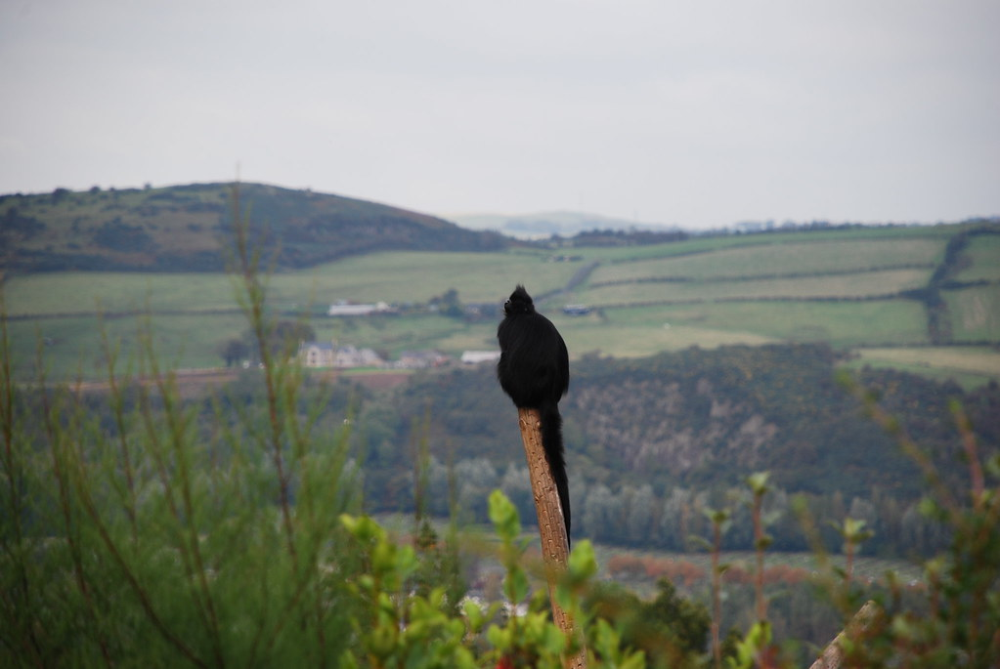

עוד מקום ראוי לציון היה שדה החפרפרות. היה אזור לא קטן שהוקדש כולו לחפרפרות. האיזור הזכיר סרטים מצויירים כמו מוש השור, עם החורים המצחיקים של החפרפרות. מסתבר שיש להן מערכת תעלות ענפה מתחת לגן החיות. נקודה מעניינת היא שבגן היו נחשים! למרות האגדה המטופשת לפיה פטריק הקדוש גירש את כל הנחשים מעל אדמת אירלנד.

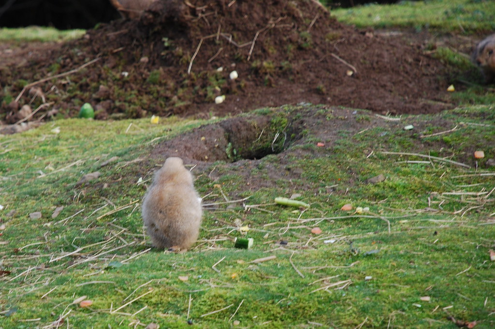

מגן החיות התחלנו בנסיעה חזרה לכיוון הכללי של דבלין. התכנית היתה לנסוע בדרך הארוכה עד שנעבור בעיירה שנראית לנו נחמדה. בסוף בדיוק כשהתחיל להיות מאוחר מצאנו B&amp;B חביב בעיירה Newton. סוף סוף חוזרים ליורו! שתי בעיות היו לנו במקום: האחת, היא שבעלת הבית, תוך כדי שקיבלה אותנו העניקה איזשהו שירות לאיש מוזר ומלוכלך מעבודת כפיים כלשהי, שהגיע עם כמות של שקים שחורים שנראו מלאים בחלקי גופות. והשניה והיותר חמורה, היא שנגמרו לי הגרביים! מזל שלנמלה המצוחצחת יש מספיק גרביים עודפות :)

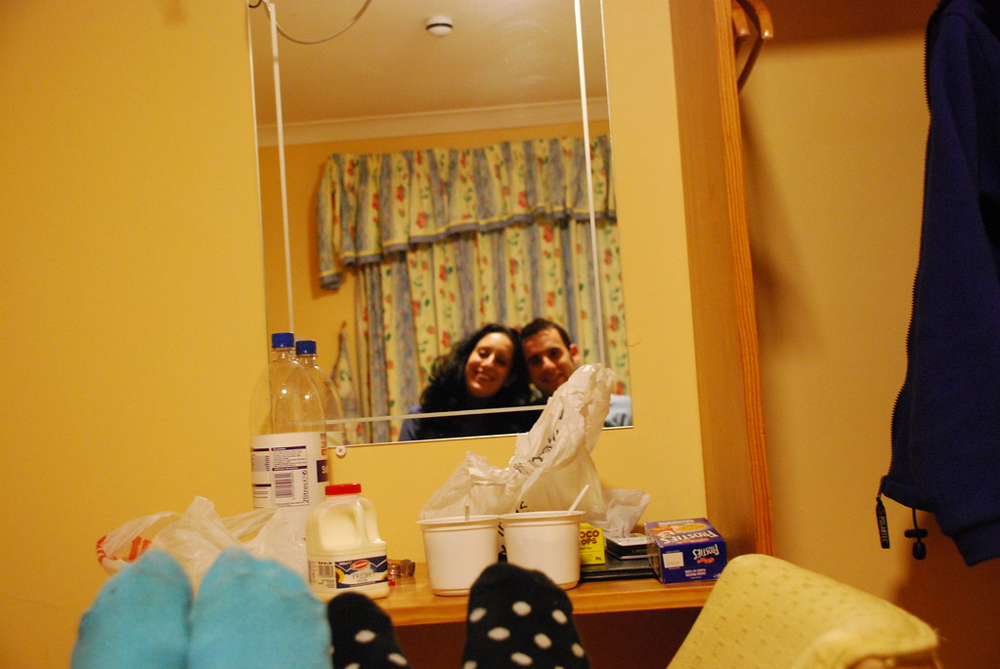

לילה טוב
