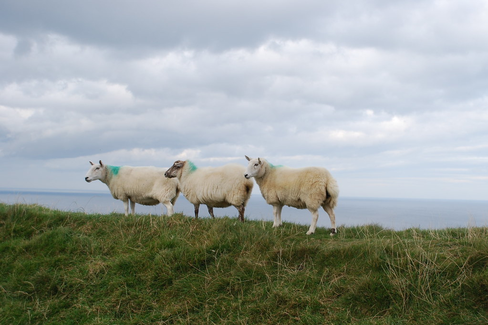

**05/10/2007 – על קדושים ונחשים**

היום נטייל ב County Mayo שבמערב אירלנד. התעוררנו בWestport לארוחת בוקר שהוגדרה כחזירית ביותר שנאכלה עד כה בטיול.

את היום התחלנו ב [Crough Patrick](http://en.wikipedia.org/wiki/Croagh_Patrick) המפורסם יחסית. ההר, הצנוע בגובהו, נקרא על שם [פטריק הקדוש](http://en.wikipedia.org/wiki/Saint_Patrick) שהתבודד וצם על ההר 40 ימים. אותו פטריק מפורסם בעיקר בשל כך שהוא כביכול גירש את הנחשים מעל אדמת אירלנד!  
התכנון המקורי כלל טיפוס אל פסגת ההר (כ3 שעות טיפוס קשה וירידה) אבל בשל מזג האויר ההפכפך, והעיפות המצטברת החלטנו לותר ולהמשיך הלאה.

מסתבר שיש משוגעים שבכל יום ראשון האחרון של יולי עולים לפסגת ההר יחפים! ויש משוגעים אף יותר שמוסיפים לכל זה צעדה המונית של 40 ק”מ לפני הטיפוס. כמעט בכל התמונות של ההר שראיתי, וגם פה היום – פסגת ההר מכוסה בענן שבהחלט תורם להרגשת הקדושה.

עשינו סיור זריז באיזור שלמרגלות ההר בו גילינו בין היתר פסלים שמספרים על תקופת הרעב באירלנד, בה הפליגו לחפש מזון במחוזות רחוקים. ופסלים נוספים שמייצגים צרות שונות ומשונות אחרות שעברו על העם האירי…

מכאן המשכנו ועברנו בכל מיני טירות\\מנזרים כשלכל טירה יש סיפור משלה.  
באחת מהן, למשל, התגוררה פיראטית “טורפת גברים” שעל מעלליה שמענו מפי אירי ג’ינג’י שהסתובב עם זוג אמריקאים ובטח עשה עליהם קופה לא קטנה..

משם המשכנו לאתר הארכיאולוגי [Céide Fields](http://en.wikipedia.org/wiki/C%C3%A9ide_Fields), שהוא אחד האתרים הגדולים בעולם מהתקופה הנאוליתית (תק’ האבן החדשה), ומכיל את מערכת השדות העתיקה ביותר שנחשפה עד היום.  
האתר מעניין, והסיור המודרך הכרחי בעיקר משום שרוב אזורי החפירות עצמן לא היו נגישים.

בין היתר לימדו אותנו איך חשפו את חומות מערכת השדות הנמצאות כשני מטרים מתחת לאדמה. בגדול מסתובבים עם מוטות ברזל ארוכים בצורת T ותוקעים עד שמרגישים חומה :)  
אחד החוקרים היה מרצה באוניברסיטה כך שהוא ניצל את הסטודנטים שלו והביא אותם לפה לחפור בתמורה לכך שלא יכשיל אותם.

בלי קשר לעתיקות ולנאוליתים, המיקום של האתר משקיף אל הים, ועל צוקים שלא נופלים ביופים מאלו של מוהר. כמובן שכמו בכל הטיול, גם כאן, מסתובבות להן הכבשים המפורסמות של אירלנד בכל פינה

ה”אטרקציה” האחרונה שלנו להיום היתה סיבוב נוסף במנזר בשם Moyne Abbey. המנזר היה גדול ומרשים וכרגיל היינו בו לבדינו לגמרי.  
מה שנזכור מהמנזר זה את השלט המאיים והמשעשע בכניסה. מסתבר ששטח המנזר נמצא על שטח פרטי, ובשטח מגדלים שוורים. מה שבאמת מדהים בכל הסיפור הזה, הוא שהנמלה איכשהו הסכימה להכנס :)  

")

המשכנו להתקדם לקראת היעד הבא – County Donegal. ויתרנו על לינה בSligo, שנראתה עיר גדולה מידי והמשכנו לנסוע בתקווה למצוא מקום “על הדרך”.  
לראשונה בטיול יצא לנו לנהוג קצת אחרי שמחשיך, ולקח לנו קצת זמן למצוא מקום לינה. האירים פה בכפרים נחמדים באופן קיצוני. כששאלנו מישהו איפה יש B&amp;B הוא לקח אותנו לבית שלו, והתקשר לכמה מקומות עד שמצא לנו מקום(לא שהיו בעיות תפוסה, פשוט אנחנו באמצע שומקום :) ).

בסוף מצאנו מקום מושלם בשם Rosewood שבכפר הנידח Grange שכולל משהו כמו 4 בתים. כמה כיף לטייל!
