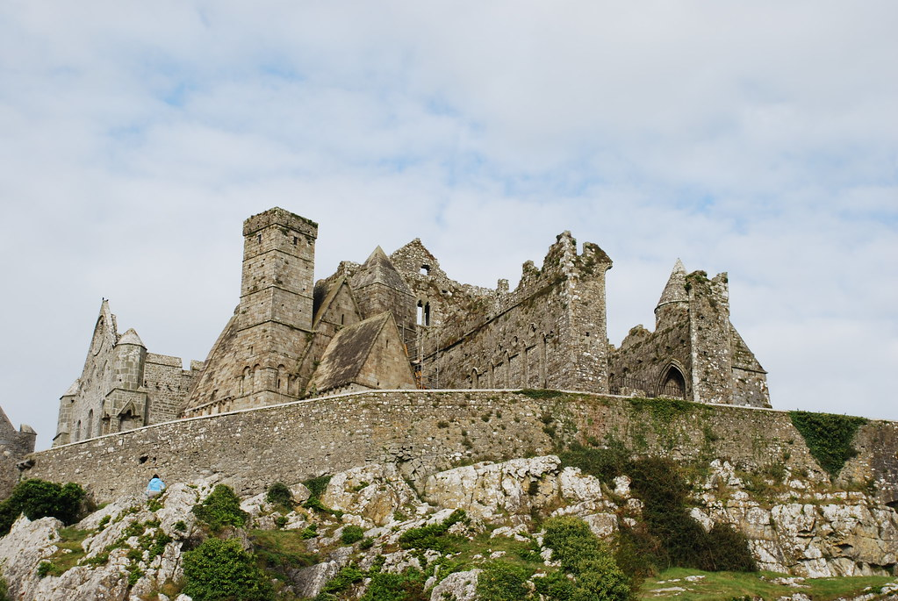
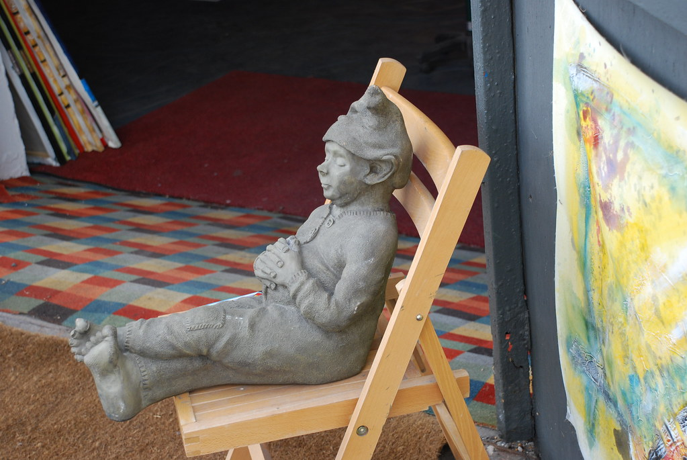
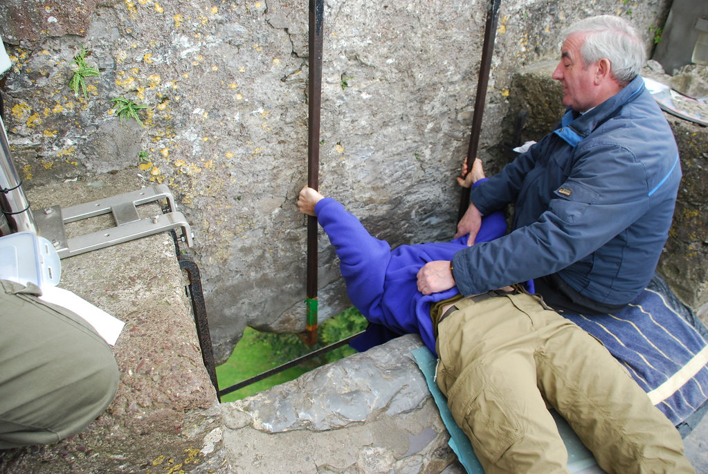
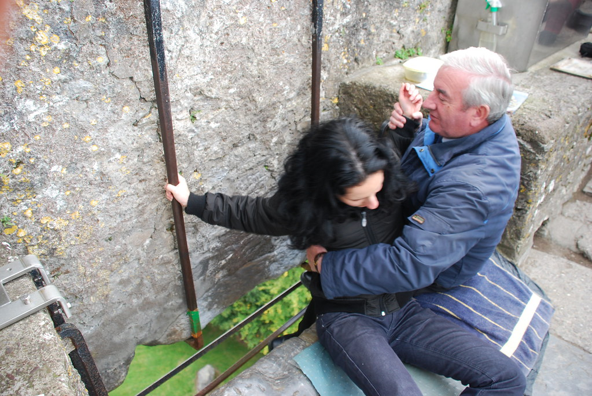
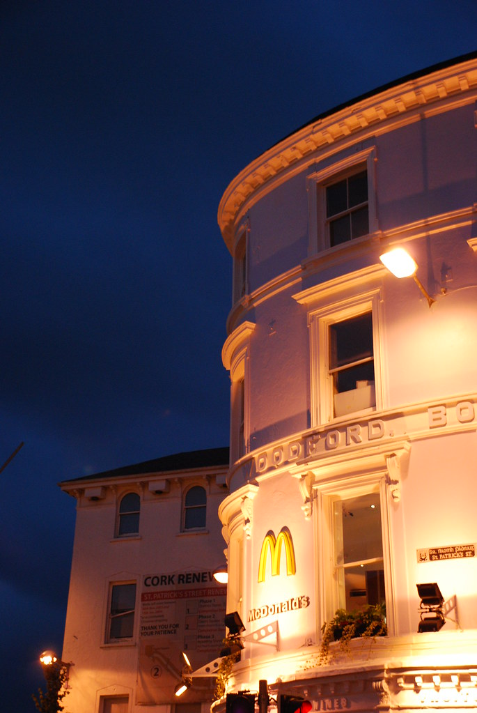

**28/09/2007 - יום הטירות הגדול**

גם היום קמנו מוקדם, גם היום אכלתי Full Irish breakfast, ויעל רק ביצים ואנחנו מוכנים לעוד יום של הרפתקאות היום התוכנית היא "לדפוק" כמה טירות ברצף כאשר שתי העיקריות הן Rock Of Cashel שב County Tipperary ו Blarney Castle שב County Cork.

הטירה הראשונה היתה Rock Of Cashel

- מבחינת החניה היה הכי נח לחנות בעיר, וללכת בדיוק 2 דק'. לפחות בעונה הזאת שהכל די ריק...
- תעודת הסטודנט הקנתה 60% הנחה

הטירה די עצומה ומרשימה, ומסתבר שבעבר גר שם בישופ מחרחר מלחמות עם רגשי גדלות רציניים. לקחנו סיור מודרך שהיה מוצלח, אולי בעיקר בזכות המדריכה שהיתה משעשעת.

על החורים המרובעים בחומת הטירה, היא סיפרה שאבא שלה עבד עליה כשהיא הייתה קטנה, שבאותה תקופה החליטו לנסות תותחים מרובעים :).

היא נולדה גדלה, ועדיין גרה בעיירה Cashel שהיא חור מרובע די רציני בפני עצמו.

מסביב לטירה היה בית קברות עתיק. הנוף היה הירוק האופייני של אירלנד כאשר שזורות בו טירות של שכנים. בגדול מדובר בסוג של כפר שמריהו רק עם בישופים במקום צפונבונים ומרתפי עינויים במקום בריכות.

")

שוב התחלנו לנסוע. הפעם לכיוון Cahir - בלי שום קשר לקהיר שלנו (וכל עוד המצרים רגועים - גם זאת לא באמת שלנו)  
בנסיעה הזאת סוף סוף קרה המקרה שסימן את ההסתגלות שלנו לאירלנד - יעל היתה צריכה סוף סוף להעיר לי שאני נוסע מהר מידי לטעמה, במקום להעיר לי שאני נוסע בנתיב הנגדי - משהו בארוחות הבוקר פשוט סידר אותי.

בקהיר עשינו את הטירה "בקטנה". לא הסתובבנו יותר מידי בעיר שהיתה די מנומנמת פרט לכלב אחד שהחליט לצאת לשחייה בנהר מי קרח...

מCahir המשכנו לכיוון Cork אל Blarney Castle. חנינו ונכנסנו אל השמורה

- הנחה לא משמעותית עם תעודת סטודנט

מה שמיוחד בשמורה הגדולה הזאת, זה שמשרד התיירות האירי החליט להפוך אותה בכח לאטרקציה - והאמת, הוא הצליח לא רע בכלל :)  
אני אסביר - במרכז השמורה יש טירה גדולה ומרשימה (פחות או יותר כמו הרבה טירות אחרות פה)  
אבל... יום אחד אחרי לילה ארוך בפאב (אירי), שר התיירות האירי קבע את העובדות הבאות:

1. אחת האבנים בתקרת הטירה הובאה מירושלים, ומי שמנשק אותה זוכה ברהיטות לשון למשך כל ימי חייו.
2. זקן סוטה גס רוח ישמור על האבן 24 שעות ביממה ו"יסייע" בנישוק האבן.
3. את האבן יש לנשק בשכיבה על הגב עם הראש כלפי מטה, כשכל גופך חשוף לידי הזקן מהסעיף הקודם :)

החגיגה רק מתחילה. בשמורה יש מדרגות מצ’וקמקות, שכביכול, בעקבות איזשהו סכסוך עתיק יומין עם מכשפה – נוצר בסופו של דבר מצב בו מי שמצליח לעלות ולרדת את המדרגות כשעיניו עצומות ותוך כדי כל זה חושבים על משאלה - המשאלה תתגשם בשנה הקרובה. את זה אפילו יעל הצליחה לעשות מה שהיה משעשע למדי.  
היה עוד סלע גדול עם סגולות שקריות, מערה שתפרו לה אגדות ומאיזשהו שלב הפסקנו לעקוב. שלא תהיה אי הבנה, מאד נהנינו בBlarney Castle. היה מצחיק, ובנוסף השמורה שם באמת יפה - נחל קטן, צמחייה מעניינת (לפי יעל - טחב בן אלפי שנים). פגשנו גם זוג גרמנים שכבר ראינו במספר אתרים. הבחור שכנראה כמוני נישק את האבן, היה רהוט לשון וחביב, וקבענו שאם נפגש שוב - נשב יחד לשתות בירה.

הלילה ישנים בCork - העיר הכי גדולה שנהיה בה עד שנחזור לDublin. איך שנכנסנו לעיר העיניים של יעל נדלקו למראה רשתות הביגוד הגדולות. לראשונה ראינו Mcdonald's ו KFC.

 by shpandrak, on Flickr")  
חזרה לציויליזציה - Cork

לראשונה בטיול מציאת מקום לינה לא הלכה "חלק"- אבל גם לא כ"כ נורא. בגלל סוף השבוע, ובגלל שמדובר בעיר גדולה עברנו שלושה-ארבעה מקומות עד שמצאנו מקום שמתאים לנו. המקום שמצאנו(שלעולם כבר לא נדע את שמו) היה במחיר מעולה כשהcatch היחיד היה שהמקלחות משותפות בין שלושה חדרים. לא היה לנו תור, והמקלחות היו חדשות ונקיות כך שלא היתה בעיה (תמיד חשוב לבקש לראות את החדר לפני ובמקרה כזה גם את המקלחות). החדר אגב היה עצום ויפה, היה בו כיור עם מים חמים וקרים - ממש לא ברור למה בחרו שלא לעשות פה מקלחת... בעלת הבית היתה זקנה בת כ-60 ממש מגניבה. מלבד זה שהיא מנעימה את זמן האורחים בנגינה בפסנתר, היא יוצאת מחר לטפס על ההר הגבוה ביותר באירלנד, וזאת כהכנה לטיול שהיא מתכננת לטיפוס על האוורסט (base capm) !!!

המשך יבוא...
