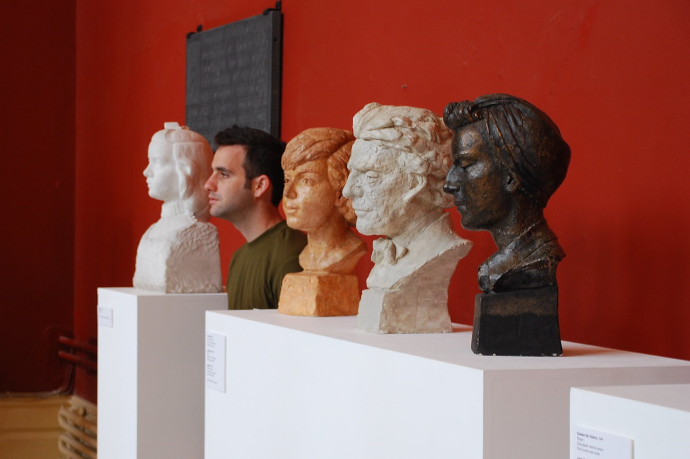
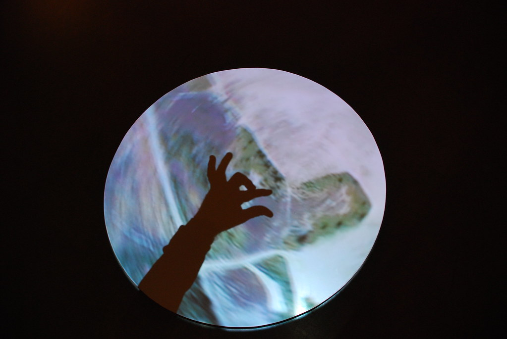
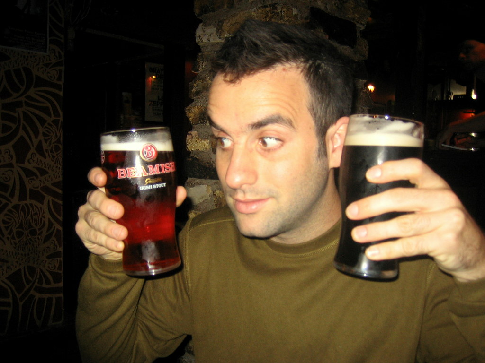
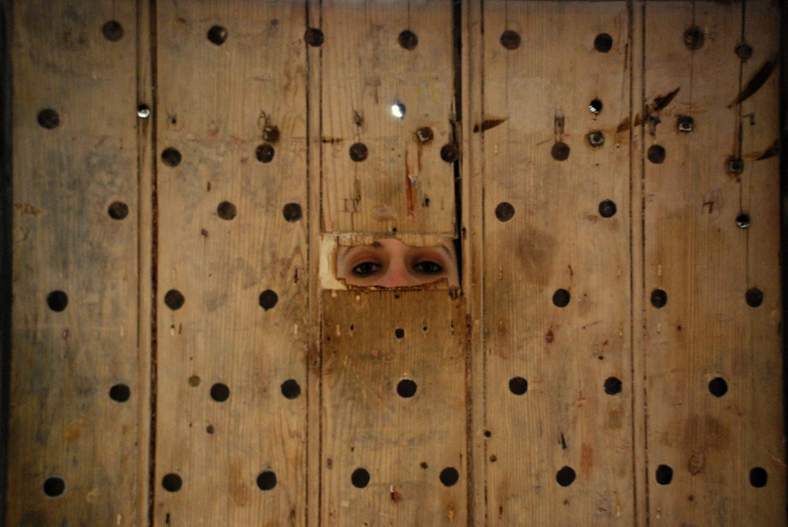
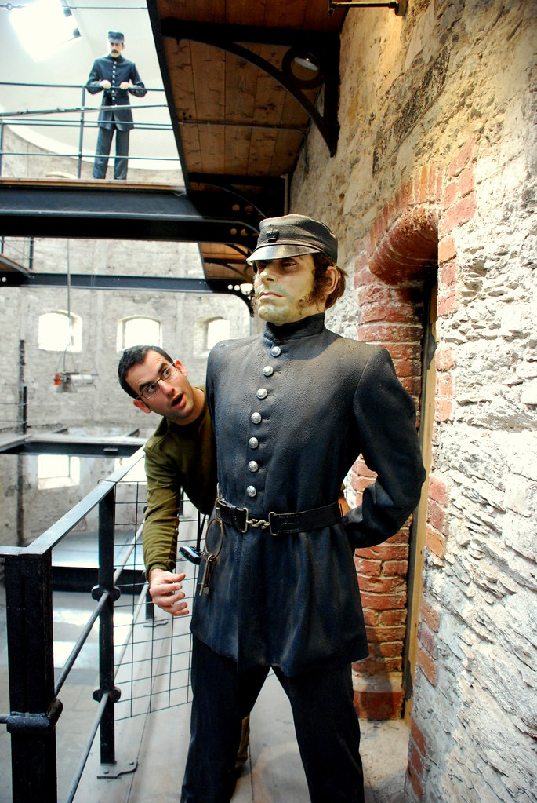
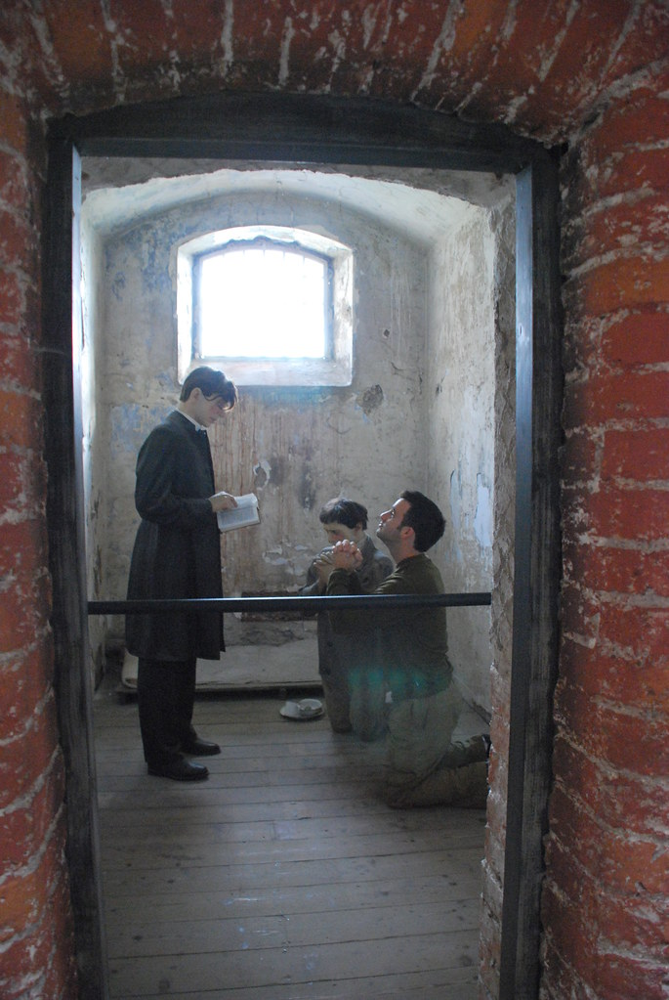
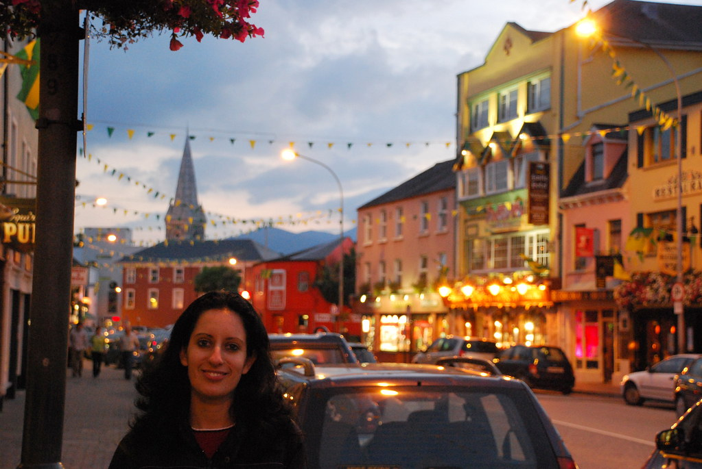

**29/09/2007 - Cork**

היום הוקדש כולו לCork. Cork היא עיר די תעשייתית ואפורה. מלבד חיי לילה, מספר מבנים עתיקים וכמה אתרי תרבות אין פה יותר מידי מה לחפש. למי שטיול בטבע זורם בעורקיו - הייתי ממליץ לדלג. "אוהבי ערים" עשויים למצוא כאן את מבוקשם.

נתחיל בזה שלאחר דיון(חד צדדי - כמעט מונולוג) הוחלט פה אחד, שלא הולכים לגן החיות Fota, זאת כדי להספיק את Cork כמו שצריך. (“חיות יש בכל מקום - מלט ובטון - רק בקורק” :) או בקיצור: יעל סיבכה את עצמה עם הבטחה לקחת אותי לגן חיות ב6 חודשים הקרובים כדי להשתחרר מביקור בFota.

מכיוון שלראשונה לקחנו את הB&amp;B ללא ה B השניה, היינו צריכים לחפש ארוחת מקום לאכול בו את ארוחת הבוקר. אחרי סקר שוק קצרצר הוחלט "להגשים ליעל חלום" ולאכול ארוחת בוקר במקדונלדס! יש להם פה ארוחות בוקר מגניבות! אני אכלתי Full Irish Breakfast בנוסח מקדונלדס - מעיין מאפין, שדחסו בו נקניקייה פחוסה לצורת המבורגר עם ביצה, בייקון, גבינה וכל מה שבן אדם צריך לארוחת בוקר. יעל מצידה בחרה בפנקייקים.

משם המשכנו לCrawford Gallery- גלריית אומנות אירית. רוב התערוכות היו סבבה, כמה מיותרות ומיצג אחד ממש מיוחד בנושא שבעת החטאים.

בהמשך תיכננו ללכת למבשלת Beamish &amp; Crawford אבל היא היתה סגורה :( מכיוון שאנחנו כבר יודעים פחות או יותר איך עושים בירה, החלטנו לעשות לעצמנו סיור פרטי שכולל רק טעימות. בקורק גיליתי את הBeamish. בירת Stout טעימה - סוף סוף תחרות לגינס.  
אלכוהול בצהריים על בטן ריקה זה בהחלט דבר נהדר!

משם הלכנו לראות כמה "כנסיות שחייבים" כאשר נק' השפל של היום היתה ביקור במנזר בשם Red Abbey. אחד המבנים המכוערים שראיתי מימי - פצע מוגלתי בלב האומה האירית - אפילו לצלם אותו לא הסכמתי.  
למרות האווירה העכורה שיצר המבנה :) המשכנו לטייל בעיר וקנינו מהגבינות המפורסמות של קורק שישמשו אותנו לארוחת הבוקר של מחר.  
את הטיול בקורק סיימנו בסיור ב Cork City Gaol. בית סוהר עתיק שפתוח לביקור הקהל עם סיורים וירטואליים בתאי אסירים וירטואליים.

הסיור היה מעניין, והמקום קודר ומשכנע. בכל תא המדריך הוירטואלי סיפר סיפור האישי של אסיר שהיה כלוא בו, מה שנתן את הערך המוסף לסיור.

משם עזבנו את Cork בדרך ליעד הבא שלנו Killarney. חוזרים לנשום אויר הרים צלול, לקראת הטיול מחר ב Killarney National Park. Killarney עיר תיירותית מאד מזמינה - ולפחות בעונה זו, כשהיא די ריקה מאד חיבבנו את השהות בה.

מצאנו בקלות B&amp;B באחד הפאבים בעיר. זאת לא טעות - מקובל פה מאד שפאבים מחזיקים גם כמה חדרי לינה להשלמת הכנסה. בכל מקרה, למדנו שהדבר הנכון לעשות באירלנד כשאתה זקוק למקום לינה, או הכוונה כלשהי - גש לפאב המקומי - מכאן מתנהלת העיירה.  
ולמי ששואל מה קורה אם אין פאב מקומי - אז אין כזאת עיירה! אפילו בעיירה של 3 בתים - אחד מהם יהיה "הפאב המקומי" :)  
לארוחת ערב אכלתי sheaperds pie, ויעל אכלה סלט עוף שהיתה צריכה לחתוך לעצמה?! הבנו כבר, שהמטבח האירי, בדומה לאחיו הבריטי לא שופע דימיון יותר מידי, אבל לפחות הstews למיניהם מצויינים! המשך יבוא...
