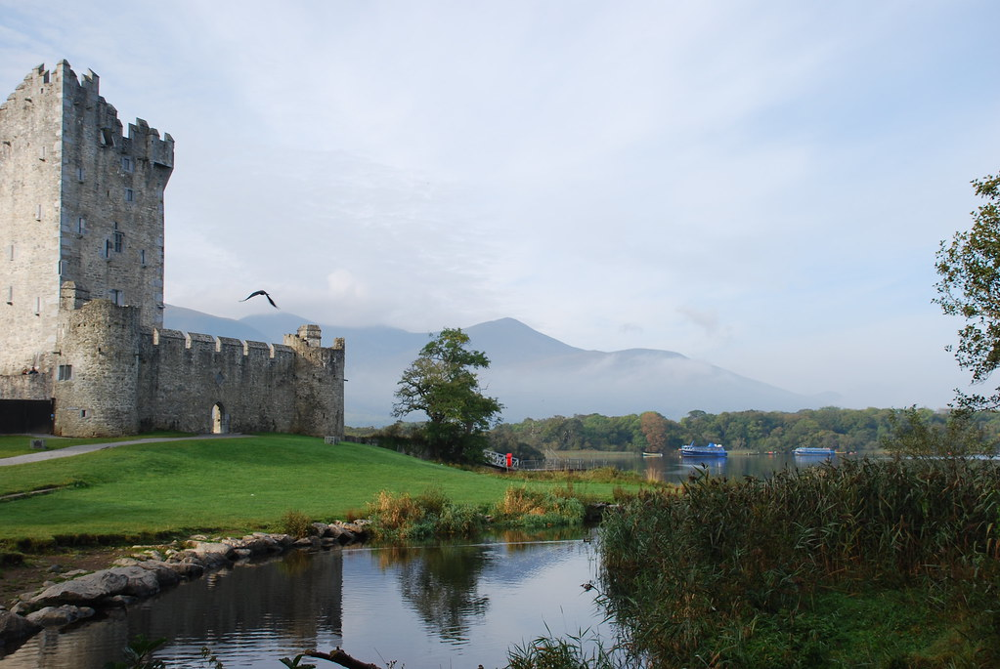
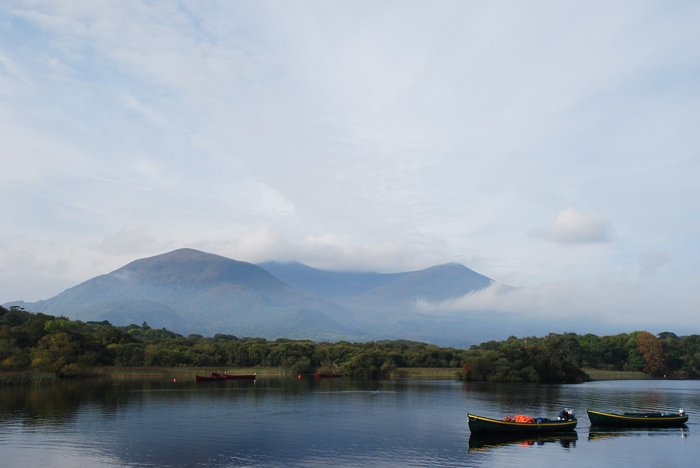
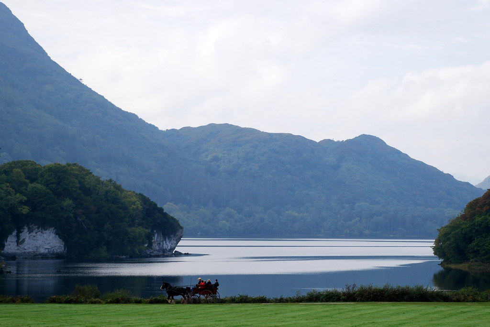
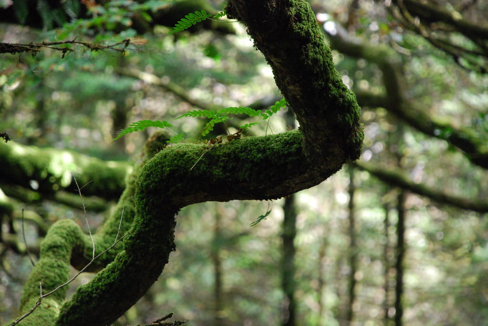
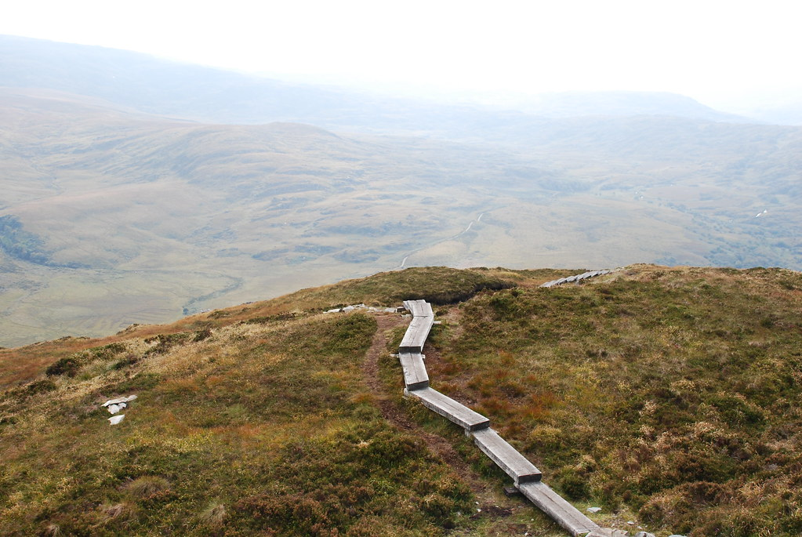
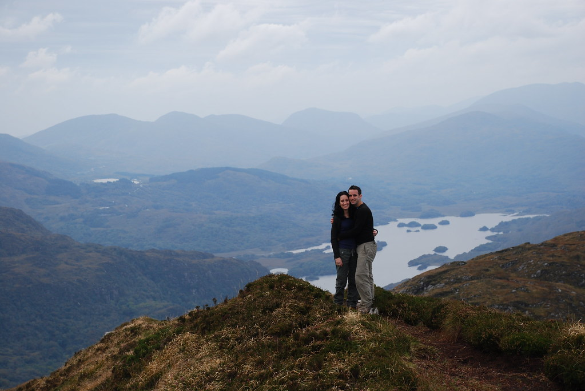
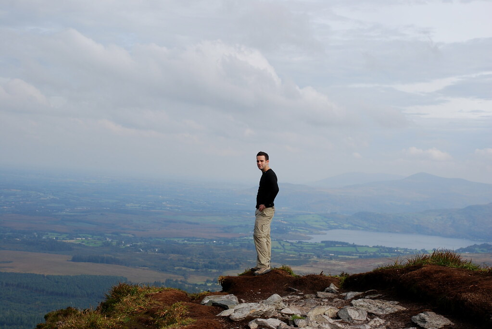

**30/09/2007 - כובשים את ההר**

שוב בוקר... שוב דוחפים הכל לאוטו והולכים לאכול Full Irish Breakfast :) היום כולו הוקדש ל Kilarney National Park שב Kerry County. הפארק של קילרני הוא אינסופי, בנוי מ3 אגמים גדולים המוצגים לראווה בתוך שמורה עצומה וירוקה שופעת במגוון צמחיה, נחלים, מפלים וגם קצת טירות מטופשות. התחלנו את היום בלעבור בקלילות על 2 מהמקומות ה"מפורסמים" יותר של השמורה כמתאבן לטיול האמיתי. התחלנו בRoss Castle. טירה יפה שנבנתה על שפת אחד האגמים. פגשנו שם את "הישראלי המכוער" שכיוון אותני לאיזה חדר צדדי בו אפשר לראות משהו בחינם, וניסה לברר האם הוא הצליח למצוא דיל טוב יותר משלנו על הטיסות :) אם היו רוצים לצלם באיזור סרט אימה, בו מפלצת מהאגם טורפת בזה אחר זה תושבי עיירה שכוחת האל(חוץ משריף העיירה) - זה היה המקום לסצינת הסיום.

מכיוון שמוקדם מידי בבוקר, ואפילו המפלצות מהאגם עוד מנמנמות, המשכנו ל Muckross house - בית מיותר שלא במקרה נשמע כמו משהו שגדל בתוך האוזניים. המקום בסך הכל יפה. מסתובבים שם "איכרים" שמשכירים לתיירים סיור במקום במרכבות סוסים.

משם המשכנו למפל Torc כדי לעשות מסלול הליכה. המפל נחמד. מהמפל לקחנו את המסלול המעגלי הכחול, וממנו התפצלנו למסלול לא מעגלי בשם Old Kenmar Road (לא ממש משולט) עליו קראנו המלצות באינטרנט. לכל County באירלנד יש מסלול הליכה של מספר ימים (תלוי בגודל הגאוגרפי) ושמו כשם הCounty. לדוגמא חלק מהמסלול שעשינו בGlendalough מתחבר עם הWicklow way. Kenmar Road הוא חלק קטן מהKerry Way. המסלול התחיל מאיזור המפל בתוך יער, הדרך היתה מאד יפה, והירוק של אירלנד במיטבו. גזעי העצים היו מכוסים גם הם ירוק, מה שנתן הרגשה של "יער מכושף".

אחרי הליכה די ארוכה ב"שבילים המכושפים", פתאום נגמר היער, ומצאנו את עצמנו במרחבים ירוקים והרריים. החלטנו להמשיך עוד קצת בנוף החדש, לפני שנסתובב ונחזור. לאחר מספר דקות, ראינו דרך אבנים שחותכת את המסלול שלנו, ונראה שמובילה אל הר גבוה (בדיעבד הר Torc). כשהצעתי לקנח את היום בטיפוס על ההר ולנסות לראות קצת נוף, קיבלתי בתגובה את אחד מהפרצופים העקומים המפורסמים של יעל :) אבל, כאילו בהזמנה, בדיוק ברגע הנכון הגיעו בירידה כמה מטיילים. ניצלתי את ההזדמנות לשאול אותם כמה זמן יקח לטפס והאם זה כדאי. הם אמרו שלוקח שעה לכל כיוון, אבל אסור לפספס את הטיפוס, משום שהנוף בפסגה מדהים. אחרי כמה רגעי התלבטות נוספים, הגיעו בירידה זוג גרמנים שנראו מטיילים רציניים והם פיארו את הנוף מהפסגה באופן שלא נתן לנו יותר מידי בחירה... יעל(הגיבורה) נתנה אור ירוק, והטיפוס החל!

הטיפוס אכן היה ארוך וקשה, אבל בלי שום ספק היה שווה כל רגע. העליה היתה יחסית תלולה. משלב מסויים התחלף שביל האבנים למדרגות עץ (אותן כבר פגשנו בGlendalough) שהקלו על הטיפוס. פתאום שמנו לב שמאחורי הר אותו בדיוק עקפנו בגובה מסתתר אגם, ואז אגם שני. בכל כמה דקות סילקנו עוד ועוד מכשולים מהאופק עד שהגענו אל הפסגה הגבוהה באיזור וממנה שום דבר לא יכל להסתיר את הנוף. קיבלנו במתנה 360 מעלות של נוף פנורמי משגע שלא ניתן לתאר במילים (והאמת - גם לא בתמונות) ההרגשה היתה שאנחנו שולטים על ה County, ולפקודתנו ההרים יקומו ויפלו :)

בשל חוסר הסימון, העובדה שהמסלול לא מופיע בLonely planet, ולא מספרים עליו בtourist info, היינו שם לגמרי לבד! במשך חצי שעה ישבנו לבדנו בפסגה עם נוף "לא הגיוני". על הפסגה אכלנו ארוחת צהרים (את הגבינות הטעימות מCork). זאת בהחלט היתה חוויה בלתי נשכחת.

- [תאור המסלול באתר של ה Kerry Way](http://www.kerryway.com/trail-description/torc-waterfall-galways-bridge.php)

לאחר הירידה מההר עברנו (עם המכונית) במספר נק' תצפית, ביניהם הLadies View, שאחרי הנוף שהיה לנו מלמעלה, היה פחות מרשים. עייפים אך מרוצים נסענו לחפש מקום לינה ב Kenmare. מצאנו B&amp;B בקלות, התרחצנו ויצאנו לחפש משהו לאכול. אכן כפי שהזהירו, ולמרות שזה לא נשמע הגיוני - ברוב המקומות אם אתה מגיע מאוחר (בסך הכל 20:30) לא יגישו לך אוכל! מן הסתם לא מדובר על דבלין, אבל בעיירות שכוחות אל - שהן רוב העיירות פה, המקומות היחידים בהם ניתן לאכול בחוץ הם פאבים, ואלו סוגרים את המטבח ב8. בכל מקרה Kenmare היא לא כ"כ קטנה, ולכן בסוף מצאנו פתרון, אבל את הלקח שלנו למדנו... אכלנו במסעדה מאד מומלצת (קצת יקרה) בשם Horse Shoe. יעל ניסתה היום בירה אירית נוספת בשם Harp - שהיא בירה Lager, בניגוד לStout האיריות. בירה "של כוסיות" שבמקרה מיוצרת באירלנד - בינתיים מבחינת הבירות עדיין בימיש צועדת בראש. ה B&amp;B בו ישננו נקרא Silver Trees שהוא גם הכי מפואר וגם הכי זול מבין כל סידורי הלינה שהיו לנו עד כה בטיול (יחי הפריפריה!). רהיטים עתיקים, שוקולדים במתנה, וJesus מפואר שצלוב לך מעל הראש בזמן שאתה ישן - כאילו כדי להזכיר לך שאתה זה שאשם בזה שהוא ממוסמר לקורה. במקלחת נתקלנו לראשונה במתקן המגוחך לקביעת טמפ' ועוצמת המים - לשני הפרמטרים גלגלים עם שנתות - מה שנתן הרגשה כאילו אתה מכבס את עצמך ולא מתרחץ... חלון החדר משקיף על חצר פסטורלית, שבמרכזה באר מים עשויה לבנים, בה בעלי הבית קוברים את שאריות הגופות אותן הם סועדים לארוחת הערב. המשך יבוא...
