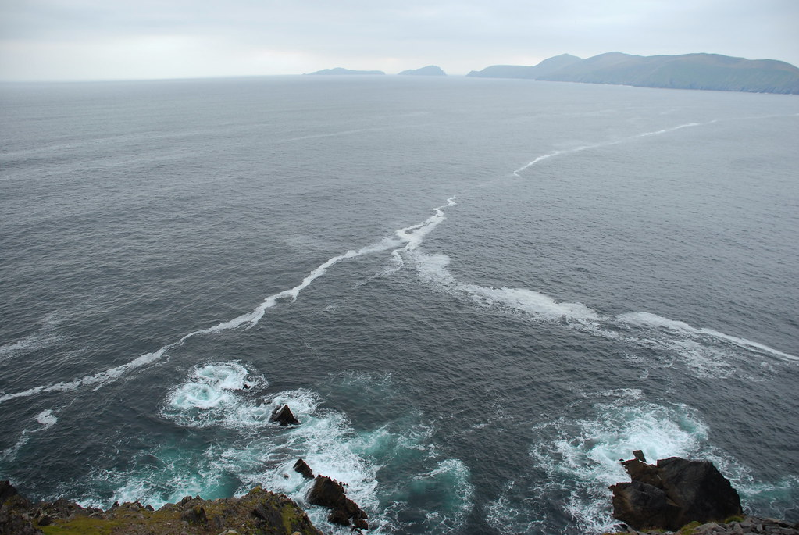

**01/10/2007 - מי אמר פנינסולה ולא קיבל?!**

היום הוא הוקדש רובו ככולו לRing Of Kerry, עם טעימה מDingle Peninsula - אותו נעשה מחר. Ring Of Kerry הוא המסלול(כביש) המקיף את Iveragh Peninsula (חצי אי). התוכנית היא להקיף את חצי האי תוך עצירה בעיירות מטופשות וכל מיני אטרקציות בשקל. הסיבה האמיתית להגיע לכאן היא הנופים - וזאת סיבה מצויינת!

כמעט ולא היו תיירים נוספים מלבדנו, מלבד כמה כבשים שנראו מקומיות וכמובן מלבד זוג הגרמנים אותו אנחנו פוגשים בדרך קבע :) עצרנו בכל מקום שהlonely planet יודע להגיד עליו משהו, התרשמנו והמשכנו. הנופים יחד עם המבנים העתיקים מזג האויר הטוב ומוזיקת האווירה באוטו זה מה שנזכור מRing Of Kerry הנהדרת

חלק גדול מהכבישים בRing Of Kerry צרים בצורה לא הגיונית. מה שלא מפריע להם להיות דו נתיביים. בכל פעם שעובר רכב ממול או שעוצרים בצד אם יש מקום במקרה הטוב, או שמאלתרים משהו. מה שחוייתי באוקטובר - אני מניח, יכול להפוך לסיוט באוגוסט כשיש הרבה תיירים - שלא לדבר על אוטובוסים! בינתיים ה"הימור המטרולוגי" של לטייל אירלנד בסתיו מוכיח את עצמו ובגדול!

רצינו להפליג לSkelling Islands אבל האירים בעצמם לא היו אופטימיים כמונו לגבי מזג האויר, ולא היה עם מי לדבר בכלל לגבי הפלגות. אחרי שנכשלנו בשכנוע שני דייגים מקומיים שלא ממש דיברו אנגלית לקחת אותנו להפלגה פרטית, הסתפקנו בחיסול הגבינות מקורק מול הנוף של האיים. האיים הם בעצם שני שפיצים מחודדים שבולטים מהים, ואירי שכנראה מאד היה חשוב לו להרשים בחורה, בנה שם טירה. על השפיץ הגדול יותר, מסתבר התגוררה קהילה קטנה במשך כמה דורות, מנותקת מהעולם. את ההפלגה נדחה לטיול הבא, בינתיים השמש יצאה ומצאנו לנו מפרצון פרטי לארוחת הצהריים.

בזכות ההספק היפה, ולמרות שממש לא השתדלנו להזדרז, נשאר לנו קצת זמן בערב להספיק משהו מה Dingle Peninsula לפני שנחפש מקום לישון. נסענו את הSlea head, שהומלץ ככביש יפה לנסיעה, לא לפני שטרפנו פיצה עצומה בעיירה קטנה בדרך בשם Milltown. אם עד עכשיו הכבישים היו צרים, כאן זה כבר נהיה מוגזם. ודווקא כשהנסיעה היא על סף תהום :) כאן אפילו האירים הבינו שלצייר קו באמצע הכביש להפרדה בין הנתיבים זה יהיה מגוחך. אז פשוט ויתרו על הקווים ומסתדרים עם מה שיש... הנופים היו מרשימים, של צוקים שבולטים מן הים, והנסיעה היתה חווייתית.

בDingle מצאנו בקלות מקום לינה בשם Moll House. בדינגל יש יותר פאבים מאנשים, נכנסנו לאחד עם הופעה חיה של מוזיקה אירית. היו שירים איריים עם טקסטים מצחיקים, ביצועים אותנטיים, ואווירה מצויינת.

