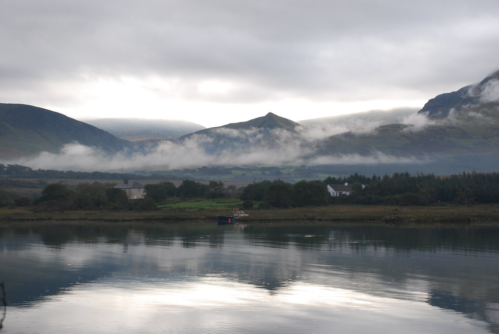
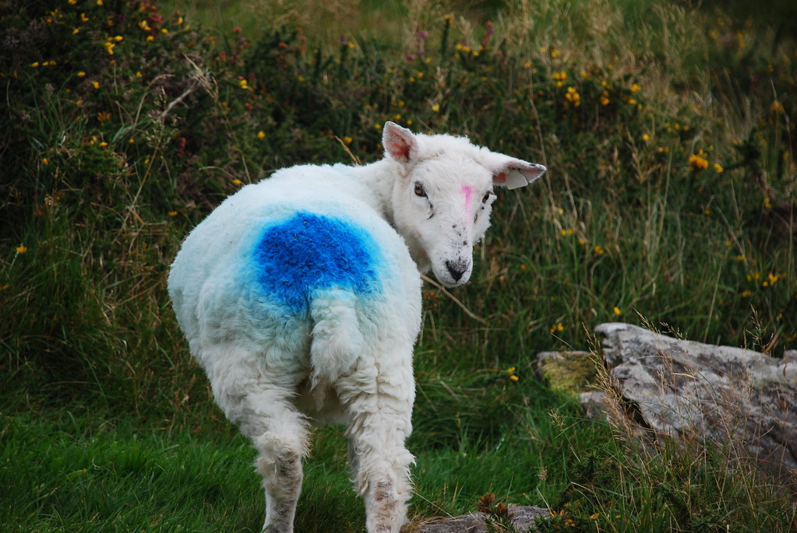
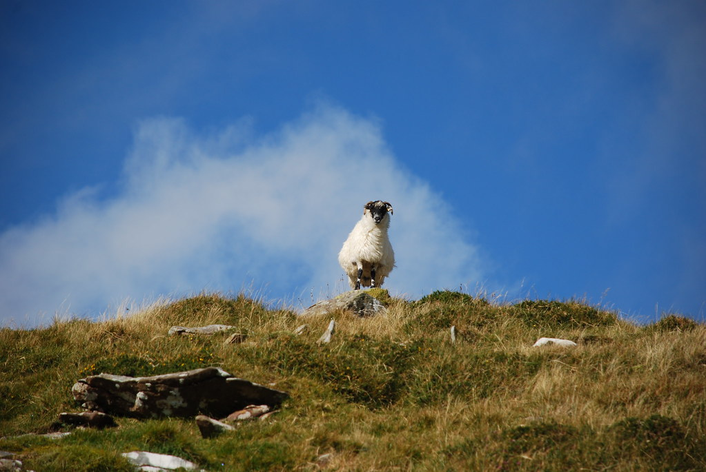
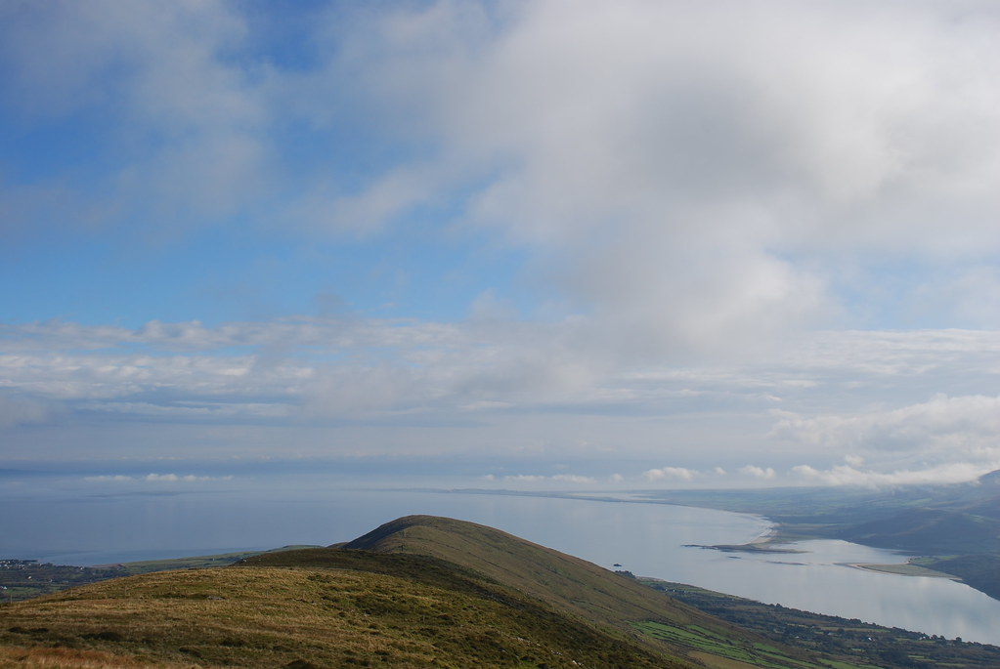
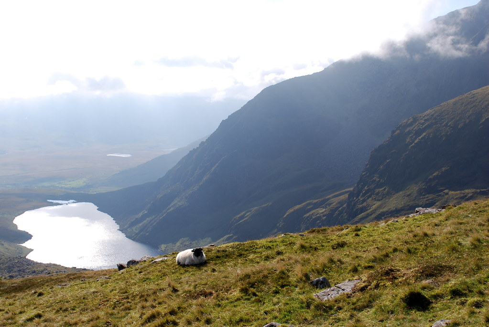
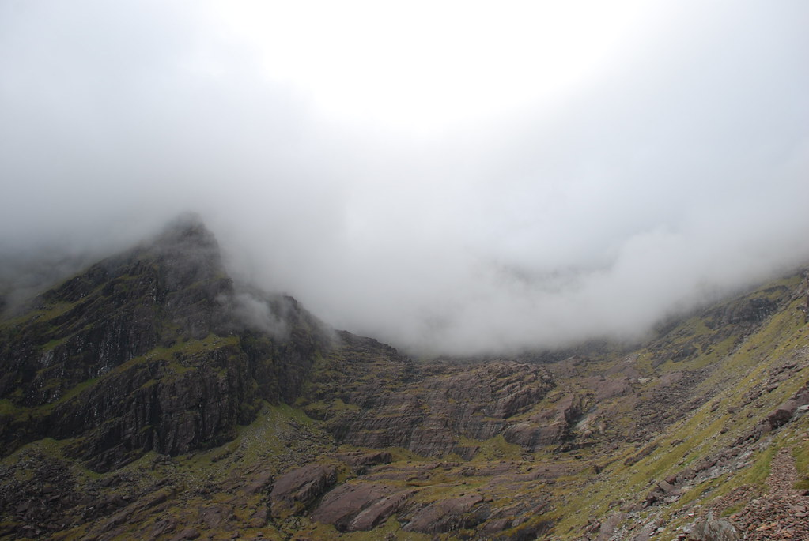
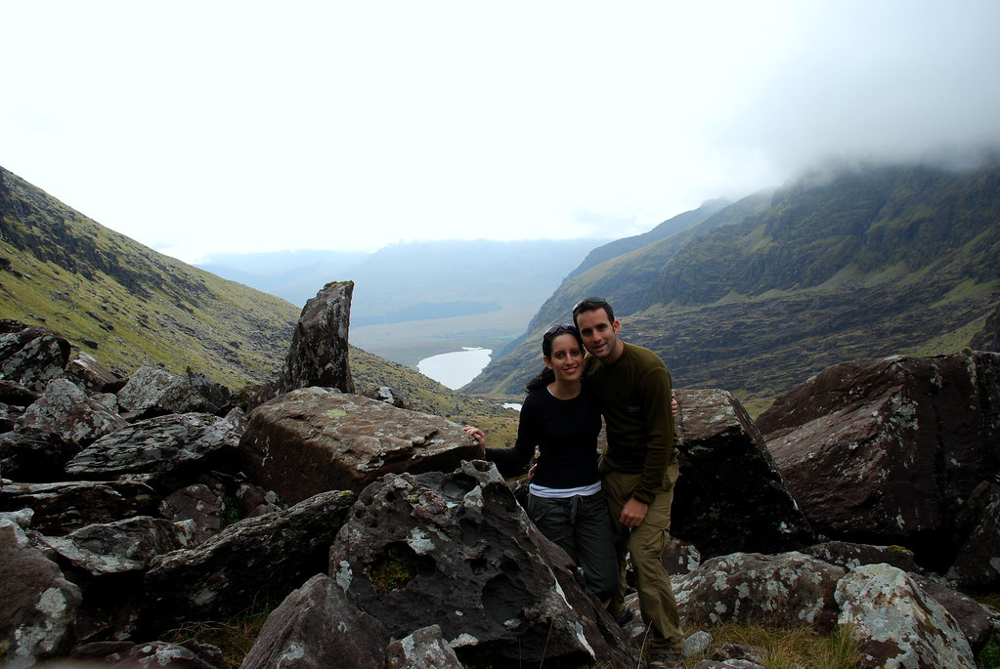
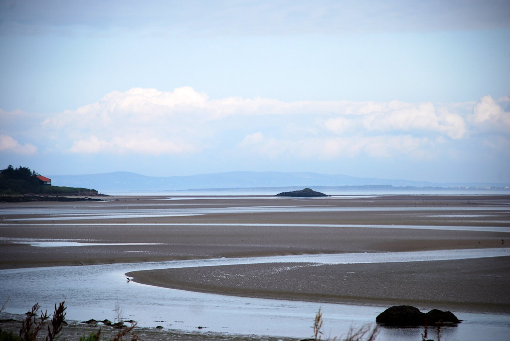
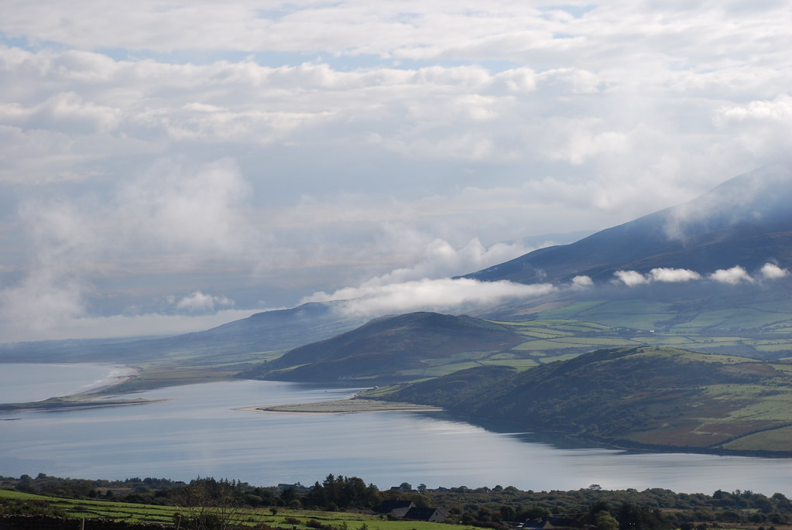

**דינג דונג דינגל**

תוכנית היום היא לטפס על הר ברנדון. ההר השני בגובהו באירלנד (שלא מצטיינת בהרים גבוהים מידי) - טיול יום המוערך בכ7 שעות הליכה לא קלות.

לראשונה בטיול התעוררנו לבוקר גשום ואפרורי. אכלנו את ארוחת הבוקר המסורתית בקצב רגוע, בתקווה שבינתיים משהו ישתנה, אבל הגשם לא התרגש והמשיך לרדת.

שאלתי את בעלת הB&amp;B מה הסיפור של Fungi the dolphin הדולפין ה"מפורסם" של דינגל, והיא מצידה, כאילו כל חייה חיכתה שרק ישאלו אותה, סיפרה איך שבשנות ה60 היה פה דולפין שהתחבר עם הדייגים, והיה מאד חכם. ועד היום לוקחים תיירים למסעות אחרי פנגי בטענה שזה עדיין אותו הדולפין.

לפי הספקנות שלה, הייתי מהמר על זה שאי שם בשנות ה60 מישהי סעדה את ליבה במרק דולפינים ב"נוסח פנגי" :) בכל מקרה, גם שיחות על מרקים, דולפינים ומה שביניהם (בעלת הB&amp;B עם מטחנת דולפינים) לא העבירו את הגשם - יוצאים לדרך כאילו אין גשם!

הגענו ללשכת התיירות של Cloghane רק כדי לגלות שהיא סגורה לרגל שיפוצים. הרמז התחיל לחלחל, וישבנו באוטו בגשם לחפש תוכנית חלופית להיום. במהלך הישיבה עם ספר והדפים, ובדיוק כשכבר פחות או יותר הסכמנו על הפתרון של לנסוע ללימריק, למרות שלא כל כך התחשק, הרמנו את הראש מהדפים כדי לגלות שקרן שמש יצאה מבין העננים, ואיתה התקווה חדשה! יצאנו מהאוטו, והגשם התחיל להחלש, עד שלאט לאט נפסק לחלוטין.

החלטנו לחזור לתוכנית המקורית, ולנסוע אל ההר. בשביל צר ומפותל נסענו לכיוון הר ברנדון. כשהגענו היינו כרגיל הרכב היחיד ב"חניון". בחניון היה שלט גדול ומפורט עם המון אזהרות לגבי המסלול - יש לקחת מצפן, בגדים לכל מזג אויר, אוכל, שתיה, נעלי טיולים, אזהרה לא לטייל במסלול לבד ועוד די הרבה אזהרות והמלצות באותה הרוח... ארזנו מעילי גשם, כמה בננות ואת ארוחת הצהרים ויצאנו לדרך.

אני חייב לציין לזכותה של יעל, שהרבה בנות אחרות היו עושות צרות על כל הסיטואציה - לשכת התיירות הסגורה, הגשם שרק הרגע פסק, ועכשיו השלט המטורף! עד שיצאנו, השמש כבר היתה בשיאה.

הסלול התחיל בעליה קשה, כשהשביל לא היה כל כך מסודר. בנוסף לשלט האזהרות והאיסורים, היו מספר שלטים קטנים שאסרו על הכנסת כלבים לשטח ההר.  
בהתחלה ממש לא הבנתי מה רוצים פה בדינגל מהכלבים, למי הם עשו משהו רע?! מהר מאד הבנתי את שלטי הכלבים, משום שהמסלול היה מלא בכבשים ותיישים בכמויות! התיישים שעמדו על השביל, ברחו באימה ככל שהתקרבנו, בדיוק באותו אופן בו יעל היתה בורחת אם הם היו מתקרבים :)

הכבשים היו מרוססות בצבעים שונים, כדי שהאיכרים ידעו למי הן שייכות וגם כדי שנדע איזו קבוצת כדורגל הן אוהדות.

ככל שטיפסנו יותר, התגלה לנו יותר ויותר ממפרץ ברנדון שהיווה תפאורה מדהימה לטיפוס.

באיזשהו שלב יעל התחילה קצת להתלונן, אבל אני הגעתי מוכן! חוץ מהפסקת בננות לחיזוק כושר הטיפוס, ציידתי אותה בהבטחה שכשנגיע לדבלין אני אהיה ה"ביץ'" שלה, ותרוצץ אחריה רק כדי להחזיק את כל שקיות הקניות שלה :) *  
\* תקף בהגעה לפסגה בלבד...

בשלב מסויים התחלף סוג הקרקע לקרקע בוצית קצת עם הרבה שלוליות וקצת מים זורמים בינהן, מה שהאט את קצב ההליכה. לאחר כחצי שעה, תוי הדרך שוב השתנה, ועכשיו היה סלעי - עם סלעים חדים (מעיין בולדרים..) התחלנו להתקרב לאיזור הפסגות, ולפנינו נגלה אגם קטן

משם נכנסנו אל בין רכסי ההרים, לעמק סלעי מהמם. כאן גילינו שבאירלנד, כמו שמזג אויר אפרורי יכול להעלם, הוא גם יכול לחזור. הפעם לבוש בצורה של גדוד עננים לבנים שפלשו לתוך העמק ובמהירות לא הגיוניות התחילו לכסות את כולו. אחרי קצת התלבטויות וכשראינו שהעננים כאן כדי להשאר, לקחנו את ההחלטה האחראית והתחלנו לחזור...

למרות שלא הגענו ממש עד הפסגה, הטיול היום היה מצויין! ראינו הרבה נופים - שונים ממה שראינו עד עכשיו בטיול. חזרנו לארוחת הגבינות המסורתית מאחורי לשכת התיירות הנטושה של Cloghane. המקום היה יפה, והיו שם המון ציפורים שהוסיפו פסקול מגניב לארוחת הצהריים .

מכאן המשכנו בנסיעה לכיוון האטרקציה הבאה (צוקי מוהר) עברנו דרך עיר, או יותר נכון עיירה (אולי כפר.. - לא! Shit hole רציני!) עם תחנת רוח מטופשת במיוחד. המשכנו דרך Tralee, משם ל Listowel - שם עברנו ב Europe Park וחזינו באנדרטה היחידה באירלנד לזכר נספי השואה (מאד ציוני מצידנו..) משם לקחנו את מעבורת המכוניות מ Trabert ל Kilmer, והמשכנו כדי ללון ב Kilrush.

מצאנו חיש מהר B&amp;B יפה במחיר סביר (35 Euro pp כולל א. בוקר) בערב ראינו את Manchester Utd. מנצחת 1-0 את Roma בליגת האלופות (רוני) בגלל החוֹרִיוּת של המקום, ולמרות שהיו מלא פאבים שמראים את המשחק, לא היו הרבה אנשים, אז לא ממש היתה אוירת ליגת האלופות...

תובנות:

- שאלתי ב B&amp;B מה משמעות הקידומת Kil שיש פה לכל הערים, והתשובה היא, שכל עיר שנקראת על שם הכנסיה בה, מתחילה ב Kil, ומשמעות המילה Kil=Church.
- כל הפאבים באירלנד הם "פאבים איריים" :)
- האירים אוהבים לעשות הכל הפוך: נוהגים הפוך, שמים מלח בפלפליה, ופלפל במלחיה - ואפולו את המפתח בדלתות צריכים לתקוע הפוך!

המשך יבוא...
