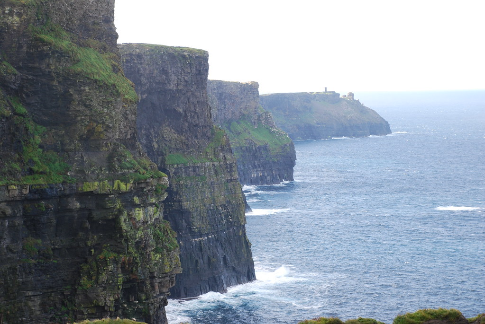
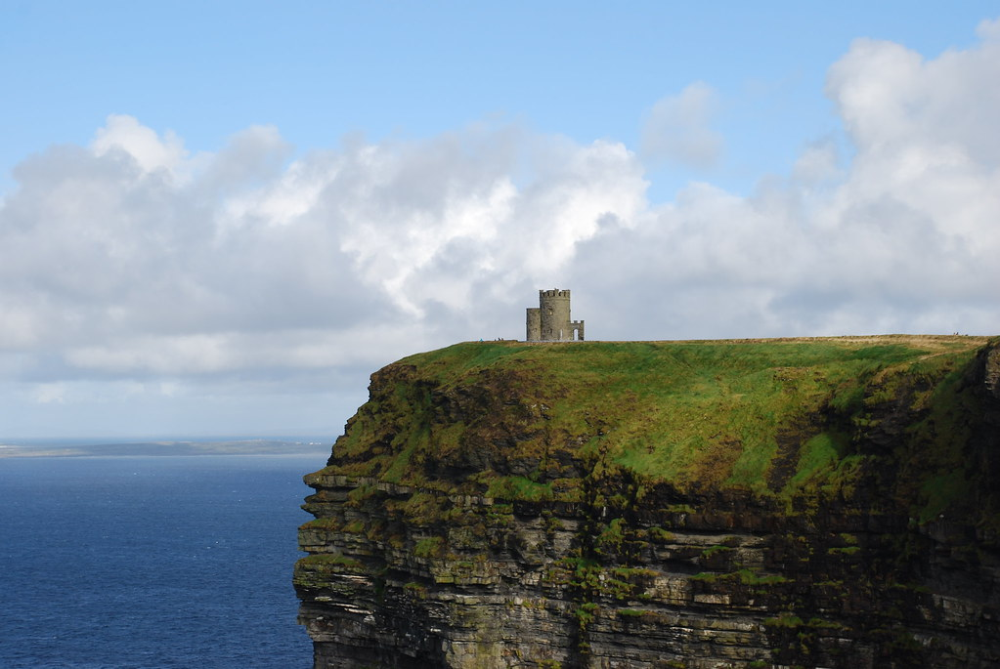
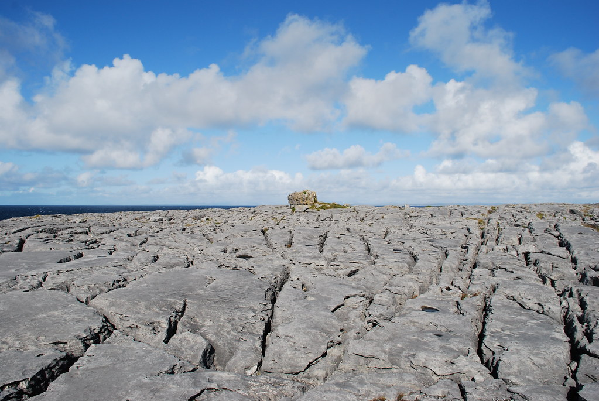
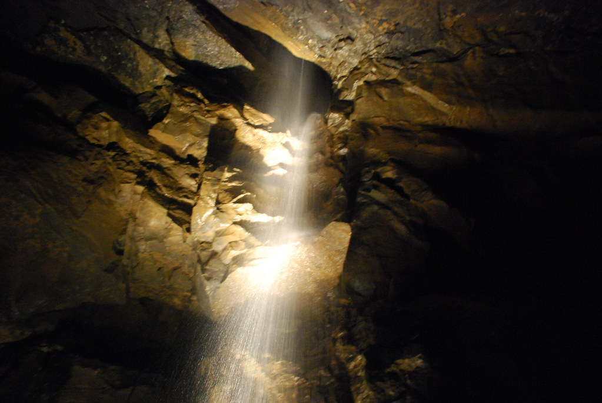
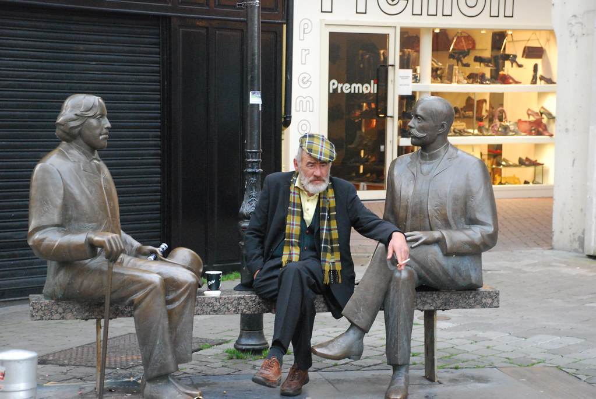
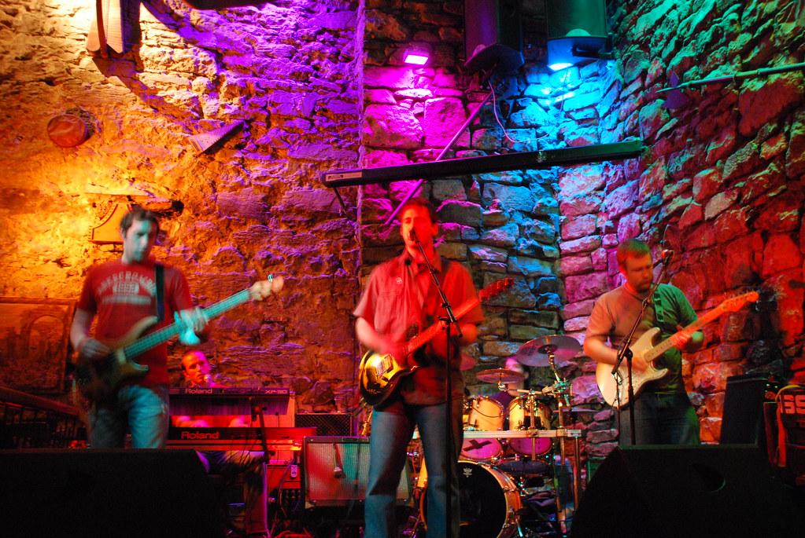

**03/10/2007 – Clare County**

היום הטיילנו בClare County. התעוררנו לבוקר גשום בKilrush.

לראשונה בטיול לא סיימתי את הFull Irish breakfast שלי, בעיקר מפני שהיא שחתה בשמן (או לפי מלעיזים שלא אנקוב בשמם - בשומן של חזיר בר).

למרות הגשם, לא ממש היתה לנו ברירה, אז פשוט המשכנו באסטרטגיית "הראש בקיר” או אולי ה”ראש בקור” – נוסעים אל היעד הבא כאילו אין גשם.

היעד הראשון שלנו להיום הוא היעד המפורסם ביותר של אירלנד – צוקי מוהר.

אמנם שילמנו על החניה 8 יורו, אך למזלנו במחיר היתה כלולה השמש!  
ברגע שחנינו, נפסק הגשם, והשמש הציצה אלינו מבין מהעננים – כאילו התעוררה מאוחר עם Hangover בניחוח של Guinness. מחיר הוגן למדי בשביל פעלולנות אסטרונומית מהוקצעת ומתוזמנת היטב.  
גם הגשם של הבוקר היה גשם ברכה, מכיוון שבלעדיו המקום היה מוצף בשלוליות תיירים.

הצוקים ממוסחרים בצורה קצת מוגזמת – בנוסף לחניון העצום והיקר, היו מלא חנויות תיירים, מקום לעשרות אוטובוסים והשיא - פרות כלואות בתוך גדר חשמלית כאשר הן מְצוּות לֶהֵראוֹת בסביבתן הטבעית. הLonely Planet הטיב לתאר את הצוקים כ”קרקס תיירות”.  
למרות הקיטרוגים, הצוקים באמת מרשימים. הסתובבנו והבטנו בהם מכל הזוויות ש”קרקס התיירות” החליט שאנחנו צריכים להביט מהן, וברגע שהמקום התחיל להיות עמוס בתיירים, התקפלנו והמשכנו ליעד הבא.

מהצוקים התחלנו להתקדם צפונה לכיוון Galway.  
לא היה קשה לשים לב מתי מתחיל אזור הBurren. פתאום במקום הירוק הרגיל של אירלנד, הנוף התחלף בנוף דרמטי למדי – כל הBurren נראה כמו סלע אחד ענק וסדוק, וחולש על חופים בצבע כחול כהה מהמם.

בBurren ביקרנו באתר, שגולת הכותרת בו הוא מערה בו נמצאו עצמותיו של דב הוז. חוץ מזה שהאתר היה שוד לאור יום, ושלא היה למקום שום קשר אמיתי לדב הוז, הסיור היה מרשים, ועזר  
לחוות בצורה נוספת את הנוף המיוחד של הBurren (ולטעום כל מיני גבינות)

המשכנו את המסע לGalway כשבדרך עצרנו בעוד כמה טירות ועיירות מנומנמות.  
בGalway למרות שהיא עיר יחסית גדולה, מצאנו B&amp;B נחמד עם חניה יחסים בקלות. אחרי מנוחה קלה, יצאנו לראות את ה”אטרקציות” של Galway.  
אין פה באמת משהו מיוחד לראות – כנסייה של סנטה קלאוס, שאולי קולומבוס עבר לידה בדרכו למסעו המפורסם, “שער ספרדי” לא ממש ברור, וטירה שהיא לא ממש טירה.  
אהבנו את Galway בגלל האוירה הטובה בעיר. העיר, שנחשבת לעיר סטודנטים, הציעה מגוון מקומות בילוי.

בערב, אחרי שראינו את יוסי בניון וליברפול מפסידים 1-0 למארסיי בליגת האלופות, הלכנו להמתיק את הגול בהופעה בפאב ה King’s head. פאב שממוקם במבנה עתיק ומרשים יותר מהטירה של העיר..

