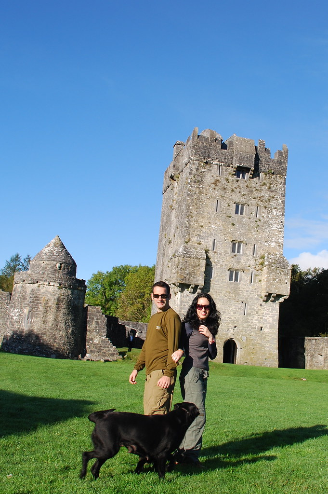
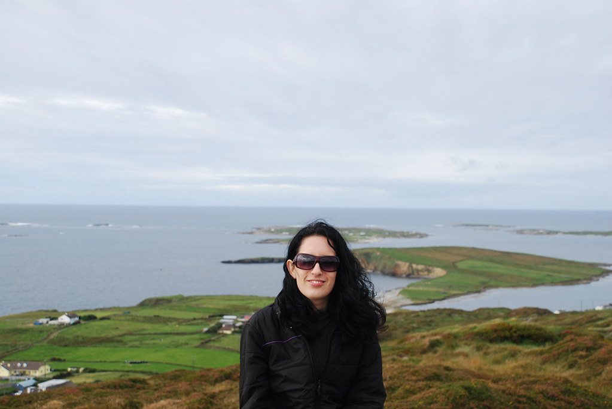
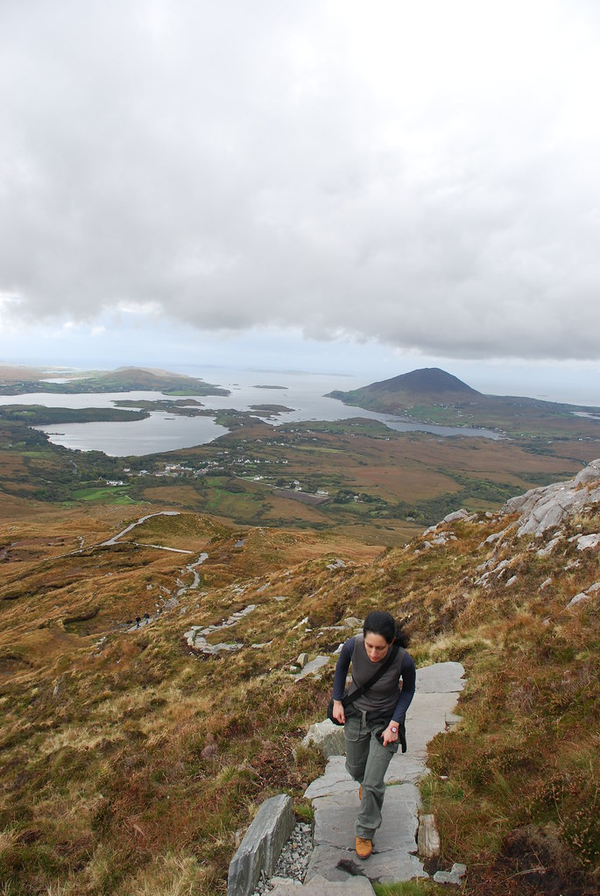
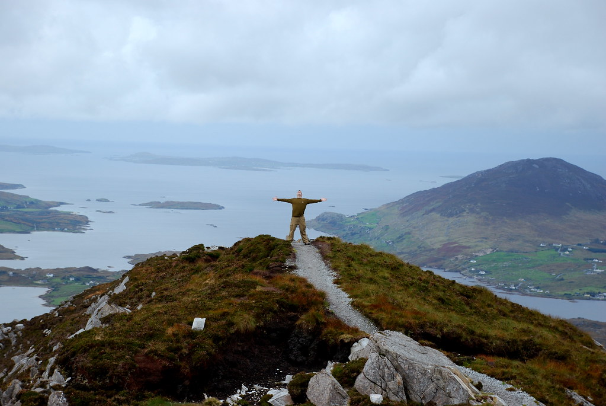
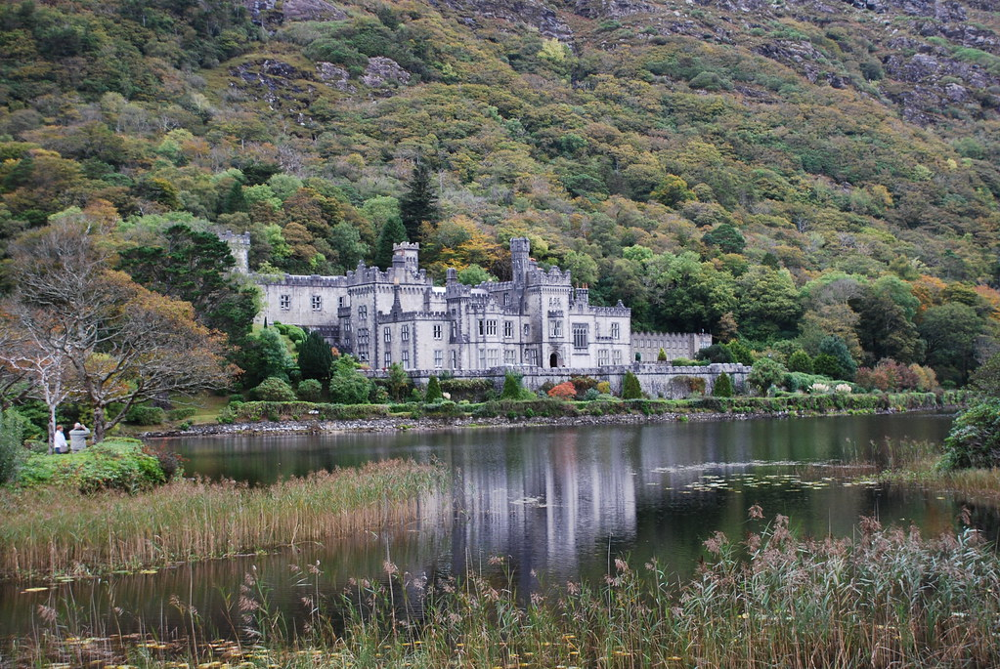

**04/10/2007 – Welcome to Bogland**

היום הטיילנו בGalway County. הB&amp;B בGalway היה שונה קצת מהמקומות הקודמים בהם ישננו. הרהיטים היו בצבע זהב, ארוחת הבוקר לא היתה הארוחה הכבדה המסורתית, אלא גבינות, נקניקים, ואפילו קצת פירות(!).

המקום נוהל על ידי אם ובתה, שאמרו שהן חושבות שישראל מאד נחמדה, כי הן טיילו במצרים וזה בטח בדיוק אותו הדבר…  
בכל מקרה, מה שנזכור מהמקום הזה, זה את “תקרית המפתחות הגדולה” -

היינו בטוחים שאיבדנו את המפתחות של הרכב, ובדיוק לפני שהתחלנו לצעוד לפאב בו ראינו הופעה אתמול בערב לחפש את המפתחות, מצאנו אותם מתחת למיטה (המוזהבת).

השמש יצאה מבין העננים, ואנחנו יצאנו לדרך.  
בתפקיד “הטירה היומית שבמילא נמצאת בדרך” ביקרנו ב”טירת הכלבים” שהיא בעצם Aughnanure Castle. מדובר בעוד עוד טירה נחמדה כאשר שני דברים ייחדו את הטירה מטירות קודמות בהן ביקרנו.  
האחד הוא הכיתוב המעניין שנתן הסברים על תפקוד החדרים בטירה, והשני הוא כלבה שחורה וענקית, מלווה בגור קטן ומקסים שהסתובבו איתנו במשך כל הביקור בטירה, והעניקו לטירה את כינויה.

שוב היינו האנשים היחידים במקום, מה שעזר לדמיין שאנחנו בעלי הטירה :)

משם המשכנו עם לכיוון Clifden, בה עצרנו לקבל קצת מידע בלשכת התיירות.  
החלטנו להתרשם מClifden Sky Road עם הרכב (במקום ברגל או עם אופניים) ומשם להמשיך לConnemara national park.  
מה- Sky Road היו נופים יפים, אבל לא עצרנו יותר מידי כדי שיספיק לנו הזמן ל National Park.

הכינוי של איזור Connemara הוא Bogland – ארץ הביצות. הסיבה לכינוי הוא שהאיזור שופע מים עד כדי כך שבהרבה מהשטח הקרקע תמיד רטובה ובוצית.

בConnemara National Park עשינו שילוב של שני מסלולים מעגליים, מסלול אחד בביצות, והשני טיפוס על הDiamond hill.הנופים בפארק היו עוצרי נשימה!  
לקראת הפסגה, הטיפוס התחיל להיות קשה ואפילו קצת מסוכן, בגלל רוח חזקה במיוחד שאיימה להעיף חזרה חזרה ארצה.

בפסגת ההר מצאנו לנו מחסה מהרוח מאחורי סלע ענק כדי לאכול את ארוחת הצהריים המסורתית שלנו הכוללת סנדביצ’ים עם גבינות מקומיות ועגבניות. כשהיום לראשונה הוספנו גם חסה לחגיגה.  
המצב היה קצת דימיוני כאשר מצידו האחד של הסלע אנחנו יושבים לאכול ונהנים מהנוף, בעוד שמצידו השני בקושי אפשר לעמוד בשל רוח קפואה שנושבת במהירות מופרזת.

מה Connemara National Park המשכנו ל Kylemore Abbey, עוד כנסיה\\טירה שמאד יפה מבחוץ, אבל בזבוז זמן גמור מבפנים. גם הגנים שהיו בה נראו כמו גינה של לובי בבניין בן 100 בתל אביב.

את הלילה העברנו ב Westport, ב B&amp;B נחמד בשם Mc’Carthys, ואכלנו ארוחת ערב טעימה בCosy Joe’s.

לילה טוב..
