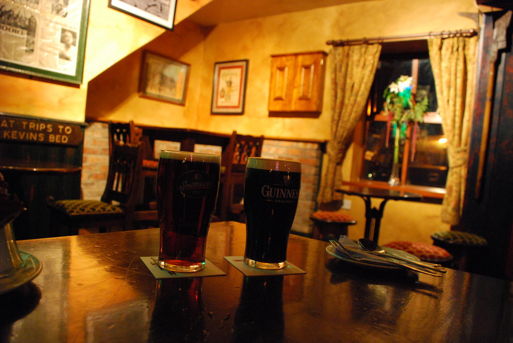

בשעה טובה ומוצלחת החלטתי לפנות זמן ולתעד את הטיול שלנו לאירלנד. לטובת המטיילים הבאים ובעיקר כדי שלא נשכח... אחרת בשביל מה כל זה?!

**26/09/24007 - היום הראשון**

לפני הכל - חשוב לציין שהיום הראשון לטיול היה גם מעניין מבחינה היסטורית - זו היתה הפעם הראשונה שישנתי בבית של יעל :)

אחרי טיסת connection מלונדון נחתנו בשעה טובה ומוצלחת בדבלין.

מבלי לבזבז זמן מייד הלכנו לקבל את האוטו (ההפוך) שחיכה לנו (Nissan Almera)

נכנסנו בהתלהבות לאוטו כדי להתחיל את הטיול.

ביקשתי מיעל להכניס לתא הכפפות את "שוקולד הנסיעה" שהוכן מבעוד מועד כדי לשמור על עירנותי.

יעל נראתה לרגע מבולבלת - "אין באוטו הזה תא כפפות ?!" אני בודק - "גם אין באוטו הזה הגה!"

התחלפנו במקומות ההפוכים שלנו כדי להתחיל את הנסיעה ברגל...שמאל.. כלומר ימין - רק הפוך..

אחרי כמה טיפוסים קלים על מדרכות בחניון שדה התעופה התאפסנו ויצאנו כשפנינו מועדות דרומה.

את הלילה הראשון העברנו ב Laragh שב County Wicklow, רק בשביל להיות בנק' יציאה טובה לGlendalough - האטרקציה הראשונה שלנו בארץ הירוקה.

ישנו בB&amp;B ליד Laragh שנקרא Glendale אותו הזמנו במחיר סביר מהארץ אחרי התכתבות בemail עם בעל המקום.

זה היה המקום היחיד פרט לדבלין שהזמנו מהארץ, והוא התגלה כהצלחה. (חמישה כוכבי נמלה על הניקיון)

יצאנו לאכול בפּוּב המקומי של Laragh (זאת לא טעות, במבטא האירי יש לבטא פּוּב בדיוק כמו דוּבּלין) :) אכלנו Guinness stew עם פירה וsoda bread המסורתי. היה מוצלח במיוחד.

שתינו Guinness ועוד בירה אירית מהרשימה של - "צריך לנסות" smithwick's רק כדי להעביר את השניה לרשימת ה"אין צורך לנסות"

זכינו גם לראות בשידור חי את הניצחון הראשון של אברם גרנט עם צ'לסי 4-0 על קבוצה מליגה ז' בגביע

הלכנו לישון מרוצים, לא לפני שמילאנו לראשונה בטיול את הפתקים המגניבים בהם בוחרים את ארוחת הבוקר שלך. אני כמובן בלי להתבלבל בחרתי ב Full Irish Breakfast, יעל מצידה הלכה על משהו קצת פחות "חזירי"

**27/09/2007 - מעמק שני האגמים עד קילקני בקילקני** קמנו מוקדם, אכלנו את ארוחת הבוקר הנהדרת כשהכל כבר ארוז באוטו מחכה לנסיעה. עם קיבה מלאה במאכלים המופקים מאיבריה השונים והמשונים של החיה חזיר, נסענו נסיעה של 5-10 דק' וחנינו בכניסה לGlendalough - יש לבטא גלנדלוך, והמשמעות - עמק האגמים...

מזג האוויר האיר לנו פנים, והשמש חייכה אלינו בשמיים מבעד מעט עננים. בחניון, אירי שלבוש כריינג'ר עם מגרפה, שקשה היה לבחור האם לסווג אותו כ"חביב כמו Yogi bear, או רוצח סידרתי שאוכל את גרוגרות קורבנותיו, המליץ באדיבות ליעל להצטייד במשהו חם יותר ללבוש (נחזור אליו בהמשך - אל דאגה, לגרוגרותיינו שלום)

התייעצנו בכניסה עם אירי חביב נוסף לגבי המסלול ורכשנו מפה. בחרנו במסלול הכי אתגרי שיש למקום להציע שנקרא "The Spinc" מסלול באורך 11km שמקיף את שני האגמים.

המסלול היה מאד מוצלח מבחינת הנופים, וסביר מבחינת הקושי - תלול במספר קטעים, וקטע אחד ארוך של 600 מדרגות עץ רצופות. המסלול כולו מסודר, ובקטעים שצריך יש שביל מגניב מעץ שהונח על ידי עבדים אירים.

מפאת העונה ושעת הבוקר המוקדמת, לא היו כמעט עוד מטיילים, והיה אפשר הרבה יותר להרגיש את הטבע. למרות ההבטחות, רוב החיות שזכינו לראות היו מפוחלצות בבקתות שהיו מרוכזות באיזור תחילת המסלולים.

לקראת סוף המסלול יעל פתאום נזכרה לשאול - "תגיד, איפה המשקפיים שלך ?"... אחרי כמה קללות ודפדוף בתמונות המסקנה היתה שהמשקפיים הוסרו לצורך צילום תמונה בדיוק בנק' שבקצה 600 המדרגות הידועות לשמצה :) בתמונה הבאה ניתן לחזות ברגעיהם האחרונים של המשקפיים שלי

מכיוון שאני בתור "אדם לא אחראי" - אחראי, ודאגתי להביא זוג נוסף של משקפים, ומכיוון שממש לא היה לנו כח לטפס שוב את הטיפוס התלול, השתעשעתי במחשבה של ויתור. הלכנו לשאול בביקתה בכניסה האם מישהו מצא משהו. אבל כשהלכנו למצוא אתונות - מצאנו את המלוכה:

כמו בכל סיפור טוב - זללן גרוגרות שמופיע במערכה הראשונה - סופו להתיר את הסתבכות העלילה במערכה האחרונה! (או לחילופין לזלול את גרוגרות כל הדמויות ולקנח בסצינת ניקוי השיניים עם קיסם)

הריינג'ר החביב למדי הביא את הג'יפ שלו והתחיל לטפס איתנו מסביב למסלול.

הוא הביא אותנו עד ממש לשלב שמתחילות 600 המדרגות ואפילו טיפס איתנו עד לפסגה

המשקפיים לעולם כבר לא ימצאו, אבל לפחות הכרנו חבר חדש. היה נחמד לשוחח עם מקומי - מוזר ככל שיהיה. והוא מצידו שמח לספר לנו על כל השקפת עולמו - כמה שהוא שונא דת ודתיים, הוא השתלח ב"מיתוס ברית המילה" - "אם נולדת עם זה, זה כנראה צריך להיות שם" הוא אפילו הפליא בידיעותיו על העם היהודי וסיפר שהוא בדיוק צפה בתוכנית שואה... החבר שלו בביקתת הכניסה המליץ לנו לנסוע כבר היום לקילקני ולישון שם לקראת היעדים הבאים שלנו למחרת. הוא גם טרח לעדכן אותנו שיוסי בניון הכניס a pitch of a goal - הראשון שלנו בליברפול!

אחרי קצת פחות משעתיים נסיעה הגענו לקילקני. בקלות מצאנו B&amp;B במרכז העיירה(בשם Dally's) ויצאנו לתור את העיר לפני שמחשיך. ביקרנו בקתדרלה כפי שהומלץ בlonely planet - ובטירה הסתפקנו במבט מבחוץ - עוד יהיו לנו המון טירות... האטרקציה האמיתית בקילקני היא העיירה עצמה, מבנים עתיקים מתערבבים עם בניה חדשה, ואווירה כללית נחמדה - לא משהו לספר עליו לדורות הבאים.

סגרנו את היום כמובן תוך שתיית "קילקני בקילקני" - את המבשלה, מסתבר, העבירו מזמן לדבלין - אבל בכל זאת - לזכר ימים עברו.

המשך יבוא...
