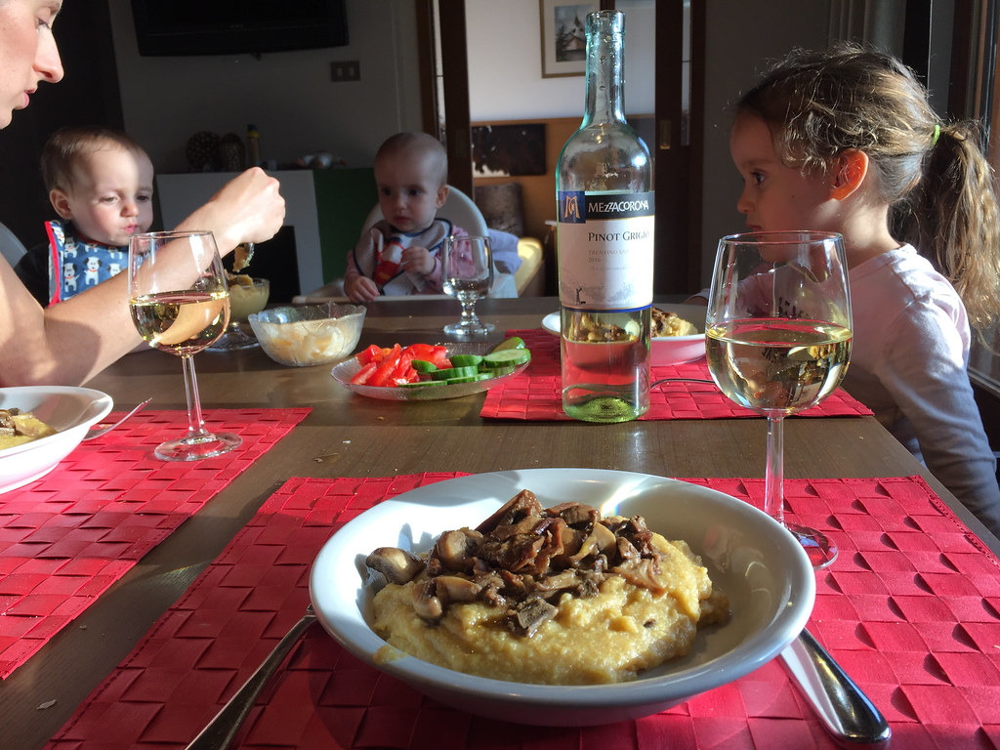

עוד יום טיול מרובה תינוקות בדולומיטים עבר עלינו בהצלחה. היום טיילנו באגם קארצה (Karersee) - אגם קטן על גבול השלולית אך מרהיב ביופיו בשל אשליית הצבעוניות של מימיו. האגם נגיש מאד מהכביש וחציו אף מוקף שבילים המתאימים לעגלות, לנכים ולסתם עצלנים.

למי שמעוניין בבלבולי ביצים, יש גם סיפור על בת ים ומכשף שניפץ את הקשת בענן בתוך האגם - אבל תאלצו לחפש את מבוקשכם באתר אחר... האגם באמת יפה ובשעות הבוקר המוקדמות גם לא עמוס מידי במטיילים. הקפנו בקלילות את השלולית וחזרנו לאורטיזיי כדי לטייל בעיירה ולהשתולל קצת בחצר הצימר.

הערב בפינת הבישול האיטלקי - הפיטריות המפורסמות של אורטיזיי פוגשות את הפולנטה האיטלקית הקלאסית - ללקק את האצבעות! איזה כיף לקנות פה את המצרכים הטריים, לבשל ולהציף את המטבח בניחוחות של איטליה. עם כל הגלובליזציה אפשר היה לחשוב שבכל מקום אוכל זה אוכל - במיוחד המטבח האיטלקי הסטנדרטי - איזה תענוג להתבדות.

מחר יום הולדת 4 לשרלוט! בערב הסתובבנו בעיר וחמקנו ממנה כדי לקנות לה בלונים וכל מיני הפתעות. איזו התרגשות :)
