הבוקר נפרדנו מהפרות בBrentonico ויצאנו לחלק השני של הטיול בדולומיטים. התחנה הראשונה בנסיעה היתה ביקור קצר במפל Cavalese. מהחניון ניתן להגיע ישירות למפל, אך הוספנו מסלול קצר באיזור כדי לעשות קצת פעילות.

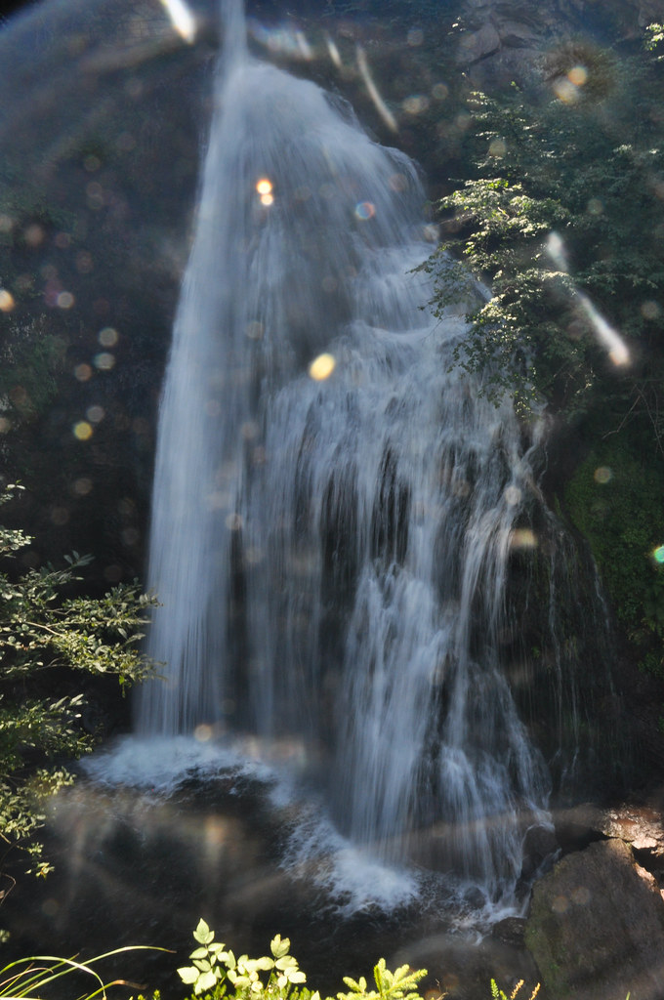
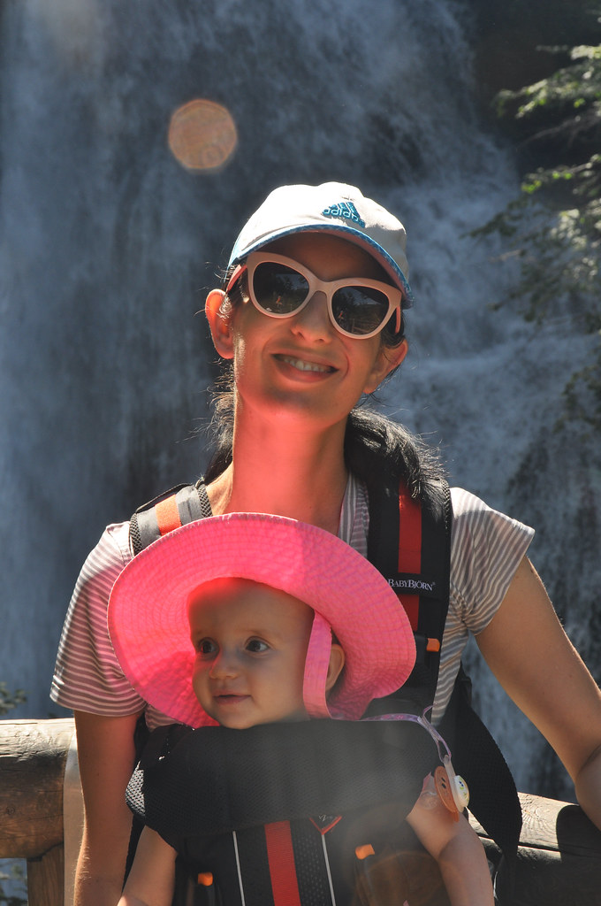

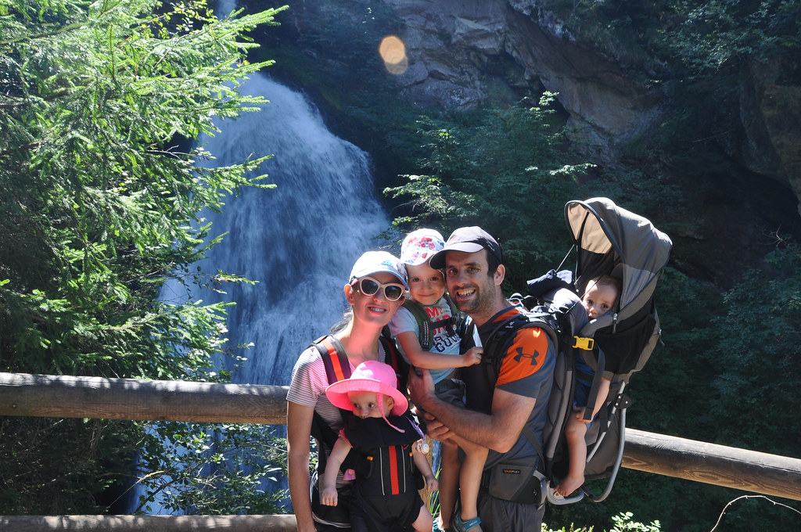

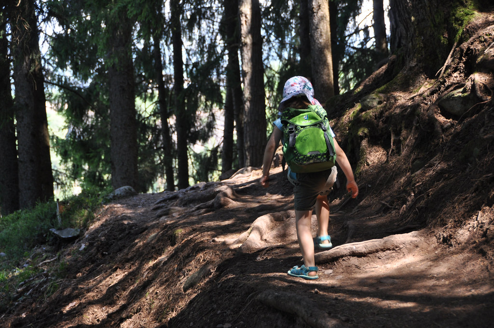

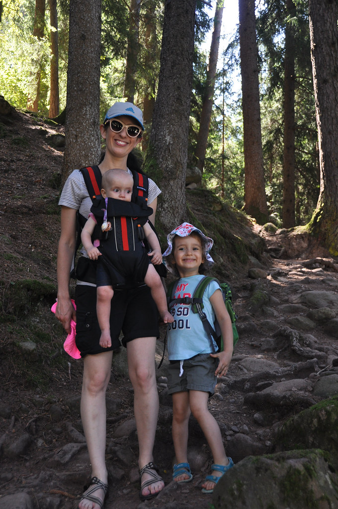

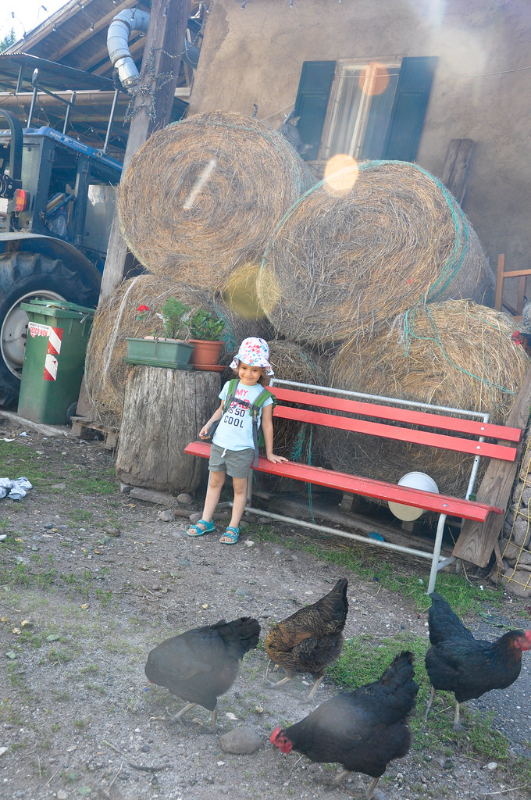
משם המשכנו לאגם Kalterer See, שנחשב לאתר נופש פופולארי בעיקר עבור מקומיים. מפני שבכל קילומטר בערך יש כאן אגם שליו ויפה - משמשים הרבה מהאגמים בתור מעיין קאנטרי קלאב עירוני. הכניסה לחוף האגם מותנית בתשלום ובאתר כרי דשא, בריכה וכמובן - אגם המשמש לרחצה. באיזור האגם לראשונה שמנו לב שהאיטלקית התחלפה בגרמנית ובהתאם גם אופי המקום (בניה, מראה התושבים וכו..). אך הזיכרון שכנראה יחקק בזיכרוננו מהמקום הוא 100% איטלקי: בנוסף לכריכים שהכנו, חשבתי לקנות משהו קטן לילדים בקיוסק של הבריכה. כשראיתי שיש שם פיצות - לא חשבתי פעמיים. הפיצות הקטנטנות, שהחליפו את ה״פיתה עם נקניקיה וצ׳יפס״ שהיו מוכרים לי בסיטואציה המקבילה בארץ, לא היו מביישות פיצריה מקצועית - איזה כיף עם האוכל כאן באיטליה :)

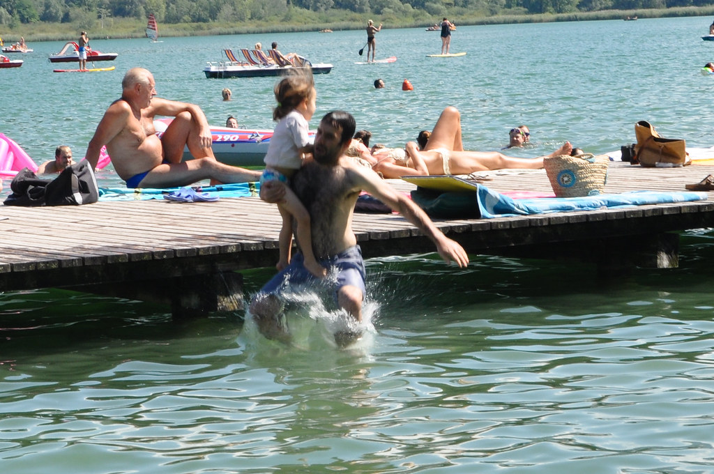
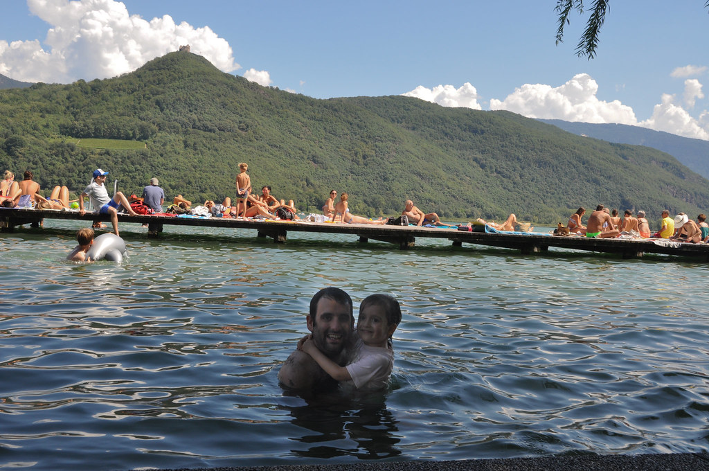

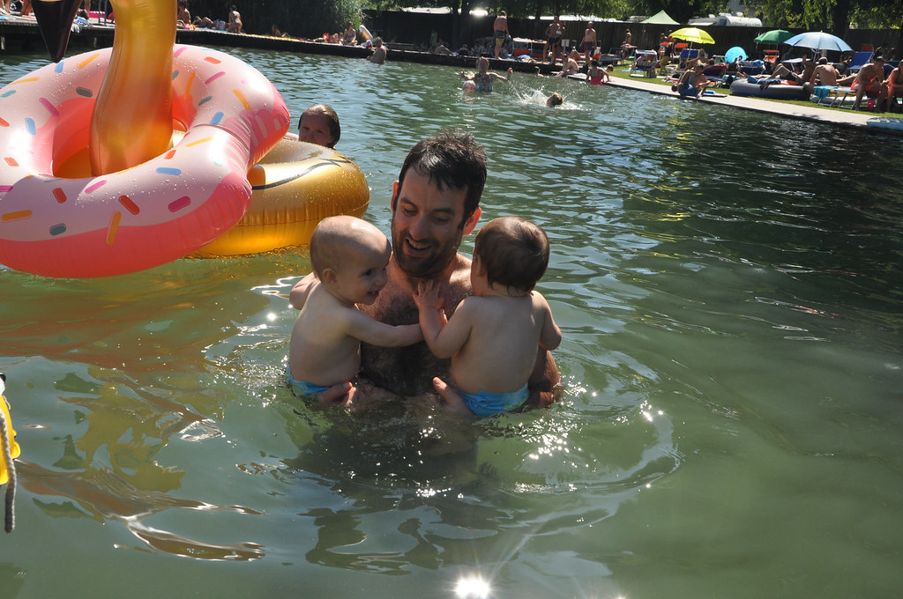

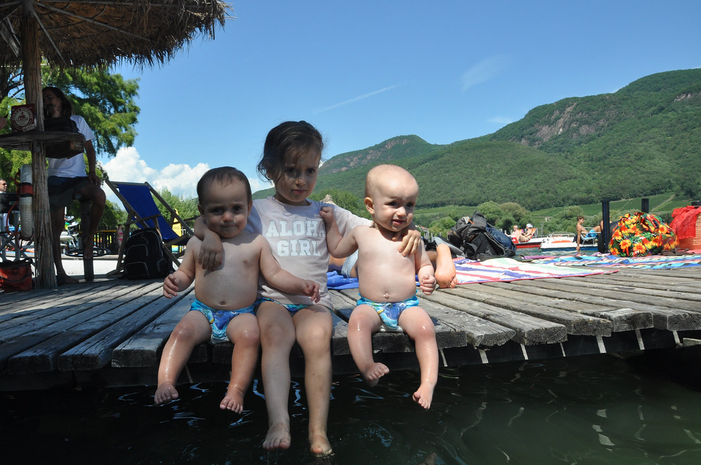
מקום המגורים שלנו בדולומיטים היה צימר בעיירה Ortisei. אורטיזיי, או בלדינו אוח-טי-ז׳אי (Urtijëi) היא עיירת סקי קלאסית שנמצאת בלב העמק Val Gardena באיזור המכונה South Tyrol. כפי ששם האיזור מרמז, אופי המקום והשפה הרבה יותר אוסטרי מאיטלקי אך לא נצפו אוסטרים אוחזים שלטי ״די לכיבוש״. הצימר אמנם לא היה חווה כמו בBrentonico, אך מספר הפרות איתן חלקנו את המקום היה פחות או יותר זהה. מעצב הפנים של הצימר היה כנראה פושט עורות וכל הצימר היה מעוטר בחלקי פרה שונים ומשונים.

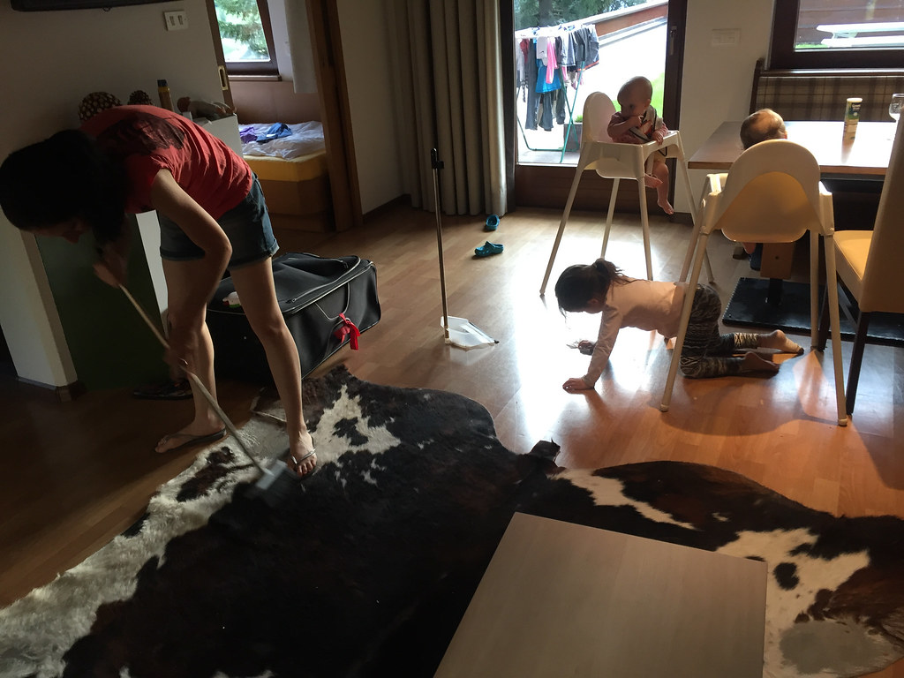
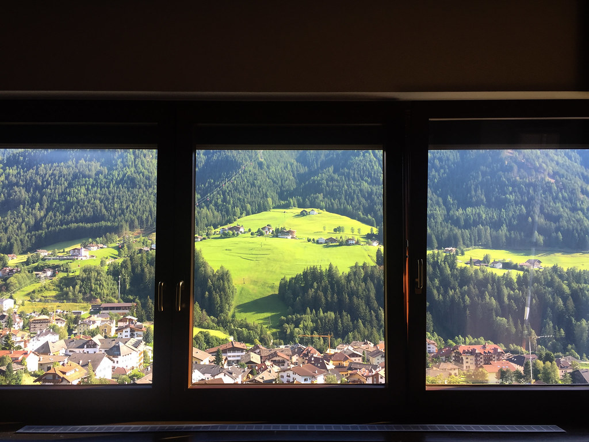
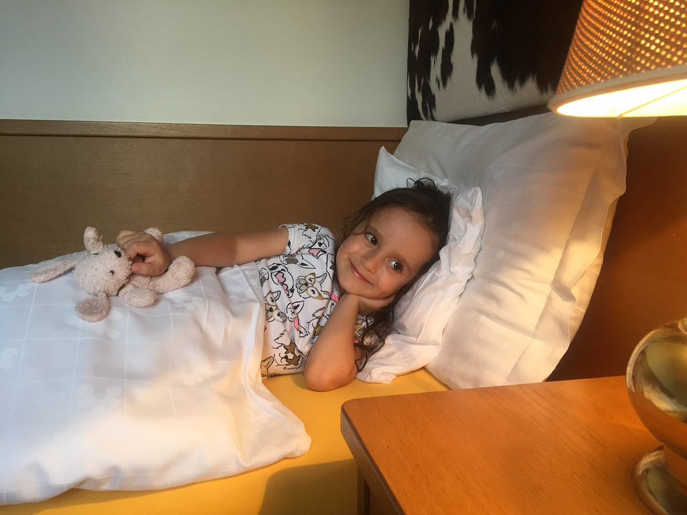
מזג האויר באיזור הדולומיטים הרבה יותר נעים ולראשונה אפילו ירד עלינו קצת גשם. אורטיזיי הרבה יותר מפנקת מBrentonico, מצאנו לנו מאפיה בה כל בוקר נקנה את הלחמים לכריכים, מעדניה מפנקת עם גבינות ונקניקים וגם סופר נח. מחר נטפס על קרחון המרמולדה.
