המרמולדה, רכס ההרים הגבוה ביותר בדולומיטים (כ 3,300 מטר), היא ביתו של הקרחון היחיד שנותר באיזור זה. הגישה לקרחון נחשבת קלה ומצריכה רק כרטיס לרכבל, לבוש חם ומזל עם מזג האויר. לנו היה את שני הראשונים :)

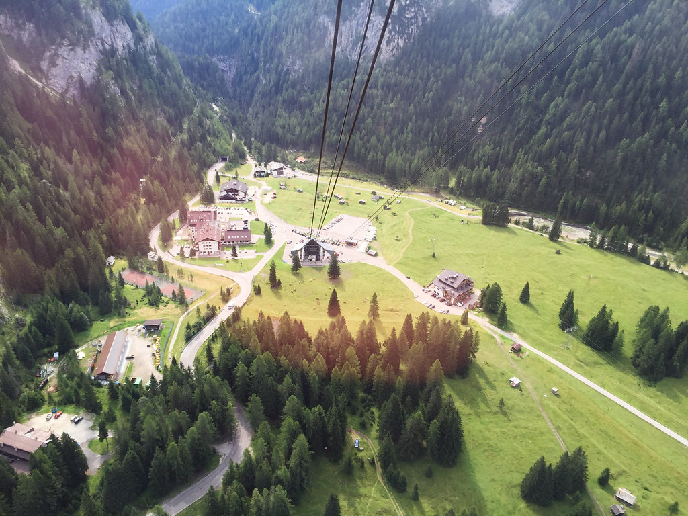
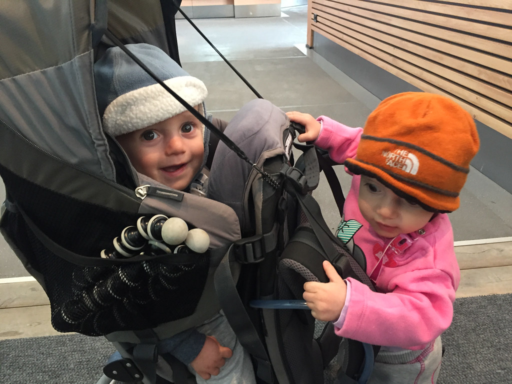
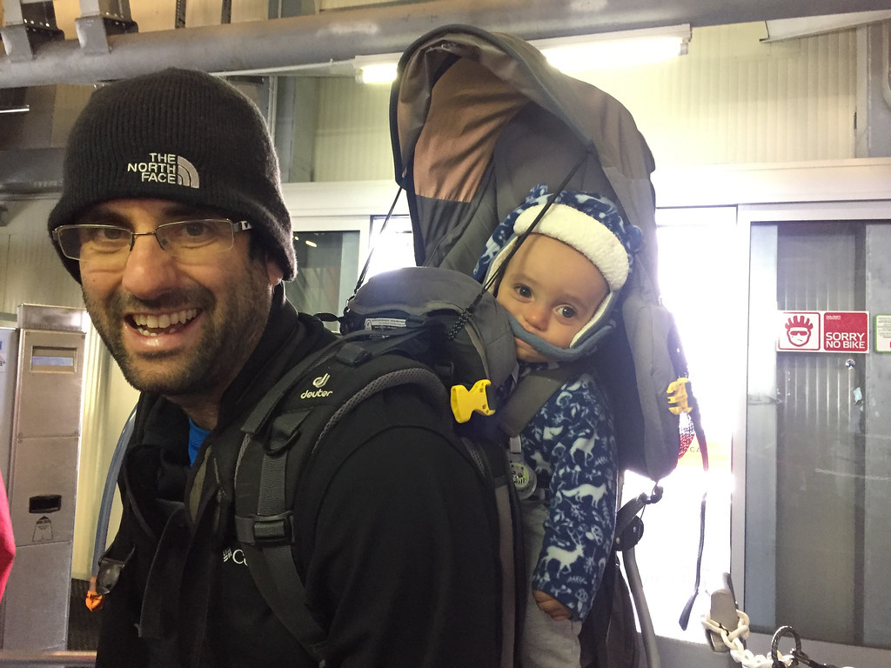

כדי להגיע לקרחון יש לקחת שני רכבלים ולהגיע לתחנה Punta Rucca. למרות הנוף המרהיב שנשקף מהרכבל, מה שנזכור מאותה עליה הוא תעלול שרלוטי טיפוסי. לאחרונה אני והשרלוט צופים יחד בפרקים של סדרת המופת הצרפתית ״היו היה״. בפרק האחרון למדנו על עליית האיסלאם ובעקבותיו אפילו תרגלנו כמה מהמנהגים המוסלמים. מה שלא תכננתי זה שבאמצע רכבל גדול וצפוף שרלוט תחליט בלי הודעה מוקדמת לצעוק בקול גדול ״אללה ואכבר! אללה ואכבר!ֿ״. למרות שהסיטואציה העניקה לי עונג רב, היה צורך לנטרל את השרלוט. פניהם של האירופאים המאופקים ברכבל הסגירו כי בעת הנוכחית גם כאן מבינים מה עלול לקרות לאחר קריאה מסוג זה...

התחלנו בטיפוס כשלמורת רוחנו החל לכסות את פסגת ההר ענן גדול ואפור. הטיפוס לא היה קשה במיוחד, אך בשילוב הקור והראות הלקויה לקח לא מעט זמן.

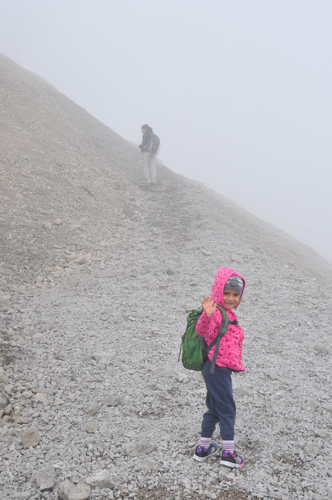
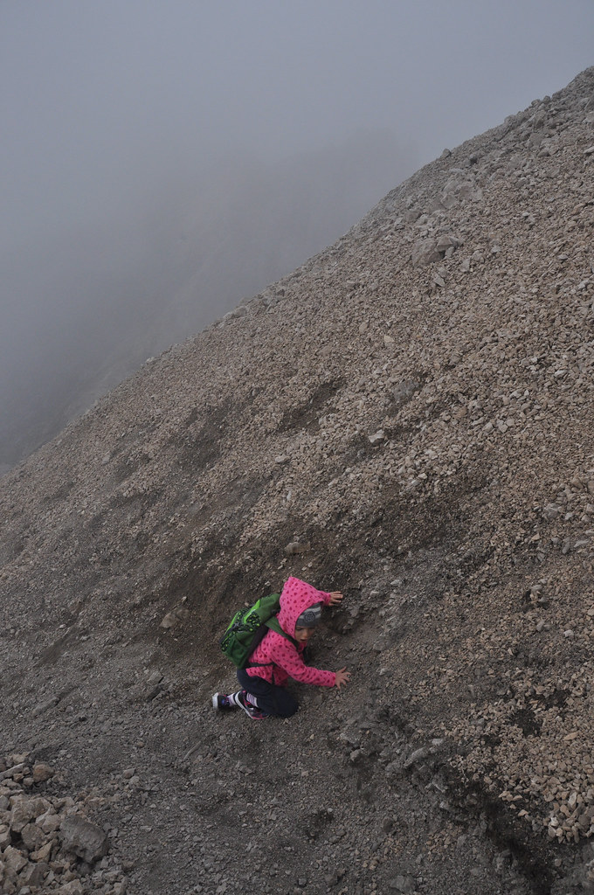

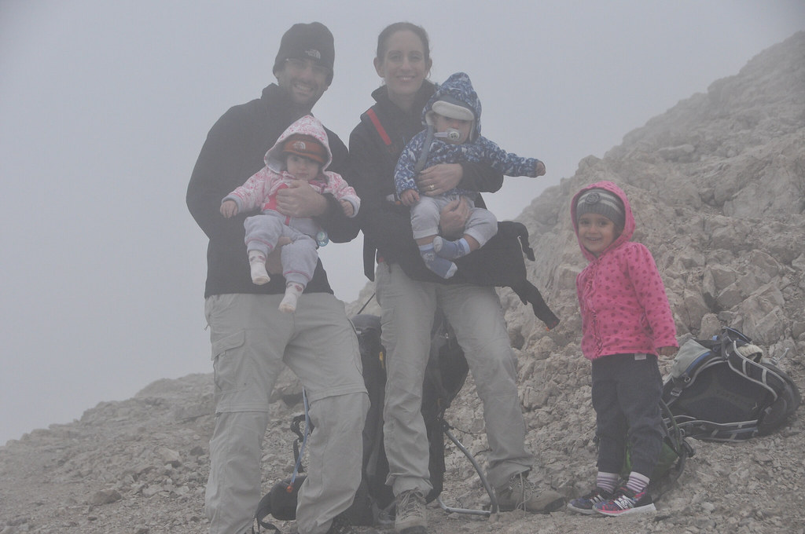
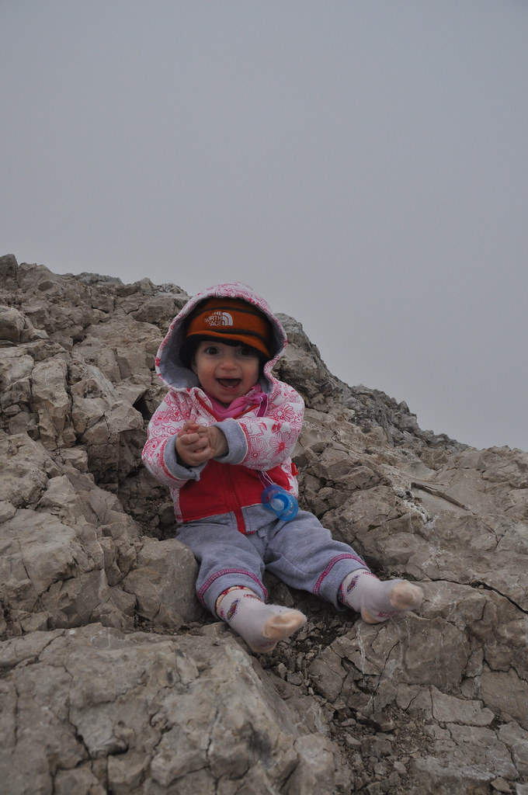
בנקודה מסויימת הבנו שאין לאן להמשיך, עצרנו להאכלת פיטים עד שהקור הכריח אותנו לחזור לאחור. בחזור שרלוט בהשראת הנמלה פיתחה את טכניקת ירידת העכוז. ירדנו לתחנת הרכבל הראשונה בה הפשרנו קצת ואכלנו את ארוחת הכריכים. אחרי סיבוב קצר בחוץ ירדנו למטה במטרה להמשיך למסלול בקניון Sottoguda.

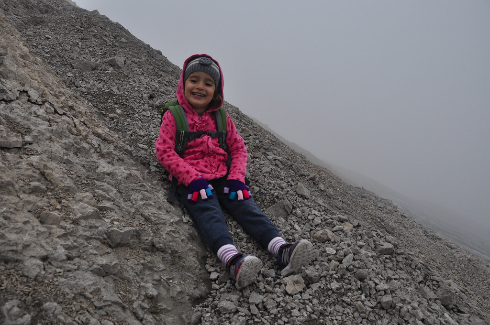
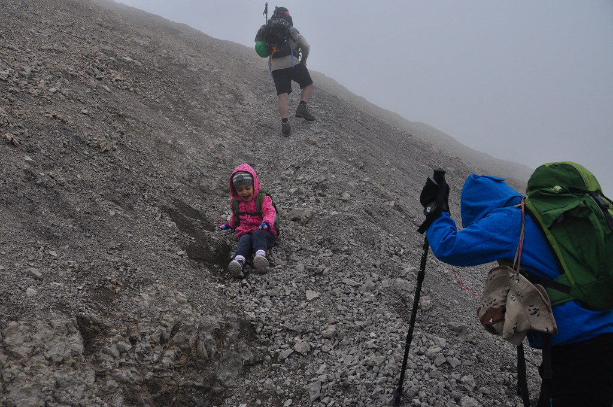
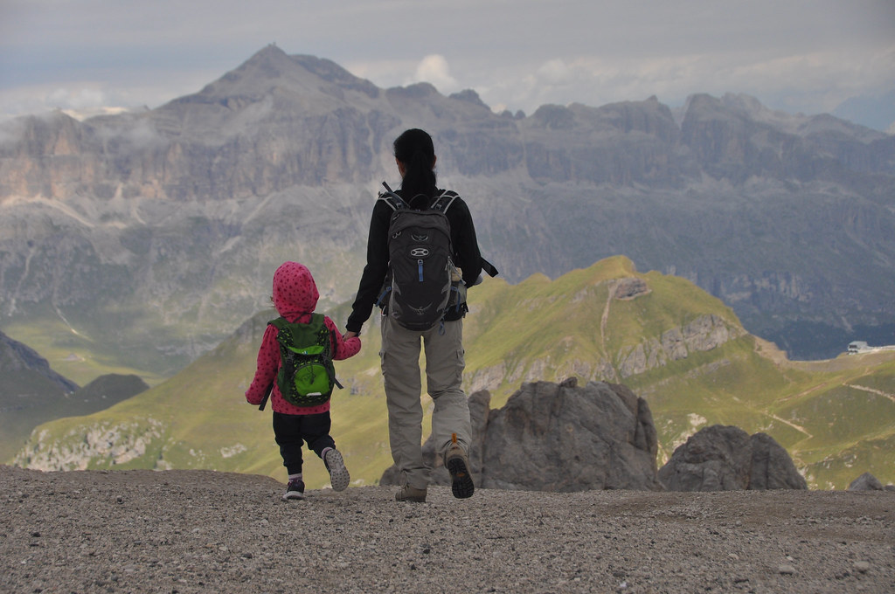
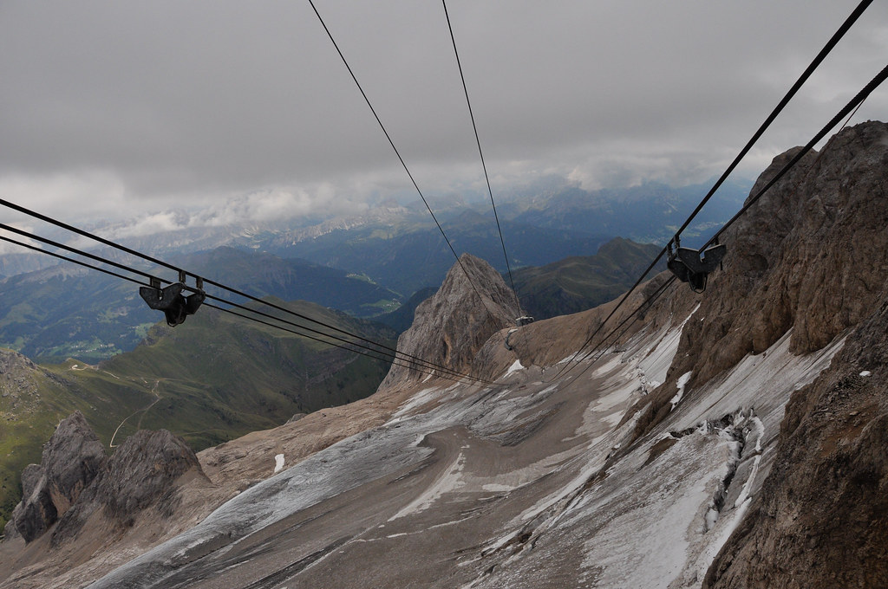
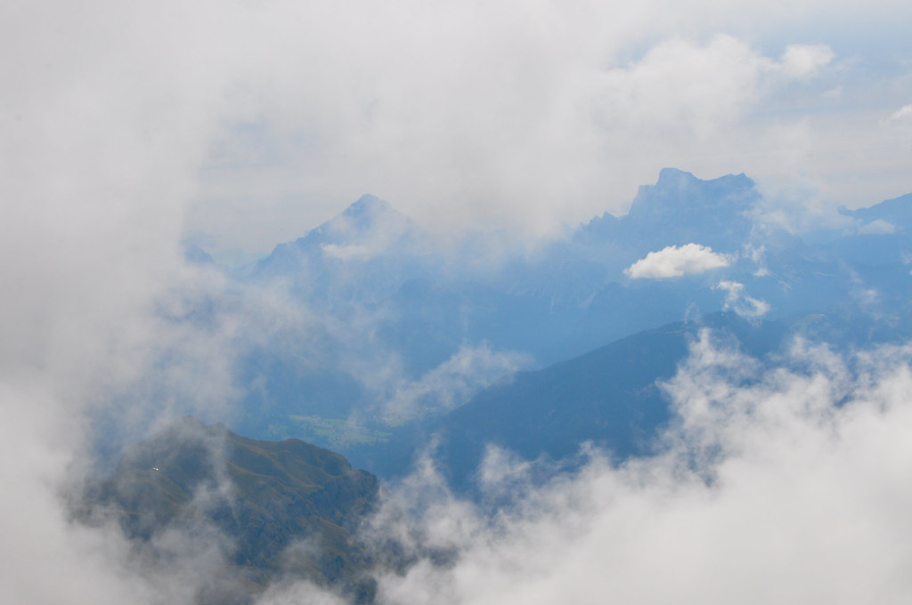
כשירדנו לכיוון קניון סוטוגודה החל לרדת גשם כבד. הלכנו קצת אך מהר מאד עשינו אחורה פנה וחזרנו לכיוון החניון. עייפים אך רטובים חזרנו לצימר שלנו כדי להתפנק בבישול עוד ארוחת ערב איטלקית.

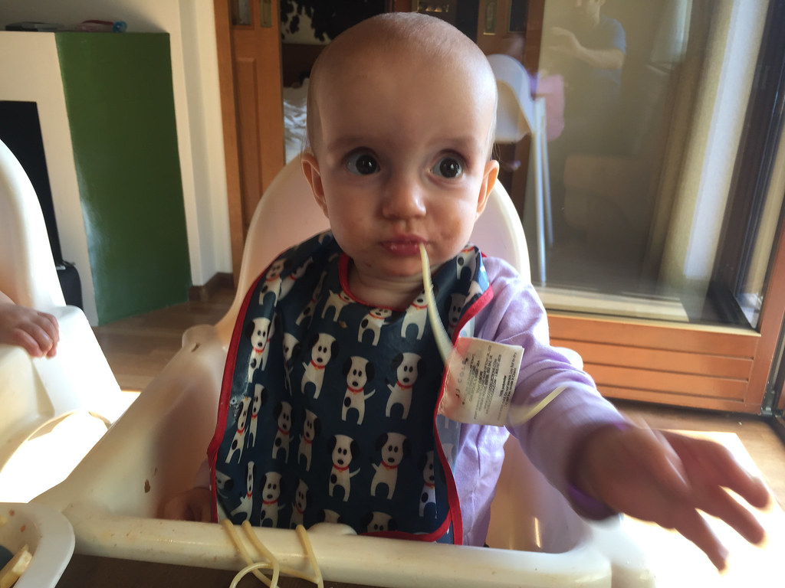
