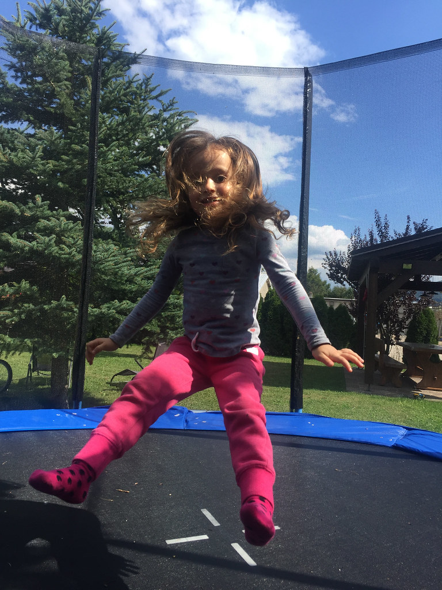
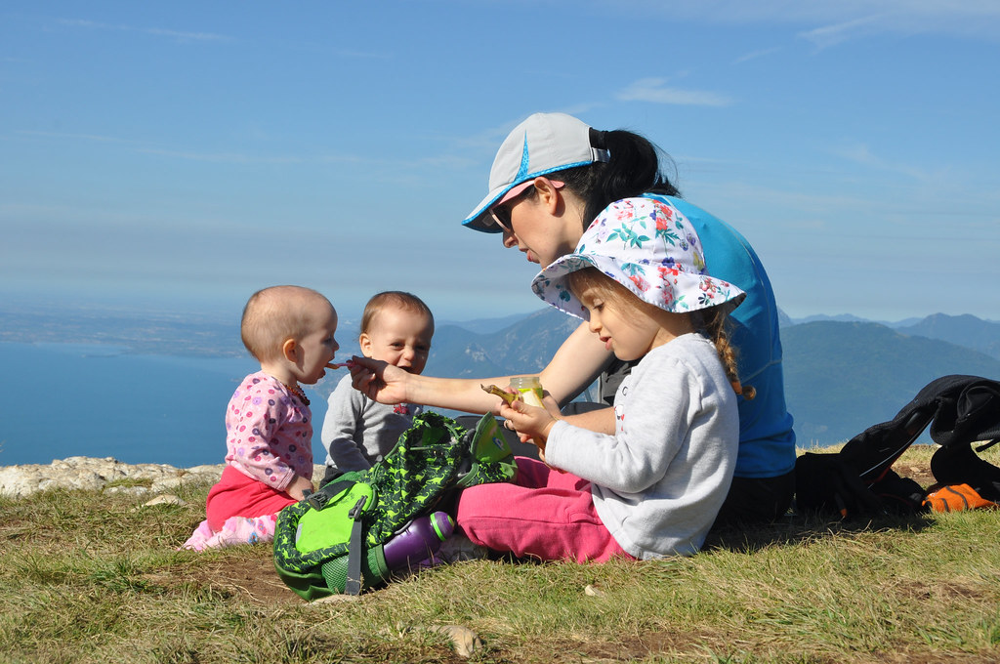

היום בילינו באגם מולבנו. מולבנו הוא עוד אחד מאותם אגמים יפים הפזורים באיזור טרנטינו. אין עליו סיפור מיוחד או קוריוז - הוא פשוט אגם מקסים - וזה באמת כל מה שצריך. את הבוקר פתחנו בהליכה סביב האגם - טיול קל ויפה לפני שהתחיל להיות חם מידי.

השרלוטין חנכה את תיק הטיולים החדש וסחבה את המים של כל הילדים וכל מיני קשקושים שהיא מצאה בטיול. בהחלט עזרה לא מבוטלת בהתחשב בכמות החפצים והתינוקות שיש באמתחתנו. אחרי הטיול מצאנו לנו מקום עם דשא לחוף האגם ורבצנו בו כדי לאפשר לפיטים להוציא אנרגיה.

הרבה שאלו אותנו מאיפה ה״אומץ״ לטוס לכמעט שבועיים עם שני הקטנטנים. אנחנו ממש לא רואים את זה כאומץ. אם מרכיבים בקפידה את המסלול ומגדירים היטב את יעדי הטיול - טיול עם תינוקות ממש לא חייב להיות קשה. אנחנו בעיקר רצינו לבלות עם הילדים ולקבל איתם קצת זמן איכות מחוץ למרוץ של החיים. אם מתחשבים באילוצים בעת קביעת הלו״ז (כמו למשל לאפשר  זמן שינה במנשא או בנסיעות ולהמנע מדברים ש״חייבים לעשות״ אם הם לא מתאימים), האטרקציות הופכות להיות רק רקע יפה לנופש המשפחתי ולא מירוץ מפרך...

שכרנו סירת מנוע קטנה ויצאנו לשייט קצר באגם. הפיטים התרגשו והשרלוט משום מה קצת פחדה. אני והשרלוטין ניווטנו והנמלה רדפה אחרי הפיטים כדי שלא ישליכו את עצמם למים.

יצאנו מוקדם בבקרים וחזרנו מוקדם כדי שנספיק להינות מהחווה, להעביר את הערבים בכיף ואפילו לנוח. היום הספקנו לבקר גם בשוק האיכרים של העיירה, להצטייד בגבינות ולזלול עוד גלידה. אחרי שהשרלוט הסתובבה עם ילדי החווה, בלי התראה מוקדמת היא החלה לקרוא לנו מאמא ופאפא. מדהים איך ילדים יכולים להיות יחד שעות מבלי לדבר את אותה השפה. כל בוקר מחוץ לדלת חיכה לנו חלב שבדיוק נחלב מהפרות ואחרי הרתחה שימש לנו לקפה ולילדים לשתיה.

למחרת טיילנו ברכס Monte Baldo שממזרח לאגם גארדה. לקחנו את הרכבל מהעיירה San Michele ומייד התחלנו ללכת במסלול אותו הרכבנו (3-4 שעות הליכה). הנופים של אגם גארדה למרגלותינו היו מרהיבים והשרלוטין עמדה בהליכה בגבורה למרות העליות הרבות.

אחרי המסלול עצרנו בRiva Del Garda רק כדי לשבת לאכול גלידה לחופי אגם גארדה לפני שחזרנו לחווה. מחר נעזוב את החווה ונטייל בדרך למנה העיקרית של הביקור באיטליה - הדולומיטים.
