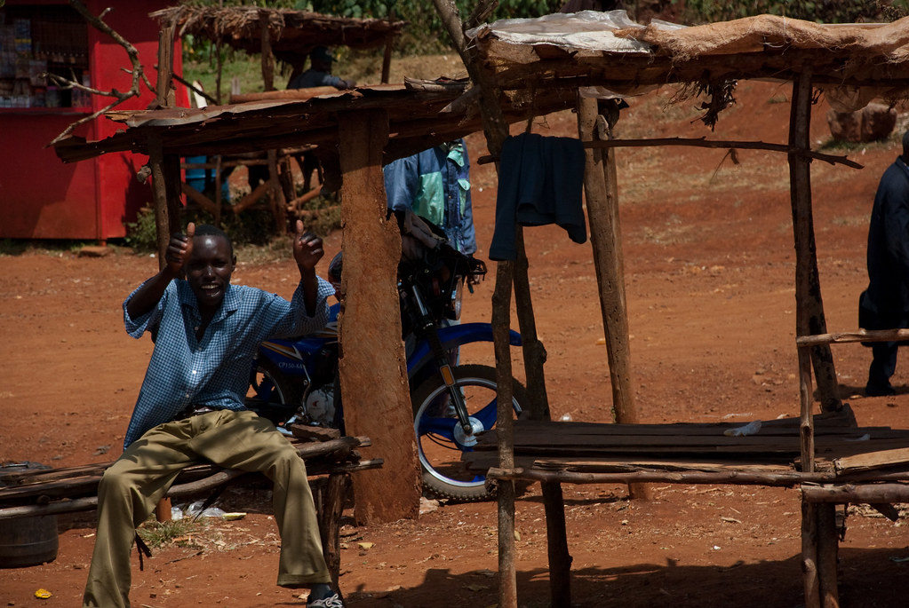

בעזרת התירוץ המנצח של חגיגת מסיבת סוף הרווקות של גיל, הצטרפנו שנינו לטרק מאורגן של חברת “אקו טיולי שטח” לטיפוס על הר קניה!

הר קניה הוא ההר שני בגובהו באפריקה ומתנשא לגובה של 5,199 מטר. (הראשון הוא כמובן הקילימנג’רו המפורסם).  
אנחנו היינו הצעירים בקבוצה שמנתה 18 איש, כשהמבוגר ביותר בן 63(!)  
למרות החששות מתווך הגילאים של הקבוצה, ובעיקר החשש שלי שגיל ישניא אותנו על הקבוצה תוך יום :) , השונות בקבוצה היא ללא ספק אחד הדברים שעשו את המסע הזה לכל כך מרתק.

**25/01/2010 - יוצאים לדרך!**

טסנו בטיסה איומה עם connection ארוך כל כך בשדה התעופה של אדיס אבבה. שדה התעופה באדיס מזכיר את התחנה המרכזית בתל אביב - רק שלאוטובוסים יש כנפיים, ולכושים אין ידיים (סתם – יש להם ידיים, אבל משום מה הצחיק אותי לכתוב שאין..)

על פני השטח לא קרה פה שום דבר מעניין, אבל מי שהקשיב טוב טוב, יכול היה לשמוע איך בתוך הגופים הלבנבנים שלנו מתרחשת מלחמה - כשטריליוני חיידקים אתיופים משחקים “תופסת נוגדנים” עם הגוף שלנו :)  
עם כמות החיסונים שקיבלנו זה לא ממש היה כוחות, וכמסורת האדם הלבן באפריקה, המקומיים מובסים ומפנים את דרכם.

נחתנו בניירובי, אליה עוד נחזור, כדי לפגוש את הצוות המקומי שלנו מהחברה (המצויינת) Gametrackers, שמדריכה באיזור גם טיולי ספארי וגם טרקים:  
[http://www.gametrackersafaris.com/](http://www.gametrackersafaris.com/ "http://www.gametrackersafaris.com/")  
עלינו על מעיין משאית שהוסבה לשמש כאוטובוס-שטח, והתחלנו לנסוע לכיוון הר קניה.

הנסיעה הארוכה, למרות שלא כללה אטרקציות מיוחדות, היתה מרתקת – מבחינתי זה הרגיש כאילו נחתנו בכוכב אחר.

בתוך השכונות של ניירובי בהן נסענו היה בלאגן לא נורמלי - כמויות לא הגיוניות של אנשים כשרובם רובצים ללא מעש בכל פינה.  
מעט האנשים שכן נראו עסוקים התחלקו לשלוש קבוצות:  
הקבוצה האחת כללה אנשים שמתקנים מכוניות שלא נראה שאי פעם יתניעו.  
בקבוצה השניה היו אנשים שכולם הציעו למכירה בדיוק את אותה הספה, ובקבוצה השלישית - כמובן – קבוצת מוכרי הקולה.

אחרי 10 דקות של נסיעה משדה התעופה, פתאום ראינו מרחוק להקה של ג’ירפות מסתובבות כאילו היו חתולי רחוב – ברוכים הבאים לקניה!

ככל שהתרחקנו מניירובי, והתקרבנו לאיזור הר קניה התחלפה הצפיפות הנוראית של ניירובי במרחבים גדולים של שדות ירוקים. השדות הם בעיקר שדות קפה, תה ואננסים – שדות אינסופיים של אננסים!

מחוץ לעיר פחות רגילים לראות תיירים, ובכל מקום בו עברנו משכנו תשומת לב.  
מהר מאד גילינו שהקנייתים (לפחות אלו שמחוץ לעיר) משוגעים על ניפנופים! נופפת להם מהחלון לשלום – עשית להם את היום.  
מצד שני – כשמצלמים אותם מבלי לנופף - הם עלולים להתעצבן :)  
מאותו הרגע גיל מונה למנופף ראשי – הוא נופף, וכשהם באקסטזה, ולפני שיש להם הזדמנות למחות - אני מגיח לצלם!

במהלך הנסיעה עצר אותנו סוחר שהציע לנהג לקנות שור במחיר מציאה של 200 דולר.  
בהמשך עצרנו לאכול ארוחת צהריים שהוגדרה כ“כללית”.  
כשגילינו שאננסים בגודל הראש שלנו עולים פחות מדולר, הארוחה הפכה לארוחת אננסים!

")

בהמשך נגלה לעינינו ההר שלשמו הגענו עד הלום – הר קניה.  
בדרך כלל בשעות היום פסגת ההר מכוסה בעננים, ולא ניתן לראותה. אבל לכבודנו העננים התפזרו וזכינו לראשונה לראות את הר הגעש העצום. קוטרו של ההר הוא כ50 קילומטר.

*הר קניה מציץ מן האופק*

את היום הארוך הזה שהתחיל עוד בתל אביב סיימנו בLodge נחמד מאד בשם Castle Forest Lodge:  
[http://www.castleforestlodge.com/](http://www.castleforestlodge.com/ "http://www.castleforestlodge.com/")  
טרפנו את ארוחת הערב הטעימה שהגישו לנו, ושבאנו לצאת לבקתה, הציע אחד מעובדי המקום ללוות אותנו. כשסרבנו בנימוס, הוא הסביר שמסתובבים במקום פילים, ולכן כדאי לנו שילוו אותנו.  
הבחור לא צחק, ומסתבר שלפני שבועיים פיל הרג אשה ואת הילדה שלה ממש פה בLodge!  
[http://abcnews.go.com/Travel/wireStory?id=9507524](http://abcnews.go.com/Travel/wireStory?id=9507524 "http://abcnews.go.com/Travel/wireStory?id=9507524")

עייפים מאד, התקלחנו במים שהורתחו במדורה, כשהמים רוב הזמן רותחים בצורה שלא מאפשרת להכנס, או קפואים מידי. מכיוון שזאת המקלחת האחרונה שלנו, לפחות לעוד 6 לילות, לא היינו בררנים מידי :)

המשך יבוא…
