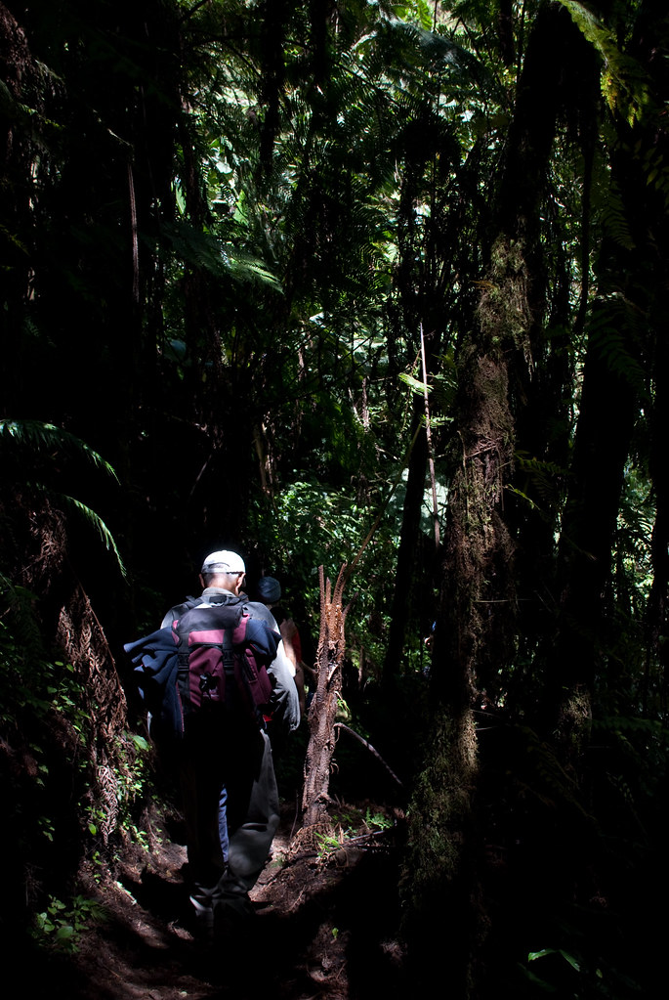
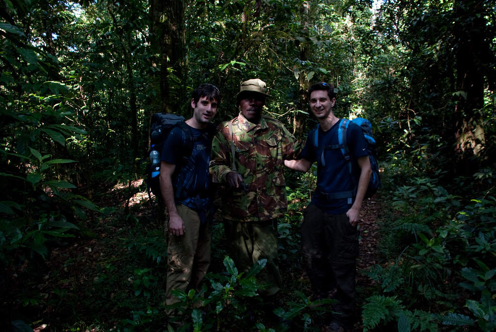
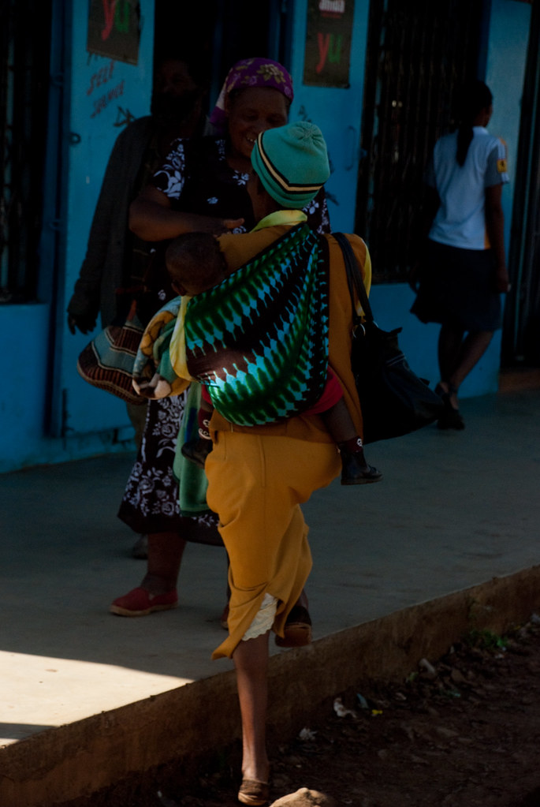
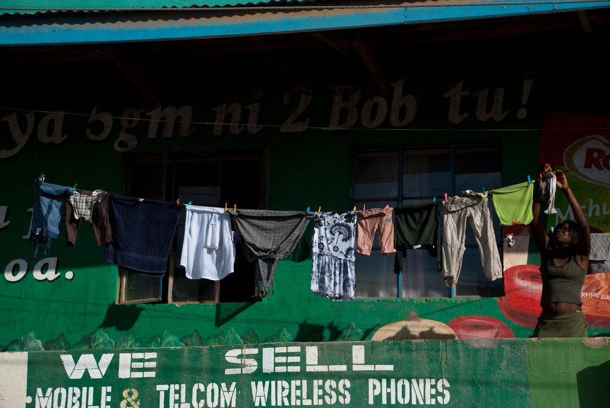
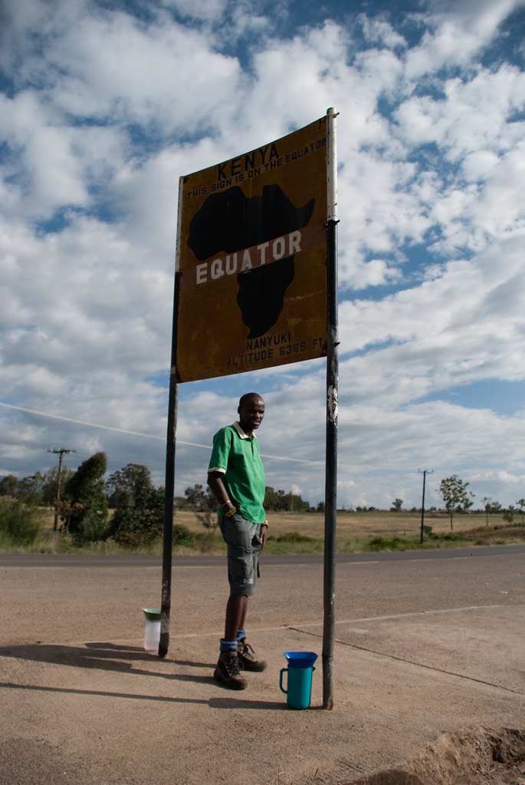
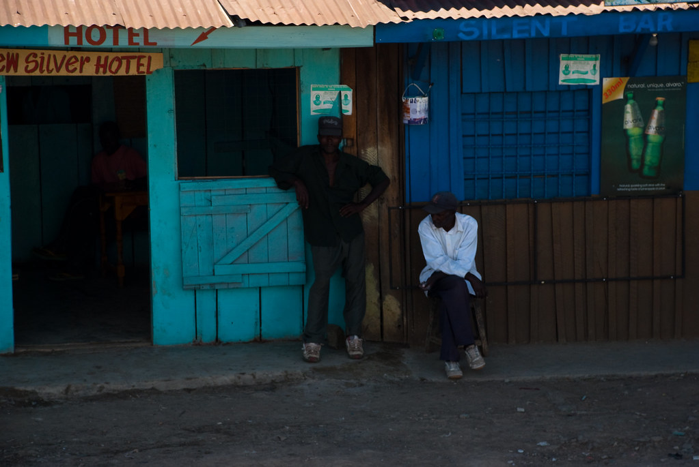

אפילו המיטה הזוגית הקטנטונת שחלקנו, והמריבות על השמיכה לא הפריעו לנו סוף סוף לישון. קמנו עם כוחות מחודשים ליום של התאפסות.

**26/01/2010 – בעקבות קקי הפילים**

בשעות הבוקר מדריך מקומי ערך לנו סיור בעקבות פילים.  
הלכנו בשבילים שיצרו הפילים ביערות שבמורדות הר קניה, כדי ללמוד על אורח חייהם ובעיקר על מוצא פיהם (זה הטבעתי)

למדנו איך פילים משחיזים את השנהבים שלהם, ואיך הם מתגרדים על העצים. למדנו שפילים יודעים מה לאכול כדי למנוע עצירות, שלשולים ושאר בעיות. מה שמגעיל בכל הסיפור, זה שפילים אוכלים דברים כל כך בריאים, שבריא אפילו לאכול את הגללים האיומים שלהם !?

פילים הם לא חיות אלימות, אבל מתוך התגוננות, או אם בטעות דרכת להם על החדק, הם עלולים לנקב אותך עם החיתים שלהם, לרמוס אותך עם המשקל העצום שלהם (שיכול להגיע גם ל10 טון), או כמובן לדגדג אותך למוות בעזרת החדק המגוחך שלהם.  
בשל תופעות לואי פיליות פליליות אלו, הצטרפו אלינו לטיול מלווים מקומיים עם רובים שהגיעו הישר מבסיס התחמושת של גרמניה מתקופת מלחמת העולם הראשונה.

הסתובבנו קצת עם המאסף מביניהם, שלא בטוח אהב את כל החוכמות שלנו.  
הוא לא הפסיק התעקש שהוא לא צייד פילים, ושאין שום תרחיש שאנחנו יכולים לארגן בו הוא ירה בפיל.  
הוא מעולם לא טעם פיל, לא הכין ספה מעור של פיל, והבית שלו לא בנוי מחדקי פילים!

במקרה שפיל יתקוף אותנו, הוא ינסה להפחיד אותו עם יריות באויר. ואם זה לא ילך, הוא פשוט יצפה בפיל משמיד אותנו. אחרי הכל – אנחנו אלה שבאנו לבית של הפילים...  
הוא חזר ושינן שהוא אוהב את הפילים והוא כאן כדי להגן עליהם.

חוץ מסיפורי גללי פילים, ראינו ביער כל מיני תופעות מעניינות כשהבולטת בהן ששלטה ביער, היתה סוג של פיקוס שגדל כטפיל על עצים אחרים. ממש ניתן היה לראות איך גזע העץ המארח מציץ מתוך חיבוק הדב של הפיקוס. מה שמפגר בכל הסיפור, זה שאחרי כמה זמן, הפיקוס חונק את העץ המארח, ואז שניהם מתרסקים ומתים...

")

מיער הפילים המשכנו לנסוע לכיוון שער סירימון של שמורת הר קניה. בדרך עברנו בנניוקי וביקרנו בשוק המקומי.  
השוק היה עמוס ומטונף, אבל היה חוויה מעניית. חוץ מהדוכנים שמרכולתם היתה זרוקה על הרצפה, החנויות הרבות שהיו בעיר נראו כמו שוק אחד גדול. באותה החנות אפשר לקנות שעון, נייר טואלט, מגרפה או עז.  
נחמד היה לראשונה להסתובב בין המקומיים ולראות את חיי היום יום שלהם.

המשכנו בדרכנו לכיוון שמורת הטבע כשבדרך עצרנו בקו המשווה. על הקו עשינו את ניסוי המים המסתובבים, בו 20 מטר מצידו האחד של הקו מים מתנקזים עם כיוון השעון, ומצידו השני נגד.  
או בקיצור, אטרקציה מפוקפקת למדי...

משם המשכנו דרך שדות התה, וכל מיני כפרים שכוחי אל כדי להגיע לשער שמורת הטבע של הר קניה.

הגענו לשער סירימון והקמנו מאהל באמצע היער. מכאן נפרד מהרכב ונמשיך רגלית עד לפסגת ההר. אכלנו ארוחת ערב זריזה שהכינו לנו הטבחים, וישבנו סביב מדורה כדי לשבור את הקרח בין חברי הקבוצה.  
למדנו למי כדאי להצמד אם רוצים לקבל הקלות במשכנתא, למי לפנות אם מתפצלחת לך הברך, ולמי פשוט לא להתקרב :)

מחר סוף סוף מתחילים לטפס!
