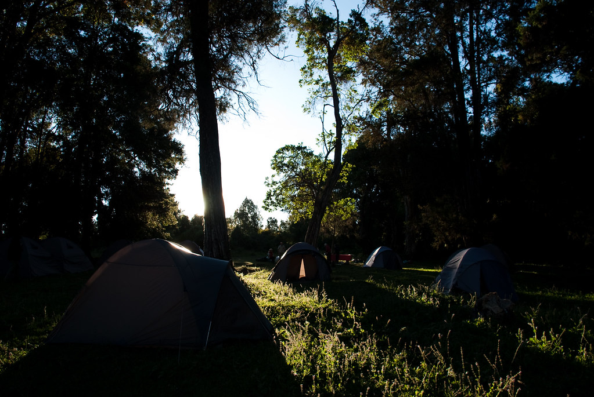
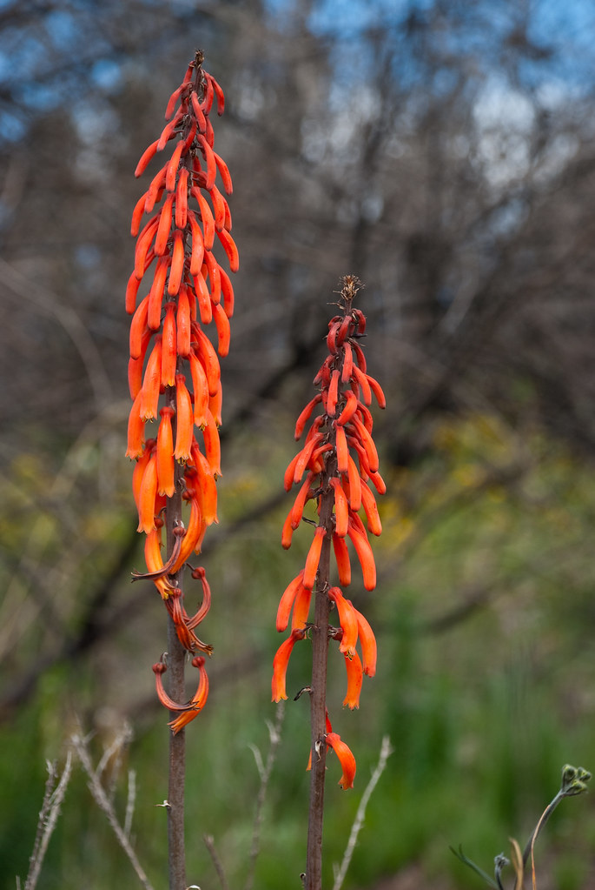
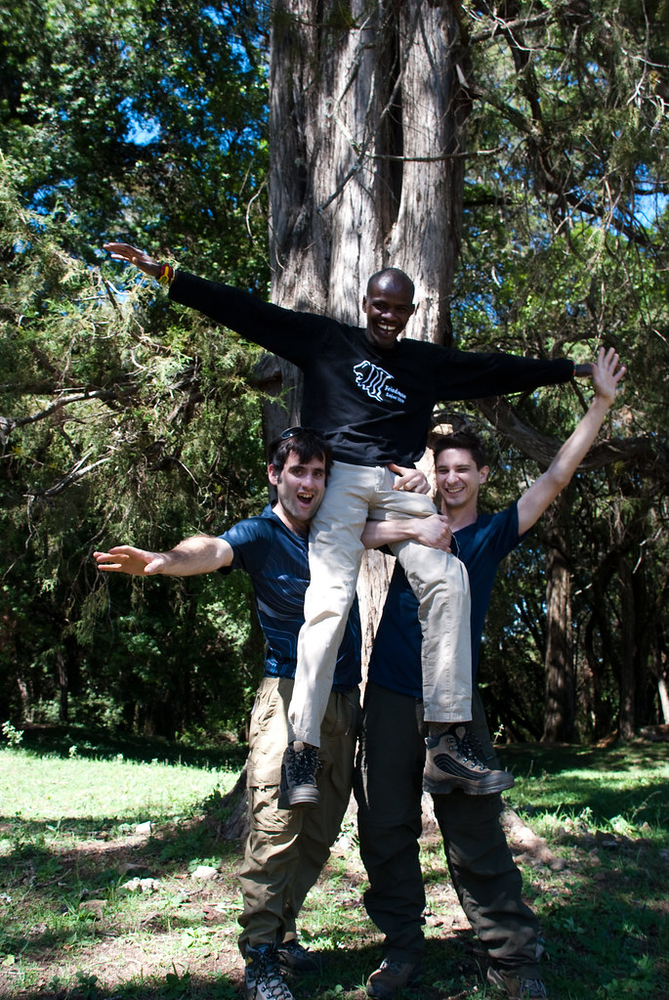
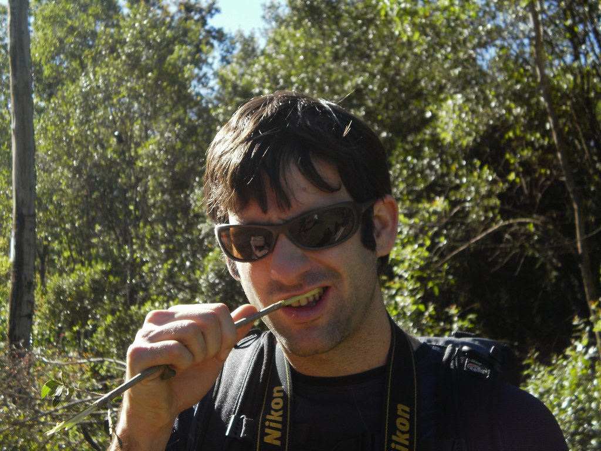
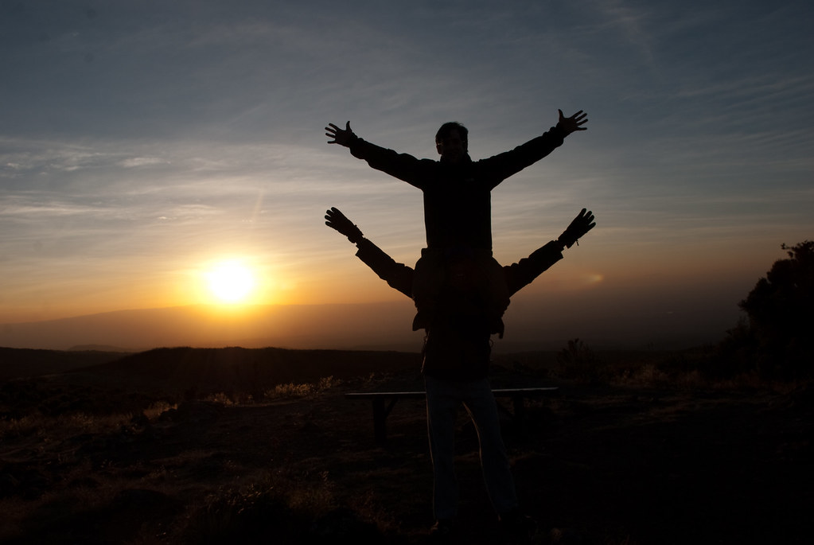
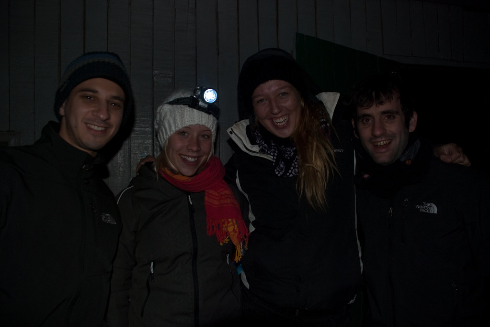

היום נכנס ל”שמורת הר קניה” דרך שער Sirimon (גובה 2650 מ’) נטייל באזור השער של השמורה, ולקראת הצהריים נתחיל לעלות למחנה Old Moses (נקרא גם Judmeier Camp) ללינה (3350 מ’).

**27/01/2010 – אל בקתת Old Moses**

השמש האירה על המחנה הצנוע שלנו ובישרה על יום חדש של טיול.  
קשה לתאר את ההרגשה, כשהמחזה הראשון שאתה רואה כשאתה מציץ החוצה מהאוהל - הוא להקת זברות, שבדיוק כמוך, עדיין לבושות בפיג’מת הטיולים שלהן!  
מרוב התלהבות קמתי והתחלתי לנופף אליהן בשמחה. בשניה שהרמתי את היד הזברות החלו בבריחה  היסטרית אל תוך היער, מה שסיים את הסצינה הרומנטית והשאיר אותי עם גיל באוהל צפוף ומלא נשימות של טרום צחצוח שיניים :)

תמיד חשבתי שזברות הן תרגיל שיווקי של בעלי גני החיות - צובעים חמורים כדי למשוך קהל בעלות זניחה של חמורים פשוטים.  
זה גאוני - העור של הפיל מחוספס מדי, ולא יתפוס את הצבע, אריה יבלע אותך אם רק תהיה טיפש מספיק להתקרב אליו עם מכחול- חמור הוא חמור מספיק כדי פשוט לעמוד שם בזמן שאתה צובע אותו :)

היום היה בינוני למדי מבחינת נופים. את החלק הראשון של היום בילינו בהליכה באזור השער של השמורה, והסברים על הפרחים והסגולות של הצמחיה באיזור.  
לא מעניין מידי, אבל מצחיק היה לחשוב איך בהיעדר מדע מסודר הגיעו לכל הממצאים האלה. בכל הסבר ששמענו, יכולתי לדמיין כמה כושים נהיו כחולים מלנסות לאכול את הצמח המתאים לבעיה שלהם :)

אני וגיל ניצלנו את היום בעיקר כדי להתחבר עם סמיאן.  
סמיאן הוא מקומי משבט המסאי מרה, שהצטרף אלינו לטיול.  
תמצית הסיפור: מדריכת טיולים ישראלית אימצה וגידלה אותו כאן בקניה, והחליטה לקחת אותו לטיול באפריקה.  
בלי קשר לכל הטלנובלה הזאת, שלא ארחיב אליה כאן, הרווח היה כמובן כולו שלנו – מה הסיכוי שיצא לך לבלות שבוע עם מסאי – ועוד  אחד בגילנו!  
כשאני אומר בגילנו, אני מתכוון בערך בגילנו, כי אף אחד לא באמת יודע מתי הוא נולד!

לקחנו את ההזדמנות בשתי הידיים והחלטנו שעד סוף היום נהיה החברים הכי טובים שלו.  
כמו בכל משימה מתוכננת היטב הוגדרו יעדים ומדדים. המדד שבחרנו היה שעד סוף היום, אנחנו צריכים להצטלם עם סמיאן כשאנחנו מניפים אותו על הכתפיים.  
ברור שאם הצלחנו להגיע למצב כזה, אז הקרח כבר נשבר ומכאן הכל ילך טבעי.  
לקח לנו בדיוק את ארוחת הבוקר כדי להשלים את המשימה :)

אמנם קבענו משימה ויעדים, אבל זה לא באמת הרגיש ככה, סמיאן הוא ילד בדיוק כמונו והוא שמח שאנחנו היינו בקבוצה לפחות כמו שאנחנו שמחנו שהוא היה…  
כל היום הסתובבנו איתו, למדנו המון ובעיקר – מצאנו חבר חדש.

לשבט המסאי יש מנהג לחתוך את החלק התחתון של האוזן ולגלגל אות סביב חלקה העליון. למרות שסמיאן אישר שזה ממש ממש כאב, לפחות זוכים באוזן מגניבה…  
הוא הראה לנו תמונה שלו בבגדים אותם הוא לובש ביום יום. בחיים לא היינו מזהים אותו – עם גלימה אדומה צעקנית – וצמידים צבעוניים.  
מסתבר שלמורת רוחו, הכריחו אותו בשביל הטיול, להגיע עם נעליים גבוהות.  
הוא הראה לנו את הכפכפים שהוא בדרך כלל מסתובב איתם שעשויים מ.. צמיג של מכונית :)

סמיאן הראה לנו עץ שעם הענפים שלו אפשר לצחצח שיניים. השיניים שלו, שהיו ממש לבנות הוכיחו את הטענה שזה הרבה יותר טוב מקולגייט..

אמנם השיניים של המקומיים לבנות, אבל זה לא בהכרח מרמז על שאר הרגלי ההגיינה שלהם. סמיאן סיפר, שאמנם הוא מתרחץ כל יום, אבל הרבה אנשים מתרחצים פה בערך פעם בשבוע, והמבוגרים לא מתרחצים בכלל (!)  
המנהג הכי דוחה של בני המסאי הוא שתיית דם של פרה מעורבב עם חלב.

טוב, נראה לי שזה מספיק קוריוזים של מקומיים להפעם…  
הטיפוס היום לא היה קשה במיוחד. הגענו לקראת ערב למחנה, בו כבר היה קר. במחנה היו צריפי פח פשוטים למדי עם מיטות קומותיים בסיסיות.  
כשהיגענו למחנה, סמיאן שכנראה היה צריך לעמוד ביעדים שהציב לעצמו להיום, ביקש להצטלם כשהוא מרים אותנו :)

האטרקציה העיקרית במחנה היתה חבורה של שבדיות צעירות שהגיעה לחלוק איתנו את הבקתות (אומרים שגם היו שבדים בנים שם, אבל לא ממש שמנו לב לזה).  
אפילו השבדיות, שחלקן הגיעו עד למחנה עם מכנסיים קצרים, התחילו לקפוא כאן ולהתעטף במלא שכבות (מה שהפך אותן למעניינות בדיוק כמו שבדים…)    
אכלנו ארוחת ערב חמה, הצקנו קצת לשבדיות והלכנו לישון אחרי עוד יום ארוך של טיול

המשך יבוא…
